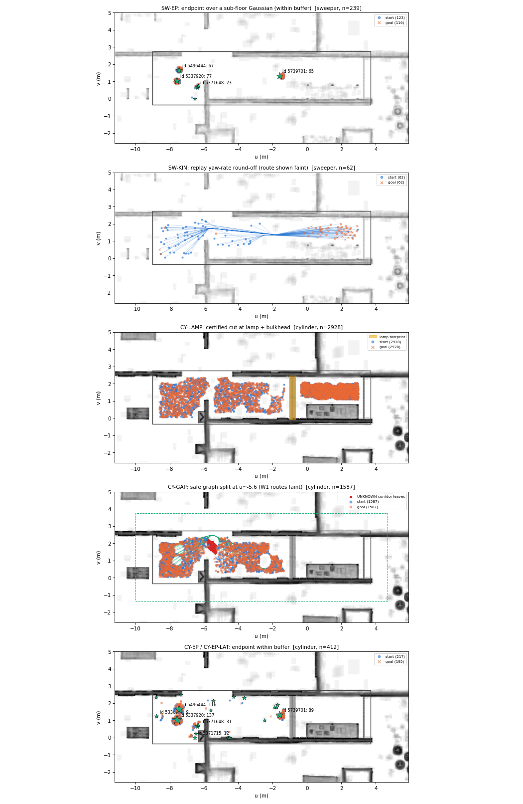
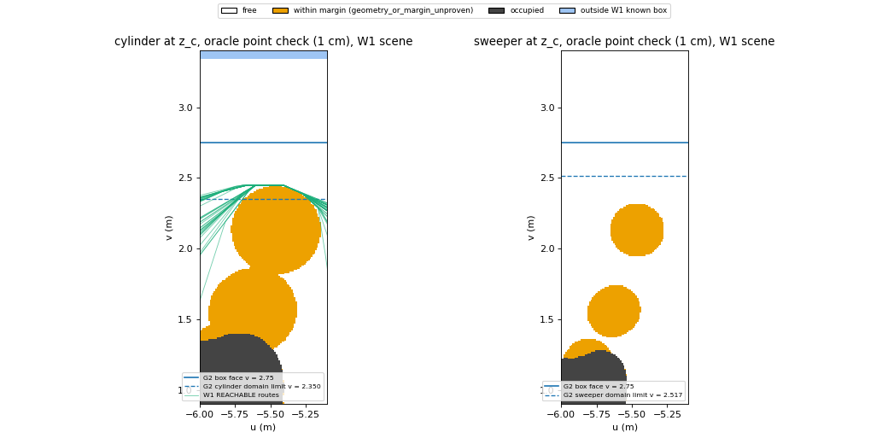

# aerial3d-ground: why the 5000-pair run fails where it fails (F1, 2026-10-01)

> **F3 follow-up (2026-10-07):**
> - G2 audit: [`aerial3dg_g2_audit.md`](aerial3dg_g2_audit.md). Every G2 non-REACHABLE row was re-checked with
>   real-body A* (G2 box and W1), subset-body lattices and a lamp-width measurement. Verdict per row in
>   `gmc/results/aerial3dg/f3/g2_audit/verdicts.csv`.
> - Hard-region search: [`aerial3dg_failures_f3.md`](aerial3dg_failures_f3.md). On confirmed-reachable pairs of the real
>   cylinder: 0 UNREACHABLE. The genuine failures are timeouts in the large WWEST box; everything else is by-tolerance
>   (endpoint ≤ 2 mm) or an export artefact.
>
> **F2 follow-up (2026-10-02): [`aerial3dg_failures_f2.md`](aerial3dg_failures_f2.md).**
> - On 5000 cylinder pairs independently confirmed reachable (robust-body A*, ≥ 5 cm lateral clearance) in a new
>   open sub-region of the same archive, GMC's cylinder is REACHABLE on 4985. The other 15 (0.30 %) are UNKNOWN
>   `shared_replay_failed`: 14 export round-off, 1 conservative swept-AABB coverage test. 0 are UNREACHABLE.
>   The sweeper is 5000/5000.
> - F2 also settles two open items here:
>   - Every W1/W2 replay veto (468 + 531) is export round-off. Replay geometry passed on all; a 1 ms floor on
>     in-place turns **and** translations clears 100 %, including the 81 W1 rows left undiagnosed below.
>   - The cylinder buffer-0 endpoint probe below already covers all 412 rows: CY-EP-LAT 12/12 → safe_graph_disconnected.

**Summary (6 lines)**
1. **Compile range = placement box, not the hall.** One prism u[-9,3.7] v[-0.35,2.75] (582,372 of 7.1 M Gaussians) is both the compile domain and the sampling box. Its faces are walls to the planner, and they are 0.1 m more conservative than the geometry for a cylinder in this 64°-rotated frame.
2. **The box *was* the cause of the 1587 cylinder `safe_graph_disconnected` UNKNOWNs.** Widened by 1 m, all 1587 find a route: 1122 are REACHABLE, and 465 are own-verified routes vetoed only by replay round-off (line 5). W2 (+1.5 m u, +2 m v) gives the same: 1068 REACHABLE + 519 vetoed, 0 still disconnected. The way round passes over the last floor splat at body-centre v ≥ 2.45, so the body's far edge reaches v ≥ 2.75, the box face. Wall B is missing there and the hall is open to v≈4.
3. **The "structure at u≈-5.6" north of v 1.1 is three sub-floor Gaussians**, 2σ tops 0.0198–0.0200 m, 0.01–0.2 mm below the chassis bottom. They block the cylinder only through the 1 mm margin, and they graze the ±1 mm C-space slab, so no cut certificate can exist there (UNKNOWN is structural, not resolution).
4. **All 651 `*_not_certified_free` endpoints (239 sweeper, 412 cylinder) have one mechanism.** Each endpoint is oracle-free by 1–2 mm over a sub-floor Gaussian (3 Gaussians own 551 of them). The certificate needs margin + buffer = 2 mm. A buffer-0 endpoint cell fixes 238/239 sweeper rows.
5. **All 62 sweeper `shared_replay_failed` rows are float round-off in the exported trajectory's yaw-rate check (excess 1–3e-9), not geometry.** Replay geometry passed on all 62; with a 1 ms floor on in-place turns all 62 pass. G2/G3's "replay was more conservative" was wrong.
6. **The 2928 cylinder UNREACHABLEs are real and box-independent**: certified lamp + bulkhead cuts, unchanged in W1/W2; the independent lattice A* finds no route for 30/30 sampled.

Machine-readable: `gmc/results/aerial3dg/f1/classes.csv` (one row per non-REACHABLE pair), `classes.json`,
`class_crosstabs.json`. Process: `docs/worklog/aerial3dg_fail.md`. Every number below comes from a committed file
under `gmc/results/aerial3dg/f1/` produced by a job listed in §7. "(unverified)" marks claims I did not test.

## 1. Compile range (Task 1)

**(a) What enters the compile, and what the box edge means.**
- *Crop:* `uavlamp_query.build_scene` (experiments/uavlamp_query.py:134-138) builds the route prism as a
  `RouteBoxKnownSpace`. It keeps every opacity > 0.3 Gaussian whose 2σ **world** AABB overlaps the prism's
  **world** AABB (`gs3d/robots.py:169`). That is a superset of the prism, with no extra pad for the robot.
  None is needed: the body itself must stay inside the prism (next point), so any Gaussian that can touch it
  overlaps the prism.
- *Pair pruning* adds `pad_m = 1e-3` (`aerial3d/pairs.py:301-311`).
- *Domain:* the planner's C-space domain is "the body's world-axis-aligned AABB lies inside the prism"
  (`pairs.py:211-216` via `_known_box_rows`, rows at `pairs.py:249`), plus the ±1 mm ground slab (`pairs.py:264`).
  Leaves outside it are OUTSIDE (`octree.py:140-141`) and never enter the possible graph (`api.py:160`). The cut
  certificate says so explicitly ("remaining boundary ... is the C-space domain boundary", `api.py:268`).
- **So the box edge is a wall.** In the 64°-rotated route frame the world AABB of an r = 0.30 m cylinder spans
  0.30·(|cos|+|sin|) = 0.40 m in v. The cylinder's centre is therefore confined to v ∈ [0.050, 2.350], not the
  geometric [-0.05, 2.45]. The sweeper's is v ∈ [-0.117, 2.517].

**(b) Compile range vs placement range.** They are the same box.
- G1's demo compile, which G2 reused, is `box_route` u[-9,3.7] v[-0.35,2.75] z[0,2.43]
  (`results/aerial3dg/g1/runs/demo/demo_cylinder.json`).
- G2 sampled every endpoint uniformly in exactly that box (`pairs_5000.json → box_uv`, `aerial3dg_batch.py:53`).
- Endpoints were checked free by the gs3d oracle on that box's scene, which also requires the body inside the
  prism (`gs3d/oracle.py:165`).
- My re-run of the crop rule on this box returns 582,372 supports, the same as G2 (job 18979876).
- The compile is **not** the whole scene.

**(c) Where the box edges sit relative to the failing structures, and what lies outside**
(`results/aerial3dg/f1/range/archive_raster*.png`, inspected; full archive, job 18979876):
- *Lamp, u -1.03..-0.67:* spans wall A (v≈0) to wall B (v≈2.4) with the bulkhead above it. Both walls are real
  full-height walls in the booth, and the back panel closes u = 3.3. No way round exists inside or outside the
  box short of passing through walls.
- *"Structure at u≈-5.6":* it is two different things.
  - A real partition at u≈-5.9 for v < 1.05. It continues south far beyond the box (to v < -3.5).
  - North of v≈1.1, nothing but **three captured sub-floor Gaussians** in the cylinder band, at (u, v) (-5.84, 1.19), (-5.62, 1.59)
    = id 5522629 and (-5.47, 2.15) = id 5526162 (§3.2). Their 2σ tops are 0.01996 / 0.01999 / 0.01981 m.
  - Wall B is **absent** between u -7.3 and -4.3: no wall Gaussians at v≈2.6, and the hall continues to v≈4.
  - So the cylinder's only way past is north of the last splat, at body-centre v ≥ 2.45 (body edge ≥ 2.75).
    That is outside the G2 box, and outside its domain limit 2.35 by 0.1 m more, with open floor beyond.
- *u_min = -9:* open hall continues west (the raster shows no wall). *v_min = -0.35:* wall A for u > -6; open
  for u < -6.

**Decisive experiment: re-compile on widened boxes, same 5000 pairs.**
- **W1** = +1 m in u and v: u[-10,4.7] v[-1.35,3.75], 783,547 supports.
- **W2** = +1.5 m u, +2 m v: u[-10.5,5.2] v[-2.35,4.75], 1,160,982 supports. +2 m in u as well was not
  possible: at the +2/+2 box's world corners the fitted floor plane deviates 0.0500 m from `z_floor`, and the
  shared floor-support contract allows 0.05 (`aerial3dg_run.floor_support`; job 18981509 failed on exactly
  this). u+1.5 gives 0.0487.
- Same archive, crop rule, `CompileConfig` and code; one compile per robot per box.
- Cylinder: all 5000 pairs in **verdict-only** query mode (`aerial3dg_fail_widen.py`). Same
  locate / cut / portal search / lifting / own verifier / shared gs3d replay; shortcut / tighten / merge are
  skipped. Those took > 95 % of the 12-70 s per long detour at full config.
  - Control: the G2 compile in the same mode reproduces all 4927 G2 non-REACHABLE verdicts exactly. It is
    slightly pessimistic on REACHABLE: 8/73 get a round-off replay veto (§3.3).
- Sweeper: full G2 config on its 301 non-REACHABLE + the unbiased slice 0-499 (770 pairs).

Compiles: W1 cylinder 320 s (in-process peak 1.38 GB); W2 cylinder 392 s, job MaxRSS 2.86 GB; sweeper
W1/W2 MaxRSS 1.38 GB. All within the 4 GB per-job cap. G2 status → widened status, per class:

| class (G2 rows) | G2 box, verdict-only control | **W1** (+1 m u, v) | **W2** (+1.5 m u, +2 m v) |
|---|---|---|---|
| CY-GAP (1587) | 1587 unchanged | **1122 REACHABLE + 465 own-verified, replay-vetoed** (all 468 W1 vetoes: replay geometry passed, kinematic round-off) | **1068 REACHABLE + 519 own-verified, replay-vetoed** (W2 vetoes not broken down, unverified) |
| CY-LAMP (2928) | 2928 unchanged | 2928 UNREACHABLE (cut) | 2928 UNREACHABLE (cut) |
| CY-EP + CY-EP-LAT (412) | unchanged | 412 unchanged | 412 unchanged |
| cylinder G2-REACHABLE (73) | 65 R, 8 veto | 69 R, 3 veto, 1 ERROR (src `simplify` ZeroDivisionError, pair 4217) | 60 R, 12 veto, 1 `safe_graph_disconnected` (G2-00917, start at the east edge of cell component 1; not investigated) |
| SW-EP (239) | — | 239 unchanged | 239 unchanged |
| SW-KIN (62) | — | 59 REACHABLE, 3 veto | 58 REACHABLE, 4 veto |
| sweeper G2-REACHABLE, slice 0-499 (469) | — | 463 R, 6 veto | 467 R, 2 veto |

**Verdict on the box.**
- The 1587 u≈-5.6 UNKNOWNs are a box effect. No pair stays disconnected once the box allows the body past
  v = 2.75 at u≈-5.5, and every route found is own-verifier certified, with the replay's geometry passing on all
  468 W1 vetoes analysed. On W1, 387/468 vetoed routes pass the full replay with the 1 ms turn floor; the rest
  are the translation variant (not tested with a fix). W2's 519 vetoes were not broken down (unverified). *F2 §5.1: all
  468 W1 and 531 W2 vetoes clear with a 1 ms floor on turns + translations; the 81 are all translation cases.*
- Nothing else is box-sensitive. The lamp cut and the 651 endpoint rows do not move at all. The sweeper's 62
  replay vetoes reshuffle with any recompile, but that is float round-off, not the box: a few REACHABLE rows
  flip the other way (6 / 2 of 469 sampled in W1 / W2).
- Sweeper sensitivity to the box: 239/301 UNKNOWNs fully insensitive; 62/301 change, but as a lottery.

## 2. Taxonomy: every non-REACHABLE row in exactly one class (Task 2)

| class | robot | G2 status : reason | rows | why (one line) |
|---|---|---|---|---|
| **SW-EP** | sweeper | UNKNOWN : start/goal_not_certified_free | 239 (123 / 116) | Endpoint is oracle-free by 1.1–2.0 mm over a sub-floor Gaussian; certifying it needs margin + buffer = 2 mm |
| **SW-KIN** | sweeper | UNKNOWN : shared_replay_failed | 62 | Route verified (own + replay geometry); the replay's yaw-rate check fails by 1–3e-9 from float round-off on a µrad in-place turn |
| **CY-LAMP** | cylinder | UNREACHABLE : possible_space_cut | 2928 | Certified cut through the lamp + bulkhead (+ walls, back panel); box-independent |
| **CY-GAP** | cylinder | UNKNOWN : safe_graph_disconnected_possible_connected | 1587 | Straddles u≈-5.6. In the G2 box no certified-free path exists. The only possible-space link is a 0.01–0.2 mm sliver over two margin-grazing sub-floor Gaussians, which no certificate can block. The real way round is 0.1 m beyond the domain the box allowed |
| **CY-EP** | cylinder | UNKNOWN : start/goal_not_certified_free | 400 | As SW-EP: within 1–2 mm over a sub-floor Gaussian |
| **CY-EP-LAT** | cylinder | UNKNOWN : start/goal_not_certified_free | 12 | As CY-EP, but the nearest blocker reaches into the body band (side clearance 1.0–1.3 mm) |
| *total* | | | sweeper 301, cylinder 4927 | no row unclassified, no OTHER class needed (`classes.json`, assertion in `aerial3dg_fail_classify.py`) |

Each row's evidence (blocker id / top z / refined gap / oracle clearance; violating step; cut roles; cell
components; W1/W2/G2-fast status; buffer-0 status; A* outcome where sampled) is in `classes.csv → evidence`.
Spatial maps: `gmc/results/aerial3dg/f1/class_maps.png` (inspected). The failing endpoints form small disks
around a handful of named sub-floor Gaussians. 54/62 SW-KIN routes have a vertex within 0.1 m of (-1.85, 1.35). The
CY-GAP W1 routes squeeze past the UNKNOWN corridor at v≈2.45.



## 3. Mechanisms ("why UNKNOWN"), traced through code and per-pair diagnostics

### 3.1 SW-EP / CY-EP / CY-EP-LAT: the endpoint cannot be grown into a certified-free cell
Code path: `api.query` → `cells_containing` finds no cell → `grow_cell(table, domain, p, 0, buffer_m=0.001)`
(`api.py:330`) → returns None (`api.py:333`). `grow_cell` refuses when the point is not strictly inside the domain
(`cells.py:112`) or when any pair's refined separating gap is ≤ `buffer + slack` (`cells.py:108,124`). The gap is
measured from the margin-inflated C-obstacle. `diag/endpoints_{robot}.json` replays exactly this per row (job
18980440 sweeper, 18981090 cylinder):

- **Domain:** 651/651 endpoints are strictly inside the domain (`box_status = inside`), so the box is not the cause.
- **Leaf:** 651/651 lie in UNKNOWN leaves, and the gs3d oracle calls 651/651 free (that is why the sampler
  accepted them).
- **Blocker:** each has 1 (219 sweeper) or 2 refining-failed pairs, all captured Gaussians.
  - SW-EP and CY-EP (639 rows): the Gaussian lies wholly **under the chassis**. Its 2σ top is 0.0180–0.0191 m,
    so the vertical gap to the chassis bottom (0.02) is 1.1–2.0 mm. Oracle clearance is 1.08–1.97 mm
    (> margin 1 mm → free). The refined gap to the margin-inflated C-obstacle is 0.26–1.00 mm
    (≤ buffer 1.00001 mm → not certifiable).
  - CY-EP-LAT (12 rows): the nearest blocker reaches into the body band (2σ top 0.02–0.19 m) and the side
    clearance is 1.00–1.29 mm.
- **Concentration:** three Gaussians, ids 5337920 (-7.57, 1.04), 5496444 (-7.45, 1.65) and 5739701 (-1.61, 1.33),
  all with 2σ tops at 0.0180–0.0182 m, own 209/239 sweeper and 342/412 cylinder endpoint failures.
- **Why so many tops sit just under 0.02:** the plane-floor edit (`gmc/height/planefloor.py:34,150-215`) only
  removes splats that reach the robot band above `z_floor + 0.02`. Splats whose top is a hair below survive by
  construction. The planners then add a 1 mm margin (oracle) and a further 1 mm buffer (aerial3d), so splats with
  tops in (0.018, 0.019] make endpoints "free but uncertifiable", and (0.019, 0.020) make them "not free".
  (Inference from the code and the measured tops; I did not re-run the floor build.)
- **Not leaf resolution:** the failing test is the point-cell growth, which has no leaf size in it.
- **Not the box:** W1 and W2 return the same 239 sweeper / 412 cylinder rows unchanged.
- **Test of the mechanism** (`fix/endpoints_buffer0_*.json`, jobs 18981044 / 18984830): re-query with the
  endpoint query cell grown at buffer 0, everything else unchanged and both verifiers still deciding.
  - Sweeper: 238/239 become REACHABLE; 1 hits a replay veto.
  - Cylinder: 30 become REACHABLE; 381 move on to `safe_graph_disconnected` (they straddle u≈-5.6, i.e. they
    are CY-GAP pairs underneath); 1 (G2-04646) stays uncertified.

### 3.2 CY-GAP: safe graph disconnected while the possible graph is connected
Code path: both endpoints are in free cells, but `graph.search` over cells + portals finds no route
(`api.py:339-341`), while start and goal share a component of the possible graph (SAFE ∪ UNKNOWN leaves,
`api.py:160-166`). `diag/bridges_cylinder.json` (job 18981090):

- **Cell graph:** 3 components: 0 = u -8.6..-5.67 (113 cells), 1 = u -5.46..-1.33 (91), 2 = east of the lamp (46).
  All 1587 CY-GAP rows have one endpoint in component 0 and the other in 1 (837 / 750). None has both on one side.
- **The link:** the shortest UNKNOWN-leaf corridor between components 0 and 1 is 900 leaves (6 hops) in
  u -5.82..-5.28, v 1.39..2.25. Its leaves name exactly **two** unresolved pairs:
  - captured 5522629 at (-5.62, 1.59, z -0.045), 2σ top **0.019990** m;
  - captured 5526162 at (-5.47, 2.15, z -0.042), 2σ top **0.019805** m.

  A third such Gaussian at (-5.84, 1.19), top 0.01996, and the partition (u≈-5.9, v < 1.05) close the rest.
- **What the oracle says there:** at z_c these two make the body's clearance 0.01 / 0.19 mm: a **margin
  violation, not a contact**. The oracle answers `unknown / geometry_or_margin_unproven` (`oracle.py:213`) on
  6655 of 8100 corridor samples, never `occupied`. A 1 cm oracle grid across the corridor has 2202 free points in
  3 components, and none touches both cell components: at z_c no free path crosses.
- **Why no certificate can exist (structural, not resolution):**
  - The ground C-space is the slab z_c ± 1 mm = [0.884, 0.886] (`pairs.py:264`, `ground_slab_m`).
  - A Gaussian's C-obstacle reaches body-centre height top + margin + half-height. For these two:
    0.019990 + 0.001 + 0.865 = **0.88599** and 0.88581.
  - So over the whole corridor a sliver of the slab 0.01–0.19 mm thick, above the obstacles, is genuinely
    collision-free in the slab.
  - A leaf is BLOCKED only if its whole box lies in one pair's inner polytope (`octree.py:184-195`). These leaves
    span the full slab thickness, so they can be neither BLOCKED nor SAFE: they stay UNKNOWN (`octree.py:202`).
  - A multi-pair cut cannot help either, because the union of all C-obstacles does not cover the sliver. On my
    3×3 samples per leaf at z_c, only 66/8100 lie in either pair's inner polytope, and 0 of the 647 no-free-sample
    leaves are covered by the union of the two inner polytopes.
  - Any sound cut has to be stated on the manifold z = z_c itself, or on a slab thinner than the intrusion
    (here ≤ 0.01 mm, which is not practical).
  - G1/G3 showed that halving the leaf changes nothing, which fits this: no leaf size fixes a slab-thickness
    problem.
- **Is the pair truly blocked?**
  - In the G2 domain, by the oracle: yes at 1 cm.
  - Physically: only by the 1 mm safety margin over two floor splats.
  - In the hall: no. Widened by 1 m, all 1587 pairs find a route (§1). The route goes round the last blob at
    body-centre v = 2.4497–2.4704: the body's edge touches or crosses the old box face v = 2.75, and the centre
    is 0.1 m above the old domain limit 2.35.
  - A 1 cm oracle scan of the window on the W1 scene (`range/scan_gap_w1.{json,png}`, job 18986244, inspected)
    shows the cylinder's free centres at u = -5.47 are exactly v ∈ [2.45, 3.34]. 3.34 is only the W1 domain
    limit: nothing stands there up to v≈4.
  - Below 2.45 the window is three overlapping *within-margin* disks (no `occupied` sample north of the partition).
  - So with any box whose face is at v = 2.75 the passage has zero width, and the G2 box closed it.



### 3.3 SW-KIN: own verifier passed, shared replay vetoed
Code path: the own verifier certified the route (`api.py:411`). The shared `replay_plan` failed (`api.py:423`).
`diag/replay_sweeper.json` and `fix/kinematics_sweeper.json` (jobs 18980440, 18981043, 18981341) re-query each row
on the same compile and rebuild the exported trajectory exactly as `api._gs3d_result` does:

- **Geometry is not the problem:** replay geometry passed on 62/62 (`all_closed_edges_verified`, clearance
  1.02–1.81 mm), and the goal matched on 62/62.
- **What fails is the kinematics check:** `speed_or_yaw_rate_exceeded` on 62/62, at exactly one step per route.
  - That step is an in-place turn of 0.38–2.58 µrad at a nearly collinear polyline vertex (54/62 routes have a vertex
    within 0.1 m of (-1.85, 1.35), next to sub-floor splat 5739701; which vertex carries the bad turn was not recorded).
  - `planner._linear_trajectory` times it as turn / 1 rad/s = 0.4–2.6 µs (`planner.py:58`) and adds it to
    t ≈ 8–39 s.
  - In binary64 the difference of two such times is off by ~1e-9 relative, and the check allows exactly 1e-9
    (`validation.py:93`). Yaw-rate excess observed: 1.0–3.3e-9.
- **Test:** keep every pose, but give each in-place turn ≥ 1 ms → the replay passes on 62/62 (geometry +
  kinematics).
  - My first try (dropping sub-µrad turns) fails the replay's heading-match check instead
    (`ground_lateral_slip_or_turn_during_translation`), so the turn must stay.
- **Box:** the class is a lottery over exact polyline floats, not geometry.
  - W1: 59/62 REACHABLE, while 6 of the 469 sampled REACHABLE pairs gain a veto.
  - W2: 58/62 REACHABLE, while 2 gain a veto.
  - Verdict-only mode (unshortened polylines, more near-collinear vertices) shows the same family on the complete
    W1 run (`fix/kinematics_w1_cylinder.json`, job 18987018). Of 468 vetoes, replay geometry passed on all 468.
    398 are tiny turns (387 cleared by the 1 ms floor); 70 are sub-µm translations (the speed half of the same
    check, not covered by a turn floor).

### 3.4 CY-LAMP: certified UNREACHABLE
- All 2928 straddle the lamp's u range, and every certificate names lamp pairs. There are two variants:
  - 1472 cuts of 124 pairs (captured + lamp; the west side);
  - 1456 cuts of 88 pairs (back panel + captured + lamp; the closed booth pocket east of the lamp).
- Every cut leaf is inside a named pair's inner polytope; the claim is "no path inside the domain" (`api.py:255-268`).
- Box-independent: W1 2928/2928 UNREACHABLE; W2 2928/2928 UNREACHABLE.
- G3's 0.1 m point map found all 2926 snappable pairs disconnected.
- Independent A*: no route on 30/30 sampled (§4).

## 4. Independent truth check: gs3d lattice A* on a stratified sample
`oracle/astar_{sweeper,cylinder}.json` (jobs 18985512, 18985513). The setup:
- gs3d `LatticePlanner` with ground5k's settings (margin 0.001, position tolerance 0, yaw tolerance 0.05,
  500k expansions), 0.1 m lattice, on the **G2 box's** scene, one PreparedScene per job.
- 30 pairs per class, stratified over distance terciles (seeded, `configs/aerial3dg/f1_oracle_sample.json`), all
  12 CY-EP-LAT, and 30 G2-REACHABLE controls per robot.
- ROUTE = A* found a route that passed its own post-build verification.
- NO_ROUTE = lattice exhausted; rejections only occupied / outside the box.
- NO_ROUTE_MARGIN = exhausted; some frontier edges were rejected only as within-margin (`geometry_or_margin_unproven`).
  There is no route with clearance > margin, the shared contract, but these edges are not proof of contact.
- No query hit the budget; none was UNSURE.

| class | sampled | ROUTE | NO_ROUTE | NO_ROUTE_MARGIN | reading |
|---|---|---|---|---|---|
| SW-EP | 30 | **30** | 0 | 0 | truly reachable → method incomplete (the endpoint certificate) |
| SW-KIN | 30 | **30** | 0 | 0 | truly reachable → method incomplete (export round-off) |
| sweeper control (G2 REACHABLE) | 30 | 30 | 0 | 0 | oracle agrees |
| CY-LAMP | 30 | 0 | 4 | 26 | truly blocked (method correct). The margin-only rejections are presumably frontier edges at floor splats elsewhere in the start component, not at the lamp, whose cut is certified by inner polytopes (inference, not checked edge by edge) |
| CY-GAP | 30 | 0 | 0 | **30** | in the G2 box, blocked **only through the margin** (the floor splats): the method "just cannot certify", and §3.2 shows why it cannot |
| CY-EP | 30 | **3** | 0 | 27 | 3 truly reachable (exactly the 3 sampled pairs that buffer-0 makes REACHABLE); 27 are CY-GAP pairs underneath (buffer-0 → safe-graph split) |
| CY-EP-LAT | 12 | 0 | 0 | 12 | all CY-GAP pairs underneath (buffer-0 → safe-graph split) |
| cylinder control (G2 REACHABLE) | 30 | 30 | 0 | 0 | oracle agrees |

Caveat (unverified): a 0.1 m lattice can miss windows narrower than its step. For CY-GAP the 1 cm scan (§3.2)
closes that gap in the window that matters.

## 5. What would fix each class

| class | fix | status | evidence |
|---|---|---|---|
| SW-EP, CY-EP | Grow the **endpoint** query cell with buffer 0 (the oracle's own contract is clearance > margin; the buffer only pads SAFE leaves against the replay) | **evidence-backed** | 238/239 sweeper rows → REACHABLE, own verifier + shared replay (`fix/endpoints_buffer0_sweeper.json`). Cylinder: 30 → REACHABLE, 381 → exposes CY-GAP, 1 still uncertified |
| SW-EP, CY-EP | Or: sample endpoints with the planner's own threshold (clearance > margin + buffer) so the test set only holds certifiable starts | guess (changes the test set, does not fix the method) | — |
| SW-EP, CY-EP, CY-GAP | Clean the floor at the robots' effective threshold: splats with 2σ top in (0.018, 0.020) survive the plane-floor rule (`planefloor.py:34`) but act inside margin + buffer | guess (scene edit; not run) | The three named splats own 551/651 endpoint rows, and two splats form the CY-GAP corridor |
| SW-KIN (and verdict-only vetoes) | Give in-place turns a minimum duration (e.g. 1 ms) in the gs3d export, or drop near-collinear polyline vertices before export. For the speed variant, give the same floor to sub-µm translations | turn floor **evidence-backed** (62/62); translation floor **evidence-backed** in F2 §5.1 (W1 468/468, W2 531/531 with both floors) | `fix/kinematics_sweeper.json`; W1 verdict-only: 387/398 turn cases cleared; the 70 translation cases need the second half |
| SW-KIN | Or: make the replay's rate tolerance relative to t (ulp-aware) | guess (changes the shared oracle, which this chain treats as fixed) | — |
| CY-GAP | **Widen the box** so the domain contains the real way round (here v ≥ 2.45 at u≈-5.5) | **evidence-backed** | W1: 1587/1587 find a route; W2 1587/1587 likewise |
| CY-GAP | Use the exact cylinder-in-prism domain instead of "world AABB in prism" (saves 0.1 m per side in this frame) | guess, and **not sufficient here**: it moves the limit from 2.35 to 2.45, and the passage starts at 2.45 | scan, §3.2 |
| CY-GAP (certify UNREACHABLE in the G2 box instead) | A cut stated on the ground manifold z = z_c (2-D cross-section of each C-obstacle) rather than on the ±1 mm slab; a multi-pair union cut in the slab cannot work | guess (not implemented); the slab argument is evidence-backed | §3.2: free sliver 0.01–0.19 mm above both splats' C-obstacles; 0/647 no-free leaves covered by the union of inner polytopes |
| CY-GAP | Finer leaves | **ruled out** | G1/G3: 0.025 / 0.05 / 0.10 m identical verdicts; mechanism is slab thickness, not leaf size |
| CY-LAMP | none needed: correct, certified, box-independent | evidence-backed | W1/W2 unchanged; A* no route 30/30 |
| all | `aerial3d/query.py:217 simplify` divides by zero on coincident lifted points (hit once on the W1 compile, pair 4217) | bug, found; not fixed (src is read-only for F1) | `widen/w1/cylinder/fast_00.jsonl` row 4217 |

## 6. Corrections to earlier reports
- **G3 §2.3 / §7, G2 "Cylinder UNKNOWN":** the 1587 "very likely unreachable (a free window narrower than 0.1 m
  could be missed)" pairs are unreachable **only inside the G2 box**. Within the box the oracle at 1 cm agrees:
  no window. But the obstacle north of v≈1.1 is three floor splats inside the 1 mm margin, not a "captured
  structure", and the hall has a way round just beyond the box face (§1, §3.2). Widening the box turns all of
  them into found routes.
- **G2 / G3 "62 shared_replay_failed: the gs3d replay was more conservative":** wrong. The replay's
  geometry/clearance check passed on all 62. They fail its timing check by 1–3e-9 through float round-off on a
  µrad turn (§3.3).
- **G2 / G3 "239 endpoints not certified free at leaf resolution (5 cm leaves)":** the failing test is the
  endpoint cell growth (`grow_cell` at a point, no leaf size involved). The cause is clearance in (margin,
  margin + buffer] over sub-floor splats, not resolution (§3.1).
- **G3 "cylinder 30 endpoint-class UNKNOWN connected in the point map":** consistent with this report. With
  buffer 0, 30 cylinder endpoint rows become REACHABLE; the other 381 are CY-GAP pairs underneath.
- Everything else in G2/G3 that I re-derived matches: 2928 cuts all at the lamp; compile box = sampling box;
  582,372 supports.

## 7. Jobs, files, reproduction
All jobs: 1 CPU, ≤ 4 GB, `cpu_short`; IDs with purpose in
`/scratch/wg2381/claude_jobs/aerial3dg_fail/jobids/F1.txt`. Logs in `/scratch/wg2381/claude_jobs/logs/a3f_*`.

| job | what | output (under `gmc/results/aerial3dg/f1/`) |
|---|---|---|
| 18979876 | full-archive raster, crop sizes | `range/archive_raster.*` |
| 18980207 (cancelled by me after the compile; its 13 full-config rows kept), 18980787 + 18986134 | W1 cylinder compile + 5000 pairs, verdict-only | `widen/w1/cylinder/` |
| 18980208 | W1 sweeper compile + 770 pairs, full config | `widen/w1/sweeper/` |
| 18981509 (failed: floor-support limit at +2/+2), 18985509 | W2 cylinder | `widen/w2/cylinder/` |
| 18985510 | W2 sweeper | `widen/w2/sweeper/` |
| 18980789 | control: G2 compile, verdict-only | `widen/g2/cylinder/` |
| 18980440, 18981090 | diagnostics (endpoints, replay, corridor) | `diag/` |
| 18981043, 18981341, 18984831, 18987018 | kinematics probes | `fix/kinematics_*` |
| 18981044, 18984830 | buffer-0 endpoint probes | `fix/endpoints_buffer0_*` |
| 18986244 | 1 cm oracle scan u≈-5.6 | `range/scan_gap_w1.*` |
| 18985512, 18985513 | lattice A* sample | `oracle/astar_*` |

```bash
cd gmc; export PYTHONPATH=src:experiments; H=hpc/aerial3dg
sbatch --job-name=a3f_archive --mem=3500M $H/f1_py.sbatch experiments/aerial3dg_fail_archive.py raster --out results/aerial3dg/f1/range
MODE=fast sbatch $H/f1_widen.sbatch cylinder w1 -10.0 -1.35 4.7 3.75 results/aerial3dg/g2/pairs_5000.json
sbatch --mem=3G $H/f1_widen.sbatch sweeper w1 -10.0 -1.35 4.7 3.75 configs/aerial3dg/f1_sweeper_subset.json
MODE=fast sbatch $H/f1_widen.sbatch cylinder w2 -10.5 -2.35 5.2 4.75 results/aerial3dg/g2/pairs_5000.json
sbatch --mem=3G $H/f1_widen.sbatch sweeper w2 -10.5 -2.35 5.2 4.75 configs/aerial3dg/f1_sweeper_subset.json
sbatch $H/f1_g2fast.sbatch cylinder results/aerial3dg/g2/pairs_5000.json
sbatch --mem=2G $H/f1_diag.sbatch sweeper endpoints replay; sbatch $H/f1_diag.sbatch cylinder endpoints bridges
sbatch $H/f1_py.sbatch experiments/aerial3dg_fail_fixprobe.py kinematics --robot sweeper --out results/aerial3dg/f1/fix/kinematics_sweeper.json
sbatch $H/f1_py.sbatch experiments/aerial3dg_fail_fixprobe.py endpoints --robot sweeper --out results/aerial3dg/f1/fix/endpoints_buffer0_sweeper.json
sbatch --mem=3500M $H/f1_py.sbatch experiments/aerial3dg_fail_archive.py scan --box -10.0 -1.35 4.7 3.75 --window -6.0 -5.1 0.9 3.4 --out results/aerial3dg/f1/range/scan_gap_w1.json
python experiments/aerial3dg_fail_classify.py            # classes.csv / classes.json / class_crosstabs.json
python experiments/aerial3dg_fail_oracle.py sample --classes configs/aerial3dg/f1_oracle_classes.json --n 30 --out configs/aerial3dg/f1_oracle_sample.json
sbatch --mem=3500M $H/f1_py.sbatch experiments/aerial3dg_fail_oracle.py run --robot cylinder --sample configs/aerial3dg/f1_oracle_sample.json --out results/aerial3dg/f1/oracle/astar_cylinder.json
python experiments/aerial3dg_fail_plots.py classes; python experiments/aerial3dg_fail_plots.py scan
```

Not committed (large, reproducible): the widened `.a3c` compiles in `gmc/outputs/aerial3dg/f1/widen/`.
Nothing under `gmc/src/` and none of the G2 results were changed.
