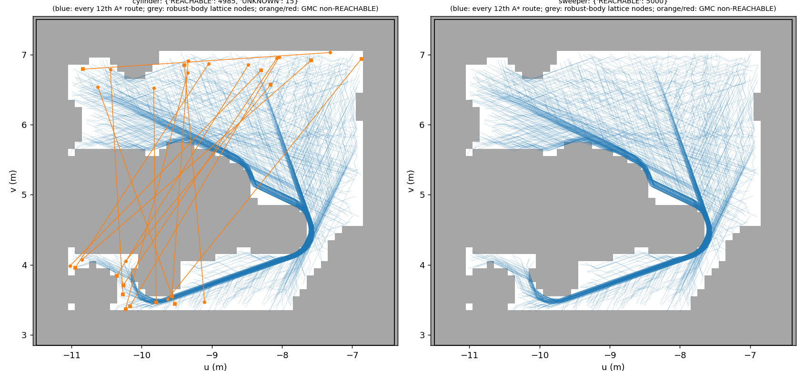

# aerial3d-ground on a confirmed-reachable benchmark (F2, 2026-10-02)

**Headline.** Of 5000 cylinder pairs that an independent A* confirmed reachable with real clearance, in a new
sub-region of the same archive, **GMC's cylinder confirmed 4985 and failed on 15 (0.30 %). 0 were UNREACHABLE.**
- All 15 are UNKNOWN : `shared_replay_failed`. GMC's own verifier certified every one of the 15 routes.
- 14 fail the shared replay's timing check by 1–3e-9: float round-off on a µrad in-place turn (F1's SW-KIN
  mechanism, §3.3 there). The 1 ms turn floor clears all 14.
- 1 fails the replay's map-coverage test on its first exported segment. Every pose is inside the domain, but the
  replay boxes the whole swept segment, and that box sticks out by 3.6 mm (§4.2).
- **No soundness problem observed**: no confirmed-reachable pair was certified UNREACHABLE, and no pair failed on
  the endpoint or the safe graph.
- The sweeper on the same 5000 pairs: **5000/5000 REACHABLE**.

Machine-readable:
- `gmc/results/aerial3dg/f2/summary.json` (per-robot counts and every non-REACHABLE row);
- `pairs_confirmed_5000.json` (the benchmark, with each pair's A* evidence and route);
- `gmc/{cylinder,sweeper}/task_00.jsonl` (GMC rows);
- `diag/` and `task2/` (probes).

Process: `docs/worklog/aerial3dg_fail.md` (F2 section). Labels: **[E]** = evidence-backed by a committed file
named next to it; **[G]** = guess or inference, not tested.

## 1. The new region (Task 1a)

**Assumption** (the prompt's, kept): "a new scene" = a new open sub-region of the same `scene_v2` archive. I did not
search the filesystem for another archive. I came across none in this worktree or in the F1 material.

**Survey** (job 19029374, `results/aerial3dg/f2/region/survey.{json,png}`, survey_maps.png and survey_context.png inspected):
- I tried five candidate boxes, each with G2's crop rule, the floor-support contract, and a 5 cm grid of the
  shared oracle at each robot's z_c (margin 0.001).
- Share of the grid that is cylinder-free **[E]**:

  | box | u × v | supports | free |
  |---|---|---|---|
  | NW | [-11.5,-6.4] × [2.85,7.5] | 200,755 | 51 % |
  | NSTRIP | [-11,0.2] × [2.85,4.5] | 347,795 | 32 % |
  | E | [0.9,5.5] × [2.75,4.7] | 32,382 | 27 % |
  | S | [-5.3,4.5] × [-1.75,-0.45] | 333,487 | 23 % |
  | NE | [-5.4,0.2] × [2.85,4.4] | 110,263 | 20 % |

- The north strip and NE (the prompt's first pointer, "north of v≈3") are cut by many oracle-occupied disks in the
  cylinder band. These are the faint squares in F1's cylinder-band raster (floaters in the 0.02–1.75 m band).
- The dense round objects at u≈[4,7.5] are the high-density option the prompt said to avoid. E, next to them, is
  already 27 % free and narrow.

**Choice: NW, u[-11.5,-6.4] v[2.85,7.5]** **[E]**:
- Lowest cylinder-band density of the five, with one compact obstacle (the table/vitrine block around (-10.5, 4.8)
  in F1's raster) in otherwise open floor.
- 200,755 supports, the same order as G2's 582,372. Floor-support contract deviation 0.0288 m (limit 0.05).
- It is not F1's structure:
  - The east face is 0.7 m west of the u≈-5.7 wall line visible in F1's top raster panel. The cylinder's domain
    limit is at u = -6.80.
  - The south face lies north of wall B and of F1's three CY-GAP floor splats (v ≤ 2.15).
  - The lamp booth (u≈-0.85) is far east.
- The robust-body free space (§2) is a C-shaped corridor round the table (`f2_map.png`). Pairs between the south
  strip (v≈3.4–4.1) and the north part need a detour through the gap at u≈-7.6, v≈4.5. So the region is open but
  not trivial.

**Probe compiles** (`results/aerial3dg/f2/probe/{small,nw}/probe.json`, jobs 19029955 / 19029988) **[E]**:

| crop | supports | cylinder candidate pairs | cylinder compile | sweeper candidate pairs | sweeper compile | peak RSS |
|---|---|---|---|---|---|---|
| small u[-11.5,-9] v[2.85,5.2] | 54,503 | 1,251 | 2.2 s | 108 | 3.3 s | 1.38 GB |
| full NW | 200,755 | 2,029 | 11.6 s | 205 | 12.4 s | 2.1 GB (job) |

The persisted compiles used for the run:
- cylinder `1583582b0f891670`: 8.5 s, 63.7 MB, sha256 `6a67c6a5…`;
- sweeper `19a764dcb391dd05`: 11.5 s, 61.8 MB, sha256 `ebab9d1b…`.

Both are `.a3c` files with SHA-256 sidecars under `gmc/outputs/aerial3dg/f2/` (not committed, reproducible).

## 2. "Confirmed reachable": definition, method, acceptance (Task 1b)

**Why a robust body, not a 5 cm oracle margin** **[E]**:
- The shared oracle's clearance is the 3-D distance from the body to each 2σ ellipsoid, and the chassis rides
  0.02 m above the floor.
- So floor splats cap clearance below 0.02 m everywhere: the survey finds **oracle clearance ≥ 0.02 m on 0 % of
  all five boxes, for both robots**. A route with ≥ 5 cm clearance in the oracle's own sense does not exist
  anywhere in the hall.

**The rule actually used** (`experiments/aerial3dg_fail2_sample.py`, docstring):
- The test runs on a **robust body**: the cylinder grown 5 cm in radius and 5 cm at the top, with the chassis
  bottom unchanged (r 0.35, half-height 0.89, still 0.02 m over the floor).
- The margin is **0.003 m**: 3× the shared 1 mm, and 1 mm above aerial3d's margin + buffer.
- The robust body contains the real cylinder. So a route it passes keeps the real cylinder ≥ 5 cm + 3 mm from
  every Gaussian sideways or above, and > 3 mm from anything below. Its world AABB also contains the real body's,
  so the route lies inside GMC's own domain: no CY-GAP-style box artefact is possible.
- The 5 cm is lateral/overhead only; the vertical guarantee is 3 mm. This is the one place I had to depart from the
  literal "≥ 5 cm", for the reason above.

A pair (uniform in the box, G2's draw rule) is accepted only if all of the following hold, cheapest test first:
0. Distance ≥ 3 m (G2's convention, unchanged).
1. Both endpoints are oracle-free for the **real** cylinder at margin 0.001 (G2's own-endpoint test).
2. Both endpoints are oracle-free for the robust body at margin 0.003.
3. **Cheap pre-filter**: each endpoint attaches, by one robust-body oracle edge, to a node of the same connected
   component of a shared 0.1 m route-frame lattice. The lattice is built once for the region: 913 free nodes, 2
   components (912 + 1), 14 s.
4. The gs3d lattice A* (`LatticePlanner`, F1/ground5k settings: 0.1 m lattice, position tolerance 0, yaw tolerance
   0.05, 500k expansions) on the robust body at margin 0.003 returns **ROUTE**: its post-build verification of
   every closed edge and of kinematics passed. `NO_ROUTE_MARGIN` is rejected.
5. That route, shifted onto the real cylinder's z_c, re-verifies edge by edge with the **real** cylinder at the
   shared margin 0.001 (`verify_path` with the goal).

Rejection is whole-draw, so every stream prefix is an unbiased sample of the conditional law.

**Pilot** (job 19029956, `sample/nw_pilot/`, 150 distance-passing candidates, A* run on pre-filter rejects too)
**[E]**:
- 12 accepted (8 %).
- Every candidate that reached step 4 got ROUTE, and every route re-verified.
- A* 2.75 s mean per call; endpoint tests ~4 ms. That is ≈ 2.8 s per accepted pair, so a projected **≈ 4 CPU-h for
  5000**, well inside 150 CPU-h. N was kept at 5000.

**Full draw** (jobs 19030110/19030111, two streams with quota 2500 each; `pairs_confirmed_5000.json → stages`)
**[E]**:

| stage | entered | failed | pass rate | cost (sum) |
|---|---|---|---|---|
| 1 endpoints free, real cylinder, 1 mm | 67,292 | 55,848 | 17.0 % | endpoint tests together 162 s |
| 2 endpoints free, robust body, 3 mm | 11,444 | 6,333 | 44.7 % | (included above) |
| 3 lattice pre-filter | 5,111 | 98 | 98.1 % | 11 s (2 ms per pair) |
| 4 A* ROUTE, robust body | 5,013 | 13 (all NO_ROUTE_MARGIN) | 99.7 % | 12,563 s (mean 2.5 s, max 8.0 s) |
| 5 re-verify, real cylinder, 1 mm | 5,000 | 0 | 100 % | 182 s |

- Totals: 187,464 draws; 67,292 passed the distance test; **5000 accepted** (7.4 % of distance-passing). Sampling
  CPU 3.6 h.
- Endpoint rejections (stage 1) are mostly `map_unknown` (39,867). The domain keeps the cylinder's centre 0.40 m
  inside each face of this small box, so a uniform draw often lands in that band.
- Accepted pair distances run 3.00–4.92 m (median 3.37). This is shorter than G2's (3–12 m) because the box is
  small.
- A* lattice route length / straight distance: median 1.20, and 36 % are > 1.3 (the lattice zig-zags, and some
  pairs detour round the table).

**Caveats on the benchmark** (stated, not hidden):
- **[E]** The 98 pre-filter rejects were not run through the A* in the full draw. The pilot's audit had none to
  test, so the pre-filter's false-rejection rate is unmeasured.
- **[G]** 78 of them have one endpoint attaching only to the lone 1-node lattice component, a pocket near
  (-11, 3.4). Excluding them can only make the benchmark easier. It cannot admit an unconfirmed pair.
- **By construction** the benchmark contains only comfortable pairs: ≥ 5 cm lateral, 3 mm vertical. It deliberately
  does not test GMC on reachable-but-tight pairs. F1 showed those are where its incompleteness lives (1–2 mm
  endpoints, sub-mm slivers).

## 3. GMC on the 5000 confirmed pairs (Task 1c)

- Compile once per robot (above), then one job per robot, G2's full `QCONFIG` (jobs 19030276 / 19030277).
- One compile id per robot across all 5000 rows: the compile-once proof holds, with no compile stage inside any
  query.

| robot | REACHABLE | UNKNOWN | UNREACHABLE | TIMEOUT/ERROR | query wall mean / median / max |
|---|---|---|---|---|---|
| **cylinder** | **4985** | **15** (`shared_replay_failed` 15) | **0** | 0 | 1.53 / 0.70 / 15.2 s |
| sweeper | 5000 | 0 | 0 | 0 | 0.83 / 0.49 / 4.7 s |

- **[E]** By distance tercile, cylinder failures are 2 / 7 / 6 out of about 1667 each.
- On the 4985 cylinder REACHABLE rows, GMC's route is shorter than the A* lattice route (median ratio 0.93). Its
  own-verifier clearance bound has median 1.08 mm.
- **[E]** The sweeper passes trivially, as expected. It is geometrically inside the cylinder (same axis, same
  bottom), so every pair is reachable for it with even more room.

## 4. The 15 cylinder failures (Task 1d)

Probe: `experiments/aerial3dg_fail2_kin.py --full` (job 19050913, `diag/kin_f2_cylinder.json`). For each row it
re-queries on the same compile with the same full config, rebuilds the exported gs3d trajectory exactly as
`api.query` does, and replays it with the shared oracle three times: as exported, with every in-place turn
≥ 1 ms, and with turns and translations ≥ 1 ms. All 15 reproduce `shared_replay_failed` with own verifier
`CERTIFIED`.

### 4.1 CY-KIN (14): round-off in the replay's yaw-rate check **[E]**
- Replay geometry passed on all 14, and the attained goal matched.
- Each fails `verify_linear_trajectory` on exactly one step: an in-place turn of 0.62–1.17 µrad at t = 10.6–20.3 s,
  yaw-rate excess 1.0–2.9e-9 against a 1e-9 tolerance.
- This is F1's SW-KIN mechanism (F1 §3.3) on the cylinder: the turn takes about 1 µs, which is added to t ≈ 15 s in
  binary64.
- With the 1 ms turn floor, 14/14 pass the full replay (geometry + kinematics + goal).

### 4.2 CY-REPLAY-DOMAIN (1, new): the replay's swept-segment coverage test, F2-03140 **[E]**
- GMC's route is the straight segment (-7.3158, 7.0298) → (-10.838, 6.792). The start is 0.07 m below the
  cylinder's domain limit v = 7.10.
- The replay reports geometry `map_unknown` on the first exported segment (0.196 m) and has no kinematic violation.
- `experiments/aerial3dg_fail2_diag.py` (`diag/replay_domain_F2-03140.json`) measures the cause:
  - **Every exported pose** keeps the real body's world AABB inside the prism. The tightest face is the floor
    (z, 2 cm); none of the 19 knot poses exceeds u or v.
  - The shared oracle's edge test instead takes the world AABB of the **swept** segment,
    `[min(pa,pb) − half, max(pa,pb) + half]` (`gs3d/oracle.py` `edge`), and maps its 8 corners into the 64°-rotated
    route frame (`integration.RouteBoxKnownSpace.contains_aabb`).
  - For segment 0 that box sticks out of the north face by **3.55 mm**. Every other segment fits.
- aerial3d's domain is per pose (body AABB inside the prism, F1 §1a). That set of centres is convex, so the body
  never leaves the prism along the segment.
- The veto is the replay's coverage test being more conservative than the body's sweep in a rotated frame. It is
  not contact, and not a hole in GMC's certificate.
- **[G]** Fixes, untested: a finer export split near faces, or a coverage test on the swept body itself rather than
  its world AABB.

### 4.3 Soundness check
**Zero** confirmed-reachable pairs were certified UNREACHABLE, so there is no cut certificate to trace against an
A* route. Within this benchmark, **no evidence of a soundness bug** **[E]**. There were also zero
`*_not_certified_free` and zero `safe_graph_disconnected` rows. The 3 mm vertical margin at the endpoints puts them
above aerial3d's margin + buffer (2 mm), which is consistent with F1's endpoint mechanism not appearing **[G]**:
these endpoints never sit in the 1–2 mm band that F1 found.

### 4.4 Headline table

| | count | share of 5000 |
|---|---|---|
| GMC cylinder agrees (REACHABLE) | 4985 | 99.70 % |
| UNKNOWN : shared_replay_failed, kinematic round-off (CY-KIN) | 14 | 0.28 % |
| UNKNOWN : shared_replay_failed, swept-AABB coverage (CY-REPLAY-DOMAIN) | 1 | 0.02 % |
| UNKNOWN : endpoint not certified free | 0 | 0 |
| UNKNOWN : safe graph disconnected | 0 | 0 |
| **UNREACHABLE** | **0** | 0 |
| **false negatives total** | **15** | **0.30 %** |

**Reading.** On comfortably reachable pairs in an open region, GMC's verdict machinery (cells, portal search,
lifting, own verifier) never failed. Every miss sits in the route export / shared replay interface, after the
method had already found and certified a route. A 1 ms in-place-turn floor would remove 14 of 15. **[G]** With
that floor, plus a less conservative coverage test or a finer export split near box faces, the rate would be 0 on
this benchmark (not re-run end to end).

## 5. Task 2 (original G2 box)

### 5.1 Replay vetoes of F1's widened-box cylinder runs **[E]**
`experiments/aerial3dg_fail2_kin.py` re-queries every `shared_replay_failed` row on F1's W1/W2 compile in the same
verdict-only mode. Jobs 19030278 / 19030279, output `results/aerial3dg/f2/task2/kin_{w1,w2}_cylinder.json`.

| run | vetoes | from class | replay geometry passed | violation kind | 1 ms turn floor clears | turn + 1 ms translation floor clears |
|---|---|---|---|---|---|---|
| W1 | 468 | 465 CY-GAP + 3 G2-REACHABLE | 468/468 | turn 387, translation 64, both 17 | 387 | **468/468** |
| W2 | 531 | 519 CY-GAP + 12 G2-REACHABLE | 531/531 | turn 520, translation 10, both 1 | 520 | **531/531** |

- **W1's 81 vetoes the turn floor did not clear** (F1 left them undiagnosed): every one has a translation violation
  (64 alone, 17 together with a turn).
  - F1's tally of "70 translation + 11 uncleared turns" counted only the first violating step. Here 81 =
    64 + 17.
  - The translations are 1.9e-9 to 7.5e-8 m long. They are float residues of collinear densify knots, timed
    length / 0.3 m/s and then failing the speed check by round-off.
  - **Fix: give every translation ≥ 1 ms as well, which clears all of them.**
- **W2's 519** (plus 12 from G2-REACHABLE pairs): the same picture. Geometry passed on all 531 and both floors clear
  all 531.
- So every replay veto in F1's widening experiment is export round-off. Counting both W1 and W2, **all 1587 CY-GAP
  pairs have a route that passes the full shared replay** once the turn and translation floors are applied.

### 5.2 Buffer-0 endpoint cell on the cylinder's own 412 rows: already done by F1 **[E]**
- The prompt said F1 verified this only for the sweeper. In fact F1's job 18984830 ran all 412 cylinder rows
  (`gmc/results/aerial3dg/f1/fix/endpoints_buffer0_cylinder.json`, summarised in F1 §3.1), so I did not re-run it.
- By subclass (joined with `classes.csv`):
  - **CY-EP (400)**: 30 REACHABLE; 369 move on to `safe_graph_disconnected` (CY-GAP pairs underneath); 1
    (G2-04646) still `start_not_certified_free`.
  - **CY-EP-LAT (12)**: all 12 move on to `safe_graph_disconnected`. They are CY-GAP pairs underneath, and the
    lateral blocker does not stop the buffer-0 endpoint cell.

`docs/aerial3dg_failures.md` links here; §5 updates its §3.3 / §5 rows.

## 6. Jobs, cost, reproduction
All jobs: 1 CPU, ≤ 4 GB, `cpu_short`. IDs and purpose in `/scratch/wg2381/claude_jobs/aerial3dg_fail/jobids/F2.txt`.
Total **7.4 CPU-h** of the 150 CPU-h budget (sum of job elapsed times).

| job | what | wall |
|---|---|---|
| 19029374 | region survey (5 boxes) | 83 s |
| 19029955, 19029988 | probe compiles (small crop, full NW) | 13 s, 33 s |
| 19029956 | lattice + audited pilot | 97 s |
| 19030110, 19030111 | full confirmed-reachable draw (2 streams) | 1.84 h, 1.80 h |
| 19030112 | cylinder compile + smoke (12 pilot pairs, all REACHABLE) | 36 s |
| 19030233 | collect → `pairs_confirmed_5000.json` | 10 s |
| 19030276, 19030277 | GMC cylinder / sweeper, 5000 pairs each | 2.14 h, 1.17 h |
| 19030278, 19030279 | Task 2.1 W1 / W2 veto probes | 10 min, 13 min |
| 19050913 | F2 veto probe (15 rows) | 47 s |

```bash
cd gmc; export PYTHONPATH=src:experiments; H=hpc/aerial3dg; B="-11.5 2.85 -6.4 7.5"
sbatch --job-name=a3f2_survey $H/f2_py.sbatch experiments/aerial3dg_fail2_region.py survey --robots cylinder sweeper --out results/aerial3dg/f2/region --boxes NW:-11.5,2.85,-6.4,7.5 ...
sbatch $H/f2_pilot.sbatch nw_pilot $B 150
for s in 1 2; do sbatch --job-name=a3f2_samp$s --time=05:00:00 $H/f2_py.sbatch experiments/aerial3dg_fail2_sample.py run --box $B \
  --lattice results/aerial3dg/f2/sample/nw/lattice.npz --stream $s --quota 2500 --out-dir results/aerial3dg/f2/sample/nw; done
python experiments/aerial3dg_fail2_sample.py collect --out-dir results/aerial3dg/f2/sample/nw --n 5000 --out results/aerial3dg/f2/pairs_confirmed_5000.json
for r in cylinder sweeper; do sbatch --job-name=a3f2_gmc_$r $H/f2_gmc.sbatch $r $B results/aerial3dg/f2/pairs_confirmed_5000.json; done
python experiments/aerial3dg_fail2_analyze.py summary; python experiments/aerial3dg_fail2_analyze.py plot
sbatch $H/f2_py.sbatch experiments/aerial3dg_fail2_kin.py --full --a3c outputs/aerial3dg/f2/cylinder.a3c --rows results/aerial3dg/f2/gmc/cylinder/task_00.jsonl --out results/aerial3dg/f2/diag/kin_f2_cylinder.json
python experiments/aerial3dg_fail2_diag.py
sbatch --mem=4G $H/f2_py.sbatch experiments/aerial3dg_fail2_kin.py --a3c outputs/aerial3dg/f1/widen/w2_cylinder.a3c --rows results/aerial3dg/f1/widen/w2/cylinder/fast_00.jsonl --out results/aerial3dg/f2/task2/kin_w2_cylinder.json
```

Nothing under `gmc/src/` was changed. F1's and G2's results are untouched; F2 only reads them.


