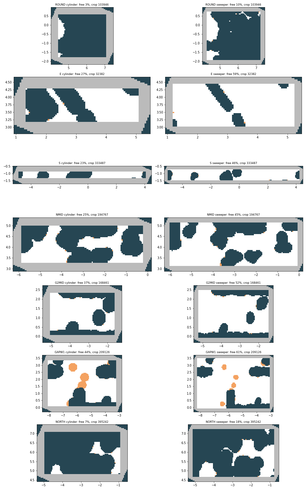
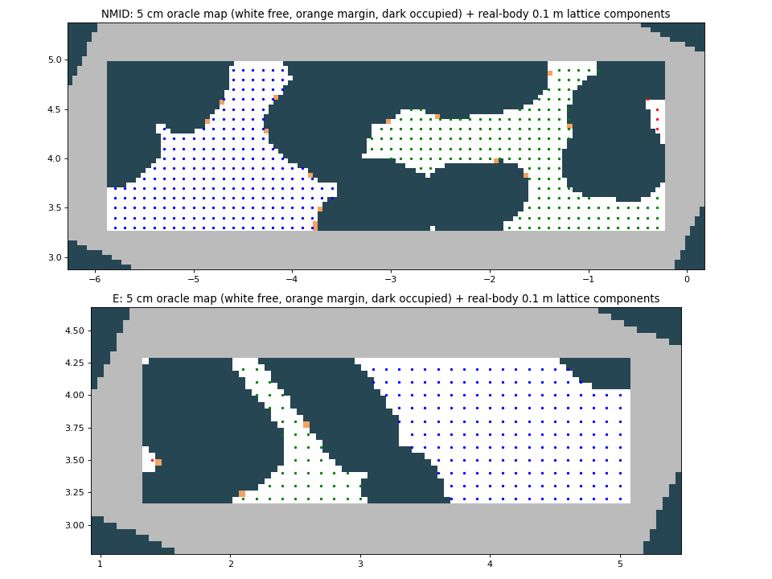
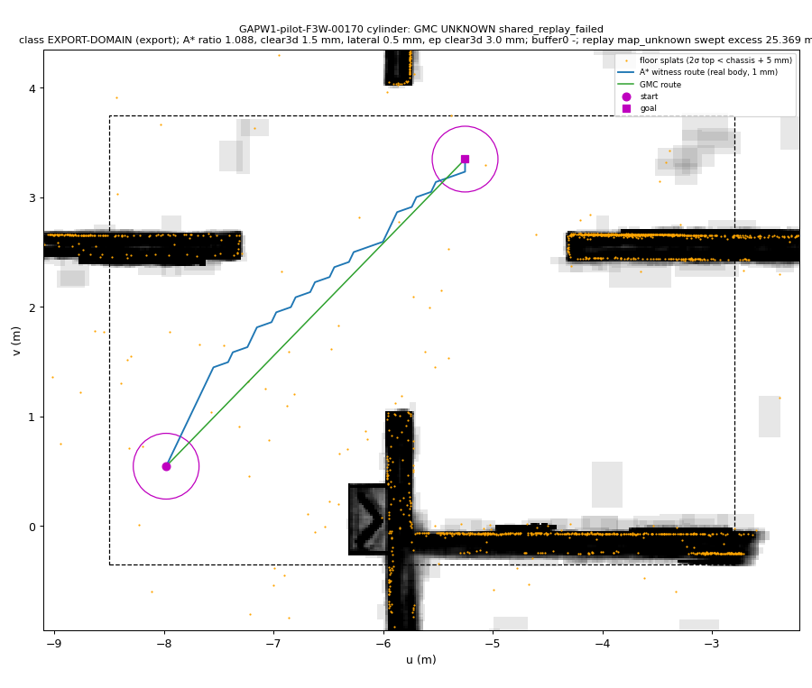
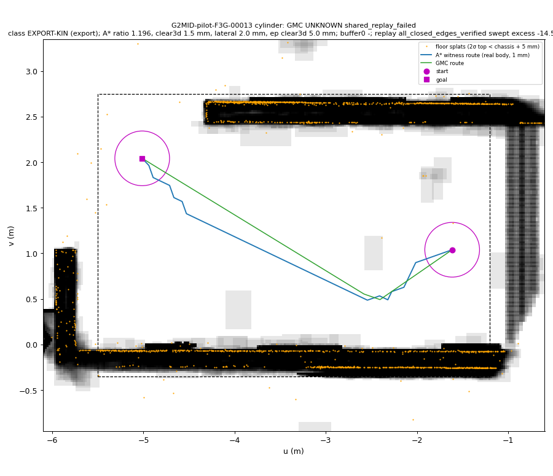
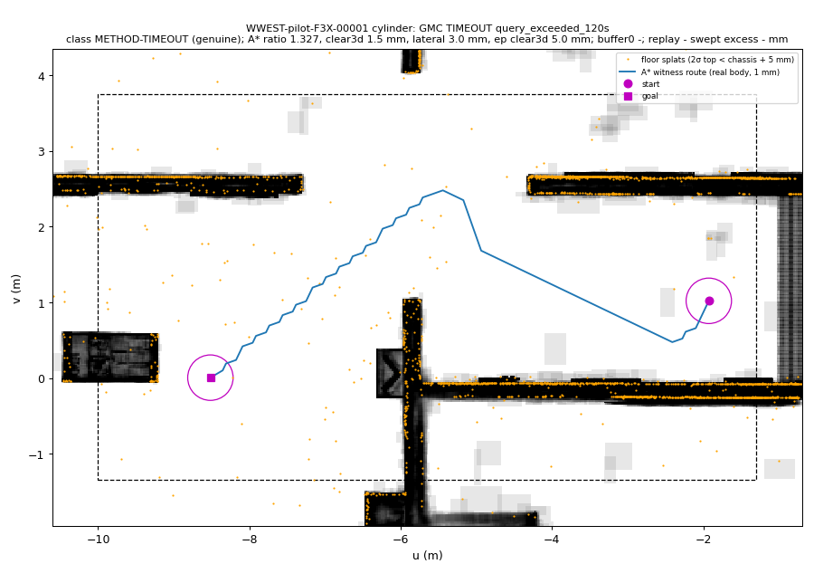

# aerial3d-ground: looking for regions where A* proves a path but GMC fails (F3, 2026-10-07)

**Headline.**
Six candidate regions, all stricter than F2: the **real** cylinder, no robust inflation. **[E]**
- E and NMID have no usable yield.
- In the other four, **1,380 confirmed-reachable pairs** were run through GMC (uniform pilots and targeted runs, both robots).
- **0 UNREACHABLE** anywhere, so no soundness problem was observed.
- **The only genuine (method) failure is METHOD-TIMEOUT in WWEST:**
  - 20 of 200 uniform confirmed pairs exceed G2's 120 s query limit;
  - on WWEST's REACHABLE rows, 95 % of query time goes to route post-processing (tighten + shortcut);
  - **[E]** the timeouts are post-processing, not search. On the same compile all 31 TIMEOUTs (20 pilot + 11 targeted)
    answer in 0.5–3.1 s in verdict-only mode (no shortcut / tighten / merge). With a 300 s limit, 19 finish REACHABLE in
    119–284 s and 12 still exceed 300 s. Tighten + shortcut take 97–98 % of the stage time.
- **Everything else is by-tolerance or an export artefact:**
  - every endpoint failure has endpoint clearance ≤ 2.1 mm, i.e. within margin + buffer; the share of confirmed pairs with
    such an endpoint equals the EP failure rate in every region;
  - every replay veto is F2's swept-AABB coverage artefact or F1's µs round-off. In the thin S box the coverage test
    vetoes 47 % of the cylinder's own-certified routes.
- **F4 choice:** WWEST 2500 (the genuine failures) + GAPW1 1500 (highest by-tolerance rate) + S 1000 (tightest
  lateral clearance). Backup G2MID. Projected 38 CPU-h of 200 for sampling + GMC (§6).

The G2 audit (Task 0) is in its own document: [`aerial3dg_g2_audit.md`](aerial3dg_g2_audit.md).

Machine-readable:
- `gmc/results/aerial3dg/f3/pilot_summary.json`: per region × run × robot: funnel, verdicts, classes, costs.
- `failures_pilot.csv`: one row per GMC failure, with class, probe results and A* evidence.
- `sample/<R>/<run>_pairs.json`: the confirmed pairs, each with its A* route and clearances.
- `gmc/<R>/<run>/<robot>/task_00.jsonl`: GMC rows.
- `diag/<R>/<run>/`: probes.
- `cases/`: figure inputs and figures.
- `f4_handoff.json`: F4's input.

Process: `docs/worklog/aerial3dg_fail.md` (F3 section). Labels: **[E]** = backed by the committed file named next to it;
**[G]** = guess or inference, not tested.

## 0. What changed from F2, and the rules used here
- **Real body, no inflation.** A pair is *confirmed reachable* only if all of these hold
  (`experiments/aerial3dg_fail3_sample.py`, docstring):
  - both endpoints are oracle-free for the **real** cylinder at the shared margin 0.001;
  - the straight distance is ≥ 3 m;
  - the gs3d lattice A* (`LatticePlanner`, 0.1 m, position tolerance 0, yaw tolerance 0.05, 500k expansions) returns
    **ROUTE** for the real body at margin 0.001;
  - that route re-verifies edge by edge with `verify_path`.

  F2's +5 cm robust body is gone. A sweeper route follows from the cylinder route, because the sweeper is inside the
  cylinder (same axis, same chassis bottom, r 0.175 < 0.30, top 0.10 < 1.75).
- **Funnel**: distance → endpoints free → shared 0.1 m real-body lattice pre-filter → A* → re-verify. Rejection is
  whole-draw, so any prefix of a stream is an unbiased sample. The pre-filter only rejects. It was audited by running
  the A* on 160 recorded rejects (E 60, NMID 40, S 60): **160/160 were A* non-routes too** (NO_ROUTE 109,
  NO_ROUTE_MARGIN 51) **[E]** (`sample/{E,NMID,S}/pilot/prefilter_audit.json`).
- **Difficulty evidence per accepted pair** (on the exact re-verified poses):
  - `clear3d`: oracle 3-D clearance ladder, 0.5 … 100 mm;
  - `lateral`: radius + top growth ladder for the body with its chassis raised 3 mm, which ignores the floor splats;
  - `vertical`: geometric gap from the chassis bottom down to the floor splats under the route (a lower bound);
  - both endpoints' `clear3d`;
  - route length / straight distance.
- **Failure classes** (`experiments/aerial3dg_fail3_probe.py`, docstring):

  | group | class | rule |
  |---|---|---|
  | export | EXPORT-DOMAIN | shared replay geometry `map_unknown`, no exported pose leaves the prism, but a swept-segment world AABB does (F2 §4.2) |
  | export | EXPORT-KIN | 1 ms turn + translation floors clear the replay (F1/F2) |
  | tolerance | EP-TOL | `*_not_certified_free` with endpoint clearance ≤ margin + buffer (2 mm), or within 0.1 mm above it (fails at 2.1 mm) |
  | tolerance | GAP-TOL | `safe_graph_disconnected` and no real-body A* route at margin 0.0021 |
  | genuine | METHOD-TIMEOUT | the query exceeded G2's 120 s limit |
  | genuine | EP-GENUINE / GAP-GENUINE / REPLAY-OTHER / METHOD-ERROR / SOUNDNESS | the rest; SOUNDNESS = UNREACHABLE on a confirmed pair |

- GMC is run exactly as G2 ran it: one persisted compile per robot per region (`.a3c` + SHA-256 sidecar), then every
  pair through G2's full `QCONFIG` with the 120 s timeout. The compile-once proof holds in every task summary
  (`same_compile_id_all_rows`, no compile stage inside a query).

## 1. Candidate regions
Survey of 7 boxes (job 19309414, `results/aerial3dg/f3/region/survey_maps.png`, inspected): a 5 cm oracle map per
robot at its z_c, margin 0.001.
- ROUND (the dense round objects, u[4,7.5] v[-2.2,1]): 3 % cylinder-free.
- NORTH (u[-5.4,-0.5] v[4.4,7.5], floater clutter): 7 % cylinder-free.

Both were dropped without a compile: for the cylinder they are solid. The other boxes were persisted-compiled for both
robots (`a3f3_compile`, `results/aerial3dg/f3/probe/<R>/compile_<robot>.json`). WWEST was added after the first
pilots: it is F1's W1 box minus the lamp booth, and larger boxes are where F1 saw its only method errors.



| region | box u0 v0 u1 v1 | supports | cylinder-free (5 cm grid) | compile cyl / sw (s) | candidate pairs cyl / sw | peak RSS (MB) | floor-contract deviation (m) |
|---|---|---|---|---|---|---|---|
| E | 0.9 2.75 5.5 4.7 | 32,382 | 27 % | 4 / 3 | 21 / 5 | 1384 | 0.048 |
| NMID | -6.3 2.85 0.2 5.4 | 194,767 | 25 % | 10 / 9 | 37,416 / 629 | 1383 | 0.037 |
| S | -5.3 -1.75 4.5 -0.45 | 333,487 | 23 % | 5 / 7 | 41 / 45 | 1383 | 0.024 |
| G2MID | -5.5 -0.35 -1.2 2.75 | 168,461 | 37 % | 16 / 8 | 62,811 / 3,111 | 1384 | 0.022 |
| GAPW1 | -8.5 -0.35 -2.8 3.75 | 209,126 | 44 % | 24 / 11 | 65,986 / 2,286 | 1384 | 0.022 |
| WWEST | -10 -1.35 -1.3 3.75 | 390,716 | (not surveyed) | 61 / 24 | 161,744 / 4,668 | 1384 | 0.027 |

**E and NMID are inadequate** **[E]** (`sample/{E,NMID}/pilot/`, `region/lattice_NMID_E.png`, inspected):

| region | distance-passing candidates | endpoint-free | pre-filter | accepted | real-body 0.1 m lattice |
|---|---|---|---|---|---|
| E | 42,377 | 159 | 0 pass | 0 | 225 free nodes in 3 components (180 / 44 / 1) |
| NMID | 10,879 | 599 | 0 pass | 0 | 412 free nodes in 3 components (222 / 186 / 4) |

- In both boxes an obstacle reaches the cylinder's domain inset at a box face: the diagonal band in E, the blob at
  u≈-3.3 in NMID. That splits the free space into two pockets, and every ≥ 3 m endpoint-free pair straddles them.
- The A* agrees on every audited reject: E 60/60 and NMID 40/40 are non-routes.
- In the brief's words, "too many pairs are ones A* proves impossible".



## 2. Uniform pilots: funnel and A* rejection split
Uniform draw in the box (G2's rule), seeded per region (`seed_base + 1000·stream`). Pilot = stream 1, quota 200 **[E]**
(`pilot_summary.json → funnel`). Targeted runs (separate streams, never mixed into these rates):
- *detour* (stream 21): the straight segment is blocked;
- *tight* (stream 31): an endpoint within 3 cm laterally of an obstacle, and the straight segment blocked.

| region / run | n | distance-passing cand. | endpoint pass | pre-filter pass | A* ROUTE / NRM / NR / UNSURE (on pre-filter pass) | CPU s per accepted | len ratio p50 / p90 | lateral p10 / p50 (mm) |
|---|---|---|---|---|---|---|---|---|
| S/pilot | 200 | 195,212 | 5.0% | 2.1% | 200 / 0 / 0 / 0 | 1.8 | 1.08 / 1.09 | 0.5 / 5 |
| S/targeted | 100 | 81,670 | 5.1% | 2.4% | 100 / 0 / 0 / 0 | 1.9 | 1.08 / 1.09 | 0.5 / 5 |
| S/tight | 60 | 131,818 | 5.1% | 2.9% | 60 / 0 / 2 / 0 | 3.4 | 1.08 / 1.10 | 0 / 2 |
| G2MID/pilot | 200 | 6,124 | 3.3% | 100.0% | 200 / 0 / 0 / 0 | 3.5 | 1.10 / 1.22 | 2 / 5 |
| G2MID/targeted | 100 | 3,789 | 2.7% | 100.0% | 100 / 0 / 0 / 0 | 3.9 | 1.12 / 1.23 | 2 / 5 |
| G2MID/tight | 60 | 6,596 | 3.3% | 100.0% | 60 / 0 / 0 / 0 | 4.8 | 1.11 / 1.21 | 1.9 / 5 |
| GAPW1/pilot | 200 | 1,965 | 10.7% | 94.8% | 200 / 0 / 0 / 0 | 8.0 | 1.18 / 1.53 | 10 / 50 |
| GAPW1/targeted | 100 | 1,304 | 8.2% | 94.3% | 100 / 0 / 0 / 0 | 8.4 | 1.24 / 1.50 | 5 / 50 |
| GAPW1/tight | 60 | 2,935 | 10.4% | 92.3% | 60 / 0 / 0 / 0 | 7.0 | 1.13 / 1.37 | 1 / 7.5 |
| WWEST/pilot | 200 | 1,992 | 13.4% | 75.2% | 200 / 0 / 0 / 0 | 13.8 | 1.20 / 1.49 | 5 / 50 |
| WWEST/targeted | 100 | 1,414 | 11.1% | 68.0% | 100 / 0 / 0 / 0 | 17.0 | 1.20 / 1.58 | 5 / 20 |

Reading **[E]**:
- **The A* reject split is almost empty because the pre-filter does that work.** Of the 1,382 pairs that passed it,
  1,380 got ROUTE and 2 NO_ROUTE (S/tight). The rejects themselves are audited above: 160/160 A* non-routes, NO_ROUTE 109 / NO_ROUTE_MARGIN 51.
- **Endpoint pass rates of 3–13 % are mostly geometry.** `map_unknown` comes from the 0.40 m domain inset in the
  64°-rotated frame; `occupied` / `minkowski` from obstacles.
- **S is the tight region.** 42 % of its A* routes have lateral clearance ≤ 2 mm, and 14.5 % of its pairs have an
  endpoint below 2 mm (GAPW1 19.5 %, G2MID 9 %, WWEST 5.5 %).
- **GAPW1 and WWEST are the detour regions.** Detour ratio p90 is 1.5, and WWEST pairs reach 7.3 m.
- **Every region's `clear3d` is capped at 1–1.5 mm by the floor splats.** As the brief anticipated, the 3-D number is
  uninformative; `lateral` and the endpoint clearances are what separate the regions.

## 3. GMC on the confirmed pairs (uniform pilots and targeted runs)
One persisted compile per robot per region, G2's full `QCONFIG`, 120 s timeout **[E]**
(`gmc/<R>/<run>/<robot>/task_00.jsonl`, `pilot_summary.json`). Classes as in §0.

| region / run | robot | REACHABLE | genuine | by-tolerance | export | unverified | classes | query wall mean / max (s) |
|---|---|---|---|---|---|---|---|---|
| S/pilot | cylinder | 78 / 200 | 0 | 29 | 93 | 0 | EP-TOL 29, EXPORT-DOMAIN 93 | 0.03 / 0.2 |
| S/pilot | sweeper | 193 / 200 | 0 | 7 | 0 | 0 | EP-TOL 7 | 0.02 / 0.0 |
| S/targeted | cylinder | 38 / 100 | 0 | 23 | 39 | 0 | EP-TOL 23, EXPORT-DOMAIN 39 | 0.03 / 0.3 |
| S/targeted | sweeper | 98 / 100 | 0 | 2 | 0 | 0 | EP-TOL 2 | 0.03 / 0.2 |
| S/tight | cylinder | 8 / 60 | 0 | 3 | 49 | 0 | EP-TOL 3, EXPORT-DOMAIN 49 | 0.04 / 0.2 |
| S/tight | sweeper | 59 / 60 | 0 | 1 | 0 | 0 | EP-TOL 1 | 0.02 / 0.0 |
| G2MID/pilot | cylinder | 181 / 200 | 0 | 18 | 1 | 0 | EP-TOL 18, EXPORT-KIN 1 | 1.59 / 24.9 |
| G2MID/pilot | sweeper | 198 / 200 | 0 | 2 | 0 | 0 | EP-TOL 2 | 0.31 / 1.2 |
| G2MID/targeted | cylinder | 90 / 100 | 0 | 10 | 0 | 0 | EP-TOL 10 | 1.97 / 25.6 |
| G2MID/targeted | sweeper | 99 / 100 | 0 | 1 | 0 | 0 | EP-TOL 1 | 0.36 / 1.0 |
| G2MID/tight | cylinder | 51 / 60 | 0 | 9 | 0 | 0 | EP-TOL 9 | 1.57 / 9.5 |
| G2MID/tight | sweeper | 60 / 60 | 0 | 0 | 0 | 0 |  | 0.31 / 1.2 |
| GAPW1/pilot | cylinder | 158 / 200 | 0 | 39 | 3 | 0 | EP-TOL 39, EXPORT-DOMAIN 3 | 7.10 / 64.1 |
| GAPW1/pilot | sweeper | 184 / 200 | 0 | 16 | 0 | 0 | EP-TOL 16 | 0.73 / 4.5 |
| GAPW1/targeted | cylinder | 72 / 100 | 0 | 22 | 6 | 0 | EP-TOL 22, EXPORT-DOMAIN 6 | 6.42 / 50.3 |
| GAPW1/targeted | sweeper | 95 / 100 | 0 | 5 | 0 | 0 | EP-TOL 5 | 0.66 / 3.3 |
| GAPW1/tight | cylinder | 32 / 60 | 0 | 14 | 14 | 0 | EP-TOL 14, EXPORT-DOMAIN 14 | 4.04 / 18.7 |
| GAPW1/tight | sweeper | 57 / 60 | 0 | 3 | 0 | 0 | EP-TOL 3 | 0.52 / 3.2 |
| WWEST/pilot | cylinder | 167 / 200 | 20 | 11 | 2 | 0 | EP-TOL 11, EXPORT-DOMAIN 2, METHOD-TIMEOUT 20 | 29.16 / 120.0 |
| WWEST/pilot | sweeper | 198 / 200 | 0 | 2 | 0 | 0 | EP-TOL 2 | 1.83 / 16.4 |
| WWEST/targeted | cylinder | 80 / 100 | 11 | 8 | 1 | 0 | EP-TOL 8, EXPORT-DOMAIN 1, METHOD-TIMEOUT 11 | 33.76 / 120.0 |
| WWEST/targeted | sweeper | 99 / 100 | 0 | 1 | 0 | 0 | EP-TOL 1 | 1.74 / 10.2 |

- **0 UNREACHABLE on 1,380 confirmed pairs × 2 robots.** Totals over all runs:
  - cylinder: EXPORT-DOMAIN 207, EP-TOL 186, METHOD-TIMEOUT 31 (WWEST pilot 20 + targeted 11), EXPORT-KIN 1;
  - sweeper: EP-TOL 40.
- The sweeper only ever fails on endpoints (EP-TOL). It never hits a replay veto in these runs, and never times out.

## 4. Failure mechanisms found
**4.1 EP-TOL: endpoint within margin + buffer of a floor splat (F1's mechanism)** **[E]**
- Every `*_not_certified_free` row in every region has endpoint oracle clearance ≤ 2.1 mm:
  - in all but one the 2 mm ladder rung fails;
  - F3Wt-00000's goal passes at 2.0 mm and fails at 2.1 mm (`diag/GAPW1/targeted/witness.json`).
- The buffer-0 probe (`diag/<R>/<run>/bufzero_<robot>.json`) re-queries every probed row with the endpoint cell grown
  without the 1 mm buffer. Of all 226 EP rows:
  - 186 become REACHABLE;
  - 36 become a replay veto (EXPORT-DOMAIN territory);
  - 1 stays `goal_not_certified_free` (WWEST F3Xt-00094, endpoint clearance in (1.0, 1.5] mm: like F1's G2-04646);
  - **2 become TIMEOUT** (GAPW1 F3W-00095 and F3W-00142, detour ratio 1.33 / 1.75): the post-processing cost of §4.4,
    seen in GAPW1 once the endpoint is unblocked;
  - **1 raises `ZeroDivisionError` in `aerial3d/query.py:217 simplify`** (WWEST F3X-00163). This is the latent src bug
    F1 hit once on W1 (pair 4217): coincident lifted points. It is reproducible here on a persisted compile, so it is a
    named F5 case (§5).
- The rate is predictable from the sample alone. The share of confirmed pairs with an endpoint below 2 mm is S 14.5 %,
  GAPW1 19.5 %, G2MID 9 %, WWEST 5.5 %, and the cylinder's EP-TOL rate equals it in every region (§3).
- The sweeper has the same chassis bottom, so the floor splats under an endpoint hit it too. Its EP-TOL rate is lower
  because its footprint covers fewer splats (r 0.175).

**4.2 EXPORT-DOMAIN: the shared replay's swept-AABB coverage test (F2 §4.2), frequent in thin boxes** **[E]**
(`diag/<R>/<run>/kin_cylinder.json` + `domain_cylinder.json`, analysis in `experiments/aerial3dg_fail3_analyze.py`)
- S pilot: 93/93 replay vetoes. GMC's own verifier CERTIFIED every route, the replay's kinematics passed, and replay
  geometry says `map_unknown`.
- **No exported pose leaves the prism.** The closest pose is −0.64 mm, i.e. inside.
- But the world AABB of the swept 0.20 m export segment, mapped into the 64°-rotated route frame, overshoots a box face
  by 0.4–69 mm (median 31 mm).
- S is 1.3 m wide in v, and the cylinder's centre band is only 0.5 m. GMC's straight routes run along the domain limit,
  and every such segment trips the test.
- The same happens near any face (GAPW1 3, GAPW1 tight 14, S targeted 39, S tight 49). In GAPW1-pilot-F3W-00170 the
  goal sits exactly on the domain limit v = 3.75 − 0.40 (figure below).
- **[G]** Fix options, untested: export segments no longer than ~2 cm near faces, or a coverage test on the swept body
  rather than its world AABB. This is an interface artefact, not a GMC failure.

**4.3 EXPORT-KIN** (G2MID F3G-00013): F1's sub-µm round-off, cleared by the 1 ms floors **[E]**.

**4.4 METHOD-TIMEOUT: WWEST only** **[E]** (`gmc/WWEST/pilot/cylinder/task_00.jsonl`; probes `diag/WWEST/{pilot,targeted}/requery_cylinder.json`)
- 20/200 uniform confirmed pairs exceed 120 s, and 11/100 detour-targeted ones. The sweeper on the same pairs: 0
  timeouts, mean 1.8 s.
- On the 167 REACHABLE cylinder rows:
  - query wall p50 / p90 / max = 12 / 51 / 115 s, with 8.4 % above 60 s;
  - **94.6 % of the summed stage time is post-processing** (tighten 56.6 %, shortcut 38.0 %, merge 3.1 %);
  - graph search is 0.5 % and lifting 0.4 %.
- The 20 TIMEOUT pairs are longer (median 5.6 m vs 4.1 m) and more detoured (A* ratio 1.38 vs 1.19). All of them
  cross the u ≈ −5.9 partition / floor-splat field.
- **Mechanism, tested** **[E]** (`diag/WWEST/targeted/requery_cylinder.json`): each TIMEOUT row is re-queried on the
  same compile with a 300 s limit, and once in verdict-only mode (`aerial3dg_fail_widen.FAST`: no
  shortcut / tighten / merge).
  - Targeted, 11 rows: with 300 s, 10 finish **REACHABLE in 119–284 s**; shortcut 47–132 s and tighten 43–190 s
    dominate every stage record. One still exceeds 300 s.
  - Verdict-only: all 11 answer in **0.5–3.1 s**. 6 are REACHABLE; 5 are UNKNOWN `shared_replay_failed`, i.e. the
    unshortened polyline meets F1's replay round-off, as in F1 §3.3.
  - Pilot, 20 rows (`diag/WWEST/pilot/requery_cylinder.json`): all 20 exceed 120 s again. With 300 s, 9 finish
    REACHABLE in 173–247 s and 11 still exceed 300 s. Verdict-only: all 20 answer in 0.5–2.8 s (13 REACHABLE, 7
    replay-vetoed). Stage time is tighten 51.7 % + shortcut 46.4 %.
  - The 22 non-TIMEOUT failures of both runs reproduce exactly (22/22).
  - So GMC finds and certifies the route in seconds; the optional shortening (shortcut + tighten) is what runs past the
    120 s budget.
- Either way the query does not answer within G2's contract, so it is counted as **genuine**. The fix [G] is a time
  budget on the post-processing (return the certified unshortened route when it runs out).

**4.5 METHOD-ERROR under buffer 0: `simplify` division by zero** **[E]**
(`diag/WWEST/pilot/bufzero_cylinder.json`)
- F3X-00163 (WWEST pilot, goal 1.5 mm over a floor splat). Re-queried with the buffer-0 endpoint cell, `query()`
  raises `ZeroDivisionError: float division by zero` at `query.py:217`, `t = (ab·ac)/(ac·ac)` with `ac = 0`.
- Under G2's normal config the query stops earlier (endpoint not certified), so G2-style runs never reach the bug.
  Any fix that lets this endpoint through will.
- `gmc/src` is read-only for this round, so it is not fixed here. **[G]** The fix is a guard for `ac·ac == 0` (drop the
  duplicate point).

**4.6 Not observed:** `safe_graph_disconnected` (0 rows in every region and run), UNREACHABLE (0), and ERROR under G2's
own config (0; the one ERROR is the buffer-0 probe of §4.5).
- The CY-GAP mechanism (F1 §3.2) cannot appear here: a confirmed pair must have a real-body route with clearance
  > 1 mm, which avoids the margin-grazing slivers GMC cannot certify.
- The A* witness test at margin 0.0021 (`sample.py witness`) was built for any GAP row, but none occurred.

## 5. Genuine-failure candidates and their verification
Named cases for F5: `results/aerial3dg/f3/cases/<R>.json`, figures in `cases/fig/`, listed in `f4_handoff.json →
f5_candidate_cases`.

| # | case(s) | class | verification |
|---|---|---|---|
| 1 | WWEST pilot: 20 TIMEOUT rows (F3X-00001, -00019, -00027, …) | METHOD-TIMEOUT (genuine) | re-query on the same compile exceeds 120 s on 20/20 (9 finish in 173–247 s, 11 > 300 s); verdict-only 0.5–2.8 s. The A* routes re-verify (stage 5). Lateral clearance median 10 mm, so not tolerance cases |
| 2 | WWEST targeted: 11 TIMEOUT rows (F3Xt-00001, -00002, -00009, …) | METHOD-TIMEOUT (genuine) | re-query: 10/11 again exceed 120 s; F3Xt-00001 finishes at 119.1 s, i.e. borderline. 10/11 finish within 300 s (119–284 s); verdict-only 0.5–3.1 s (§4.4) |
| 3 | GAPW1 pilot F3W-00095, F3W-00142 | EP-TOL, but TIMEOUT once buffer 0 unblocks the endpoint | `bufzero` probe; detour ratio 1.33 / 1.75. The same post-processing cost, appearing in GAPW1 |
| 4 | WWEST pilot F3X-00163 | EP-TOL, but **ERROR** (`simplify` ZeroDivisionError) under buffer 0 | `bufzero` probe on the persisted compile; latent src bug (F1 saw it once on W1) |
| 5 | GAPW1 targeted F3Wt-00000 | borderline EP-TOL (goal clearance in (2.0, 2.1] mm) | witness at margin 0.0021: goal not free; stored A* route re-verifies at 1 mm; buffer 0 → REACHABLE |

Outside these, **no failure survives verification**: every other row is EP-TOL or an export artefact.

- **Quick-look figures** were made for every candidate and for 2 examples of each other class per region
  (`cases/fig/`, inspected). Each shows the A* witness route, GMC's route if any, start/goal disks at the body radius,
  the 2σ footprints in the body band (grey) and the floor splats (orange). Examples:





WWEST-pilot-F3X-00001 (inspected) is typical of the timeouts. The pair joins the two sides of the u≈-5.9 partition,
and the only way is north of it at v≈2.45, between the partition top and the floor-splat chain: F1's CY-GAP passage,
here inside the domain. **[G]** GMC's certified cells there are small, so tighten/shortcut work on many vertices.

## 6. Choice of F4's benchmark region(s) and the cost projection
**Criterion:** highest rate of genuine + by-tolerance failures (export artefacts excluded), cylinder, uniform pilot,
subject to yield **[E]**:

| region | genuine | by-tolerance | genuine + tol. | export | sampling CPU s / pair | GMC cyl / sw s / pair | all-in s / pair |
|---|---|---|---|---|---|---|---|
| GAPW1 | 0 | 39 | **19.5 %** | 1.5 % | 8.0 | 7.1 / 0.7 | 15.8 |
| WWEST | **20 (10 %)** | 11 | 15.5 % | 0 (2 replay rows unprobed) | 13.8 | 29.2 / 1.8 | 44.8 |
| S | 0 | 29 | 14.5 % | 46.5 % | 1.8 | 0.03 / 0.02 | 1.9 |
| G2MID | 0 | 18 | 9 % | 0.5 % | 3.5 | 1.6 / 0.3 | 5.4 |
| E, NMID | – | – | – | – | no yield | – | – |

**Choice: three regions with fixed quotas** (`results/aerial3dg/f3/f4_handoff.json`):
- **WWEST u[-10,-1.3] v[-1.35,3.75]: 2500.** The only region with genuine failures. Its pairs are long (≤ 7.3 m) and
  detoured.
- **GAPW1 u[-8.5,-2.8] v[-0.35,3.75]: 1500.** Highest by-tolerance rate: endpoints over the u≈-5.6 floor-splat field.
  Detour p90 1.53.
- **S u[-5.3,4.5] v[-1.75,-0.45]: 1000.** Tightest geometry: 42 % of routes have lateral clearance ≤ 2 mm. Cheapest per
  pair. F4 must keep its 47 % EXPORT-DOMAIN vetoes separate.
- **Backup: G2MID u[-5.5,-1.2] v[-0.35,2.75].** One lattice component, 100 % pre-filter pass, 5.4 s/pair.

WWEST and GAPW1 overlap in area (GAPW1 lies inside WWEST). They are different boxes and compiles, with different
domain faces and pair-length laws; the overlap is deliberate.

**F4 projection** (pilot costs × quota):

| region | quota | sampling | GMC cylinder | GMC sweeper | total |
|---|---|---|---|---|---|
| WWEST | 2500 | 9.6 h (2 streams × 1250) | 20.3 h | 1.3 h | 31.1 h |
| GAPW1 | 1500 | 3.3 h | 3.0 h | 0.3 h | 6.6 h |
| S | 1000 | 0.5 h | < 0.1 h | < 0.1 h | 0.5 h |
| **total** | 5000 | | | | **38.3 CPU-h of 200** |

Probes come on top:
- TIMEOUT re-queries at ≤ 300 s + verdict-only cost ~6 min per row. About 250 TIMEOUTs are expected in WWEST, so
  F4 should probe a stratified ≤ 50.
- Every other probe is cheap.

Even doubled, the total stays under half the budget.
- **[G]** If WWEST's yield falls short, move quota to GAPW1 first, then to the backup G2MID.

## 7. Jobs and cost
- All jobs: 1 CPU, ≤ 3.5 GB requested, `cpu_short`, job names `a3f3_*`. IDs and purposes in
  `/scratch/wg2381/claude_jobs/aerial3dg_fail/jobids/F3.txt`.
- Several not-yet-started jobs of mine were cancelled and resubmitted to keep within the 16 GB memory share
  (`scontrol update` is refused on this cluster). My requested memory still went above 16 GB, to ~22 GB, for some
  minutes around 00:55Z (worklog).
- **Task 1 compute: ≈ 12.1 CPU-h** of the 40 budgeted: sampling, compiles, GMC and figures 8.8 h, plus probes 3.3 h.
  The WWEST TIMEOUT re-queries alone took 2.2 h. **F3 total ≈ 43 CPU-h of 80** (Task 0 ≈ 30.8). Sums of job elapsed
  time from `sacct` over `jobids/F3.txt`.

| step | jobs | what |
|---|---|---|
| survey | 19309414 | 7 boxes, oracle maps (`region/survey.*`) |
| compiles | 19309957-62, 19311458 | persisted `.a3c` per region × robot (`outputs/aerial3dg/f3/<R>/`, SHA-256 sidecars; records in `probe/<R>/`) |
| pilots | 19310355/58/59 (S, G2MID, GAPW1), 19311459 (WWEST); E/NMID 19309688/93 (stopped after 0 accepted) | `sample/<R>/pilot/` |
| pre-filter audits | 19309967, 19309998, 19310766 | `sample/{E,NMID,S}/pilot/prefilter_audit.json` |
| targeted | 19310922/23, 19311168, 19313646 (detour); 19312469-71 (tight) | `sample/<R>/{targeted,tight}/` |
| GMC | `a3f3_gmc_<R>_<run>_<robot>` (22 jobs) | `gmc/<R>/<run>/<robot>/` |
| probes | `a3f3_probe` lane (kin floors, buffer 0, re-query, witness) | `diag/<R>/<run>/` |
| figures | 19314579-81, 19317415 | `cases/fig/` |

```bash
cd gmc; export PYTHONPATH=src:experiments; H=hpc/aerial3dg
sbatch $H/f3_compile.sbatch WWEST -10.0 -1.35 -1.3 3.75
sbatch --mem=2500M $H/f3_py.sbatch experiments/aerial3dg_fail3_sample.py run --box -10.0 -1.35 -1.3 3.75 --stream 1 --seed 20261600 --quota 200 --out-dir results/aerial3dg/f3/sample/WWEST/pilot
sbatch --mem=2200M $H/f3_py.sbatch experiments/aerial3dg_fail3_sample.py run --box -10.0 -1.35 -1.3 3.75 --mode detour --stream 21 --seed 20261600 --quota 100 --lattice results/aerial3dg/f3/sample/WWEST/pilot/stream_01.lattice.npz --out-dir results/aerial3dg/f3/sample/WWEST/targeted
$H/f3_post.sh WWEST pilot -10.0 -1.35 -1.3 3.75 F3X          # collect + GMC both robots on the persisted compile
sbatch --mem=2500M $H/f3_probe.sbatch WWEST pilot cylinder    # kin floors, buffer 0, re-query (TIMEOUT: 300 s + verdict-only)
python experiments/aerial3dg_fail3_analyze.py summary; python experiments/aerial3dg_fail3_analyze.py tables
python experiments/aerial3dg_fail3_analyze.py cases; sbatch $H/f3_py.sbatch experiments/aerial3dg_fail3_fig.py cases --cases results/aerial3dg/f3/cases/WWEST.json --out-dir results/aerial3dg/f3/cases/fig
python experiments/aerial3dg_fail3_analyze.py handoff --quota WWEST:2500 GAPW1:1500 S:1000 --backup G2MID --why "..."
```

Nothing under `gmc/src/` was changed. G2's, F1's and F2's results are untouched.
