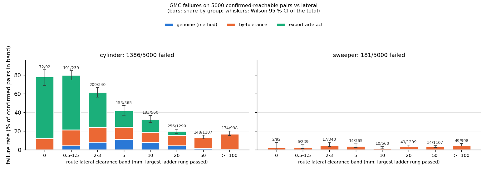
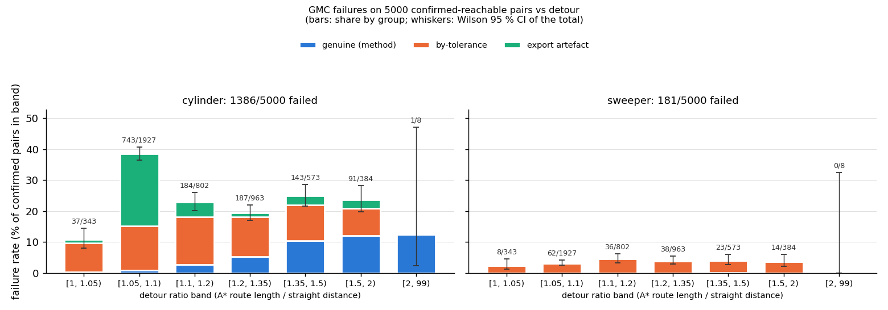
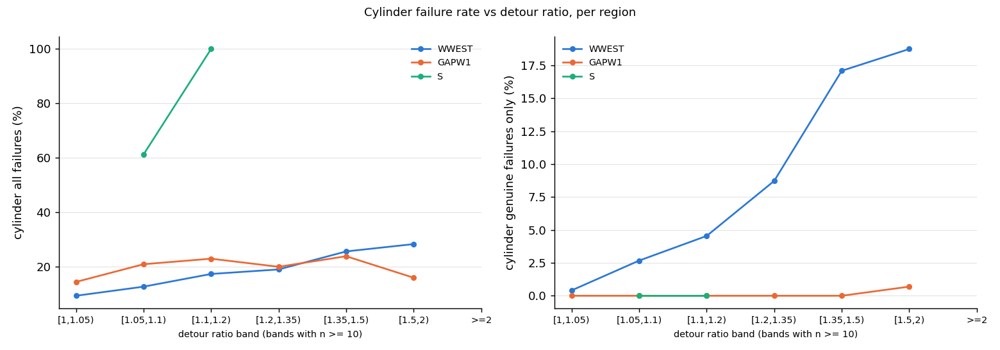
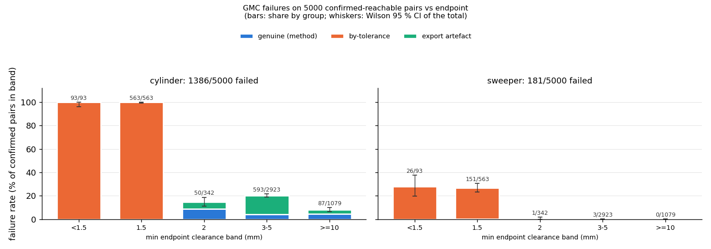
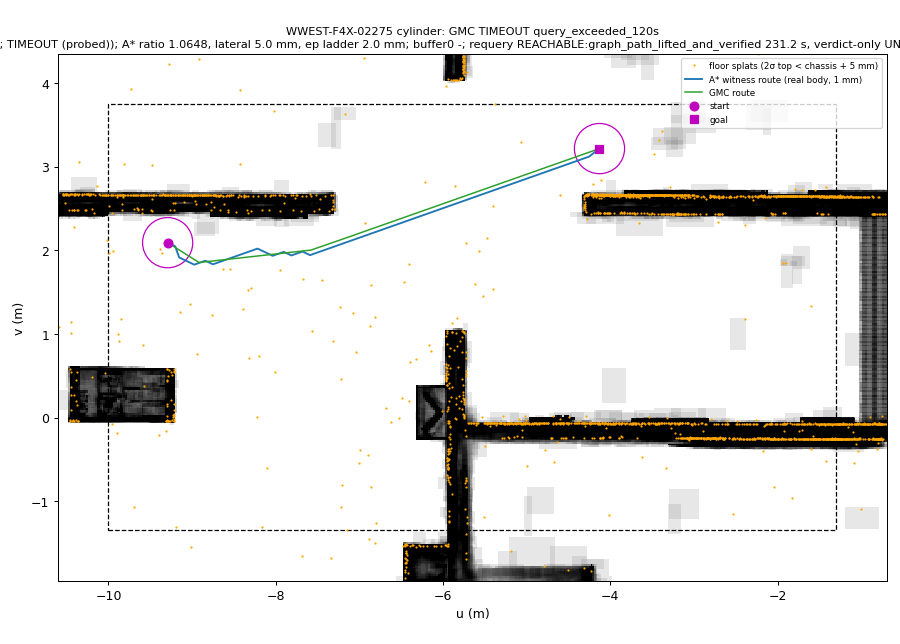
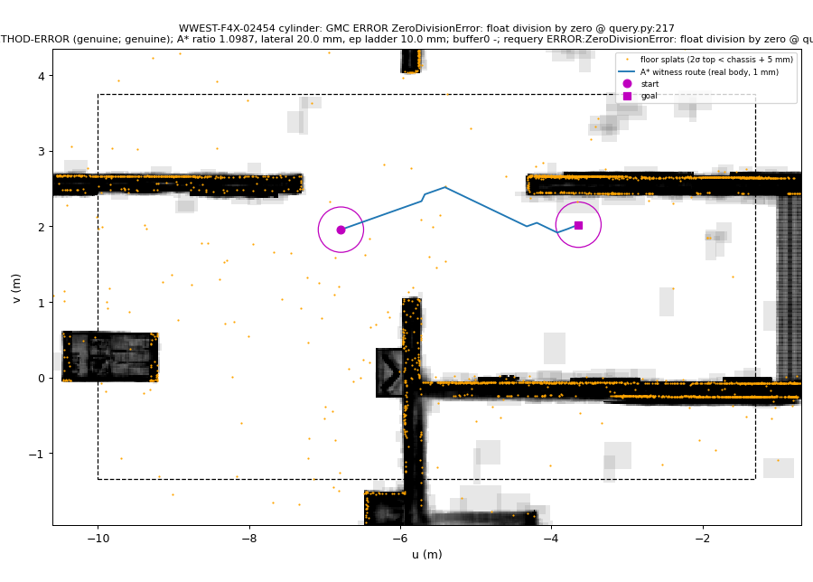
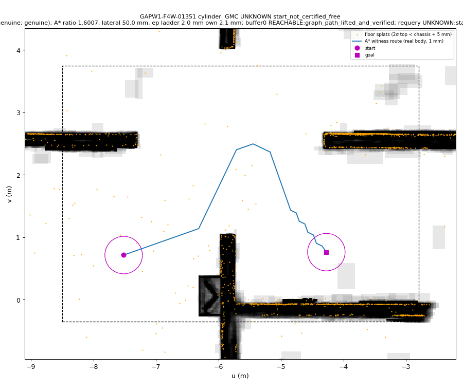

# aerial3d-ground: 5000 confirmed-reachable pairs in the hard regions (F4, 2026-10-07)

**Headline** **[E]** (`gmc/results/aerial3dg/f4/summary.json`, `failures.csv`)

Of 5000 pairs confirmed reachable by real-body A* in WWEST (2500), GAPW1 (1500) and S (1000):
- **GMC's cylinder** returned REACHABLE on 3614 and failed on **1386 (27.7 %)**.
- **GMC's sweeper** returned REACHABLE on 4819 and failed on **181 (3.6 %)**.
- **0 UNREACHABLE** in 10,000 queries, so **no soundness flag**.

Where the 1386 cylinder failures come from:

| group | rows | share of the 5000 | what it is |
|---|---|---|---|
| by-tolerance | 656 | 13.1 % | endpoint within margin + buffer (EP-TOL) |
| export artefact | 534 | 10.7 % | the shared replay's swept-AABB coverage test (EXPORT-DOMAIN, 524) or µs round-off (EXPORT-KIN, 10) |
| **genuine method failures** | **196** | **3.9 %** | 194 METHOD-TIMEOUT, 1 METHOD-ERROR, 1 borderline EP-GENUINE |

- **METHOD-TIMEOUT (194).** All are in WWEST. The query exceeds G2's 120 s limit.
  - It is post-processing, not search. Of the 50 timeouts re-queried, all 50 answer in 0.4–3.6 s with shortening switched off.
  - The rate rises steeply with detour: 0.4 % for near-straight pairs, 17–19 % for detour ratio ≥ 1.35.
- **METHOD-ERROR (1, new).** `ZeroDivisionError` in `gmc/src/aerial3d/query.py:217 simplify`, under **G2's own config** (F4X-02454). F3 only reached this bug with buffer 0.
- **EP-GENUINE (1, borderline).** The endpoint clearance is in (2.1, 3] mm, just above margin + buffer.

The sweeper's 181 failures:
- 176 by-tolerance (EP-TOL, using the sweeper's **own** endpoint clearance);
- 4 export round-off (EXPORT-KIN), new versus F3, all cleared by the 1 ms floors;
- 1 borderline EP-GENUINE.

The sweeper never times out, never fails where the cylinder succeeds for a route reason, and never returns UNREACHABLE.

**Contrast with F2's 0.30 %** (`aerial3dg_failures_f2.md`):
- F2 confirmed its pairs with a robust body: +5 cm laterally, endpoints included. That excluded by construction every pair GMC fails on here:
  - endpoints within 2 mm of a floor splat;
  - routes hugging a box face;
  - long detours in the large WWEST box.
- On the real body the benchmark is hard, as intended. Most of the difficulty is still *interface* (tolerance + export, 23.8 %), not *method* (3.9 %).

Machine-readable outputs, all under `gmc/results/aerial3dg/f4/`:
- `pairs_confirmed_5000.json`: per pair the A* route, length ratio, min lateral / vertical clearance along the route, endpoint clearances, region, stream and seed; plus the funnel per region.
- `failures.csv`: **F5's input**. One row per non-REACHABLE (robot, pair), with class, probe results, A* route pointer and clearances.
- `summary.json`: counts, rate bands, probe tallies.
- `compile_once.json`: the compile-once proof.
- `cases/`: case files and 36 quick-look figures for F5.
- `fig/`: the rate plots.

Process: `docs/worklog/aerial3dg_fail.md` (F4 section). Labels: **[E]** = backed by the committed file named next to it;
**[G]** = guess or inference, not tested.

## 1. Regions and sampling (Task 1)
**What was reused from F3.**
- Regions and quotas from `gmc/results/aerial3dg/f3/f4_handoff.json`.
- Sampler: `experiments/aerial3dg_fail3_sample.py run`, uniform mode, unchanged. Confirmation rule:
  - real cylinder at margin 0.001, no robust inflation;
  - both endpoints oracle-free;
  - straight distance ≥ 3 m;
  - 0.1 m lattice A* (`LatticePlanner`, 500k expansions, 120 s) returns ROUTE;
  - the route re-verifies edge by edge (`verify_path`).
- Shared pilot lattice as a pre-filter. It only rejects; its rejects are audited below.

**What changed: more streams.**
- Streams are independent and seeded `seed_base + 1000·stream`, with streams 101+. F3 used 1/21/31.
- The quotas were split into more streams than the handoff, for wall time under 5 h: WWEST 5 × 500, GAPW1 2 × 750, S 1 × 1000.
- Every stream reached its quota exactly. Rejection is whole-draw, so each stream's accepted set is an unbiased prefix and so is their union.
- Pair ids: F4X (WWEST), F4W (GAPW1), F4S (S).

**Funnel** **[E]** (`pairs_confirmed_5000.json → funnel`; streams `sample/<R>/stream_1NN.jsonl.gz`; S as
`stream_101.slim.jsonl.gz` + `.slim.meta.json`, see §6):

| region | box u0 v0 u1 v1 | n | distance-passing cand. | endpoint pass | pre-filter pass | A* ROUTE / NRM / NR / UNSURE (pre-filter pass) | pre-filter rejects audited by A*: ROUTE / NRM / NR / UNSURE | CPU s per accepted | CPU h |
|---|---|---|---|---|---|---|---|---|---|
| WWEST | -10 -1.35 -1.3 3.75 | 2500 | 26,052 | 12.9 % | 74.5 % | 2500 / 0 / 0 / 0 | 0 / 37 / 23 / 0 (of 60) | 14.0 | 9.72 |
| GAPW1 | -8.5 -0.35 -2.8 3.75 | 1500 | 14,709 | 10.6 % | 96.3 % | 1500 / 3 / 0 / 0 | 0 / 19 / 14 / 0 (of 33, all there were in stream 101) | 8.1 | 3.37 |
| S | -5.3 -1.75 4.5 -0.45 | 1000 | 874,655 | 5.0 % | 2.3 % | 1000 / 2 / 12 / 0 | 0 / 16 / 44 / 0 (of 60) | 1.9 | 0.52 |

Cost per stage (CPU s, sums over all candidates):

| region | endpoint | pre-filter | A* | re-verify | evidence (accepted) |
|---|---|---|---|---|---|
| WWEST | 335 | 90 | 28,896 | 747 | 5,113 |
| GAPW1 | 95 | 16 | 10,445 | 188 | 1,442 |
| S | 746 | 110 | 431 | 68 | 511 |

Reading (**[E]**, same files):
- **Yield is adequate in all three regions; none is "inadequate".**
  - Of the pairs that pass the endpoint stage, the share A* and the audited pre-filter would call impossible is WWEST 25.5 %, GAPW1 3.9 % and S 97.7 %.
  - S is the brief's "too many pairs A* proves impossible" case: its 1.3 m-wide box splits into lattice components. Even so it costs only 1.9 CPU s per confirmed pair, so its quota stands.
  - The share is reported, not hidden. It does not bias the accepted sample, which is unbiased conditional on reachability.
- **No pre-filter reject was A*-reachable**: 153 of 153 audited rejects. The A* reject split is therefore NO_ROUTE / NO_ROUTE_MARGIN only, with 0 UNSURE.
  - On pre-filter passes, A* rejected 3 pairs in GAPW1 and 14 in S, and 0 in WWEST.
- **Endpoint stage rejections in S** (831,136 rows): `map_unknown` 655,522 (the 0.40 m domain inset of a thin box), `minkowski_interior_witness` 120,560, workspace bounds 54,208, `geometry_or_margin_unproven` 846.
- Sampling total **14.8 CPU-h** (13.6 for the streams, plus collect and audits).

## 2. GMC on all 5000, both robots (Task 2)
**How GMC was run** **[E]** (`compile_once.json`):
- One persisted compile per robot per region: F3's `.a3c` under `gmc/outputs/aerial3dg/f3/<R>/`.
- The SHA-256 of each was re-computed and equals the sidecar and the handoff; the box is identical, so no re-compile.
- G2's full `QCONFIG`, 120 s per query.

**Compile-once proof** **[E]**:
- Every one of the 6 (region, robot) sets has exactly one compile id across all its rows, equal to F3's.
- No query call contains a compile stage: `all_ok: true`.
- Ids: WWEST 549453247f5cf37a / 29e3d020cb81ffa1; GAPW1 abfa278e193c88d4 / a160fe048b6c47fd; S 8352bdd37aab07a2 / a17c75430cd3fec4 (cylinder / sweeper).

**Two task crashes, both handled:**
- **WWEST cylinder task 0, pair F4X-00196.** G2's 120 s alarm (`_Timeout`) fired inside numpy `linalg.norm`'s `int(axis)` try/except. Numpy re-raised it as `TypeError: 'axis' must be None, an integer or a tuple`, chained from `_Timeout`. `aerial3dg_batch.run_task` only catches `_Timeout`, so the task died.
  - This is a harness artefact, not a method error. Re-run: TIMEOUT.
  - Recorded in `gmc/WWEST/cylinder/task_00.notes.json`.
- **Task 11, pair F4X-02454.** A real `ZeroDivisionError` in src `simplify` (§4.3).
- Both tasks were resumed with `aerial3dg_fail3_f4.py gmctask`. It is G2's `run_task` unchanged, with `query` wrapped:
  - an exception chained from the alarm becomes a TIMEOUT row;
  - any other exception becomes an `ERROR` row;
  - every event is logged.

**Raw verdicts** **[E]**:

| robot | REACHABLE | TIMEOUT | ERROR | UNKNOWN start/goal not certified free | UNKNOWN shared_replay_failed | UNKNOWN safe_graph_disconnected | UNREACHABLE |
|---|---|---|---|---|---|---|---|
| cylinder | 3614 | 194 | 1 | 332 / 325 | 534 | 0 | **0** |
| sweeper | 4819 | 0 | 0 | 101 / 76 | 4 | 0 | **0** |

**Sweeper as context** (the sweeper is geometrically inside the cylinder) **[E]** (`failures.csv`, cross-tab by pair):
- **On the cylinder's genuine and export rows the sweeper is REACHABLE**: 192 of 194 TIMEOUT, the ERROR, 523 of 524 EXPORT-DOMAIN, 10 of 10 EXPORT-KIN and the EP-GENUINE.
- The 3 exceptions are sweeper EXPORT-KIN, i.e. round-off on its own exported route.
- **Every sweeper EP failure (176 EP-TOL + 1 EP-GENUINE) is on a pair where the cylinder is EP-TOL too.** Same floor splats under the endpoint, smaller footprint.
- **The sweeper fails where the cylinder succeeds on exactly one pair: S F4S-00090**, EXPORT-KIN.
  - Replay geometry passed (`all_closed_edges_verified`) and the 1 ms floors clear it.
  - So it is µs export round-off on the sweeper's own route, not a geometric failure.
  - Named for completeness; figure `cases/fig/S-F4S-00090_sweeper.png`.

## 3. First-pass classification (Task 3)
**Taxonomy.** F3's `classify_row` (`experiments/aerial3dg_fail3_probe.py` docstring), with one refinement, stated:
- **The sweeper's EP rows use the sweeper's own endpoint clearance ladder** (`aerial3dg_fail3_f4.py epclear`).
- F3 used the cylinder's ladder for both robots. The sweeper is a sub-body, so its clearance can only be larger, and the cylinder ladder cannot show that the sweeper's endpoint is within margin + buffer.
- `epclear` also gives every EP row a 2.1 mm freeness check for its own body. This replaces the A* witness for EP rows.
- No GAP row occurred, so no witness run was needed.

**Probes run** **[E]** (`diag/<R>/<robot>/`; array 19349441, plan `diag/probe_plan.txt`):
- 1 ms turn + translation floor (`aerial3dg_fail2_kin.py --full`) on all 538 `shared_replay_failed` rows, with F3's domain check (`domain.json`).
- Buffer-0 endpoint cell (`aerial3dg_fail3_probe.py bufzero`) on all 834 `*_not_certified_free` rows.
- Re-query on the same compile (300 s limit, certificate dump) on every non-REACHABLE non-TIMEOUT row: 1192 cylinder + 181 sweeper.
- A stratified sample of **50 of the 194 TIMEOUT rows**: region × robot × detour-ratio tercile, seed 20261007 (`diag/timeout_sample.json`). These were also run once verdict-only.
- Own-body endpoint ladders (`epclear`) on all 834 EP rows.

**Per-class counts** (0 rows left unverified or unprobed) **[E]**:

| region / robot | n | REACHABLE | genuine | by-tolerance | export | classes | query wall mean / p90 / max (s) |
|---|---|---|---|---|---|---|---|
| WWEST / cylinder | 2500 | 2049 | **195** | 206 | 50 | EP-TOL 206, METHOD-TIMEOUT 194, EXPORT-DOMAIN 41, EXPORT-KIN 9, METHOD-ERROR 1 | 29.3 / 97.7 / 120 |
| GAPW1 / cylinder | 1500 | 1191 | 1 | 262 | 46 | EP-TOL 262, EXPORT-DOMAIN 46, EP-GENUINE 1 | 6.8 / 18.3 / 89 |
| S / cylinder | 1000 | 374 | 0 | 188 | 438 | EXPORT-DOMAIN 437, EP-TOL 188, EXPORT-KIN 1 | 0.0 / 0.0 / 1 |
| WWEST / sweeper | 2500 | 2440 | 1 | 57 | 2 | EP-TOL 57, EXPORT-KIN 2, EP-GENUINE 1 | 1.6 / 3.3 / 23 |
| GAPW1 / sweeper | 1500 | 1413 | 0 | 87 | 0 | EP-TOL 87 | 0.8 / 1.7 / 6 |
| S / sweeper | 1000 | 966 | 0 | 32 | 2 | EP-TOL 32, EXPORT-KIN 2 | 0.0 / 0.0 / 0 |
| **cylinder total** | 5000 | 3614 | **196 (3.9 %)** | 656 (13.1 %) | 534 (10.7 %) | | |
| **sweeper total** | 5000 | 4819 | **1 (0.02 %)** | 176 (3.5 %) | 4 (0.08 %) | | |

**Reproduction** **[E]** (`requery_*.json`):
- Every re-queried non-TIMEOUT failure gives the same status and reason: 1192 + 181.
- Of the 50 probed TIMEOUTs, 49 again need ≥ 120 s. F4X-02012 finished REACHABLE in 98.3 s on re-query, so it is a limit-edge case (§4.1).

### 3.1 Where it breaks: failure rate vs route clearance, detour and endpoint clearance
Each pair is banded by its A* route's evidence (`aerial3dg_fail3_sample.py` docstring):
- lateral clearance: the largest ladder rung passed;
- detour ratio: route length / straight distance;
- minimum endpoint clearance: the cylinder's ladder.

Bars are split by group; whiskers are Wilson 95 % CIs of the band's total rate. Full tables are in `summary_tables.md` and `summary.json → bands`.
All four figures were inspected.



**Rate vs lateral clearance (cylinder)** **[E]**:
- The total rate falls monotonically: 78–80 % below 2 mm → 62 % (2–3 mm) → 42 % (5 mm) → 33 % (10 mm) → 20 % (20 mm) → 13–17 % (≥ 50 mm).
- At small clearances the excess is almost all **export** (EXPORT-DOMAIN). Tight routes in S run along the domain limit, so their swept 0.20 m export segments overshoot the box face.
- The **genuine** rate peaks at 5–10 mm lateral clearance (11 %, 8 %). These are the WWEST timeouts, whose routes cross the floor-splat field with moderate clearance.
- At ≥ 50 mm what remains is almost all endpoint tolerance.

The sweeper is flat at 2–5 % in every band, all EP-TOL.




**Rate vs detour ratio** **[E]**. The genuine rate rises steeply with detour, all of it in WWEST:

| WWEST detour band | [1, 1.05) | [1.05, 1.1) | [1.1, 1.2) | [1.2, 1.35) | [1.35, 1.5) | [1.5, 2) |
|---|---|---|---|---|---|---|
| genuine / n | 1 / 246 (0.4 %) | 16 / 599 (2.7 %) | 22 / 484 (4.5 %) | 50 / 573 (8.7 %) | 60 / 351 (17.1 %) | 45 / 240 (18.8 %) |

- GAPW1 has the same detour range but only 1 genuine failure, the borderline EP row. S routes are all < 1.2.
- The [1.05, 1.1) spike in the all-failure rate is S's export vetoes.



**Rate vs endpoint clearance** **[E]**:
- **The cylinder fails on every pair whose endpoint ladder is below 2 mm: 656 / 656 (93 + 563), and only on those as EP.** This is F1's by-tolerance mechanism, now shown on a full benchmark: the GMC endpoint cell needs clearance > margin + buffer = 2 mm.
- Above 2 mm the cylinder fails at 8–20 %, all export or genuine.
- The sweeper fails on 27 % of the pairs whose *cylinder* ladder is below 2 mm, i.e. where its smaller footprint also touches the splats, and on 4 of 4344 pairs above.

### 3.2 Genuine failures (197 rows)
**4.1 METHOD-TIMEOUT, 194 rows, all WWEST cylinder (7.8 % of WWEST)** **[E]** (`diag/WWEST/cylinder/requery_timeout_0*.json`, `summary.json → timeout_probe`)

The 50 sampled rows:
- **with a 300 s limit:** 36 finish REACHABLE in 98–297 s and 14 still exceed 300 s;
- **verdict-only** (`aerial3dg_fail_widen.FAST`: no shortcut / tighten / merge): **all 50 answer in 0.38–3.6 s** (median 1.1 s). 28 are REACHABLE and 22 UNKNOWN `shared_replay_failed`, i.e. F1's round-off on the unshortened polyline;
- **stage time** in the 300 s re-queries: tighten 59.1 %, shortcut 38.1 %, merge 2.2 %.

So GMC finds and certifies a route in seconds, and the optional shortening runs past G2's 120 s budget. This confirms F3 §4.4 at 10× the sample.

Profile:
- TIMEOUT pairs are longer and more detoured than WWEST overall: median distance 5.2 vs 4.2 m, detour ratio 1.37 vs 1.18.
- Their lateral clearance is not unusually small: median 10 mm vs 20 mm.
- But near-straight pairs time out too. WWEST-F4X-02275 has detour ratio 1.06 and takes 231 s on re-query, across open floor dotted with floor splats (figure below).
- **[G]** The cost driver is the number of small certified cells the route crosses over the floor-splat field, not the detour itself.

F4X-02012 timed out at 120.0 s in the run and finished in 98.3 s on re-query: a limit-edge case.



**4.2 METHOD-ERROR, 1 row: `ZeroDivisionError` in `simplify` under G2's config (new)** **[E]**
(`gmc/WWEST/cylinder/task_11.jsonl`, `task_11.notes.json`, `diag/WWEST/cylinder/requery_fail_1.json`)
- F4X-02454, WWEST, 3.1 m, detour 1.10, lateral 20 mm. `query()` raises at `aerial3d/query.py:217`, `t = (ab·ac)/(ac·ac)` with `ac = 0`, in 0.27 s.
- It reproduces on re-query.
- F3 saw this bug only under the buffer-0 probe (F3X-00163), and F1 once on W1. **This is the first occurrence under G2's own configuration.** One in 5000.
- The figure shows an ordinary pair across open floor.
- **[G]** Fix: guard `ac·ac == 0` (drop the duplicate point). `gmc/src` is read-only this round.



**4.3 EP-GENUINE, 2 rows, both borderline** **[E]** (`diag/{GAPW1/cylinder,WWEST/sweeper}/epclear.json`, `bufzero.json`)

| robot | pair | reason | own-body endpoint | buffer 0 |
|---|---|---|---|---|
| cylinder | F4W-01351 | `start_not_certified_free` | free at 2.1 mm, not at 3 mm | REACHABLE |
| sweeper | F4X-02245 | `goal_not_certified_free` | free at 2.1 mm, not at 3 mm | REACHABLE |

- The endpoint clearance is in (2.1, 3] mm. That is above F3's tolerance cut (margin + buffer + 0.1 mm), but within 1 mm of it.
- By the rule they are genuine. **[G]** They are most likely GMC's endpoint cell slack beyond the 1 mm buffer. F5 should measure their clearance finely.



### 3.3 By-tolerance and export (not new findings, counted and re-checked)
**EP-TOL, cylinder 656, sweeper 176** **[E]**. Every row's endpoint ladder for its own body is below 2 mm. Buffer-0 outcomes:

| robot | REACHABLE | replay veto | TIMEOUT | `own_verification_unresolved` | still not certified free |
|---|---|---|---|---|---|
| cylinder | 523 | 101 | 28 | 2 | 2 |
| sweeper | 176 | | | | |

The sweeper's EP-GENUINE row is also REACHABLE under buffer 0, giving its 177 REACHABLE in `summary.json → buffer0`.

What the buffer-0 non-REACHABLE outcomes show:
- **TIMEOUT (28: WWEST 22, GAPW1 6).** The post-processing cost of §4.1, appearing once the endpoint is unblocked.
- **`own_verification_unresolved` (2, WWEST F4X-00667, F4X-01092).** A reason F3 never saw. GMC's own verifier could not resolve the route under buffer 0. Flagged for F5.
- **Still `start_not_certified_free` (2, WWEST F4X-00914, -01885).** Like F1's G2-04646.

**EXPORT-DOMAIN, 524 cylinder rows (S 437 = 43.7 % of S; WWEST 41; GAPW1 46)** **[E]** (`kin.json`, `domain.json`)
- Replay geometry `map_unknown`.
- **No exported pose leaves the prism**: max pose excess −0.34 mm.
- But the swept 0.20 m segment's world AABB does, by a median 27.8 mm and up to 73.2 mm. This is F2 §4.2 / F3 §4.2.
- The 1 ms floors do not clear these rows because geometry, not kinematics, fails. 3 of them also carry a µs turn violation.

**EXPORT-KIN, cylinder 10 + sweeper 4** **[E]**: the 1 ms turn + translation floors clear the replay. The 4 sweeper rows (2 WWEST, 2 S) are the first sweeper replay vetoes in this chain's confirmed-pair runs, with the same mechanism.

## 4. Soundness flags
**None.** **[E]** 0 UNREACHABLE in 10,000 (pair, robot) queries on independently confirmed-reachable pairs. `summary.json → soundness_flags` is empty.

Had there been any, the `requery` probe would have dumped:
- the cut certificate (cut pair ids, their Gaussians' route-frame centres / tops);
- the A* route's minimum xy distance to the cut.

No `safe_graph_disconnected` occurred either. A confirmed pair's route clears margin + buffer, so F1's CY-GAP sliver mechanism cannot appear (F3 §4.6).

## 5. For F5
Every row of `failures.csv` (1567 = 1386 cylinder + 181 sweeper) carries:
- class and group;
- GMC status / reason / wall;
- the A* route pointer (`sample/<R>_pairs.json#<pair_id>`);
- lateral / vertical / 3-D / endpoint clearances, plus the own-body endpoint ladder;
- probe results: 1 ms floors, replay geometry, swept / pose excess, buffer 0, re-query and its reproduction, verdict-only for TIMEOUTs.

Priority cases, each with a quick-look figure in `cases/fig/` (36 figures; case lists `cases/<R>.json`):
1. F4X-02454: METHOD-ERROR, `simplify` ZeroDivisionError under G2's config.
2. The 194 WWEST TIMEOUTs; the 50 probed are in `timeout_sample.json`. Plus F4X-02012, the limit-edge case.
3. EP-GENUINE borderline: F4W-01351 (cylinder), F4X-02245 (sweeper).
4. Buffer-0 oddities: F4X-00667 and F4X-01092 (`own_verification_unresolved`), F4X-00914 and F4X-01885 (still not certified).
5. Sweeper EXPORT-KIN (4) and examples of each other class.

Note on the figures: they reuse F3's `aerial3dg_fail3_fig.py`, whose long titles are clipped at the image edge. The full note for each case is in the case JSON.

## 6. Jobs and cost
All jobs: 1 CPU, `cpu_short`, names `a3f4_*`, IDs in `/scratch/wg2381/claude_jobs/aerial3dg_fail/jobids/F4.txt`. My concurrent memory was ≤ 16 GB throughout: arrays throttled, later stages chained with `afterany`.

| step | jobs | CPU-h |
|---|---|---|
| sampling (8 streams) + collect + pre-filter audits | 19332894-96, 19338996-99, 19339250 | 14.8 |
| GMC both robots × 3 regions | 19339252, 19340214, 19339387-90, 19339492, resumes 19348000/19348031 | 24.7 |
| probes (30) + case figures | 19349441, 19359005-07 | 7.3 |
| **total** | | **≈ 48 of 200** |

Notes:
- 19339252 tasks 8–11 were cancelled before they started and resubmitted as 19340214, to get more concurrency (`scontrol update` of the throttle is refused here).
- 19338999 (S audit) was OOM-killed at 2 GB while reading the 335 MB S stream, and re-run at 4 GB.
- S's raw stream (335 MB, 59 MB gz) is not committed. Committed instead: every row past the endpoint stage (43,519), the per-reason endpoint counts, and the meta file. The stream is reproducible from seed 20261200 + 1000·101.

Reproduce (from `gmc/`, `PYTHONPATH=src:experiments`):

```bash
H=hpc/aerial3dg
sbatch --job-name=a3f4_samp_WWEST --array=101-105 $H/f4_samp.sbatch WWEST 20261600 500 -10 -1.35 -1.3 3.75   # GAPW1 / S likewise
sbatch --mem=4G $H/f3_py.sbatch experiments/aerial3dg_fail3_f4.py collect; python experiments/aerial3dg_fail3_f4.py merge
$H/f4_gmc.sh WWEST cylinder 12 1700M 06:00:00 4        # each region x robot; crashed tasks: aerial3dg_fail3_f4.py gmctask
python experiments/aerial3dg_fail3_f4.py check; python experiments/aerial3dg_fail3_f4.py prep
sbatch --array=1-30%8 $H/f4_probe_array.sbatch results/aerial3dg/f4/diag/probe_plan.txt
python experiments/aerial3dg_fail3_f4.py summary; python experiments/aerial3dg_fail3_f4.py plots; python experiments/aerial3dg_fail3_f4.py cases
```

Nothing under `gmc/src/` was changed. G2's, F1's, F2's and F3's results are untouched.
