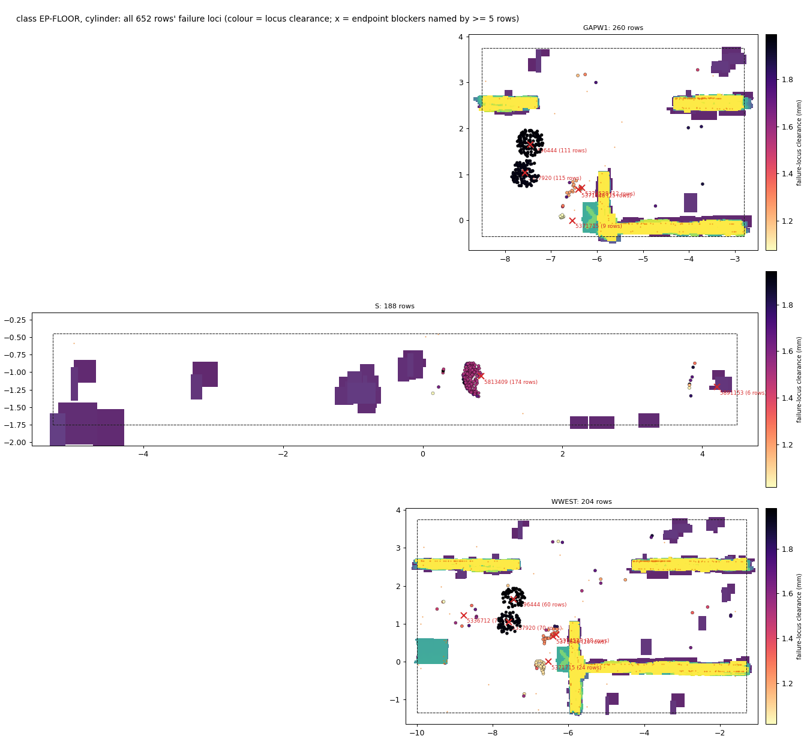
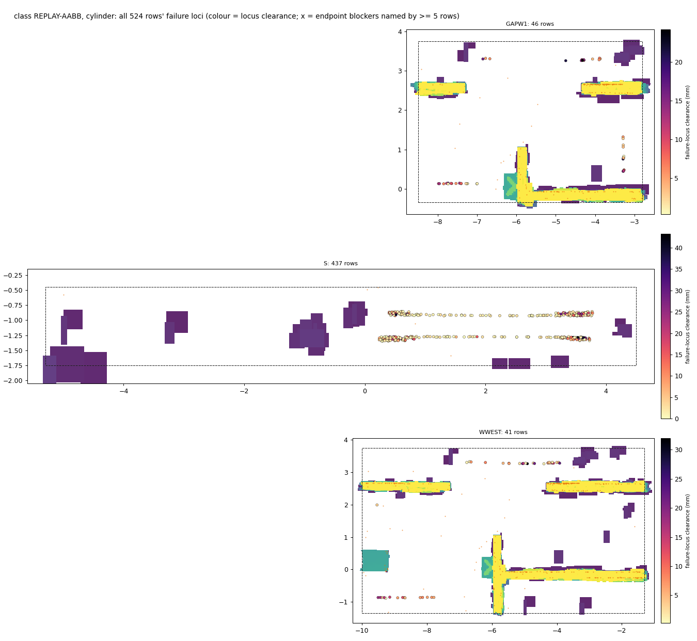
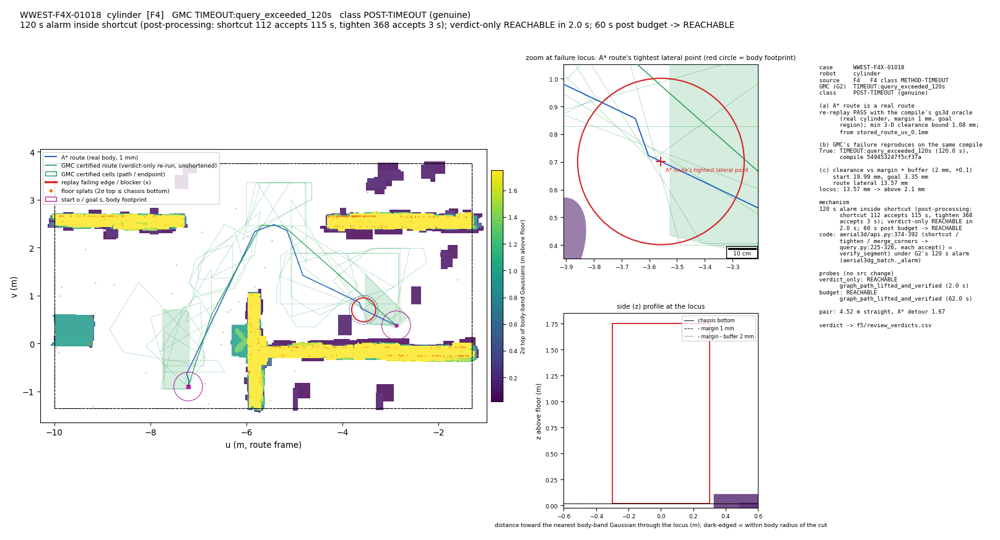

# aerial3d-ground: why GMC fails where A* proves a path, and the review set (F5, 2026-10-07)

Final stage of the "hard benchmark" round (F3 → F4 → F5).
- **Review index: [`aerial3dg_f5_review.md`](aerial3dg_f5_review.md).** Verdict sheet: `gmc/results/aerial3dg/f5/review_verdicts.csv`.
- Per-row facts: `gmc/results/aerial3dg/f5/facts.csv`. Counts: `summary.json`. Raw traces: `trace/*.jsonl`.
- Labels: **[E]** = backed by the committed file named next to it; **[G]** = guess or inference, not tested.
- Process: `docs/worklog/aerial3dg_fail.md` (F5 section).

## The answers (one page)

**(1) Where does A* prove a path but GMC fail, and how were these regions found?** **[E]**
(`aerial3dg_failures_f3.md`, `gmc/results/aerial3dg/f3/f4_handoff.json`)
- F3 surveyed 7 boxes of the `scene_v2` hall and compiled 6 of them.
- In each, it drew pairs that the gs3d lattice A* proves reachable for the **real** body:
  - margin 1 mm, no robust inflation;
  - the route is re-verified edge by edge;
  - sampling was uniform, plus streams targeted at detours and at tight endpoints.
- E and NMID give no usable pairs: their free space splits at a box face.
- Three regions do give failures:

  | region | box (u, v) | failures found there |
  |---|---|---|
  | **WWEST** | u[-10,-1.3] v[-1.35,3.75] | the only *method* failures: post-processing timeouts on long, detoured pairs |
  | **GAPW1** | u[-8.5,-2.8] v[-0.35,3.75] | the most endpoint-tolerance failures (the floor-splat field at u≈-5.6) |
  | **S** | u[-5.3,4.5] v[-1.75,-0.45] | the tightest routes: a thin box, with routes along its domain limit |

**(2) The 5000 really-valid run.** **[E]** (`aerial3dg_failures_f4.md`; F5 `facts.csv`, `summary.json`)
- **The pairs.** 5000 pairs are confirmed reachable: WWEST 2500, GAPW1 1500, S 1000. Every stream met its quota.
- **How many candidates A* rejects** (share of endpoint-free candidates):
  - WWEST 25.5 %, GAPW1 3.9 %, S 97.7 %;
  - S is "mostly A*-impossible", but each confirmed pair costs only 1.9 CPU s, so its quota stood.
- **F5 re-checked every failure row:**
  - the A* route re-replays as a real route on **1567 / 1567** rows;
  - GMC's failure reproduces on the same compile on **1560 / 1567**;
  - the other 7 are timeouts that finish in 103–117 s on re-query, i.e. at the edge of the 120 s limit.
- **False-negative rate** (GMC not REACHABLE on a confirmed pair): **27.7 %** for the cylinder, **3.6 %** for the sweeper:

  | group | cylinder (of 5000) | sweeper (of 5000) | F5 classes |
  |---|---|---|---|
  | **genuine algorithm failure** | **196 (3.9 %)** | **1 (0.02 %)** | POST-TIMEOUT 194, SIMPLIFY-ZERODIV 1, EP-SLACK 1 + 1 |
  | by-tolerance (clearance ≤ margin + buffer) | 656 (13.1 %) | 176 (3.5 %) | EP-FLOOR 652 + 176, EP-SIDE 4 |
  | export artefact (shared replay) | 534 (10.7 %) | 4 (0.08 %) | REPLAY-AABB 524, REPLAY-RATE 10 + 4 |
  | soundness (UNREACHABLE on a confirmed pair) | **0** | **0** | — |

- **Compared with F2:** F2 measured 0.30 % for the cylinder (15/5000, all export artefacts).
  - F2 confirmed its pairs with a +5 cm robust body.
  - That body excluded, by construction, every kind of pair GMC fails on here:
    - endpoints within 2 mm of a floor splat;
    - routes hugging a box face;
    - long detours through WWEST.
  - So 0.30 % is right for F2's benchmark, but it is not the rate on hard cases.

**(3) Failure classes, their causes and code locations.** **[E]** (traces `gmc/results/aerial3dg/f5/trace/`, §2)

| class | group | rows cyl / sw (F4) | cause | where GMC loses the A* route (code) |
|---|---|---|---|---|
| **POST-TIMEOUT** | genuine | 194 / 0 | GMC certifies a route in 0.2–5 s. The optional shortening then spends the 120 s mostly proving that long "farthest-first" shortcut chords collide | `aerial3d/api.py:374-392` → `query.py:225-241` (shortcut) → `verify.py:73-102` |
| **SIMPLIFY-ZERODIV** | genuine | 1 / 0 | the lifted polyline has an a → b → a spike of 4.5 nm, so `simplify` divides by \|ac\|² = 0 | `aerial3d/query.py:217`, called at `api.py:364` |
| **EP-SLACK** | genuine (borderline) | 1 / 1 | the endpoint is 2.25 / 2.31 mm clear (oracle), but GMC's refined gap says 1.96 mm, below margin + buffer | `aerial3d/cells.py:122-125` (`refine_gap`) → `api.py:330-333` |
| EP-FLOOR | by-tolerance | 652 / 176 | the endpoint is 1.02–1.99 mm from a Gaussian below the chassis (809/832: a sub-floor splat); a certified endpoint cell needs > 2 mm, by design | `aerial3d/cells.py:122-125` → `api.py:330-333` |
| EP-SIDE | by-tolerance | 4 / 0 | the same, with a wall-side Gaussian 1.02–1.58 mm away | same |
| REPLAY-AABB | export | 524 / 0 | the shared replay checks the *world AABB* of each swept 0.20 m export segment. In the 64°-rotated frame that box leaves the prism at the domain limit, although the body does not | `gs3d/oracle.py:165-166` → `gs3d/integration.py:47-55`, called from `api.py:417-423` |
| REPLAY-RATE | export | 10 / 4 | float round-off on a µs-long turn or translation exceeds the replay's 1e-9 rate tolerance; the geometry passes | `gs3d/validation.py:90-93` on `planner._linear_trajectory` timings |

- **Genuine algorithm failures:** POST-TIMEOUT, SIMPLIFY-ZERODIV, EP-SLACK.
- **Not algorithm failures:**
  - EP-FLOOR and EP-SIDE: GMC refuses, by design, to certify an endpoint closer than margin + buffer = 2 mm;
  - REPLAY-AABB and REPLAY-RATE: GMC's own verifier certified the route, and the shared replay vetoes it for a non-geometric reason.
- **Fix tests** (none changes `gmc/src`):

  | class | probe | result |
  |---|---|---|
  | POST-TIMEOUT | 60 s post-processing budget | 185/194 REACHABLE within 120 s |
  | SIMPLIFY-ZERODIV | guarded `simplify` | REACHABLE |
  | REPLAY-AABB | exact swept-cylinder coverage test in the replay | 521/524 REACHABLE |
  | REPLAY-RATE | 1 ms timing floors (F4) | 14/14 cleared |

**(4) The G2 audit: does anything other than GMC check `g2/collect.json`'s "cylinder unreachable"?** **[E]**
(`aerial3dg_g2_audit.md`, `gmc/results/aerial3dg/f3/g2_audit/verdicts.csv`)
- **No.** `collect.json` holds only GMC's own verdict counts.
- F3 then checked **all** 4927 cylinder + 301 sweeper non-REACHABLE G2 rows with methods other than GMC:
  - real-body A* in the G2 box, and in F1's wider W1 box;
  - subset-body lattices at margin 0;
  - a lamp-width measurement.

  | G2 rows | verdict | evidence |
  |---|---|---|
  | 2928 cylinder UNREACHABLE (lamp) | genuinely unreachable: **location picking** | A* finds 0 routes; no route even for a body 1 cm smaller; the lamp gap is 0 wide |
  | 1587 cylinder `safe_graph_disconnected` | **box artefact: location picking** | the way round leaves the G2 box; A* finds it in W1 on 1587/1587 |
  | 412 cylinder + 239 sweeper endpoint rows | **by-tolerance** | endpoints 1.0–1.97 mm from a splat: this round's EP-FLOOR |
  | 62 sweeper replay rows | reachable; **export round-off** | this round's REPLAY-RATE |

  - 0 soundness flags, 0 rows left unresolved, and 193/193 controls agree.
- **Verdict:** none of G2's 5228 failures is a wrong reachability answer, and none is a genuine algorithm failure. 4515 are location picking, 651 tolerance and 62 export.

**How to review.** Details are at the top of [`aerial3dg_f5_review.md`](aerial3dg_f5_review.md).
1. Open each figure from the index. Genuine failures come first.
2. In each figure, check that:
   - (a) the blue A* route is a real way from start to goal;
   - (b) GMC fails as the title says;
   - (c) the zoom and the side profile show the stated cause.
3. Fill `human_verdict` (`algorithm_failure` / `not_algorithm_failure` / `unsure`) and `human_note` in
   `gmc/results/aerial3dg/f5/review_verdicts.csv`.

The large tolerance and export classes have one class-level row each in the sheet. Each is backed by 30
stratified representatives and an overview map.

---

## 1. The three verification facts, per row (Task 1)
**Inputs.**
- All 1567 non-REACHABLE rows of F4's 5000, for both robots.
- F3's 35 verified genuine or borderline candidates (`f4_handoff.json → f5_candidate_cases`), kept separate as source `F3-targeted`:
  - 31 WWEST timeouts;
  - 3 endpoint rows that become TIMEOUT or ERROR under buffer 0;
  - F3Wt-00000.

**Method** (`gmc/experiments/aerial3dg_fail5_trace.py`, docstring). Array 19363459, 35 shards; every record is in `trace/`.
- **(a) The A* route is a real route.**
  - The stored A* route is rebuilt as unicycle poses: start yaw 0, turn in place, translate, final turn to yaw 0.
  - It is re-replayed with `verify_path` through **the compile's own gs3d oracle**, `GaussianBodyOracle(compiled.prepared)`. This is the same oracle GMC's shared replay uses.
  - It runs on the real cylinder (and also on the sweeper for sweeper rows), at margin 1 mm, with the goal region.
  - If the 0.1 mm rounding of the stored route broke the replay, the A* was re-run (it is deterministic) and its exact poses were verified instead.
- **(b) The failure reproduces.**
  - GMC is re-run on the same persisted compile with G2's QCONFIG, with a 120 s limit for TIMEOUT rows and 300 s otherwise.
  - It is instrumented by wrapping `gmc.aerial3d.api` module globals for one query, with no source change. The wrappers record:
    - the safe-graph path cells and the endpoint cells;
    - the polylines;
    - the replay's first failing edge or step;
    - the post-processing stage and its accept() calls, kept even when the alarm fires;
    - the input to `simplify`.
- **(c) Clearance at the failure locus vs margin + buffer.** Both are fine clearances, found by bisection with the same oracle:
  - endpoint rows: the endpoint's oracle clearance (row robot, 0.01 mm);
  - route rows: the A* route's lateral clearance (F3's lateral body: chassis +3 mm, margin 0, 0.01 mm).
  - The cut is ≤ 2 mm + 0.1 mm, F3/F4's slack.

**Results** **[E]** (`summary.json`):

| source | rows | (a) A* re-replay PASS | (a) needed the exact-pose re-run | (b) reproduced | all of (a) + (b) |
|---|---|---|---|---|---|
| F4 | 1567 | **1567** | 5 (S; the 0.1 mm rounding cut the clearance) | **1560** | 1560 |
| F3 targeted | 35 | **35** | 0 | **35** | 35 |

- **The 7 F4 rows that did not reproduce are all POST-TIMEOUT.** On re-query they finish REACHABLE in 103–117 s, with post-processing 97–99.7 % of the wall time:
  - WWEST-F4X-00862, -01558, -01747, -01789, -02055, -02061, -02159.
  - They are limit-edge cases, like F4's F4X-02012. **[G]** Node-to-node speed differences are larger than their distance to the limit.
- **(c) per class** (mm; min / median / max):

  | class | locus | min / median / max (mm) | rows ≤ 2.1 mm |
  |---|---|---|---|
  | EP-FLOOR | endpoint | 1.02 / 1.95 / 1.99 | all (by-tolerance) |
  | EP-SIDE | endpoint | 1.02 / 1.32 / 1.58 | all |
  | EP-SLACK | endpoint | 2.25 and 2.31 | none |
  | POST-TIMEOUT | route lateral | 0.85 / 13.2 / 100 (cap) | 10 of 194 |
  | REPLAY-AABB | route lateral | 0 / 2.6 / 43 | 209 of 524 |

  - For the route classes, (c) is context only: their mechanism is not a clearance.

## 2. Mechanisms, traced through the code
### 2.1 POST-TIMEOUT (194 F4 + 31 F3 rows, all WWEST cylinder): genuine
**Where the route is lost.** `api.query` gets through every certifying stage in seconds:

| stage | code |
|---|---|
| endpoint cells | `api.py:325-336` |
| safe-graph search over cells and portals | `api.py:338-342` |
| lifting into the cells, then `simplify` | `api.py:343-364` |

Then the optional shortening runs:

| step | code |
|---|---|
| `shortcut` | `api.py:374-377` → `query.py:225-241` |
| `tighten` + `shortcut` | `api.py:378-386` |
| `merge_corners` | `api.py:387-392` |

Each candidate segment goes through `accept()`, which is one `verify_segment` call (`verify.py:64-126`). G2's 120 s alarm fires here.

**Evidence** **[E]** (`facts.csv`, columns `post_*`, `probe_*`):
- **Where the alarm fires:** in `shortcut` on 178/194 rows, in `tighten` on 5, in `merge_corners` on 3, and right after post-processing on 1. The other 7 are the limit-edge rows that finished.
- **Time spent in `shortcut`:**
  - accept() time inside `shortcut` is 77–120 s per row (median 115 s);
  - inside `tighten` it is 1–42 s;
  - `shortcut` makes only 6–415 accept() calls (median 72).
- **Verdict-only re-run** (no shortening; `aerial3dg_fail_widen.FAST`): it answers all 194 rows in 0.17–5.2 s (median 1.2 s). The certified route crosses 9–29 cells (median 18). Outcomes:
  - 116 REACHABLE;
  - 71 replay round-off vetoes, all cleared by the 1 ms floors;
  - 6 REPLAY-AABB vetoes;
  - 1 `own_verification_unresolved` (F4X-00303, see below).

**What the time is spent on** **[E]** (`segprobe_WWEST_timeout.jsonl`: 8 rows, every `verify_segment` call logged, job 19365904):
- 96 % of the 120 s goes to `shortcut`.
- 196 of its 604 calls take more than 1 s each, and they hold 97 % of its time.
- **195 of those 196 calls are rejections**: COLLISION 147, UNRESOLVED 48. They test candidate chords 2.8–6.5 m long, whose padded AABB holds a median of 27k Gaussian pairs.
- The mechanism:
  - `shortcut` tries the farthest vertex first, so its first candidates are long chords across walls and the floor-splat field;
  - `verify_segment` refines every pair whose segment gap fails (`verify.py:86-102`) before a subdivision midpoint lands inside an inner polytope and proves the collision.
- The same chord is checked again by the second `shortcut` call (inside the tighten stage); there is no cache.
- **[G]** Why WWEST only: its pairs are long (median 5.2 m) and detoured, and they cross the u≈-5.9 partition and the floor-splat field. GAPW1 has the same detours inside a smaller box, with shorter chords.
- This corrects F4's "tighten 59 %" reading: F4's stage *tighten* includes the `shortcut` call that follows it (`api.py:384`).

**Fix test** **[E]** (probe `budget`: accept() refuses after 60 s of post-processing, so the polyline is always the last certified one, under the 120 s limit):
- **185/194 become REACHABLE** in 60–96 s.
- The other 9 are:
  - 7 REPLAY-AABB vetoes on the unshortened route (§2.4);
  - 1 REPLAY-RATE (the floors clear it);
  - 1 `own_verification_unresolved`.
- F3's 31: 30 REACHABLE; 1 is REPLAY-RATE (F3X-00059).
- **[G] Fix:** a time budget on shortening (return the certified route). Better still: try short chords first, or reject chords cheaply (lattice / oracle pre-check), and cache rejections.

**F4X-00303 (inside the POST-TIMEOUT class).**
- Its *unshortened* certified polyline fails GMC's own verifier: `separation_unresolved_at_max_depth` on one segment with 2 pairs, at u≈-8.5..-8.8, v≈0.9..1.0 (`verify.py:113-117`).
- This is the same reason as F4's two buffer-0 rows F4X-00667 and F4X-01092 (re-traced here, `probe_buffer0`).
- **[G]** Likely cause: the pinning of lifted vertices back onto z_c (`api.py:357-363`, moves ≤ 1 mm) lets a segment leave its cell next to a margin-grazing floor splat. This is a second, latent genuine issue, reached by 1 row here.

### 2.2 SIMPLIFY-ZERODIV (F4X-02454; F3X-00163 under buffer 0): genuine
- `simplify` (`query.py:205-222`) first drops repeats closer than 1e-9 m.
- The lifted polyline of F4X-02454 has vertices a, b, c with |ab| = 4.5 nm and c == a exactly, so ab survives the repeat filter **[E]** (`simplify_spikes` in the trace).
- `t = ab·ac / ac·ac` then divides by 0 at `query.py:217`, and the query raises.
- **Fix test** **[E]** (probe `guard`): drop the spike, i.e. b and c; the remaining segment a → next is the old c → next, already inside its cell.
  - F4X-02454 → REACHABLE.
  - F3X-00163 under buffer 0 → REACHABLE.

### 2.3 Endpoint classes: EP-FLOOR, EP-SIDE (by-tolerance) and EP-SLACK (genuine, borderline)
**Code path.**
1. `api.query` finds no compiled cell that contains the endpoint.
2. It calls `grow_cell(..., buffer_m=0.001, kind="query")` (`api.py:330`).
3. `grow_cell` returns None as soon as one pair's refined gap to the margin-inflated C-obstacle is ≤ buffer + slack (`cells.py:122-125`).
4. → `*_not_certified_free` (`api.py:333`).

The trace replays this branch (F1's `endpoint_trace`) and names the blocking pair, its 2σ top and the refined gap **[E]**.

- **EP-FLOOR (828 rows).**
  - In 809 of the 832 rows (F4 + F3), the blocker lies wholly under the chassis: 2σ top 18.0–20.0 mm, chassis bottom 20 mm.
  - The other 23 blockers are centred below the floor plane, but their 2σ top reaches up to 110 mm.
  - Endpoint clearance is 1.02–1.99 mm, and GMC's gap is ≤ 1 mm.
  - So these endpoints are free by the oracle (> 1 mm margin), but GMC cannot certify them, by design (> 2 mm needed).
  - F4's buffer-0 probe un-blocks 523/656 cylinder rows and 176/176 sweeper rows.
  - A few Gaussians own most rows: see the overview maps.
- **EP-SIDE (4 rows).** The same, with a wall-side Gaussian 1.02–1.58 mm away (F4W-00245, F4W-00914, F4X-01495, F4X-02244).
- **EP-SLACK (2 rows): F4W-01351 (cylinder, 2.25 mm) and F4X-02245 (sweeper, 2.31 mm).**
  - Both blockers are floor splat 5337920, 2σ top 18.04 mm.
  - On **5 different endpoints** near this splat, GMC's refined gap is the same 0.962 mm (= 1.962 mm to the raw obstacle). That is the vertical gap at the splat's peak. Meanwhile the oracle clearance varies with the lateral offset: 1.95–2.31 mm.
  - So `refine_gap` settles on the horizontal separating plane, and is conservative by up to 0.35 mm here **[E]** (`facts.csv`, `cause`).
  - **[G]** Its direction search does not find the tilted plane between the cylinder rim and the ellipsoid.
  - The same conservatism explains why buffer 0 still leaves F4X-00914 and F4X-01885 uncertified: the refined gap is negative there while the oracle says 1.08 / 1.30 mm.
  - Buffer 0 → REACHABLE on both EP-SLACK rows.
  - Genuine by the rule, but within 0.35 mm of the tolerance.

### 2.4 REPLAY-AABB (524 rows: S 437, GAPW1 46, WWEST 41): export artefact
- GMC's own verifier CERTIFIED every route, and `replay_plan` then fails with geometry `map_unknown`.
- The oracle's coverage test (`oracle.py:165-166`) asks `RoutePrismKnownSpace.contains_aabb` (`integration.py:47-55`) whether the **world AABB** of the body swept over one exported edge lies in the route prism.
- The trace names the edge and the overshoot: 0.04–73 mm (median 14 mm); 509 of the 524 are in v, 15 in u. This matches F3/F4's measurements.
- A vertical cylinder's world AABB, seen in the 64°-rotated route frame, reaches r·(|cos|+|sin|) ≈ 1.34 r from its centre. The 0.40 m domain inset is exactly that, so any pose at the domain limit already touches the face, and any swept edge crosses it.
- **Fix test** **[E]** (`aabbprobe/`, job 19368400). GMC is re-run on the same compile, with the replay's test replaced by an exact one for a vertical cylinder: every corner of the edge's centre box ± (r, r, half-height) must lie in the prism. GMC itself is untouched.
  - **521/524 become REACHABLE.**
  - The other 3 (F4S-00504, F4S-00748, F4X-01569) then pass geometry and fail only REPLAY-RATE round-off.

### 2.5 REPLAY-RATE (cylinder 10, sweeper 4): export artefact
- Replay geometry passes. `verify_linear_trajectory` rejects one step where an in-place turn (µrad) or translation (µm) is timed at µs scale by `planner._linear_trajectory`. The difference of two large `time_s` values then exceeds the limit by 1.0–2.0e-9, against an allowed 1e-9 (`validation.py:90-93`).
- The 1 ms turn + translation floors clear 14/14 (F4 `kin.json`; re-confirmed in the trace, `replay_floors`).

### 2.6 Soundness
- **0 UNREACHABLE** in 10,000 F4 queries on confirmed pairs, and in all F3 runs.
- There is no cut certificate to trace, and no row of class CUT-WRONG.
- No `safe_graph_disconnected` occurred either. Every confirmed pair has a real route with > 1 mm clearance, so F1's CY-GAP sliver mechanism cannot arise.

## 3. The review figures (Task 2)
`gmc/experiments/aerial3dg_fail5_fig.py`, job 19385030. It reads only the trace records and the compile's pair arrays (`outputs/aerial3dg/f5/<R>_<robot>_pairs.npz`, uncommitted).

**Which cases get a figure: 340.**
- Every genuine row: 194 + 1 + 2.
- Every F3-targeted row: 35.
- Every row of the small classes: EP-SIDE 4, REPLAY-RATE 14.
- 30 stratified representatives for each large class (EP-FLOOR cylinder, EP-FLOOR sweeper, REPLAY-AABB):
  - strata = region × robot, allocated proportionally, at least 1 each;
  - within a stratum, rows evenly spaced over the locus clearance.
- Plus 3 class-overview maps (`fig/overview/`).

**What each figure shows.**
- **Map.** Top-down, 2 cm cells. Body-band Gaussians are coloured by their 2σ top. Floor splats are orange. Also drawn:
  - the A* route, with the body at its tightest lateral point;
  - start and goal, with the body footprint;
  - GMC's path cells and endpoint cells;
  - GMC's route: for TIMEOUT rows the verdict-only certified route; for the crash the lifted polyline;
  - the replay's failing edge with its swept AABB;
  - the endpoint blockers.
- **Zoom** at the failure locus: 2σ ellipses, the body footprint and a 10 cm scale bar.
- **Side (z) profile** through the locus, toward the blocker for endpoint rows. It is zoomed to ±1 cm around the chassis bottom when floor splats are the cause, with lines at margin and at margin + buffer.
- **Text column** with the three facts and the probe outcomes.

**Inspected (Read) before citing:**
- POST-TIMEOUT: F4X-00001, F4X-01018, F4X-00303;
- SIMPLIFY-ZERODIV: F4X-02454;
- EP-SLACK: F4W-01351;
- EP-FLOOR: F4X-00004, F4S-00052 (sweeper), F3X-00163 (F3-targeted, buffer-0 crash);
- EP-SIDE: F4W-00245;
- REPLAY-AABB: F4X-00055, F4S-00002;
- REPLAY-RATE: F4X-00153;
- both EP-FLOOR overviews and the REPLAY-AABB overview.

**Fixes made after looking:**
- the text column was clipped, so it is now wrapped at 47 characters;
- the side profile cut runs toward the blocker, or toward the nearest body-band Gaussian, instead of along the route, where it often showed nothing;
- the tightest point is now the first edge that fails just above the bisected lateral clearance; the oracle's per-edge `clearance_lower_m` is an AABB bound that ranked edges wrongly;
- a `+` locus marker was added, and the prism outline is now drawn in the zoom.



- **EP-FLOOR overview** **[E]**: three splats own most cylinder EP-FLOOR rows:
  - 5813409 in S (174 rows);
  - 5337920 and 5496444 in GAPW1 / WWEST (115 + 70 and 111 + 60 rows).



- **REPLAY-AABB overview** **[E]**: every failing export edge lies on the domain-inset line, 0.40 m inside a box face.



## 4. Jobs and cost
All jobs ran with 1 CPU on `cpu_short`, named `a3f5_*`. IDs are in `/scratch/wg2381/claude_jobs/aerial3dg_fail/jobids/F5.txt`. My concurrent memory stayed ≤ 16 GB.

| step | jobs | CPU-h |
|---|---|---|
| trace probes (6 rows) | 19362290 (crashed: known-space wrapper), 19362888 | 0.1 |
| traces, 1602 rows | 19363459 (35 tasks) | 14.5 |
| shortcut segment log | 19365904 | 0.3 |
| REPLAY-AABB fix probe | 19368400 (12 tasks) | 0.5 |
| figures | 19385030, 19385412 (4 tasks each) | 0.4 |
| **total** | | **15.7 of 40** |

Reproduce (from `gmc/`, `PYTHONPATH=src:experiments`):

```bash
python experiments/aerial3dg_fail5_trace.py plan
sbatch --array=1-35%10 --mem=1600M hpc/aerial3dg/f5_trace_array.sbatch results/aerial3dg/f5/plan/plan.txt
sbatch --job-name=a3f5_aabbprobe --array=1-12%3 hpc/aerial3dg/f5_py_array.sbatch results/aerial3dg/f5/aabbprobe/plan.txt
sbatch --mem=1600M hpc/aerial3dg/f3_py.sbatch experiments/aerial3dg_fail5_trace.py segprobe --shard results/aerial3dg/f5/plan/WWEST_cylinder_timeout_00.jsonl --out results/aerial3dg/f5/segprobe_WWEST_timeout.jsonl --ids F4X-00001 ...
python experiments/aerial3dg_fail5_analyze.py facts; python experiments/aerial3dg_fail5_analyze.py select
sbatch --array=0-3 hpc/aerial3dg/f5_fig.sbatch 4
python experiments/aerial3dg_fail5_analyze.py review
```

Nothing under `gmc/src/` was changed. G2's, F1's, F2's, F3's and F4's results are untouched.
