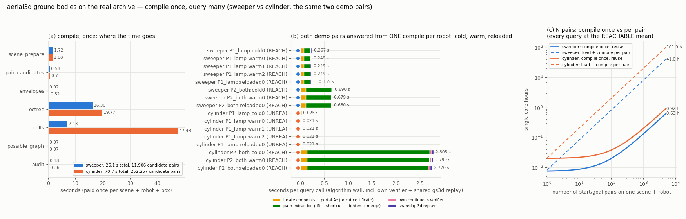
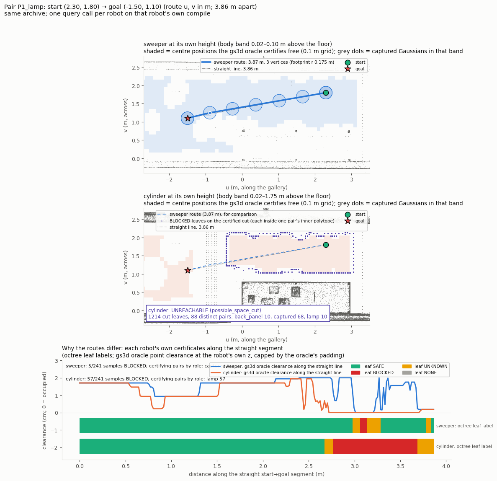
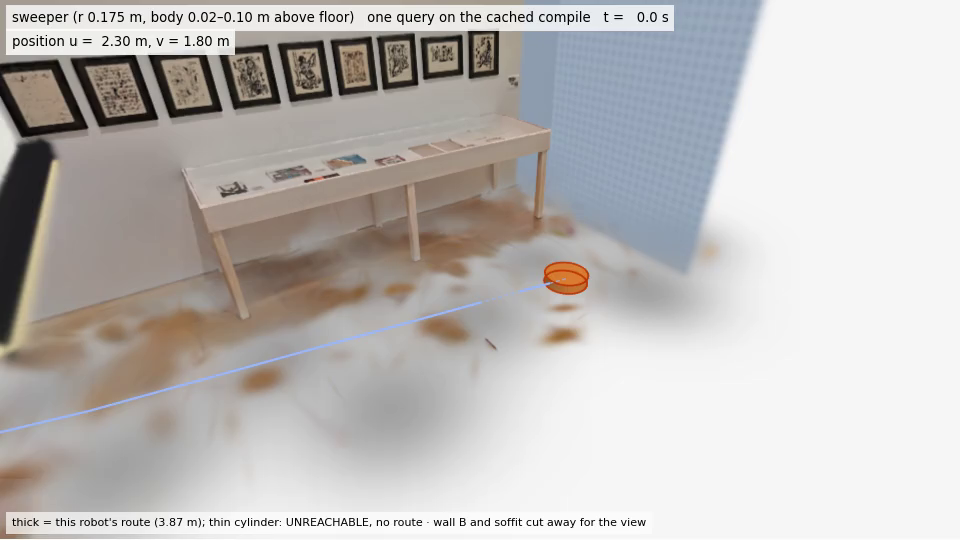
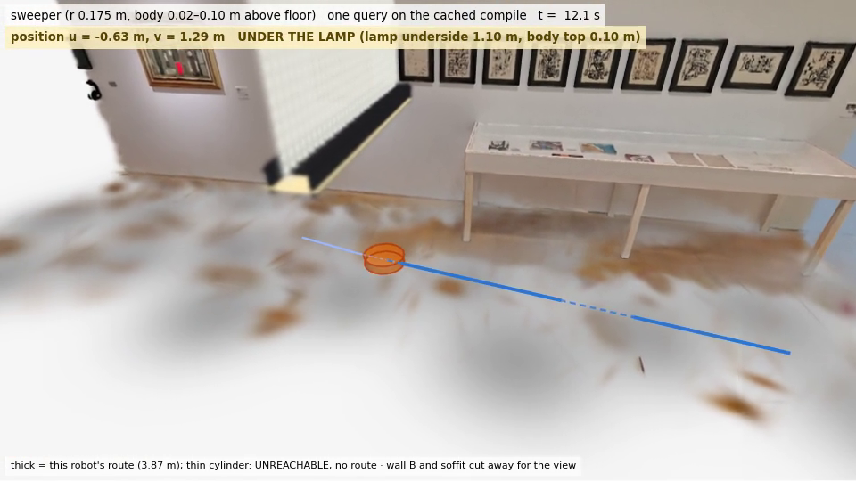
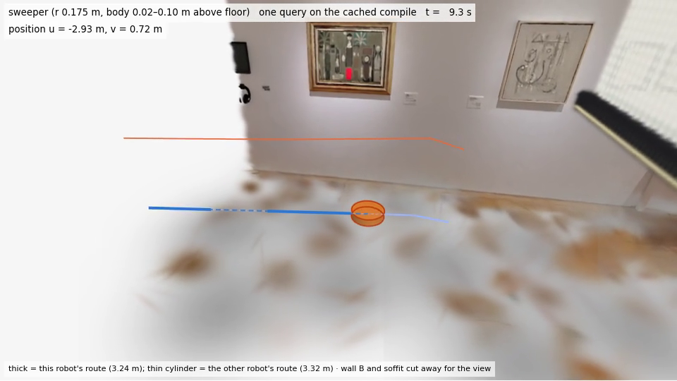
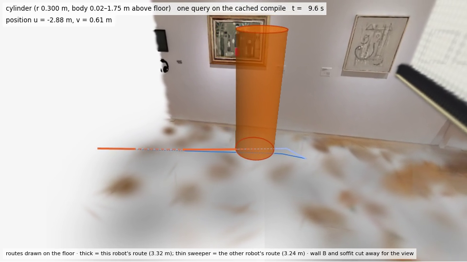

# aerial3d-ground G1：sweeper 与 cylinder 跑通纯 3D GMC 风格规划（≥3 m 演示对 + 5000 对时间估计）

G1 的演示与估计于 2026-09-28 约 03:30 EDT 完成并推送，**早于 2026-09-29 08:45 America/New_York 的软截止**。
设计见 [`aerial3dg_design.md`](aerial3dg_design.md)，过程见 [`worklog/aerial3dg.md`](worklog/aerial3dg.md)，
机器可读交接见 [`gmc/results/aerial3dg/g1_handoff.json`](../gmc/results/aerial3dg/g1_handoff.json)。

## 结论

1. **`aerial3d` 现在能规划 sweeper 和 cylinder**：同一个 pair 认证的纯 3D 后端（完整 3D 协方差、支撑平面凸胞、portal A*、
   连续验证、共享 gs3d 重放），不做任何 2D 投影；地面机器人只是把体心 z 钉在支撑面上方 `离地+半高` 的 1 mm 薄层里。
2. **演示对（≥3 m，起终点不重合，两种机器人各自高度上都无碰撞）已端到端跑通两种机器人**，每种机器人**只编译一次**，
   同一个编译产物回答了两对查询的冷调用、热调用，以及存盘→重载后的调用，**结果逐字节一致、查询里没有任何编译阶段**。
3. **两种机器人的策略确实不同，但不是“一个绕行、一个穿行”那种**：在灯附近（P1），sweeper **从灯下穿过**（3.865 m，
   几乎是直线），cylinder **根本过不去**——灯+隔断在 1.07 m 以上横跨整条走廊，北侧口袋被墙、灯、背板封死，
   返回**认证的不可达**（割证书 1,214 个 BLOCKED 叶、88 个 pair）。在两者都可达的对里（P2），两者都绕开同一块贴地的捕获
   Gaussian，cylinder 绕得更宽（+0.086 m，最大横向偏差 0.16 m）——是程度差别，不是策略差别。按事先写下的挑选规则，
   筛选的 120 对里**没有**“cylinder 明显绕行、sweeper 直穿”的对；原因见下文，是这份扫描场景本身的几何，不是方法问题。
4. **5000 对的时间很便宜**：先编译再复用，两种机器人各 5000 对合计约 **1.0 单核小时**（悲观 1.55，p95 上界 5.3）；
   对照“每对都重新加载+编译”约 **142 单核小时**。编译一次 26 s（sweeper）/ 71 s（cylinder），查询中位数 0.05–0.12 s。

## 接口与设计（一句话）

`compile_complex(scene, SWEEPER|CYLINDER, config=CompileConfig(margin_m=0.001))` → `query(compiled, start, goal)`；
`save_compiled / load_compiled` 把编译产物存盘（pickle + SHA-256 旁文件）供数组作业复用。地面机器人用 gs3d 已有的
`ground_unicycle` 语义，所以共享 gs3d 重放会检查“体心在支撑面上 1e-7 以内、原地转向、无侧滑、足迹下有支撑证据”。
z 以场景地面为基准（档案 `meta.z_floor` = 场地坐标系原点 z，只有一个地面约定）：sweeper 体心 0.06 m（体带 0.02–0.10），
cylinder 体心 0.885 m（体带 0.02–1.75）。

两处 G1 中途的决定（均在 worklog 里记录，有测量依据）：
- **导出给共享重放的轨迹按 ≤0.20 m 插共线节点**（`QueryConfig.export_max_segment_m`，路径几何不变、不增加转向）。
  第一次筛选里 sweeper 的大多数路线被自有验证器认证、却被共享重放判 `map_unknown`：gs3d oracle 用**世界轴对齐**的整段扫掠
  AABB 去比对旋转了 64° 的 route 盒，长的走廊直线段必然出盒（uavconn EA03 同一原因）。插节点后 40/40 通过。
- **查询盒从 booth 盒扩到整条走廊 u∈[−9, 3.7]**（v、z 不变），以便找绕行对；两种盒子的结果都保留。

## 真实场景 probe（Task 2）

T1 probe (small box u[-1.6,0.6] v[-0.35,2.75], job 18702178)

| robot | candidate pairs | compile s | scene_prepare | pair_candidates | envelopes | octree | cells | possible_graph | audit | octree nodes | cells | peak RSS GB |
|---|---|---|---|---|---|---|---|---|---|---|---|---|
| sweeper | 3,676 | 4.25 | 0.33 | 0.22 | 0.01 | 2.81 | 0.71 | 0.01 | 0.15 | 4,667 | 61 | 1.35 |
| cylinder | 65,573 | 2.75 | 0.34 | 0.13 | 0.11 | 1.18 | 0.78 | 0.00 | 0.21 | 1,320 | 13 | 1.35 |


地面机器人的 C-space 是 1 mm 薄层，octree 在 z 向只有 8 个最小单位，所以编译是秒级（UAV 在 booth 盒上是 250–660 s）。
cylinder 的体带几乎是整个房高，候选 pair 是 sweeper 的 18 倍（small box）/ 21 倍（走廊），但 octree 节点反而更少
（cylinder 的自由区更小，大块区域在粗层级就被一个 pair 的内多面体整块认证为 BLOCKED）；贵的是凸胞生长（每个胞对所有 pair 求支撑面）。无需查询局部编译或额外剪枝。

## 演示（Task 3）

**挑选规则（在看第三次筛选结果之前写进 worklog）**：两者都 REACHABLE（共享重放通过）、sweeper L ≤ 1.02 d、
cylinder L ≥ 1.05 d，取 L_cyl − L_sw 最大者；若没有，退回到“穿灯”对。**结果：没有任何对满足**（两者都可达的对里
路线长度差 ≤ 0.085 m）。因此：
- **P1_lamp（主演示对）**：booth 盒筛选里穿灯桶中 sweeper 路线最直的一对，(2.30, 1.80) → (−1.50, 1.10)，3.864 m。
- **P2_both**：两者都可达、路线偏差最大的一对，(−5.30, 1.10) → (−2.10, 0.70)，3.225 m——给两种机器人都提供一条
  经过验证的完整路线和视频。

T2 demo compile (extended corridor u[-9,3.7] v[-0.35,2.75]; jobs 18704511 / 18704512)

| robot | cropped supports | candidate pairs | active pairs | compile wall s | compile CPU s | octree s | cells s | leaves SAFE/BLOCKED/UNKNOWN | free cells | portals | persisted MB | reload s | job MaxRSS GB |
|---|---|---|---|---|---|---|---|---|---|---|---|---|---|
| sweeper | 582,372 | 11,906 | 563 | 26.1 | 36.8 | 16.3 | 7.1 | 5,257/5,634/11,852 | 330 | 15,763 | 180 | 0.88 | 1.73 |
| cylinder | 582,372 | 252,257 | 1,038 | 70.7 | 133.1 | 19.8 | 47.5 | 4,574/4,343/11,199 | 250 | 12,202 | 387 | 1.25 | 2.17 |


T3 demo pairs, every call on the one compile

| pair | robot | status | length m (d) | vertices | clearance m (own / fresh replay) | cold s | warm s | reloaded s | identical all calls | compile stage inside any call |
|---|---|---|---|---|---|---|---|---|---|---|
| P1_lamp | sweeper | REACHABLE | 3.865 (3.864) | 3 | 0.0018 / 0.0018 | 0.257 | 0.249, 0.249, 0.249 | 0.355 | True | False |
| P1_lamp | cylinder | UNREACHABLE (cut: 1,214 BLOCKED leaves, 88 pairs: back_panel 10, captured 68, lamp 10) | — (3.864) | — | — | 0.025 | 0.021, 0.021, 0.021 | 0.021 | True | False |
| P2_both | sweeper | REACHABLE | 3.238 (3.225) | 4 | 0.0020 / 0.0021 | 0.690 | 0.679 | 0.680 | True | False |
| P2_both | cylinder | REACHABLE | 3.324 (3.225) | 5 | 0.0019 / 0.0014 | 2.805 | 2.799 | 2.770 | True | False |


**先编译后复用的证明（测得，不是断言）**：每个机器人的作业里 `compile_complex` 只调用一次；8 次查询调用
（P1 冷+3 热+重载，P2 冷+热+重载）的计时记录里**没有任何编译阶段**，编译记录在所有查询后**未被改动**，
compile_id 全部相同，每对的所有调用（包括从磁盘重载的产物）返回**完全相同的折线和状态**
（`runs/demo/demo_*.json → compile_once_proof`）。冷/热几乎一样快，因为冷调用也不含编译；剩下的小差别来自惰性缓存（包络表的内多面体缓存等）。
从磁盘重载一次 0.9–1.3 s。



### 两种机器人的路线是否不同？为什么？（证据）

**P1（穿灯）——不同：sweeper 穿行，cylinder 没有任何路线。**
沿直线 start→goal 在各自的 z 上取 241 个样点：
- cylinder：57/241 个样点落在 **BLOCKED** 叶里，u −1.31…−0.42，证书 pair **全部是灯**（高度 1.12 m 的灯罩 Gaussian）；
  gs3d oracle 在 u −1.34…−0.38 的 62 个点上判占用。cylinder 顶到 1.75 m，灯底 1.10 m，灯+隔断横跨墙 A 到墙 B，
  所以没有绕行：查询在 0.025 s 内返回**认证的不可达**，割由 1,214 个 BLOCKED 叶组成（每个叶都在某个 pair 的内多面体里），
  涉及 88 个 pair：捕获的墙/台面 68、灯 10、背板 10——正是封闭北侧口袋的四面。
- sweeper：直线上只有 5 个样点 BLOCKED（u −0.77…−0.71），证书是一个**中心在地面以下 3.7 cm 的捕获 Gaussian**（渲染里
  地板上的褐色斑块），它的 2σ 椭球伸进了 0.02–0.10 m 体带；sweeper 在 (−0.884, 1.251) 拐一个小弯避开它，
  正好在灯下，其余全程 SAFE。路线 3.865 m / 直线 3.864 m。
- 在 80 对走廊筛选里，10/10 穿灯对都是这个模式（sweeper 可达、cylinder 认证不可达）。

**P2（两者都可达）——同一策略，程度不同。** 两者的直线都被同一个贴地斑块（u −2.48, v 1.01，中心 z −0.029）
认证为 BLOCKED（sweeper 20/241、cylinder 41/241）；sweeper 贴着它绕（3.238 m）；cylinder 半径 0.30 m，须从斑块下方 v≈0.5 绕过，
并在 u≈−4.2…−3.7 贴着另一处捕获物体（紧绷路线的顶点即接触处），整体绕得更宽（3.324 m，经过 (−4.18, 0.89)、(−3.73, 0.81)、(−2.39, 0.50)）。

**为什么这个场景里没有“cylinder 绕行、sweeper 穿行”的对**（逐机器人 gs3d 点检查图，`runs/map/map.json`）：
cylinder 的体带（0.02–1.75 m）和半径都包含 sweeper 的，所以只有 cylinder 会被“多挡”。只挡 cylinder 的结构有三处：
灯（横跨整条走廊 → 没有绕行，只有不可达）、桌子（桌下对 sweeper 也不通——桌下有捕获的 Gaussian——所以不存在
“sweeper 从桌下穿”）、u≈−5.6 处的一个真实结构（sweeper 从窄缝穿过：走廊筛选里 68 条 sweeper 路线在 v≈1.74–1.80 处穿过 u=−5.6，个别在 2.3 附近；
cylinder 的 gs3d 点检查图在该处没有可通行的格点）。
第三处在 5 cm 叶子下 cylinder 返回 **UNKNOWN**（`safe_graph_disconnected_possible_connected`，53/80 对），把叶子减半到
2.5 cm 结论一个都没变（编译 2.7 倍、查询 2–5 倍）；它从不给出错误的“可达”，也还不能认证“不可达”。
因此：用户希望看到的“体型不同 → 策略不同”在这份场景里的真实形态是**“穿行 vs. 无路可走”**，不是“穿行 vs. 绕行”；
我们没有为了演示而改场景或挑选假象。

### 图与视频

- 路线与证据图：[`routes_P1_lamp.png`](../gmc/results/aerial3dg/g1/routes_P1_lamp.png)、
  [`routes_P2_both.png`](../gmc/results/aerial3dg/g1/routes_P2_both.png)（每个机器人在自己高度上的自由区、体带内的捕获
  Gaussian、两条路线、直线上的叶标签与 oracle 间隙）。



- 视频（EWA 渲染规划档案本身，沿用 uavconn/uavlamp 的渲染管线；墙 B 与吊顶切掉以便观看）：
  `video/P1_lamp_sweeper_flythrough.mp4`（穿灯；cylinder 无路线，故无 P1 cylinder 视频）、
  `video/P2_both_sweeper_flythrough.mp4`、`video/P2_both_cylinder_flythrough.mp4`。每个视频从 MP4 解码回 4 帧并已人工查看。

| P1 sweeper：起点 | P1 sweeper：灯下 |
|---|---|
|  |  |
| **P2 sweeper** | **P2 cylinder** |
|  |  |

测量表（`measurement_template.csv` 的副本，每个机器人×每对一列）：
[`gmc/results/aerial3dg/g1/measurement_g1.csv`](../gmc/results/aerial3dg/g1/measurement_g1.csv)。

## 5000 对时间估计（Task 5）

T4 5000-pair estimate (single-core hours, per robot; compile once per robot, persisted)

| robot | archive load+crop s | compile s | load persisted s | query mean s (pooled 120) | REACHABLE mean s | p95 s | CPU-h central | CPU-h pessimistic (all at REACHABLE mean) | CPU-h p95 bound | CPU-h if compiled per pair | wall h, 1 task | wall h, 8 tasks |
|---|---|---|---|---|---|---|---|---|---|---|---|---|
| sweeper | 2.9 | 26.1 | 0.88 | 0.437 | 0.447 | 2.36 | 0.61 | 0.63 | 3.28 | 40.9 | 0.61 | 0.084 |
| cylinder | 2.1 | 70.7 | 1.25 | 0.262 | 0.650 | 1.43 | 0.38 | 0.92 | 2.01 | 101.4 | 0.38 | 0.066 |
| **both** | | | | | | | **1.00** | **1.55** | **5.29** | **142** | | |

sweeper pooled screen statuses: {'REACHABLE': 117, 'UNKNOWN': 3}; by status: REACHABLE n=117 mean 0.447 s p95 2.36 s max 5.17 s; UNKNOWN n=3 mean 0.032 s p95 0.05 s max 0.05 s

cylinder pooled screen statuses: {'UNREACHABLE': 20, 'REACHABLE': 34, 'UNKNOWN': 66}; by status: UNREACHABLE n=20 mean 0.022 s p95 0.04 s max 0.04 s; REACHABLE n=34 mean 0.650 s p95 2.77 s max 3.91 s; UNKNOWN n=66 mean 0.136 s p95 0.18 s max 0.31 s

**假设（照 `worklog/height_timing.md` §5 的写法摆出来）：**
- 每个（场景、机器人、盒）只编译一次并存盘；5000 对都在同一个走廊盒里，所以每个机器人付一次编译（26 s / 71 s），
  数组作业各自 `load_compiled`（0.9 / 1.3 s，文件 180 / 387 MB）后只做查询。
- 单次查询成本 = 筛选里实测的算法墙钟（包含自有连续验证和查询内的共享 gs3d 重放），合并 booth 盒 40 对和走廊 80 对。
  **中值估计**用合并均值；**悲观估计**假设每对都花 REACHABLE 的均值（REACHABLE 最贵：shortcut + tighten 占大头；
  UNREACHABLE 0.02 s、UNKNOWN 0.14 s）；**上界**假设每对都在 p95。筛选不是均匀抽样（偏向穿灯/窄缝），走廊里 cylinder
  跨 u≈−5.6 的对便宜地返回 UNKNOWN，会压低它的中值——所以要看悲观列。
- 查询没有 refinement/重试循环：UNKNOWN 直接返回，不会形成无界的长尾；最慢单次查询 5.2 s（sweeper）/ 3.9 s（cylinder）。
- 墙钟不含 Slurm 排队（cpu_short 每用户 120 GB / 32 CPU，与 ground5k 共享）；单线程，节点不超载时近似线性扩展
  （uavconn 观察到节点争用让编译时间差到 1.8 倍）。
- 若 G2 还要对每条路线再做一次独立的新鲜 gs3d 重放（像 uavconn 那样），每对另加约 1.7 s 的 PreparedScene 构建——
  应在数组作业里对每个任务只构建一次 PreparedScene，而不是每对一次。

**推荐 G2 的 sbatch 规模**：每个机器人 1 个编译作业（2 CPU / 4 GB / 15 min，产出 `.a3c`），然后 4–8 个数组任务
（每个 1 CPU / 4 GB / 1 h，MaxRSS 实测 1.7–2.2 GB，×1.5 余量取 4 GB），每个任务处理 625–1250 对。

## 限制与没有追的事

- 分辨率：u≈−5.6 结构处 cylinder 的 UNKNOWN 不因叶子减半而改变；没有继续追（需要多 pair 联合的割证书或更细的局部细化，
  超出 G1）。G2 抽样若覆盖该处，cylinder 会有一批 UNKNOWN，应如实计数。
- 间隙：地面机器人 margin 0.001 m（gs3d 地面约定，因为地砖顶 0.015、底盘底 0.02），所以报告的最小间隙在 1.4–2.1 mm；
  这是设计选择，不是数值问题。
- 盒边界：不可达一般是“盒内”结论（u_min 面在走廊开放方向）；P1 的起点连通分量范围 u −0.42…3.00、v 1.06…2.11，
  完全在盒内，割由墙、灯、背板构成，不依赖盒面。
- 共享 gs3d 重放的“世界轴对齐扫掠 AABB”保守性是通过插共线节点绕开的，没有改验证器本身。

## 复现

```bash
cd gmc; S=hpc/aerial3dg
sbatch --job-name=a3g_probe $S/g1_run.sbatch probe --box -1.6 -0.35 0.6 2.75 --out outputs/aerial3dg/probe_small
for R in sweeper cylinder; do
  sbatch --job-name=a3g_screen_$R $S/g1_run.sbatch screen --robot $R --box -9.0 -0.35 3.7 2.75 --out outputs/aerial3dg/screen3
  sbatch --job-name=a3g_demo_$R   $S/g1_run.sbatch demo --robot $R --box -9.0 -0.35 3.7 2.75 \
         --pairs configs/aerial3dg/g1_demo_pairs.json --warm 3 --out outputs/aerial3dg/demo
done
sbatch $S/g1_viz.sbatch --demo outputs/aerial3dg/demo --candidates outputs/aerial3dg/screen3/candidates.json \
       --pairs P1_lamp P2_both --out results/aerial3dg/g1
python experiments/aerial3dg_report.py --demo outputs/aerial3dg/demo --screen outputs/aerial3dg/screen2 \
       outputs/aerial3dg/screen3 --sacct results/aerial3dg/g1/sacct_demo.json --extra results/aerial3dg/g1/extra.json \
       --out results/aerial3dg/g1
```
