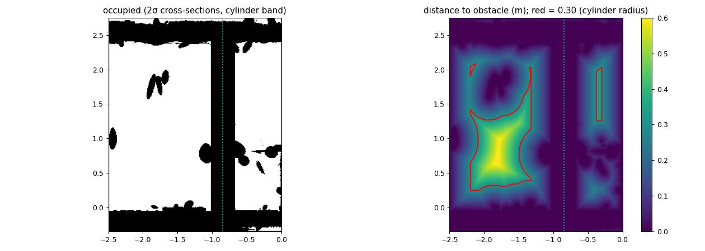

# G2 audit: is the cylinder really unreachable on so many pairs? (F3 Task 0, 2026-10-07)

**The question (user):** does G2 check with A* or another algorithm that the cylinder really is unreachable on so many
pairs? If not, is each failure location picking or an algorithm failure?

**Short answer.**
- `gmc/results/aerial3dg/g2/collect.json` contains GMC's own verdict counts and nothing else.
- F1 cross-checked only 30 rows per class, and those checks mostly came back NO_ROUTE_MARGIN, which proves little.
- This audit checks **every** G2 non-REACHABLE row (cylinder 4927, sweeper 301), plus 193 controls, with algorithms
  other than GMC. Results: 

| G2 rows (F1 class) | n | verdict | decisive evidence |
|---|---|---|---|
| cylinder UNREACHABLE (CY-LAMP) | 2928 | **blocked (location picking: genuinely unreachable)**: 2928 | real-body A* 0/2928 ROUTE; no lattice route even for a body 1 cm smaller at margin 0; the lamp + bulkhead close the crossing completely (width 0) |
| cylinder UNKNOWN safe-graph (CY-GAP) | 1587 | **box artefact (location picking)**: 1587 | real-body A* ROUTE in W1 on 1587/1587; none in the G2 box at the 1 mm margin (lattice: 1587/1587 separated) |
| cylinder UNKNOWN endpoint (CY-EP) | 400 | **reachable within ≤ 2 mm tolerance**: 400 | endpoint oracle clearance 1.0–1.97 mm < margin + buffer. Underneath: 30 pairs have a real-body route in the G2 box, 370 only in W1 |
| cylinder UNKNOWN endpoint, lateral (CY-EP-LAT) | 12 | **reachable within ≤ 2 mm tolerance**: 12 | as CY-EP; all 12 real-body routes are only in W1 |
| sweeper UNKNOWN endpoint (SW-EP) | 239 | **reachable within ≤ 2 mm tolerance**: 239 | real-body A* ROUTE 239/239 in the G2 box; endpoint clearance < 2 mm |
| sweeper UNKNOWN replay (SW-KIN) | 62 | **reachable, GMC UNKNOWN (algorithm incompleteness)**: 62 | real-body A* ROUTE 62/62; the veto is export round-off (F1 §3.3) |
| controls (G2 REACHABLE) | 73 + 120 | A* agrees: 193/193 | real-body A* ROUTE on all |

- **No soundness problem:** no certified UNREACHABLE pair has an A* route, in either the G2 or the W1 box.
- **No row stays unresolved.**
- **So the user's question has a clean answer:**
  - the 2928 cylinder UNREACHABLEs are real;
  - the 1587 "safe graph disconnected" UNKNOWNs are a placement/compile-box choice: the way round lies just outside
    the box;
  - the remaining 713 UNKNOWNs (412 cylinder + 301 sweeper) are endpoints within GMC's 2 mm margin + buffer, or the
    sweeper's export round-off. None is a wrong answer about reachability.

Machine-readable:
- `gmc/results/aerial3dg/f3/g2_audit/verdicts.csv`: one row per audited pair, with every check and the verdict.
- `summary.json`: class × verdict counts and coverage.
- `raw/` (per-row A* jsonl, lattice labellings), `raw_s2/`, `lampwidth.{json,png}`.

Labels: **[E]** = backed by the committed file named next to it; **[G]** = guess or inference, not tested.

## 1. Method: four independent checks, none of them GMC

| check | what | settings | rows |
|---|---|---|---|
| A. real-body A* in the G2 box | gs3d `LatticePlanner`, F1's oracle settings | real body, margin 0.001, 0.1 m lattice, pos tol 0, yaw tol 0.05, 500k expansions, 300 s | all 5000 cylinder rows (4927 + 73 REACHABLE controls) + 421 sweeper rows (301 + 120 controls) |
| B. real-body A* in F1's W1 box | same, on the W1 scene u[-10,4.7] v[-1.35,3.75] | as A | 1999 rows: CY-GAP 1587 + CY-EP 400 + CY-EP-LAT 12 |
| C. subset-body lattice (decisive version of NO_ROUTE_MARGIN) | connected components of a fixed 0.05 m route-frame lattice: every node a free pose, every edge one oracle edge test. This is exactly the graph the A* searches, anchored globally instead of at the start. Each row's start and goal are attached with one oracle edge. Same component = constructive route (re-verified with `verify_path` on 300 rows per labelling); different components = exhaustive A* would fail | bodies real / s2 / s10, **margin 0** (s2/s10), step 0.05 | all cylinder rows |
| C'. per-row subset-body A* | `LatticePlanner` on the s2 body, margin 0, 0.05 m lattice: a cross-check of C | as A, 0.05 m | systematic samples: CY-LAMP 1-in-9 (326), CY-GAP 1-in-16 (100), CY-EP 1-in-7 (58), all CY-EP-LAT (12), controls 1-in-4 (19) |
| D. lamp passage geometry (no search) | 1 cm occupancy of every Gaussian's 2σ cross-section, on z planes every 1 cm across the cylinder's body band [0.02, 1.75] m, and the widest disk that can cross the lamp line | window u[-2.5,0] v[-0.35,2.75] | – |

**Why subset bodies, and which.**
- In F1's sample, NO_ROUTE_MARGIN was the usual outcome. It means "exhausted, but some edges were rejected only as
  within-margin". The pilot here shows why **[E]**: 95 of the 188 Gaussians behind such rejections lie *under the
  chassis* (2σ top < 0.02 m). The real cylinder's 0.1 m lattice breaks into small start components (289-565 nodes)
  bounded by floor splats that graze the 1 mm margin.
- A body that is a **strict subset** of the real cylinder, searched at **margin 0**, removes both effects. If it
  finds no route, the real body cannot pass either (modulo lattice resolution). If it finds a route, a route exists
  up to the shrink.
- The shrinks:
  - **s2**: radius −2 mm, chassis bottom +2 mm, top −2 mm. Half-height −2 mm and clearance +2 mm keep z_c unchanged.
  - **s10**: radius −10 mm, bottom +3 mm, top −10 mm. Half-height −6.5 mm, clearance +3 mm, z_c −3.5 mm. Still inside
    the real body: bottom 0.023 ≥ 0.020, top 1.740 ≤ 1.750, r 0.29 ≤ 0.30.
- The bottom raise comes from the geometry. The plane-floor edit keeps only splats whose 2σ top is below
  z_floor + 0.02, and F1 measured the grazing tops at 0.0180–0.019990 m. So at +2 / +3 mm every floor splat is ≥ 2 mm
  below the chassis and no longer grazes at margin 0. Anything that reaches above 0.022 / 0.023 m still blocks.
- Lateral 2 mm is the "≤ 2 mm tolerance" of the verdicts. 10 mm is a generous over-approximation: if even that body
  cannot pass, the pair is blocked by a wide margin.

## 2. Results
**2.1 Real-body A*, every row** **[E]** (`raw/{cylinder,sweeper}_real_m0.001_r0.1_{G2,W1}_*.jsonl`):

| class | G2 box: ROUTE / NO_ROUTE / NO_ROUTE_MARGIN | W1 box: ROUTE |
|---|---|---|
| CY-LAMP (2928) | **0** / 417 / 2511 | – |
| CY-GAP (1587) | 0 / 0 / 1587 | **1587 / 1587** |
| CY-EP (400) | 30 / 0 / 370 | **400 / 400** |
| CY-EP-LAT (12) | 0 / 0 / 12 | **12 / 12** |
| cylinder controls (73) | 73 / 0 / 0 | – |
| SW-EP (239), SW-KIN (62), sweeper controls (120) | 421 / 0 / 0 | – |

- No query hit the budget, and none was UNSURE.
- In the lamp rows' NO_ROUTE_MARGIN rejections, 40 % of the Gaussians are floor splats under the chassis. That is
  why NO_ROUTE_MARGIN is uninformative on its own, and why check C is needed.
- A real-body A* query costs 12.5 s for an exhausted search and 2.4 s for a route.

**2.2 Global lattice labelling, all 5000 cylinder rows** **[E]** (`raw/grid_cylinder_{real,s2,s10}_m*_s0.05_G2.json`):

| body, margin (0.05 m lattice) | components (sizes) | CY-LAMP | CY-GAP | CY-EP | CY-EP-LAT | controls | routes re-verified (`verify_path`) |
|---|---|---|---|---|---|---|---|
| real, 0.001 (the contract) | 3 (2239 / 1973 / 1171) | 2927 sep. + 1 no-attach | **1587 sep.** | 30 conn. / 370 sep. | 12 sep. | 73 conn. | 103 / 103 |
| real, 0 (no margin) | 2 (4483 / 1177) | 2927 sep. + 1 no-attach | 1587 conn. | 400 conn. | 12 conn. | 73 conn. | 300 / 300 |
| s2 (−2 mm), 0 | 2 + 1 isolated node (4641 / 1186 / 1) | 2927 sep. + 1 no-attach | 1587 conn. | 400 conn. | 12 conn. | 73 conn. | 300 / 300 |
| s10 (−1 cm / +3 mm / −1 cm), 0 | 2 + 1 isolated node (4710 / 1204 / 1) | **2928 sep.** | 1587 conn. | 400 conn. | 12 conn. | 73 conn. | 300 / 300 |

Reading:
- **At the contract margin, the G2 box has three regions:** west of the u≈-5.9 partition, between the partition and the
  lamp, and the booth east of the lamp. CY-GAP pairs straddle the partition.
- **Remove the 1 mm margin, or shrink the body by 2 mm, and the partition region joins the west:** the body passes over
  the floor splats with 0.01–0.19 mm to spare (F1 §3.2). The lamp crossing never opens, even at −1 cm.
- The 30 CY-EP rows that connect at the contract margin are exactly F1's 30 buffer-0 REACHABLE rows.
- The single CY-LAMP no-attach row (G2-02515) has its start in a pocket of 1 lattice node. Its per-row s2 A* is a clean
  NO_ROUTE and s10 separates it.

**2.3 Per-row s2 A* versus the global labelling** **[E]** (`raw_s2/`):
- They agree on all **515/515** sampled rows: CY-LAMP 325 no route (175 NO_ROUTE, 150 NO_ROUTE_MARGIN) + 1 no-attach;
  CY-GAP 100, CY-EP 58, CY-EP-LAT 12 and controls 19 all ROUTE / connected.
- The 150 lamp NO_ROUTE_MARGINs at margin 0 are rejected only on inserted booth/lamp Gaussians (ids > 7,340,008, 2σ
  tops 0.03–1.68 m), where the bound is inconclusive at exact contact. None involves a floor splat.

**2.4 Lamp passage geometry** **[E]** (`lampwidth.{json,png}`, inspected):
- **Full body band [0.02, 1.75] m: the lamp + bulkhead close the crossing between wall A and wall B completely**
  (max-min clearance 0). At each u column the widest free v-run is 3 cm.
- By height band:
  - [0.02, 0.5] and [0.5, 1.0] m leave a 0.48 m disk, smaller than the 0.60 m cylinder;
  - every band from 1.0 m up leaves ≤ 0.06 m.
- So the cylinder would have to be under 1 m tall *and* under 0.48 m wide to cross. An independent, non-search argument
  for CY-LAMP.



## 3. Per-row verdict rule (`experiments/aerial3dg_fail3_audit.py verdict`)
Applied per row, first match wins (`verdict()` in `experiments/aerial3dg_fail3_audit.py`):
1. **GMC UNREACHABLE:**
   - real-body A* ROUTE → **SOUNDNESS BUG** (0 rows);
   - s10 lattice separated and s2 lattice separated (or not attachable, with a per-row s2 A* non-route) → **blocked**;
   - else a subset-body route → by-tolerance; else unresolved.
2. **Endpoint not certified free:** endpoint clearance ≤ 2 mm (F1's oracle value) → **by-tolerance**. The note records
   whether the pair itself has a real-body route in G2, only in W1, or only within tolerance.
3. **Replay veto:** real-body A* ROUTE → **algorithm incompleteness** (export round-off, F1 §3.3).
4. **Safe graph disconnected:**
   - real-body ROUTE in G2 → algorithm incompleteness;
   - else ROUTE in W1 → **box artefact**;
   - else a subset-body route in G2 → by-tolerance;
   - else s10/s2 separated → blocked; else unresolved.

## 4. Cost
- All jobs: 1 CPU, ≤ 3.5 GB, `cpu_short`. IDs and purposes are in
  `/scratch/wg2381/claude_jobs/aerial3dg_fail/jobids/F3.txt` (job names `a3f3_t0_*`, `a3f3_grid_*`, `a3f3_lampwidth*`,
  `a3f3_pilot_real/_s2`, and the lattice jobs in the `a3f3_probe` lane).
- **Total ≈ 31 CPU-h of the 40 budgeted.** The per-row A* took 28.6 CPU-h (G2 17.0, W1 6.7, s2 4.9). The lattice
  labellings took ≈ 1 h, including two failed attempts caused by my own bugs (route re-verify with yaw-0 poses, then
  variable shadowing); both were fixed and re-run. The lamp width took 0.06 h.

```bash
cd gmc; export PYTHONPATH=src:experiments; H=hpc/aerial3dg/f3_py.sbatch; S=experiments/aerial3dg_fail3_audit.py
python $S rows                                                   # configs/aerial3dg/f3_audit_rows.json
sbatch --array=0-23%2 --mem=2100M $H $S astar --robot cylinder --nshards 24 --out-dir results/aerial3dg/f3/g2_audit/raw
sbatch --mem=2100M $H $S astar --robot sweeper --out-dir results/aerial3dg/f3/g2_audit/raw
sbatch --array=0-7%1 --time=06:00:00 --mem=2100M $H $S astar --robot cylinder --box-name W1 --classes CY-GAP CY-EP CY-EP-LAT --nshards 8 --out-dir results/aerial3dg/f3/g2_audit/raw
sbatch --array=0-2%1 --mem=2100M $H $S astar --robot cylinder --body s2 --margin 0 --resolution 0.05 --classes CY-LAMP --stride 9 --nshards 3 --tag _lamp --out-dir results/aerial3dg/f3/g2_audit/raw_s2   # + _gap/_ep/_eplat/_ctrl
for x in "real 0" "real 0.001" "s2 0" "s10 0"; do set -- $x; sbatch --mem=2500M $H $S grid --robot cylinder --body $1 --margin $2 --step 0.05 --store-paths; done
sbatch --mem=3G $H $S lampwidth --zstep 0.01
python $S verdicts                                               # verdicts.csv + summary.json
```
