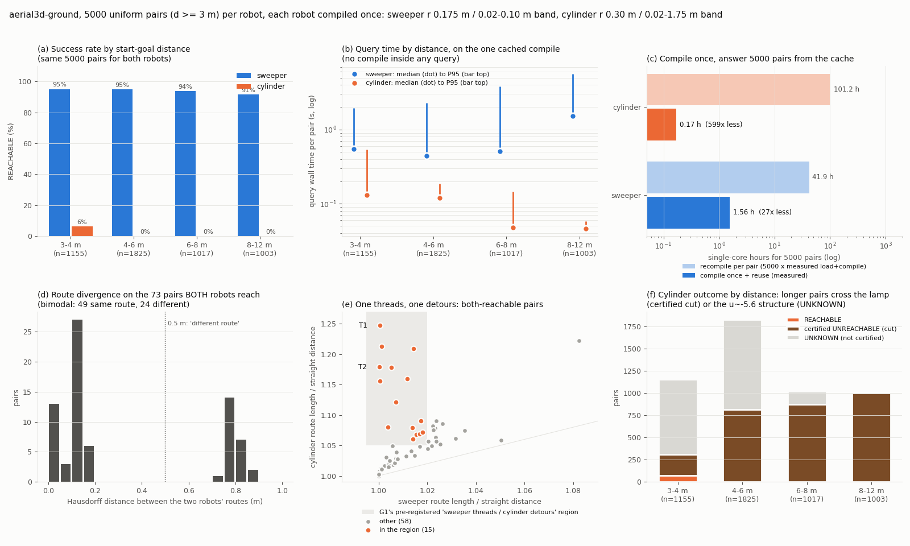
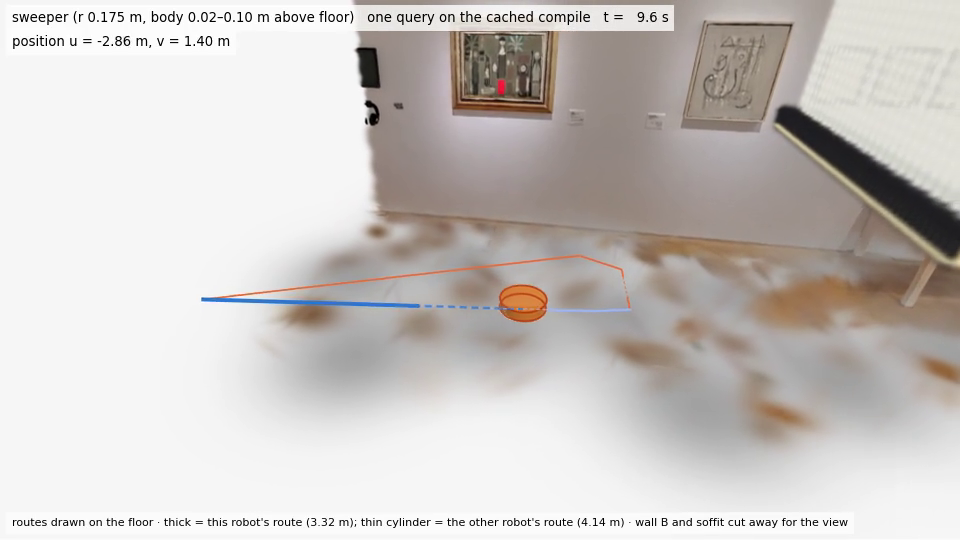
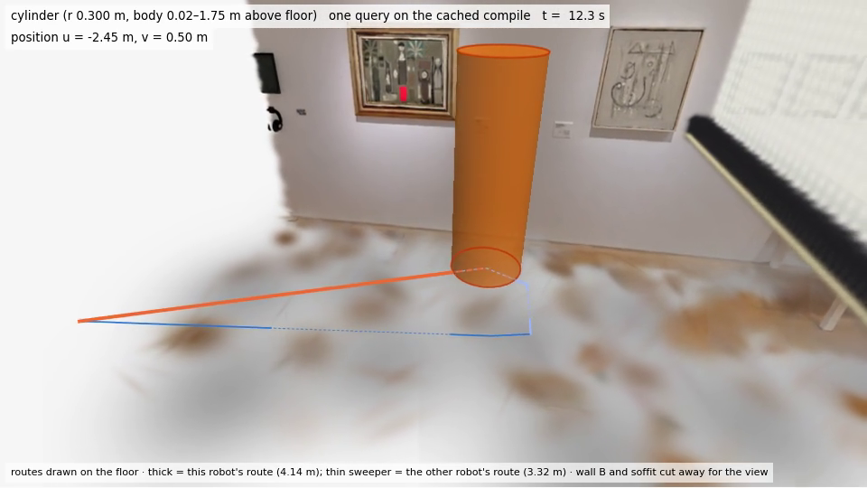
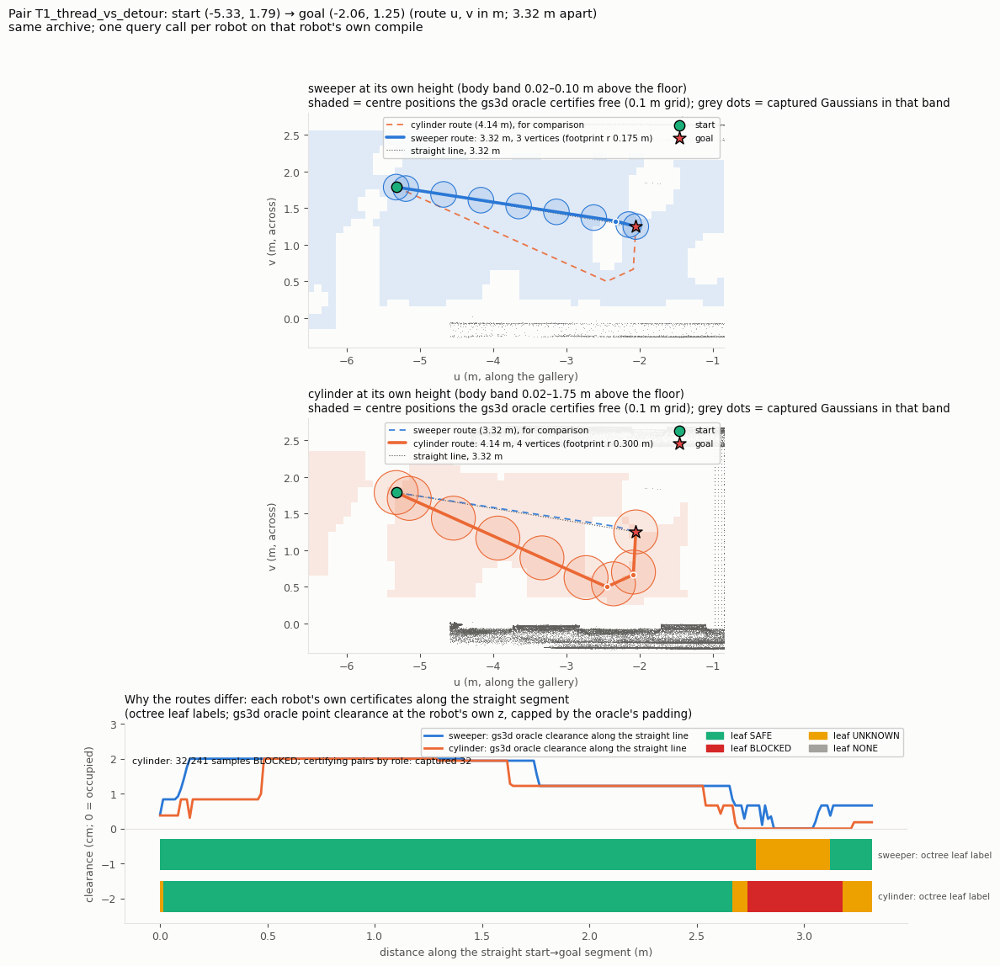

# aerial3d-ground 最终报告（G1–G3）：sweeper 与 cylinder 的纯 3D GMC 风格规划、演示、5000 对采样、先编译后复用

分阶段报告：[`aerial3dg_g1.md`](aerial3dg_g1.md)（接缝、演示对、时间估计）、[`aerial3dg_g2.md`](aerial3dg_g2.md)（5000 对）。
设计：[`aerial3dg_design.md`](aerial3dg_design.md)。过程：[`worklog/aerial3dg.md`](worklog/aerial3dg.md)。
填好的测量表：[`aerial3dg_measurement.csv`](aerial3dg_measurement.csv)（附录 A）。
G3 的机器可读汇总：[`gmc/results/aerial3dg/g3/analysis.json`](../gmc/results/aerial3dg/g3/analysis.json)，由
`gmc/experiments/aerial3dg_analyze.py` 从已提交的 G1/G2 原始结果算出，不重新规划。

## 一句话结论

**跑通了**。`aerial3d` 这个纯 3D、不做任何 2D 投影的 pair 认证后端，现在能规划 sweeper 和 cylinder 两种地面机器人：
- **演示**：≥3 m 的演示对（3.86 m，起终点不重合）在 2026-09-28 03:18 EDT 推送，比 09-29 08:45 的软截止早约 29.5 小时。同一次推送里有 5000 对的时间估计。
- **5000 对**：每种机器人都答完了全部 5000 对，每种机器人**只编译一次**。实测共 1.73 单核小时；如果每对都重新编译，约需 143 小时（83 倍）。
- **两种体型的策略确实不同**：
  - 跨灯的 2928 对：sweeper 在其中 2783 对里从灯下穿过；cylinder 在全部 2928 对上被认证为不可达。
  - 两者都可达的 73 对：其中 15 对是用户想看的“sweeper 直穿、cylinder 绕行”，按 G1 事先写下的规则判定。
- **更正 G1**：G1 在 120 对筛选里判定这种对“不存在”。那是抽样没覆盖到，不是场景里没有。

## 0. 做了什么，没做什么（如实命名）

- **接缝**（G1，`7ebfa2e`）：
  - `aerial3d` 原本只接受 UAV。现在也接受 gs3d 的 `ground_unicycle` 机体。
  - 地面机器人的 C-space 是一个 1 mm 厚的 z 薄层，高度 z_c = 地面 + 离地间隙 + 半高：sweeper 0.06 m，cylinder 0.885 m。
  - 用的仍是完整的 3D Gaussian 协方差和 pair 认证的内/外包络，没有阴影，也没有 2D 投影。
  - 安全裁决有两道，都要通过：自有的连续验证器，以及**共享的 gs3d 重放**（和以前所有链用的是同一个 oracle）。
- **先编译后复用**：`save_compiled / load_compiled` 把 `CompiledComplex` 存成 `.a3c` 文件（pickle + SHA-256 旁文件）。每个数组任务只加载一次，然后回答自己那一片的所有对。G2 自己一次都没有编译，用的就是 G1 演示时的那次编译：两者的盒子和配置相同，编译代码自那以后没改过。
- **没做的**：
  - UAV 没有在本链里重跑，UAV 的结果在 uavconn 分支。
  - 没有真值最短路。“质量”一节用直线距离作最短路的下界。“错误无路”一节用独立的 0.1 m gs3d 点图连通性作证据代理，不是证明。
  - 场景只有这一个：展厅 3DGS + uavlamp 加入的灯/隔断。

## 1. 设置

| 项 | 值 |
|---|---|
| 场景 | `uavlamp_scene.npz`（SHA-256 `2a3a72d6…96cc`），route 盒 u∈[−9, 3.7]、v∈[−0.35, 2.75] m，裁剪后 582,372 个 Gaussian（全档案 7,107,732） |
| sweeper | 圆柱 r 0.175 m，体带离地 0.02–0.10 m；候选 pair 11,906，有效 563 |
| cylinder | 圆柱 r 0.30 m，体带离地 0.02–1.75 m；候选 pair 252,257，有效 1,038 |
| 编译 | margin 0.001 m、octree 最小叶 0.05 m；sweeper 26.1 s / cylinder 70.7 s（同 compile_id 的另一次测量：18.6 / 50.7 s，节点负载不同） |
| 查询 | `QueryConfig(export_max_segment_m=0.20)`；每对超时 120 s |
| 5000 对 | 种子 20260928；在盒内均匀抽样，直线距离 ≥ 3 m；两端点对两种机器人都通过 gs3d oracle 检查（各自的 z_c）；两种机器人用同一张对表，不做连通性筛选。距离 3.00 / 5.33 / 11.62 m（最小 / 中位 / 最大） |

## 2. 演示对，以及两种机器人的策略是否不同

**G1 的演示对**（两种机器人，同一次编译上的冷、热和重载调用结果逐字节一致）：

| 对 | 距离 | sweeper | cylinder |
|---|---|---|---|
| P1_lamp | 3.864 m | REACHABLE，3.865 m，从灯下穿过（L/d 1.0003） | **认证不可达**：割证书含 1,214 个 BLOCKED 叶、88 个 pair（捕获物 68、灯 10、背板 10） |
| P2_both | 3.225 m | REACHABLE，3.238 m | REACHABLE，3.324 m，绕得更宽（程度不同，路线属同一类） |

视频：`gmc/results/aerial3dg/g1/video/`（P1 sweeper、P2 sweeper、P2 cylinder；P1 的 cylinder 没有路线，所以没有视频）。
计时图：`gmc/results/aerial3dg/g1/timing.png`。

**在 5000 对上，策略有三种不同**（证据见 `analysis.json → paired`）：

1. **“穿行 vs. 无路可走”（高度）**：
   - 直线跨过灯（u≈−0.85）的对有 2928 个。其中 cylinder **100% 认证不可达**：灯加隔断从 1.07 m 起横跨整条走廊，cylinder 顶到 1.75 m，没有低头的余地，也没有绕行路线。
   - sweeper 在其中 2783 对里从灯下穿过（体带顶 0.10 m，灯底 1.10 m），过灯处 v 中位 1.42。其余 145 对是 UNKNOWN。
2. **“直穿 vs. 绕行”（宽度）——用户希望看到的那种**：
   - 两者都可达的 73 对里，路线差异呈清楚的**双峰**：49 对路线几乎一样（Hausdorff < 0.2 m），24 对明显不同（0.7–0.88 m），中间 0.2–0.7 m 一对都没有。
   - 其中 **15 对满足 G1 事先写下的规则**：sweeper L ≤ 1.02 d，cylinder L ≥ 1.05 d。例如 G2-02772：sweeper 3.319 m / 直线 3.317 m，cylinder 4.137 m（L/d 1.247）。
   - 这 15 对里有 13 对，是 sweeper 从 (−2.34, 1.3) 处一块贴地捕获斑块（中心约 (−2.48, 1.01)，z −0.03）的北侧窄道穿过；cylinder（半径 0.30）过不去那条窄道，要绕到斑块南侧（v≈0.45）。
   - 证据：沿直线，cylinder 有 32–34/241 个样点落在 BLOCKED 叶里，证书 pair 正是这块斑块；sweeper 在同一段只有 0–1 个样点 BLOCKED。gs3d 点图显示：在 u −2.2…−2.0 处，这条北侧窄道对 sweeper 是通的，对 cylinder 是封死的（`routes_T1_*.png`、`routes_T2_*.png`）。
3. **“穿窄缝 vs. 不能认证”（宽度）**：
   - 直线跨过 u≈−5.6 处一个捕获结构的对有 3402 个。sweeper 在其中 3143 对里从 v≈1.74 的窄缝穿过；cylinder 在这 3402 对上**没有一条**可达路线（1433 对认证不可达，1969 对 UNKNOWN）。
   - 这些 UNKNOWN 在独立点图里**全部不连通**，所以几乎可以肯定是真不可达，但没有被认证（见 §4 的局限）。

**对 G1 的更正**：
- G1 的原话是：“按事先写下的挑选规则，筛选的 120 对里**没有**‘cylinder 明显绕行、sweeper 直穿’的对……是这份扫描场景本身的几何”。
- 这个判断的前半句成立：G1 的 120 对里确实没有这种对。后半句不成立：在 5000 个均匀对里，同一条规则挑出了 15 对。
- 原因是 G1 的 P2 起点在斑块南侧，两种机器人本来就都走南侧；G1 的筛选对又偏向穿灯和窄缝两类。
- G2 的报告写的是“这种模式仍然少见”（15/5000 = 0.3%），这个说法没错。

## 3. 先编译后复用：怎么证明，省了多少（实测）

- **同一对、同一次编译，重复调用结果不变**：
  - G1：每种机器人一次编译，回答 8 次调用：P1 冷调用 1 次 + 热调用 3 次 + 重载后 1 次；P2 冷 + 热 + 重载各 1 次。
  - 这些调用里都**没有编译阶段**，编译记录也没被查询改动，同一对每次返回的折线逐字节相同。
- **5000 对**：20 个数组任务，每个任务 `load_compiled` 一次（sweeper 平均 0.73 s，cylinder 1.06 s）。
  - `compile_complex` 外面包了一个计数器，所有任务读数都是 0。
  - 每一行的 compile_id 都相同，也没有任何一次查询里出现编译阶段。
- **跨进程、跨节点复现**（G3 新做）：
  - G3 的画廊作业（18708038/39）从同一个 `.a3c` 重新加载，用新加的 `demo --from-a3c`，本进程内 0 次编译。
  - 6 对 × 2 机器人 = **12/12 个结果与 G2 批量结果逐字节相同**（折线 SHA-256 和状态都比对了）；另外每条可达路线都在新建的 PreparedScene 上重放通过。
- **省了多少**：“重编译”列不是跑出来的，是用实测的单次加载+编译时间乘以 5000 得到的。

| | 实测：编译一次 + 加载 + 查询 | 反事实：每对都重新加载+编译（实测单次 × 5000） | 倍数 |
|---|---|---|---|
| sweeper | 1.56 h | 41.9 h | 27× |
| cylinder | 0.17 h | 101.2 h | 599× |
| 合计 | **1.73 h** | **143 h** | **83×** |

cylinder 省得多，是因为它的编译贵（70.7 s，凸胞生长占 47.5 s），而查询便宜（中位 0.05 s）。sweeper 的时间花在查询上：路径提取（shortcut + tighten）占 5000 对总时间的 87%。

**和 G1 的时间估计比**：
- G1 估了三档：中值 1.00 CPU-h、悲观 1.55、p95 上界 5.29。实际查询任务分配了 1.74 CPU-h，另有抽样 0.06；墙钟 34 min。
- 实际落在 G1 的悲观档和 p95 上界之间。
- sweeper 用了中值估计的 2.6 倍。原因：G1 的筛选对更短（中位 3.57 m，均匀抽样是 5.3 m），拐点也更少。
- cylinder 只用了中值估计的 0.44 倍，因为 98.5% 的对是很便宜的认证割（0.035 s）或 UNKNOWN（0.15 s）。

## 4. 5000 对的结果

| 机器人 | REACHABLE | UNREACHABLE（认证） | UNKNOWN | TIMEOUT | 查询中位 / P95 / 最大 (s) | 每对摊销（含编译） |
|---|---|---|---|---|---|---|
| sweeper | 4699 | 0 | 301 | 0 | 0.651 / 3.655 / 18.1 | 1.125 s |
| cylinder | 73 | 2928 | 1999 | 0 | 0.050 / 0.182 / 3.9 | 0.122 s |

**按直线距离分档**（，已查看）：

| 档 | n | sweeper 成功率 | sweeper 查询中位 / P95 (s) | cylinder 成功率 | cylinder 结局 |
|---|---|---|---|---|---|
| 3–4 m | 1155 | 95.1% | 0.55 / 1.95 | 6.3% | 73 可达 / 236 割 / 846 UNKNOWN |
| 4–6 m | 1825 | 94.8% | 0.44 / 2.28 | 0% | 817 割 / 1008 UNKNOWN |
| 6–8 m | 1017 | 93.8% | 0.51 / 3.80 | 0% | 872 割 / 145 UNKNOWN |
| 8–11.6 m | 1003 | 91.4% | 1.53 / 5.66 | 0% | 1003 割（全部跨灯） |

cylinder 的自由空间在点图里分成 4 块，最大一块在 u −5.3…−1.5 之间，所以它只能在短对里可达。编译不随距离变：同一次编译、同样的 pair 数和 octree，服务所有档位。

**质量**：
- **最终验证**：输出为 REACHABLE 的路线 4699/4699（sweeper）和 73/73（cylinder）都通过了自有连续验证和共享 gs3d 重放。
- **被共享重放否决的路线**：另有 62 条 sweeper 路线自有验证通过，但被更保守的共享重放否决。这些对报 UNKNOWN，**没有**作为可达输出。
- **clearance**：最小 0.0010 m。这是 margin 0.001 的设计选择：地砖顶 0.015 m，底盘底 0.02 m。
- **比直线长多少**：sweeper 平均 3.2%、中位 1.3%、P95 13.3%。直线是最短路的下界，所以这些数是上界。
- **转弯**：sweeper 每条路线平均 2.65 个内部顶点。

**有没有“错误的无路径”**（证据代理：G1 在各机器人自己的 z_c 上做的 0.1 m gs3d 点图，4-连通，`analysis.json → oracle_map_crosscheck`）：
- cylinder 的 2928 个认证不可达里，能吸附到点图的 2926 个**全部不连通**，另 2 个端点吸附不上；没有证据表明有错误的“无路”。
- 1587 个 u≈−5.6 处的 UNKNOWN 也全部不连通。
- sweeper 的点图是一整块连通区域，所以它的 301 个 UNKNOWN 在点图里**全部连通**。这 6.0% 是方法的不完备：
  - 239 个是端点在 5 cm 叶上没被认证为自由；
  - 62 个是共享重放否决了路线。
  - 这些都是“没给出结论”，不是“说没有路”。
- cylinder 另有 30 个端点类 UNKNOWN，在点图里是连通的。

**稳定性与敏感性**：
- **分辨率**（G1 的同一组 80 个筛选对，最小叶 0.10 / 0.05 / 0.025 m）：
  - cylinder 的结论三档完全相同（6 可达 / 10 割 / 64 UNKNOWN）。
  - sweeper 相对 0.05 m 分别有 1 个和 2 个结论翻转，全是 REACHABLE ↔ shared_replay_failed 的互换，总数不变。
  - 主要路线变化 0 个。
  - 编译时间：sweeper 11.7 / 18.6 / 56.8 s，cylinder 33.1 / 50.7 / 135.6 s。
  - 所以 u≈−5.6 的 UNKNOWN **不是分辨率问题**；0.10 m 的叶子对这两种机器人一样好，还更便宜。这一点 G1 没测到。
- **半径 ±1 cm**（每个变体编译一次，跑 G2 的第 0–499 对；`hpc/aerial3dg/g3_variant.sbatch`）：
  - cylinder r 0.29：500/500 结论相同；r 0.31：497/500 相同。
  - sweeper r 0.165：486/500 相同；r 0.185：484/500 相同。
  - sweeper 的翻转两个方向都有，两个半径下都约 10 个 UNKNOWN→REACHABLE、4–6 个 REACHABLE→UNKNOWN。这更像端点和叶子的离散化，不像几何上的突变。
  - sweeper r 0.165 有 24 对主要路线变了：它改从斑块**南侧**（v≈0.69）绕，路线反而平均长 0.05 m。原来的北侧路线对更小的机器人也一定可行，所以**规划器不保证全局最短**：斑块两侧的绕行长度几乎打平，半径一变就可能换边（见 §7）。
- **重复运行**：12/12 个画廊结果与 G2 逐字节相同（§3）。

## 5. 画廊（G3，Task 2）

挑选规则在渲染前写死在 `aerial3dg_analyze.py select` 里，结果存为 `gmc/configs/aerial3dg/g3_gallery_pairs.json`。
所有查询都来自持久化的 G1 编译（0 次编译）。
- 路线图：`gmc/results/aerial3dg/g3/gallery/routes_<对>.png`。
- 视频：`gmc/results/aerial3dg/g3/gallery/video/<对>_<机器人>_flythrough.mp4`，每个视频从 MP4 解码回 4 帧，全部看过（见 worklog）。

| 对 | 规则 | 距离 | sweeper | cylinder | 视频 |
|---|---|---|---|---|---|
| T1_thread_vs_detour（G2-02772） | G1 规则，L_cyl − L_sw 最大 | 3.32 m | 3.32 m，北侧窄道直穿 | 4.14 m，绕斑块南侧 | 两种机器人 |
| T2_thread_vs_detour_reverse（G2-02004） | 同上，反方向 | 3.23 m | 3.24 m | 3.81 m | 两种机器人 |
| L1_gap_and_lamp（G2-02503） | 同时穿 u≈−5.6 和灯，cylinder 被割，sweeper 路线最直 | 7.26 m | 7.26 m，穿窄缝 + 灯下 | 认证不可达（与 P1 同一个割：1,214 叶 / 88 pair） | sweeper |
| N1_gap_only（G2-00964） | 只穿 u≈−5.6，cylinder UNKNOWN，sweeper 路线最直 | 3.54 m | 3.54 m | UNKNOWN（safe 图不连通） | sweeper |
| S1_sweeper_max_detour（G2-00354） | 全部 5000 对里 sweeper L/d 最大 | 3.00 m | 4.32 m（L/d 1.44，绕经窄缝） | UNKNOWN | sweeper |
| B1_both_same_route（G2-00177） | 对照组：两者路线 Hausdorff < 0.2 m 中 d 最大 | 3.87 m | 3.871 m | 3.884 m（同一路线） | 两种机器人 |

| T1 sweeper（北侧窄道） | T1 cylinder（绕南侧） |
|---|---|
|  |  |



渲染管线沿用 G1。视频里机器人本体固定画成橙色；当前机器人的路线是粗线，另一机器人的路线是细线，都画在地面上。

看过的情况：9 个视频，每个从 MP4 解码回 4 帧，共 36 帧，全部看过。
- 相机从没有被挡在墙后；机器人都在各自的真实高度；L1 在灯下的帧有标注。
- S1 的后半段在走廊西端（u < −6），那里扫描稀疏，地面渲染偏白，背景信息少。
- G1 的画图代码对 cylinder 的 UNKNOWN 会写出 “None cut leaves”。已在 `aerial3dg_viz.py` 修正，N1、S1 两张路线图重新渲染（作业 18708264），视频没有重做。

## 6. 复现

```bash
cd gmc; S=hpc/aerial3dg; export PYTHONPATH=src:experiments
python experiments/aerial3dg_analyze.py select          # 画廊对（规则写死）
for R in sweeper cylinder; do
  sbatch --job-name=a3g_gallery_$R --mem=3500M --cpus-per-task=1 $S/g1_run.sbatch demo --robot $R \
    --box -9.0 -0.35 3.7 2.75 --pairs configs/aerial3dg/g3_gallery_pairs.json --warm 1 \
    --from-a3c outputs/aerial3dg/demo/$R.a3c --out outputs/aerial3dg/g3/gallery
  sbatch --job-name=a3g_screen5_$R --mem=3500M $S/g1_run.sbatch screen --robot $R --box -9.0 -0.35 3.7 2.75 \
    --candidates results/aerial3dg/g1/runs/screen3_corridor/candidates.json --min-cell 0.1 --out outputs/aerial3dg/g3/screen5_mc10
done
sbatch --mem=4G $S/g1_viz.sbatch --demo outputs/aerial3dg/g3/gallery \
  --candidates results/aerial3dg/g1/runs/screen3_corridor/candidates.json --out results/aerial3dg/g3/gallery \
  --pairs T1_thread_vs_detour T2_thread_vs_detour_reverse L1_gap_and_lamp N1_gap_only S1_sweeper_max_detour B1_both_same_route
for v in "sweeper 0.165" "sweeper 0.185" "cylinder 0.29" "cylinder 0.31"; do sbatch $S/g3_variant.sbatch $v; done
python experiments/aerial3dg_analyze.py analyze && python experiments/aerial3dg_analyze.py csv && python experiments/aerial3dg_analyze.py plot
```

## 7. 局限（如实）

- **UNKNOWN 不是失败的“无路”，但也不是结论**：
  - cylinder 有 1999 个 UNKNOWN，占 40%。其中 1587 个在 u≈−5.6：单个 pair 的叶证书封不住那处结构，而点图显示那里不通。要认证它需要多 pair 联合的割证书，没做。
  - sweeper 有 301 个 UNKNOWN（6%），其中 239 个卡在 5 cm 叶上端点认证不了。
- **不保证最短**：
  - A* 在凸胞 portal 图上搜索，然后做 shortcut/tighten。这样得到的是认证安全的路线，不是全局最短路。
  - 半径 −1 cm 的实验直接暴露了这一点：更小的机器人在 24 对上选了平均长 0.05 m 的另一侧绕行。
- **没有构造真值**：“错误无路”和“正确无路”的比例用的是 0.1 m 点图代理。点图可能漏掉窄于 0.1 m 的窗口，也不检查格点之间的扫掠。
- **clearance 只有毫米级**：margin 0.001 m，是地面约定所迫（见 G1）。路线紧贴障碍，这是认证意义上的安全，不代表有物理余量。
- **只测了一个场景**：规模一节的三个 N_G，是同一份档案取三个越来越大的查询盒，N_G 和盒子体积一起变大，不是独立的场景。
- **三种机器人只跑了两种**：模板里“机器人 3”的各行写的是“未运行”。
- **每对的碰撞检查次数没记录**：G2 的每行只记了阶段时间，所以测量表里“collision 查询次数”一行对 5000 对这一列写“未逐对记录”。单对的数字在 G1 的演示列里。

## 8. 最终检查：逐项对照用户原始要求（plan §4）

每一项只按 `origin/aerial3d-ground` 上的提交和文件判断，不看各阶段 done.md 自己怎么说。推送时间取自远程跟踪分支的 reflog（每次推送一条记录，时间为 EDT）。

| # | 要求 | 结论 | 证据（origin 上） |
|---|---|---|---|
| 1 | `aerial3d` 能跑 sweeper 和 cylinder（完整 3D pair 认证，无 2D 投影） | **达成** | `7ebfa2e`（接缝 + 10 个地面单测）、`da2292a`；G1 在 38f7c5d 跑完整 aerial3d 测试 81/81 通过（作业 18705006）；G3 在当前 HEAD 重跑地面 + 批量单测 16/16 通过 |
| 2 | 每种机器人有演示视频 + 计时/图，演示对 ≥3 m，起终点不重合 | **达成**，有一处注明 | P1_lamp 3.86 m：sweeper 视频 + 路线/证据图 + `timing.png`（`c257134`、`b81240d`、`38f7c5d`）。cylinder 在 P1 **没有路线**（认证不可达），所以它的视频在 P2_both（3.23 m）上；G3 又补了 T1/T2/B1 三个 cylinder 视频（3.2–3.9 m） |
| 3 | 如实说明两种策略是否不同（绕行 vs 穿行），有证据 | **达成**，并更正了 G1 | G1：P1 是“穿行 vs 无路”，证据是叶标签和割证书；G3（本报告 §2）：5000 对里有 15 对是“直穿 vs 绕行”，证据是直线上的叶标签、证书 pair 和点图 |
| 4 | 两种机器人各跑 5000 对 | **达成（全量，不是部分）** | `373c146`、`9c9fa31`、`f938414`、`3d90de9`：两种机器人各 5000/5000，0 超时 |
| 5 | 真正的 5000 对运行用了先编译后复用，不只是演示对 | **达成** | 每个 `task_??.summary.json` 里的 `compile_once_proof`（20/20 个任务 0 次编译）；G3 画廊 12/12 跨进程逐字节复现；实测 1.73 h vs 反事实 143 h |
| 6 | 每个有意义的提交都随做随推，不攒到最后 | **达成**，有一处延迟 | 分支上 24 个提交，远程 reflog 有 24 次推送，每个提交单独推。唯一的例外：sweeper 第 9 个数组任务 04:34 EDT 跑完，但 `3d90de9` 06:54 才推——G2 那次撞上用量上限，恢复后才推，结果文件在磁盘上没有丢 |
| 7 | 填好 `measurement_template.csv`（放在本工作树里的副本，不改原件） | **达成** | `docs/aerial3dg_measurement.csv`（G3：G1 的 4 列演示 + 2 列 5000 对，107 行指标全部填写，没有剩余的 `____`）；G1 的副本 `gmc/results/aerial3dg/g1/measurement_g1.csv`；原件 `/scratch/wg2381/splathjb/measurement_template.csv` 没动 |
| 8 | 2026-09-29 08:45 EDT 之前，要有两种机器人都跑通的 ≥3 m 演示对 + 站得住的 5000 对时间估计 | **达成，提前约 29.5 小时** | `c257134`（演示对 + 估计 + 测量表）于 **2026-09-28 03:18:00 EDT** 推送；G2 的实测（04:34 EDT 跑完）落在该估计的悲观档和 p95 上界之间（§3）。G1 自己的说法（“~03:30 EDT，提前约 29 h”）与 reflog 一致 |

**用户要求里还有两条，不在 §4 的清单上，这里一并交代**：
- **“用好一点的 agents”**：三个阶段都是 Opus 的无人值守 Slurm agent。
- **“关注刷新时间”**：
  - G2 撞过一次用量上限，被包装脚本按重置时间重新提交（`18705824`），在同一对话里恢复，没有丢工作。
  - G1 和 G3 没有被中断。
  - G3 从 11:00Z（07:00 EDT）开始，约 11:45Z 完成。它自己的算力是 10 个小作业，合计分配 2.1 CPU-h（其中渲染占 1.5）；其间一直和 ground5k 共享 120 GB 的 QOS 配额，没有动 ground5k 的任何作业。

**没有达成或没追的事**：
- UAV 没在本链重跑（不在 §4 范围内）。
- cylinder 在 u≈−5.6 的不可达没能**认证**。
- 没有真值最短路。
- 这些都记在 §7，没有被说成已经做到。

## 附录 A：测量表

[`docs/aerial3dg_measurement.csv`](aerial3dg_measurement.csv)（UTF-8 带 BOM，行序与原模板相同）。

| 列 | 内容 |
|---|---|
| 1–4 | G1 的单对演示：sweeper/cylinder × P1_lamp/P2_both。只有总体才有意义的行，写“N/A（单对演示；见 5000 对列）” |
| 5–6 | 5000 对：sweeper、cylinder。机器人对比那几行是配对比较，只写在 sweeper 列，cylinder 列写“同 sweeper 列” |

几条填法说明：
- **冷启动**：每个机器人只发生一次，就是那一次编译，所以报一次编译的时间和“每对摊销”，不按每对报。
- **各阶段占比**：分母是 1 次编译 + 10 次加载 + 5000 次查询的总墙钟。
- **规模一节**：用同一份档案的三个查询盒。
- **分辨率一节**：三档，0.10 / 0.05 / 0.025 m。
- **“相近尺寸机器人”各行**：用半径 ±1 cm 的实验填；“operator edge 相同比例”写 N/A——每次编译的凸胞和 portal 各不相同，边之间没有一一对应。
