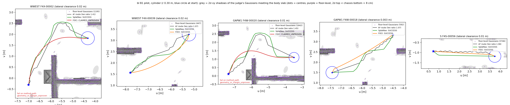

# Baseline adapters on the F4 benchmark (bl stage B1; B2 adds PNO and cust_fields)

Plan: `docs/baselines_f4_plan.md` (§3 fairness contract, §5 rows). Environments: `docs/baselines_envs.md` (B0).
Branch `baselines-f4`. Claims are **[E]** (evidence: the committed file named next to it) or **[G]** (guess / untested).
Code: `gmc/experiments/bl_harness.py` (harness, gmc-venv), `bl_worker.py` (method process), `bl_testmethods.py`
(the harness's own methods), `bl_splatnav.py`, `bl_foci.py`; tests `gmc/tests/unit/test_bl_harness.py`; sbatch
helpers `gmc/hpc/baselines/b1_{cpu,gpu}.sbatch`. Job IDs: `/scratch/wg2381/claude_jobs/baselines/jobids/B1.txt`.

## 1. Harness

### 1.1 What every method goes through

```
F4 / tuning pair ──► bl_harness (gmc-venv) ──JSON line──► bl_worker (method env, own process group, GPU)
                         │  120 s from outside (select on the pipe; on expiry killpg SIGKILL, next pair restarts the worker)
                         ◄──────────── {claimed, path (u, v[, z]), algorithm_wall_s, cpu_s, stages} ─────┘
                         ▼
     complete_path: exact start / goal appended if the method stops short (recorded) ──► GMC's exporter
     (api._gs3d_result + api._densify 0.20 m) ──► replay_plan(result, GaussianBodyOracle(C.prepared)) ──► §5 row
```

- **Pairs.** `load_pairs("f4")` = `results/aerial3dg/f4/pairs_confirmed_5000.json`; `load_pairs("tuning")` = plan §3.5
  (first 25 WWEST + 15 GAPW1 + 10 S of F3's `pilot_pairs.json`, disjoint from the 5000); or a committed id list:
  `results/baselines/pilot/pilot_pairs.json` (100) and `results/baselines/b1_sanity/sanity_pairs.json` (200), both
  stratified by region × F4 lateral-clearance band (`aerial3dg_fail3_f4.LAT_BANDS`), proportional, ≥ 1 per stratum,
  seeds 20261010 / 20261011 (`bl_harness sample`). The method's worker receives only `(start_uv, goal_uv)`; only the
  `astar_replay` sanity method is sent the pair record.
- **Judge scene.** `Judge(region, robot)` loads the persisted F3 compile after `bl_judge_check.verified_a3c` checked
  its SHA-256 against the sidecar, F3's handoff and F4's `compile_once.json`; `C.prepared` is the very object F5/J
  judged A* routes and GMC with. One `Judge` per task.
- **Scene export** (`bl_harness export`, job 19508155) — what a Gaussian-native method reads:
  `outputs/baselines/scene/<R>_<robot>.npz` (+ `.json` with SHA-256): the judge's own `PreparedScene.means/covs/ids`
  (opacity > τ = 0.3, covariances as the judge floors them), rotated into the plan frame (= the route frame:
  u, v, height above the floor; checked `known_frame_equals_plan_frame: true` for all six), plus τ, level (2.0), margin
  (0.001), body, z_c, the known-space prism. 390,716 (WWEST), 209,126 (GAPW1), 333,487 (S) Gaussians **[E]**
  (`outputs/.../scene/*.json`, log `bl_b1_export-19508155.out`).
- **Export = GMC's export, mirrored by calling it.** `Judge.export` builds the world polyline exactly as `api.query`
  does — interior vertices `frame.to_world([u, v, domain.ground_z])`, endpoints the exact
  `frame.to_world([u, v, clearance + half_height])` that `aerial3dg_batch.run_task` passes — then
  `api._gs3d_result(C, api._densify(P, QCONFIG.export_max_segment_m = 0.20), g_w, None)`: start yaw 0, turn in place
  to each heading at 1 rad/s, translate at 0.3 m/s, final turn to yaw 0, position tolerance 0, yaw tolerance 0.05,
  margin = the compile's 0.001. **Test:** GMC re-queried through the harness as a method (`gmc_requery`) gives a
  `gs3d.v1` trajectory equal to GMC's own export pose for pose and time for time, and the same `polyline_sha256` as
  GMC's re-judged F4 row (`test_gmc_reachable_route_requeried_is_success_and_export_is_byte_identical`, 3 S pairs)
  **[E]** (job 19508155, 13/13 tests pass).
- **Completion (§3.3).** `complete_path`: a method vertex within 1e-9 m of the pair's endpoint *is* the endpoint
  (frame round-off); otherwise a straight segment from the exact start / to the exact goal is added and judged like the
  rest; rows carry `prepended_start_segment`, `appended_goal_segment`, `start_gap_m`, `goal_gap_m`. The start
  prepend is our addition to §3.3 (SplatNav starts at an A* voxel centre, FOCI within 0.22 m of the start: both need
  it). A 3-column path is (u, v, z): z is dropped (the body is judged at z_c) and `max_abs_dz_m` recorded.
- **Judge** = `replay_plan` (§2), always in the harness's gmc-venv process. Outcome (§5):
  claimed ∧ passed → `SUCCESS`; geometry fails with `occupied` → `CLAIMED_COLLIDES`; geometry `unknown`/`invalid`
  (margin unproven, map_unknown, goal tolerance) → `CLAIMED_UNPROVEN`; geometry passes but kinematics/attained-goal
  fails → `CLAIMED_KINEMATICS`; method reports failure → `FAIL`; > 120 s → `TIMEOUT`; exception / worker death /
  unexportable path → `ERROR` (message + traceback kept); worker cannot start → `SETUP_FAIL`.
  `judge_wall_s` is recorded per row and never charged to the method. `run --judge defer` writes the method's exact
  path only and `bl_harness judge` fills the judge fields later on CPU (keeps GPU allocations off the CPU judge).
- **Timeout from outside.** The worker is a child process in its own session; the parent waits on the result pipe with
  `select` and a 120 s deadline, then `killpg(SIGKILL)` and records `TIMEOUT:query_exceeded_120s`; the next pair starts
  a fresh worker (which reloads the persisted setup). No signal or alarm runs inside the method process (F4's in-process
  SIGALRM surfaced as a `TypeError` inside numpy, 0a97784). The worker's own stdout (Python and C level: IPOPT) is
  redirected to its log, so method prints cannot corrupt the protocol (`test_method_prints_cannot_corrupt_the_protocol`).
- **Setup once (§3.4).** `bl_harness setup` builds the method's setup state from the scene export once per
  robot × region, in the method's env (`bl_worker --mode setup`), and persists it with a SHA-256 sidecar
  (`outputs/baselines/<method>/<config-hash>/<R>_<robot>.setup.pkl`; record `results/baselines/<method>/setup/...`).
  Each task's worker loads that artifact (hash checked, `load_s`) and instantiates the live planner (`instantiate_s`:
  e.g. SplatNav's voxel grid on the GPU, FOCI's CasADi/IPOPT problem); both are reported per worker start in the task
  summary's `setup_once_proof` (`setup_builds_in_this_task: 0`, `worker_starts`, `restarts`, same artifact SHA every
  start, same `setup_id` every row) and never charged to a query.
- **Rows** (§5): F4's fields where they apply (`index, pair_id, start_uv, goal_uv, dist_m, status, reason,
  algorithm_wall_s` (worker-measured around `plan`), `stages, cpu_s, outer_wall_s` (parent, send → receive),
  `polyline_sha256` (of the exported world polyline, `aerial3dg_run._sha`)) + `method, setup_id, claimed,
  claimed_reason, appended_goal_segment, prepended_start_segment, judge_passed, judge_reason, judge_geometry_reason,
  judge_kinematics_reason, judge_wall_s, path_length_m, vertices, route_polyline` (exact uv that was judged),
  `method_path_uv` (the method's raw output), `lateral_clearance_m, len_ratio, worker_generation, info`. Appended +
  fsync'd per pair; a killed task resumes. Task summaries carry host/commit (`aerial3dg_run.host`), setup id + SHA,
  setup-once proof, config + its SHA, judge-scene SHA, worker log path (`outputs/baselines/worker_logs/...`).

### 1.2 Harness checks
| check | result |
|---|---|
| unit tests, pure (sleep → TIMEOUT from outside + worker restart; raise → ERROR, worker survives; `os._exit` → ERROR + restart; completion; outcome map; artifact hash; protocol vs prints; resume) | 9/9 pass **[E]** (login node, and job 19508155) |
| heavy unit tests (GMC REACHABLE re-queried → SUCCESS with byte-identical export; straight line through an obstacle → CLAIMED_COLLIDES (`minkowski_interior_witness`); astar_replay → SUCCESS; sleep with inline judge → TIMEOUT) | 4/4 pass **[E]** (job 19508155, `BL_HEAVY=1`) |
| **astar_replay** on the tuning set, both robots | **100/100 SUCCESS** **[E]** (`results/baselines/b1_sanity/astar_replay/tuning/`, job 19508232) |
| **astar_replay** on the 200-pair F4 sample, both robots | **400/400 SUCCESS** **[E]** (`.../f4_sample200/`, job 19508232) |
| astar_replay on J's 4 rounding-failure pairs (F4X-00400/00692/01125, F4W-00211) | **8/8 SUCCESS** **[E]**: cylinder via the exact A* re-run (stored route `geometry_or_margin_unproven`, as in J), sweeper via the stored route (`.../rounding4/`, job 19508644) |

All 500 sample/tuning rows used the stored 0.1 mm route (none needed the re-run); no completion segment was needed
(the A* route starts and ends exactly at the endpoints).

## 2. SplatNav (Splat-Plan)

### 2.1 Design
`gmc/experiments/bl_splatnav.py`, env `splatnav`, GPU. The pristine clone (e996e22) is imported and called exactly as
`run_splatplan.py` does: `SplatPlan(gsplat, {radius, vmax, amax}, {lower_bound, upper_bound, resolution},
SplinePlanner(spline_deg, N_sec), device).generate_path(x0, xf)`; the nerfstudio loader is replaced by an object with
the fields of the repo's `DummyGSplatLoader` (B0's approach). Setup (persisted) = the Gaussian preparation below;
instantiate (per worker start) = `SplatPlan(...)`, i.e. the repo's voxel grid + collision set on the GPU.
Claimed = A* found a path and the Bézier QP was feasible (the repo's `feasible`); FAIL reasons `astar_no_path`,
`qp_infeasible`. Output = the evaluated Bézier positions (≈ 10 per polytope).

### 2.2 Body cover: a sphere through a linear change of coordinates
Splat-Plan's robot is a sphere. The plan's fallback — the sphere enclosing the cylinder — has radius
√((r+m)² + (h+m)²) = **0.917 m** for the cylinder (3.05 × its radius) and 0.181 m for the sweeper. Instead the planner
works in the plan frame recentred on the region box and squashed in z about the body centre,
x' = (u − u_c, v − v_c, ε (z − z_c)). Every collision test is invariant under an invertible linear map, Gaussians stay
Gaussians (μ' = Aμ, Σ' = AΣAᵀ), so Splat-Plan still reads Gaussians. In that space the body is a cylinder of radius
r + m and half-height ε (h + m), which Splat-Plan's sphere of radius R = √((r+m)² + (ε(h+m) + Δ)²) covers for any
centre within Δ = √2·vmax²/(2 amax) of the plane z' = 0 (Δ bounds how far the Bézier can leave the plane: its corridor
around each A* segment is the repo's local box of half-width vmax²/(2 amax), rotated randomly about the segment).
Mapped back, the cover is the ellipsoid with semi-axes (R, R, R/ε): laterally **R/r = 1.073 (cylinder) and 1.088
(sweeper)** at ε = 0.05 with the authors' vmax = amax = 0.1 **[E]** (`results/baselines/splatnav/setup/*/*.json`),
vertically very tall. The tall extent is harmless only after the obstacle cut: a Gaussian is kept iff its
judge-level (2σ) ellipsoid meets the body's slab [z_c − h − m, z_c + h + m] (exact: an ellipsoid's z-extent is
μ_z ± 2√Σ_zz) and lies within reach of the box. Dropping the others cannot make a path unsafe for the real body. A kept
Gaussian that pokes out of the slab is still seen over its whole height — the cover's conservatism; kept/extending:
WWEST 207,352 / 10,367, GAPW1 92,157 / 5,604, S 81,475 / 5,320 (cylinder) **[E]**. The voxel grid (A* init) is one
layer thick (z' ∈ [−R, R]); its xy extent is the known box shrunk by r + m + Δ (so the corridor cannot leave the
box); the harness projects the result onto z = z_c (`max_abs_dz_m`).

### 2.3 Obstacle contract
| parameter | judge | SplatNav | status |
|---|---|---|---|
| σ level | 2σ ellipsoid | `scales` = semi-axes | **matched**: scales = 2·√eig(Σ) |
| opacity | > τ = 0.3 | not used | matched by input (export holds only the judge's Gaussians) |
| margin | clearance > 0.001 | none | matched: added to r and h |
| body | vertical cylinder | sphere | cover above (ε-squash) |
| safety | exact continuous check | corridor polytopes from ellipsoid–sphere tests, Bézier in the polytopes | method's own |

### 2.4 Deviations from the paper's setup
- No nerfstudio / gsplat / Splat-Loc: Gaussians fed directly (plan §4; B0).
- The z-squash body cover and the slab cut (above); the plain enclosing sphere (ε = 1) is tuning candidate S0.
- Rotations: the repo's quaternion-to-matrix returns NaN for a zero vector part (B0 hazard); such Gaussians are
  rewritten as an equivalent 90° yaw with swapped scales (none occurred: `zero_vector_quaternions_rewritten: 0`), and
  all rotations/covariances are asserted finite.
- On an infeasible QP the repo dumps the polytopes to `infeasible.obj` (open3d + qhull) before re-raising; that dump
  raised `QhullError` on degenerate polytopes and masked the infeasibility (probe 19508258, F3S-00000). The dump is
  replaced by a no-op on the instance; control flow is the repo's (its bare `raise` follows → FAIL `qp_infeasible`).
- Per-query `torch.manual_seed(q_seed)`: the repo's corridor box draws a random axis (`torch.randn`).
- Endpoints: Splat-Plan starts/ends at A* voxel centres (≤ half a cell off); the harness adds the exact endpoints.

## 3. FOCI

### 3.1 Design
`gmc/experiments/bl_foci.py`, env `foci`, GPU (warp), code `ext_repos/foci_bl` = clone 79d8ddc +
`gmc/baselines/patches/foci_mumps.patch` (MA27 → MUMPS). `Planner(means, covs, robot_cov, num_control_points,
num_samples).plan(start, end)` as in `demos/stonehenge.py`; FOCI's own initial guess (its A* on a 0.25 m voxel grid of
Gaussian means + spline fit), never our A* route. Frame: plan frame recentred on the box, z shifted so z_c = 0.5.
Claimed = IPOPT success (`solver.stats()['success']`: `Solve_Succeeded` / `Solved_To_Acceptable_Level`); FAIL
`astar_no_path` (FOCI's `ValueError("No path found")`), `ipopt_<status>`. Output = the 40 (`num_samples`) curve samples.
Setup (persisted) = obstacle preparation; instantiate (per worker start) = `Planner(...)` (CasADi NLP + warp kernels).

### 3.2 Body cover
FOCI's robot is three body points (centre and ±0.2 m along the heading), each the Gaussian `robot_cov`. Cover:
robot_cov = diag(a², a², c²)/level², with (a, a, c) the minimum-volume ellipsoid enclosing the cylinder (r + m, h + m):
a = √1.5 (r+m), c = √3 (h+m); so each body point's 2σ ellipsoid encloses the cylinder — semi-axes
(0.369, 0.369, 1.500) m for the cylinder (1.22 × r laterally, before the ±0.2 m body-point spread) and
(0.216, 0.216, 0.071) m for the sweeper **[E]** (`results/baselines/foci/setup/*/*.json`). FOCI's obstacle term is a
soft overlap cost, so a "cover" bounds the shape the cost sees, not a guarantee.

### 3.3 Obstacle contract
| parameter | judge | FOCI | status |
|---|---|---|---|
| σ level | 2σ | none: Gaussian-overlap cost exp(−dᵀ(Σ_o+Σ_r)⁻¹d/2)·1000/det(Σ_o+Σ_r) | **mismatch** (no threshold); `sigma_level` "native" feeds Σ, "judge" feeds 4Σ (its 1σ shape = the judge's 2σ ellipsoid) |
| opacity | > 0.3 | not used | matched by input |
| margin | 0.001 | none | mismatch (soft cost) |
| safety | hard | soft cost vs jerk and goal cost | mismatch: no collision constraint |
| plane | z = z_c | 3D, z ∈ (0, 1) hard-coded | constrained: band z_c ± `z_half` (below) |

### 3.4 Deviations from the paper's setup
- IPOPT linear solver MA27 → MUMPS (licence; B0; committed patch on a copy).
- **Plane constraint.** FOCI plans in 3D with its z band hard-coded to (0, 1). With that band it moved the body the
  full ±0.5 m off the plane on every probe query (`max_abs_dz_m` ≈ 0.4999, job 19508258), and the projection of such a
  curve is not what FOCI planned. `_planner_cls` subclasses `Planner` with `__init__` verbatim except the band,
  (0.5 ± `z_half`), and optionally the body-point spacing (`kin_scale`, repo 0.2). `plan` is inherited unchanged (its
  A* init still searches z ∈ (0, 1)). `F0_repo_zband` (z_half 0.5) is run in tuning to show the effect.
- Start/goal heading: the start→goal direction for both (the demo uses π/2 for all); the body is axisymmetric, FOCI's
  three-point robot is not.
- Obstacle cut to the body slab and box (as SplatNav); the demo feeds all Gaussians of its scene.
- FOCI's goal is a soft cost and its start a soft constraint (‖·‖² ≤ 0.05, incl. heading): its curves start up to
  0.22 m and end 0.4–2.6 m from the endpoints on the probe **[E]**; the harness completes them (§1.1), and that
  completion is part of what is judged.

## 4. Tuning (both methods, same procedure)

Pre-registered rule, committed before any tuning result (`gmc/configs/baselines/tuning/RULE.md`, fbdbf18): tuning set
= plan §3.5 (50 pairs, disjoint from the 5000), both robots, unchanged harness (judge inline, 120 s); 8 candidates per
method, one pass each; per robot pick the most SUCCESS, then fewest CLAIMED_*, then lowest median
`algorithm_wall_s`; candidates that break §3 (SplatNav 1σ obstacles; FOCI without the plane constraint) are run for
information and are ineligible. Applied mechanically by `bl_harness tunetable`
(`results/baselines/tuning/<method>/tuning_table.json`). Jobs: 19508642 (all 16 candidates, 4 streams on one L40S,
43 min), 19510034 (FOCI F1 rerun, below), 19510126/19510253 (fail locations: `bl_harness locate` re-exports the stored
exact polylines and places the judge's failing edge on the method's path or on a completion segment). Rows:
`results/baselines/tuning/<method>/<candidate>/<R>/<robot>/task_00.jsonl.gz` **[E]**.

**One rerun, disclosed.** In 19508642 FOCI's `F1_zband` (config `{}`) reused a setup artifact built before the FOCI
defaults gained `kin_scale`/`z_half`, because the artifact directory was keyed on the explicit config only; all 100
rows were SETUP_FAIL (kept in `outputs/baselines/stale/`). Fix (a502739: `artifact_path` now also hashes the adapter's
source), then F1 alone was rerun unchanged (19510034). No other candidate was rerun or edited between passes.

**splatnav** (pick: cylinder `S6_eps05_noshrink`, sweeper `S1_eps05`)

| candidate | what | robot | SUCCESS | COLLIDES | UNPROVEN | FAIL | median s | unsafe claims on a completion segment |
|---|---|---|---|---|---|---|---|---|
| S0_sphere | ε = 1: the plain enclosing sphere (R = 0.98 m cylinder, 0.21 m sweeper) | cylinder | 2 | 3 | 0 | 45 | 0.00 | 3/3 |
| S0_sphere |  | sweeper | 50 | 0 | 0 | 0 | 0.32 | 0/0 |
| S1_eps05 | ε = 0.05, 2 cm cells, vmax = amax = 0.1 (authors') | cylinder | 47 | 0 | 0 | 3 | 0.57 | 0/0 |
| **S1_eps05** |  | sweeper | 50 | 0 | 0 | 0 | 0.30 | 0/0 |
| S2_eps05_cell1 | S1 + 1 cm cells | cylinder | 46 | 0 | 0 | 4 | 0.67 | 0/0 |
| S2_eps05_cell1 |  | sweeper | 50 | 0 | 0 | 0 | 0.38 | 0/0 |
| S3_eps05_cell4 | S1 + 4 cm cells | cylinder | 47 | 0 | 0 | 3 | 0.66 | 0/0 |
| S3_eps05_cell4 |  | sweeper | 49 | 0 | 0 | 1 | 0.26 | 0/0 |
| S4_eps02 | ε = 0.02 | cylinder | 48 | 0 | 0 | 2 | 0.80 | 0/0 |
| S4_eps02 |  | sweeper | 50 | 0 | 0 | 0 | 0.36 | 0/0 |
| S5_eps05_narrow | S1 + amax 0.5 (corridor half-width 0.01) | cylinder | 47 | 0 | 0 | 3 | 2.78 | 0/0 |
| S5_eps05_narrow |  | sweeper | 49 | 0 | 0 | 1 | 1.54 | 0/0 |
| **S6_eps05_noshrink** | S1, A* grid = whole known box (not shrunk by r + m + Δ) | cylinder | 49 | 0 | 0 | 1 | 0.56 | 0/0 |
| S6_eps05_noshrink |  | sweeper | 50 | 0 | 0 | 0 | 0.45 | 0/0 |
| S7_eps05_native1sigma | S1 with 1σ obstacles (contract **not** matched; ineligible) | cylinder | 38 | 6 | 6 | 0 | 0.53 | 1/12 |
| S7_eps05_native1sigma |  | sweeper | 43 | 3 | 4 | 0 | 0.30 | 0/7 |

**foci** (pick: cylinder `F3_cov05`, sweeper `F3_cov05`)

| candidate | what | robot | SUCCESS | COLLIDES | UNPROVEN | FAIL | median s | unsafe claims on a completion segment |
|---|---|---|---|---|---|---|---|---|
| F0_repo_zband | repo's z band (0, 1) (plane **not** enforced; ineligible) | cylinder | 18 | 5 | 27 | 0 | 0.21 | 2/32 |
| F0_repo_zband |  | sweeper | 27 | 7 | 16 | 0 | 0.19 | 0/23 |
| F1_zband | F-defaults: z band ±0.01, 1σ covs, cov_scale 1, 10 cp, 40 samples | cylinder | 20 | 4 | 26 | 0 | 0.23 | 2/30 |
| F1_zband |  | sweeper | 33 | 1 | 3 | 13 | 0.39 | 3/4 |
| F2_judge_sigma | F1 + obstacle covs × 4 (2σ shape) | cylinder | 19 | 4 | 27 | 0 | 0.26 | 2/31 |
| F2_judge_sigma |  | sweeper | 31 | 6 | 7 | 6 | 0.55 | 12/13 |
| **F3_cov05** | F1 + robot cov_scale 0.5 | cylinder | 23 | 2 | 24 | 1 | 0.35 | 0/26 |
| **F3_cov05** |  | sweeper | 35 | 2 | 1 | 12 | 0.47 | 2/3 |
| F4_cp20 | F1 + 20 control points | cylinder | 19 | 4 | 27 | 0 | 0.48 | 4/31 |
| F4_cp20 |  | sweeper | 34 | 2 | 7 | 7 | 0.50 | 5/9 |
| F5_kin0 | F1 + body points coincident (kin_scale 0) | cylinder | 22 | 3 | 25 | 0 | 0.24 | 2/28 |
| F5_kin0 |  | sweeper | 29 | 5 | 7 | 9 | 0.56 | 9/12 |
| F6_samples80 | F1 + 80 samples | cylinder | 20 | 3 | 27 | 0 | 0.41 | 2/30 |
| F6_samples80 |  | sweeper | 29 | 1 | 6 | 14 | 0.73 | 5/7 |
| F7_cp20_samples80 | F1 + 20 cp + 80 samples | cylinder | 17 | 3 | 29 | 1 | 0.67 | 4/32 |
| F7_cp20_samples80 |  | sweeper | 35 | 3 | 8 | 4 | 0.57 | 6/11 |

Reading the tables **[E]** (all from the files above):
- **SplatNav** is insensitive to resolution and corridor width on this set (46–49/50 cylinder, 49–50/50 sweeper,
  zero unsafe claims for every eligible candidate). Its FAILs are `qp_infeasible` / `astar_no_path`. The cylinder pick
  (`S6`) only differs from the authors'-defaults candidate S1 by letting the A* grid span the whole known box.
- The **plain enclosing sphere** (S0, 0.98 m for the cylinder) makes SplatNav fail 45/50 cylinder pairs
  (`astar_no_path` 33, `qp_infeasible` 12); its 3 unsafe claims all lie on harness completion segments (A* endpoint
  moved off an occupied voxel). For the sweeper (0.21 m sphere) it is as good as S1. So the ε-squash cover is what
  makes SplatNav viable for the tall body — an adaptation choice, stated as such.
- **Matched contract matters for SplatNav**: with 1σ obstacles (S7) 12/50 cylinder and 7/50 sweeper claims are unsafe,
  11 resp. 7 of them on SplatNav's own path; with the judge's 2σ none are.
- **FOCI** is far weaker under the judge: cylinder 17–23/50, with 26–32 unsafe claims per candidate, almost all
  `geometry_or_margin_unproven` on FOCI's own curve (it grazes Gaussians: a soft overlap cost has no margin). Sweeper
  29–35/50. The plane constraint costs nothing measurable (F0 18 vs F1 20 cylinder) while removing ±0.5 m z drift.
  Pick `F3_cov05` (robot covariance halved) for both robots.

## 5. Pilot (frozen configs, 100 F4 pairs per robot)

Configs frozen in `gmc/configs/baselines/{splatnav,foci}.json` (full effective parameters + adapter SHA-256), commit
0f0e049, **before** the pilot. Pairs: `results/baselines/pilot/pilot_pairs.json` (50 WWEST / 30 GAPW1 / 20 S,
stratified by region × lateral band, seed 20261010). Job 19510252 (one L40S, 4 concurrent streams = method × robot,
judge inline, node gl015, commit 0f0e049). Rows `results/baselines/pilot/<method>/<R>/<robot>/task_00.jsonl.gz`,
summaries `task_00.summary.json`, `report.json` **[E]**.

| method | robot | SUCCESS | CLAIMED_COLLIDES | CLAIMED_UNPROVEN | FAIL | TIMEOUT / ERROR | algorithm s median / p95 / max | judge s median / p95 |
|---|---|---|---|---|---|---|---|---|
| SplatNav | cylinder | **100** | 0 | 0 | 0 | 0 / 0 | 0.60 / 1.57 / 2.97 | 1.45 / 13.9 |
| SplatNav | sweeper | **100** | 0 | 0 | 0 | 0 / 0 | 0.40 / 1.30 / 1.88 | 0.98 / 1.64 |
| FOCI | cylinder | **44** | 2 | 54 | 0 | 0 / 0 | 0.39 / 1.07 / 1.22 | 0.07 / 0.21 |
| FOCI | sweeper | **77** | 5 | 2 | 16 | 0 / 0 | 0.46 / 2.96 / 3.38 | 0.06 / 0.08 |

Per region (SUCCESS/n), cylinder: SplatNav WWEST 50/50, GAPW1 30/30, S 20/20; FOCI WWEST 16/50, GAPW1 8/30, S 20/20.
Sweeper: SplatNav all; FOCI WWEST 37/50, GAPW1 21/30, S 19/20 **[E]**.

Where the unsafe claims are **[E]** (`judge_fail_location`, inline): FOCI cylinder 54 of 56 on FOCI's own curve
(`geometry_or_margin_unproven` 53 — clearance below the 1 mm margin — and 1 `minkowski_interior_witness`), 2 on the
prepended start segment; FOCI sweeper 6 of 7 on the appended goal segment (FOCI stops short: goal gap median 0.20 m,
p90 1.19 m) and 1 on its own curve. FOCI sweeper FAILs are all `ipopt_Maximum_Iterations_Exceeded` (16). So FOCI's
sweeper unsafe claims are mostly caused by the completion that §3.3 prescribes, its cylinder ones by FOCI itself.
Example (`fig_b1_pilot.png`, viewed): on F4X-00002 FOCI's curve cuts the corner the A* route and SplatNav go around;
the Gaussian the judge flags there is a **floor-level** one (centre z −0.042 m, 2σ top 0.020 m = the chassis bottom,
0.37 m from the edge, clearance 0.54 mm < 1 mm) **[E]** (job 19510804). Such sparse floor bumps are typical of these
regions' hard pairs **[G]** (the figure shows them; not counted).



Other pilot facts **[E]**:
- **Completion**: SplatNav needed both completion segments on every row (A* voxel centres: start/goal gap median
  8.7 / 8.5 mm, cylinder) and none of them failed; FOCI on every claimed row (start gap median 0.22 m: its soft start).
- **Plane**: FOCI `max_abs_dz_m` ≤ 0.010 (the band); SplatNav ≤ 0.77 m in real units, i.e. ≤ 0.039 in squashed units,
  inside the Δ = 0.0707 the cover accounts for.
- **Paths**: SplatNav path / straight-line length median 1.19 (cylinder), 1.20 (sweeper), ≈ 700 exported vertices
  (dense Bézier); FOCI 1.02 / 1.05, ≈ 42 vertices.
- **Setup once**: every task 1 worker start, 0 restarts, same artifact SHA, same setup id on every row. Setup build
  (numpy, persisted) 0.8–2.5 s SplatNav, 0.01–0.04 s FOCI; instantiate per worker start (GPU) 17.6–31.4 s SplatNav
  (voxel grid; WWEST largest), 11.9–23.5 s FOCI (CasADi NLP + warp), under 4-stream contention.
- **Success vs lateral-clearance band** (cylinder, n per band 2–25): SplatNav 100 % in every band; FOCI 3/4 at 0 m,
  2/6 at 5 mm, 4/11 at 10 mm, 12/25 at 20 mm, 5/21 at 50 mm, 9/21 at ≥ 100 mm — no clear trend with the route's
  lateral clearance **[E]**; its failures follow the floor-level grazes instead **[G]**.

## 6. Projection for B3 (5000 pairs × 2 robots per method)

`gmc/results/baselines/pilot/projection_b1.json` (`bl_harness project ... --streams 4 --gpus 2 --tasks 1`) **[E]**:
mean per-query `outer_wall_s` and `judge_wall_s` per region from the pilot × F4's 2500/1500/1000 pairs, + setup.

| method | method GPU-h (4 streams/GPU) | judge CPU-h | wall h at 2 GPU jobs (judge deferred) | GPU-h if judge inline | wall h, judge inline |
|---|---|---|---|---|---|
| SplatNav | 0.45 | 5.98 | 0.23 | 1.95 | 0.97 |
| FOCI | 0.49 | 0.21 | 0.24 | 0.54 | 0.27 |

Recommendation for B3 **[G]**: run each method with `--judge defer` on the GPU (4 harness streams per L40S job:
method × robot, or more tasks per region) and judge with `bl_harness judge` as a CPU array (SplatNav's dense paths
make the judge ~2–5 s/query on WWEST cylinder: ≈ 6 CPU-h). Either way both methods are two orders of magnitude inside
the plan's B3 share (150 CPU-h, 100 GPU-h total). Caveats: linear scaling to 4 streams per GPU is assumed from a pilot
whose streams also spent time in the inline judge [G]; CPU-h of the GPU jobs = 4 cores × wall. SplatNav task files
are large (exact dense polylines): ≈ 100–300 kB per row before gzip; `bl_harness archive` drops the redundant raw
path and gzips (pilot: 7.1 → 3.0 MB for 400 rows), so ~0.5–1 GB gzip per robot for 5000 rows is plausible [G] — B3
should decide whether to commit them or keep them under `outputs/` with SHA sidecars.

## 7. For B2 (PNO, cust_fields) and B3
- Use the harness unchanged: write `bl_<method>.py` with `Adapter.build_setup / instantiate / plan` (see the
  `bl_worker.py` docstring), add the module to `bl_worker.ADAPTERS` and the env's python to
  `bl_harness.METHOD_PYTHON`. `plan` returns a planar path (u, v[, z]) in the plan frame; the harness does completion,
  export, judge, timing, rows. Raise for errors; return `claimed: False` with a reason for method-declared failures.
- The scene export (`outputs/baselines/scene/<R>_<robot>.npz`) is the input the shared rasteriser should read: the
  judge's Gaussians (opacity > τ = 0.3 already), plan frame, level 2.0, margin 0.001, z_c, body, known box.
- Artifacts are keyed on (config, adapter source SHA); a frozen config is `configs/baselines/<method>.json` with
  per-robot full parameter sets; `bl_harness setup --method M --config configs/baselines/M.json`.
- Tuning: `bl_harness run --pairs tuning`, `tunetable --method M --ineligible ...`; same pre-registered rule
  (`configs/baselines/tuning/RULE.md`) keeps the effort comparable.
- `astar_replay` (100 % SUCCESS) and the unit tests are the harness's regression check; rerun
  `BL_HEAVY=1 pytest tests/unit/test_bl_harness.py` in an sbatch job after any harness change.

## 8. Budget and jobs
B1 used **4.0 CPU-h and 0.96 GPU-h** of 40 / 10 (`sacct` over the 15 compute jobs in `jobids/B1.txt`, excluding the
agent's own 1-CPU allocation 19507514) **[E]**. Jobs: 19508155 export + tests, 19508232 sanity, 19508233 setup,
19508258 GPU probe, 19508642 tuning, 19508644 rounding sanity, 19510034 F1 rerun, 19510126 / 19510253 fail
locations, 19510252 pilot, 19510647 / 19510683 / 19510875 figure renders, 19510776 (failed: script on node-local
/tmp) / 19510804 flagged-Gaussian diagnosis (`experiments/bl_b1_diag_f4x00002.py`). Jobs still running: none.

---

# Part B2 — the shared rasteriser, PNO and cust_fields (bl stage B2)

Code: `gmc/experiments/bl_raster.py` (+ `bl_raster_check.py`), `bl_pno.py` (+ `bl_pno_probe.py`), `bl_custfields.py`
(+ `bl_custfields_probe.py`, `bl_custfields_check.py`, `bl_custfields_control.py`); tests
`gmc/tests/unit/test_bl_raster.py` (9), `test_bl_custfields.py` (4); sbatch helpers `gmc/hpc/baselines/b2_{cpu,gpu}.sbatch`.
Job IDs: `/scratch/wg2381/claude_jobs/baselines/jobids/B2.txt`. The harness (`bl_harness.py`, `bl_worker.py`) is used
unchanged except for the registration of the two methods (`ADAPTERS`, `METHOD_PYTHON`).

## 9. The shared rasteriser (`bl_raster.py`, plan §3.1)

### 9.1 Construction — a free cell is judge-free everywhere

Input: the harness's scene export (`outputs/baselines/scene/<R>_<robot>.npz`, SHA-checked) = the judge's own Gaussians
(opacity > τ = 0.3, covariances as the judge floors them) in the plan frame, level 2, margin m = 0.001, body, z_c.
Output per robot × region × resolution: `outputs/baselines/raster/<R>_<robot>_r<res>mm.npz` (+ `.json` sidecar with
SHA-256, build time and the module's own SHA). Grid = the region box (= the known route box in u, v), cell (iy, ix)
centred at (u0 + (ix + ½) res, v0 + (iy + ½) res). A cell is **occupied** if any point of the closed cell could fail
the judge's pose check (`GaussianBodyOracle.edge` at a pose) for one of three reasons:

1. **Gaussians.** The judge's body at p is the vertical cylinder disk(p, r) × [z_c − h, z_c + h], free of a Gaussian iff
   its clearance to the 2σ ellipsoid E exceeds m. dist(body, E) ≤ m ⇒ E meets body ⊕ ball(m) ⊆ disk(p, r + m) × Z,
   Z = [z_c − h − m, z_c + h + m] ⇒ dist(p, S) ≤ r + m with **S = xy-projection of E ∩ Z** (convex). The rasteriser
   marks every cell that meets S ⊕ disk(r + m). S's support function is exact in closed form (whitened coordinates:
   E ∩ Z is the unit ball cut by two parallel planes; h_S(d) = d·μ + max_{t∈[t_lo, t_hi]} (α t + β√(1 − t²)),
   concave in t). Each grid row's chord of C = S ⊕ disk(r + m) ⊕ cell square is bounded by
   min_θ (h_C(θ) − y sin θ)/cos θ; every θ gives a valid bound, 16 sampled angles + 16 golden-section steps make it
   tight, and only the best value ever evaluated is used, so the result is sound whatever the refinement does.
   (A first version used the outer 64-gon of C; its overshoot on the flat side of long, thin Gaussians is
   ≈ a·π/K — 3 cm for a 0.6 m floor splat — which the tightness test caught; replaced before any use.)
   **Floor splats** (F1/F5 EP-FLOOR): the slab cut makes a splat count exactly as the judge counts it. A splat whose 2σ
   top lies below z_c − h − m = 0.019 m (1 mm under the 2 cm chassis clearance) is never within the margin of the
   chassis and is not an obstacle; one whose top pokes above it counts only with its cap's footprint, not its whole
   1 m-wide disk (`test_floor_splat_counts_only_its_cap_above_the_chassis`).
2. **Known space** (`RouteBoxKnownSpace.contains_swept_cylinder`): route-frame centre ± (r, r, h) inside the known
   prism (no margin); checked at the cell's four corners (linear condition).
3. **Workspace bounds**: the body's *world* AABB must stay more than m (+ the judge's numerical slack) inside the scene
   bounds = the world AABB of the known prism; a concave piecewise-linear condition, exact at the four corners. In the
   rotated frames of these regions it never bites beyond (2) (a disk inside a rotated box cannot push its world AABB out
   of the box's world AABB, corner geometry r − r√2 cos ψ ≤ 0; unit test), but it is kept exact.

Conservatism added on top of the judge: the cell (≤ res/√2), the square (r + m) × (h + m) box around body ⊕ ball(m)
(a rounded cylinder), and float guards (1e-9 m). The build also stores the 8-connected labels of occupied and free
cells (scipy, gmc-venv): a diagonal grid move between two free cells crosses only their shared corner, which belongs
to both closed cells, so 8-connected moves between free cells are judge-free too. Builds run once per region × robot
under gmc-venv (numpy + scipy); the method envs read the bytes with `bl_raster.load` (numpy only, SHA-checked) and
both map-based methods get byte-identical maps. Its build time is part of each map-based method's setup ("compile").

Unit tests (`test_bl_raster.py`, 9 pass, gmc-venv): the closed-form support equals d·x at an explicit maximiser inside
E ∩ Z and bounds 20 000 sampled points of E ∩ Z (random and flat Gaussians); every point of every free cell (corners,
edge midpoints, centre, random) is farther than r + m from S by a rigorous 2048-direction distance lower bound; marked
cells lie within r + m + res/√2 (+ 0.2 mm) of S (tightness); the floor-cap case; the known/workspace layers at every
point of free cells in frames rotated by 0, 1.0 and 2.2 rad; SHA fail-closed loading; `nearest_free` equals brute force.

### 9.2 Measured against the judge (job 19518228; `results/baselines/raster/check_*.json`, `summary.json`) [E]

Per region × robot × resolution, the judge (`GaussianBodyOracle.pose` on the SHA-checked F3 compile, body on the
support at z_c, margin 0.001) at (a) 3000 uniform points of the region box and (b) 1000 map-free cells that touch an
occupied cell — where an unsafe map would show first — each at its centre, 4 corners and a random point (6000 points).
Routes: the stored A* route of every pair (F4 5000, tuning 50) sampled at res/8.

| region | robot | res | grid | build s | occupied | **map free ∧ judge not free** (uniform) | map occupied ∧ judge free (conservatism) | **boundary points not free** (min judge clearance bound, mm) | F4 A* route crosses an occupied cell | F4 start/goal cell occupied | snap p95 (mm) | F4 snapped endpoints connected |
|---|---|---|---|---|---|---|---|---|---|---|---|---|
| GAPW1 | cylinder | 10mm | 570x410 | 40 | 0.530 | **0**/1573 | 1.40 % of 1427 | **0**/6000 (1.0000) | 54.1 % | 1.1 % | 6.5 | 100.0 % |
| GAPW1 | cylinder | 5mm | 1140x820 | 84 | 0.528 | **0**/1573 | 0.56 % of 1427 | **0**/6000 (1.0000) | 34.3 % | 0.5 % | 3.2 | 100.0 % |
| GAPW1 | cylinder | 2.5mm | 2280x1640 | 186 | 0.526 | **0**/1573 | 0.28 % of 1427 | **0**/6000 (1.0000) | 23.0 % | 0.5 % | 1.6 | 100.0 % |
| GAPW1 | sweeper | 10mm | 570x410 | 4 | 0.365 | **0**/1067 | 1.19 % of 1933 | **0**/6000 (1.0008) | 0.0 % | 0.0 % | 6.3 | 100.0 % |
| GAPW1 | sweeper | 5mm | 1140x820 | 12 | 0.360 | **0**/1067 | 0.67 % of 1933 | **0**/6000 (1.0004) | 0.0 % | 0.0 % | 3.1 | 100.0 % |
| GAPW1 | sweeper | 2.5mm | 2280x1640 | 46 | 0.358 | **0**/1067 | 0.52 % of 1933 | **0**/6000 (1.0004) | 0.0 % | 0.0 % | 1.6 | 100.0 % |
| S | cylinder | 10mm | 980x130 | 7 | 0.681 | **0**/2073 | 1.40 % of 927 | **0**/6000 (1.0004) | 7.1 % | 2.7 % | 6.9 | 100.0 % |
| S | cylinder | 5mm | 1960x260 | 15 | 0.679 | **0**/2073 | 0.86 % of 927 | **0**/6000 (1.0002) | 4.1 % | 1.6 % | 3.3 | 100.0 % |
| S | cylinder | 2.5mm | 3920x520 | 40 | 0.678 | **0**/2073 | 0.54 % of 927 | **0**/6000 (1.0001) | 2.6 % | 1.0 % | 1.6 | 100.0 % |
| S | sweeper | 10mm | 980x130 | 1 | 0.460 | **0**/1341 | 2.47 % of 1659 | **0**/6000 (1.0012) | 0.0 % | 0.0 % | 6.3 | 100.0 % |
| S | sweeper | 5mm | 1960x260 | 5 | 0.451 | **0**/1341 | 0.48 % of 1659 | **0**/6000 (1.0016) | 0.0 % | 0.0 % | 3.1 | 100.0 % |
| S | sweeper | 2.5mm | 3920x520 | 19 | 0.449 | **0**/1341 | 0.24 % of 1659 | **0**/6000 (1.0007) | 0.0 % | 0.0 % | 1.6 | 100.0 % |
| WWEST | cylinder | 10mm | 870x510 | 66 | 0.571 | **0**/1744 | 2.23 % of 1256 | **0**/6000 (1.0000) | 58.0 % | 1.6 % | 6.5 | 100.0 % |
| WWEST | cylinder | 5mm | 1740x1020 | 138 | 0.568 | **0**/1744 | 1.27 % of 1256 | **0**/6000 (1.0000) | 39.0 % | 0.7 % | 3.2 | 100.0 % |
| WWEST | cylinder | 2.5mm | 3480x2040 | 301 | 0.567 | **0**/1744 | 0.40 % of 1256 | **0**/6000 (1.0000) | 25.1 % | 0.4 % | 1.6 | 100.0 % |
| WWEST | sweeper | 10mm | 870x510 | 5 | 0.379 | **0**/1138 | 1.50 % of 1862 | **0**/6000 (1.0008) | 0.0 % | 0.0 % | 6.4 | 100.0 % |
| WWEST | sweeper | 5mm | 1740x1020 | 18 | 0.373 | **0**/1138 | 0.59 % of 1862 | **0**/6000 (1.0001) | 0.0 % | 0.0 % | 3.1 | 100.0 % |
| WWEST | sweeper | 2.5mm | 3480x2040 | 67 | 0.372 | **0**/1138 | 0.16 % of 1862 | **0**/6000 (1.0003) | 0.0 % | 0.0 % | 1.6 | 100.0 % |

Reading the table [E]:
- **The map is safe.** Over 18 region × robot × resolution combinations, no map-free point was judged anything but
  free: 0 of 9960 judge-non-free uniform points (occupied, `map_unknown`, `body_exceeds_workspace_bounds`) and 0 of
  108 000 points of boundary free cells. The smallest judge clearance lower bound found in a free cell is
  1.0000–1.0016 mm, i.e. just above the 1 mm margin — the construction is tight where it must be.
- **Conservatism** (judge-free points the map calls occupied): 1.2–2.5 % of judge-free space at 10 mm, 0.5–1.3 % at
  5 mm, 0.16–0.54 % at 2.5 mm.
- **It does not close passages topologically**: for every F4 pair (5000) and every tuning pair, at every resolution,
  the endpoints (each moved to its nearest free cell when its own cell is occupied — 0–2.7 % of endpoints, by
  ≤ 7 mm at p95) are in the same 8-connected free component. **But it closes the A\* route's own corridor** for the
  cylinder in WWEST and GAPW1: the stored A* route crosses a map-occupied cell on 58 % / 54 % of pairs at 10 mm,
  39 % / 34 % at 5 mm and 25 % / 23 % at 2.5 mm (S: 7 / 4 / 2.6 %). These routes graze obstacles within the cell
  conservatism (F4's lateral-clearance ladder: most cylinder routes have ≤ 2 cm), so a map-based planner has to find
  a wider way round — which exists for every pair. Sweeper routes never cross (0 %): the pairs were confirmed for the
  cylinder, so the 0.175 m sweeper has room.
- Build time (one core): 1–19 s for the sweeper, 7–301 s for the cylinder (its 0.30 m inflation makes every Gaussian
  span ~2.5× more grid rows); WWEST cylinder at 2.5 mm is the worst case (301 s). Peak RSS of a check task 0.8–2.0 GB.

## 10. PNO (`bl_pno.py`, env `pno`, GPU) — zero-shot

### 10.1 Design
- **Model (no training of any kind; the user's decision).** The only published 2D planning-operator weights are the
  2D example notebook's: `DEEPNORM2dMultiGoal(4, 8, 8, 16)` with HF weights `PNO` or `PNOwPINN`, and its SDF
  approximator `FNO2d(4, 1, 8, 8, 16)` `FNOSDF` (HF `lukebhan/generalizableMotionPlanningViaOperatorLearning`
  rev 36a76173, SHA-256 checked against B0's sidecars at every worker start). The repo's 2D *planning* notebooks
  (`2D_Neural_Heuristics/test_heuristics_on_*_maps.ipynb`) load a street-map `PNO2D` checkpoint that is not published
  (the HF model repo lists exactly the five example models), so the published model is used inside the paper's own
  2D extraction pipeline:
- **Path extraction = the paper's.** `heuristics.py::planningoperator` + `astar/astar.py::AStar.plan` +
  `environment_simple.Environment2D` (repo code, imported from the pristine clone): erode the obstacles by `erosion`
  cells (`1 − binary_erosion(map, iterations=erosion)`, "to under-approximate the value function"), χ =
  `smooth_chi(mask, FNOSDF(mask), 5)` (the example notebook's input), V = PNO(χ, goal), `V / (mask + 1e-9)`,
  heuristic = max(V, Euclidean), 8-connected grid A* on the un-eroded map. Grid A* is complete on its grid: PNO's
  quality changes the number of expansions (time), never whether a path is found.
- **Units** (probe 19518250, `results/baselines/pno/probe_units.json`) [E]: V is in the training units (1/4 cell at
  256², map width = 64); on empty S × S rooms V per cell × S/64 = 2.4–2.8 for S = 64…2048, i.e. the unit conversion
  `S / 64` holds and the zero-shot model over-estimates free-space distance ≈ 2.8× on an empty room (an inadmissible
  heuristic: A* stays complete but its path need not be the grid-shortest). FNOSDF/EDT ≈ 0.32 (expected 0.25) on City
  map 0: the SDF approximator is used in its own units, as the notebook does.
- **Map → model grid (resampling, plan §4).** The shared raster (judge-conservative at its resolution) is max-pooled
  onto the model's S × S grid spanning the region box's longer side (the shorter side padded as occupied): a coarse
  cell is free only if every fine cell its closed square overlaps is free, so free coarse cells stay judge-free and
  8-connected moves stay judge-free. Resolution loss = coarse cell / fine cell, recorded per setup
  (`resolution_loss_factor`): e.g. WWEST 8.7 m at S = 1024 → 8.5 mm cells from the 5 mm raster (×1.7); S = 2048 →
  4.25 mm (≤ 1: no loss beyond the raster's).
- **Endpoints.** A start/goal whose model-grid cell is occupied (F4 endpoints sit 1–5 mm from obstacles) is moved to
  the nearest free cell centre (recorded `start_snap_m` / `goal_snap_m`); the harness adds the exact start/goal
  segments, which the judge checks like everything else. If the snapped endpoints lie in different 8-connected free
  components the repo's A* would exhaust the start component and return no path; the adapter returns that answer
  directly (`astar_no_path_component`, same outcome, no search).
- **Setup / per query.** Setup (persisted, numpy + scipy): raster load (SHA) + resample + labels + erosion.
  Instantiate (per worker start, GPU): weights (SHA) + χ for the region (goal-independent, computed once).
  Per query: V for the goal (one GPU inference), heuristic, A* (CPU Python), collinear grid vertices merged (same
  geometry). Output = the grid path's cell centres.

### 10.2 Obstacle contract
| parameter | judge | PNO | status |
|---|---|---|---|
| σ level, τ, margin | 2σ, > 0.3, 0.001 | none (reads an occupancy map) | **matched through the shared rasteriser** (§9) |
| body | vertical cylinder | point on a C-space map | matched: the raster is the C-space of the cylinder (r + m) |
| safety | exact continuous check | grid path through free cells | sound by construction (§9; 8-connected moves) |
| resolution | — | model grid S | resampled conservatively; loss recorded |

### 10.3 Deviations from the paper's setup
- Published example-notebook model (City-trained `DEEPNORM2dMultiGoal`) in the 2D planning pipeline, because the
  planning notebooks' `PNO2D` checkpoint is unpublished; zero-shot on maps of a different kind (rasterised C-space of a
  Gaussian-splat room, not street maps), at S up to 2048 (trained at 64², the paper evaluates zero-shot up to 1024²).
- CPU `rfft2` contiguous-copy workaround from B0 (only if a worker ever runs on CPU; all runs here are on the L40S).
- Endpoint snapping to the nearest free cell (needed by any grid method; recorded per row, completed by the harness).
- `astar_no_path_component` short-cut (same outcome as the repo's exhaustive A*).

## 11. cust_fields (`bl_custfields.py`, env `cust_fields`, CPU) — plain navigation function

### 11.1 Design
- **Method = the repo's plain NF** (`NF/`, as `test_nf.py`): `NavigationFunction(World(yaml), goal, NF_LAMBDA = 1e3,
  NF_MU = [1e10, 1e8, 1e6, 1e4, 1e2, 1e1])`, path = `test_nf.py`'s own loop (normalised −∇φ steps of
  DT·tanh(2d), DT = 0.05 m, `safe_advance` backtracking, 16 random escapes, stall limit 60, MAX_STEPS 3000,
  GOAL_TOL 0.05 m), with `neg_gradient` / `safe_advance` imported from the pristine `test_nf.py`. Claimed = the loop
  reached the goal tolerance; FAIL `nf_stuck` / `nf_max_steps` otherwise. The homotopy customisation (`TOPO/`) needs a
  per-pair target homotopy class; this benchmark defines none, so it is not used (plan §4).
- **What the method can represent** (read in code, confirmed by the probe 19518393, `results/baselines/cust_fields/
  probe.json`) [E]: a star world = one squircle workspace + obstacles that are rotated squircles (`Rectangular`), each
  obstacle either one squircle or a *chain* (`StarTree`: a list, leaf purged first; depth ≤ len(NF_MU) = 6, i.e. ≤ 7
  squircles). Obstacles must be pairwise disjoint and inside the workspace. The repo's form for obstacles attached to
  the workspace boundary (a workspace `StarTree`) **cannot run**: `ForestToStar.compute_virtual_ws` calls
  `Rectangular(_type, center, w, h)` without the required `theta`, `s` → `TypeError` (probe). `Rectangular` silently adds
  0.1 m to every width and height (`geometry.py`), `Workspace` too (it inherits that `__init__`). Our squircle level
  equals the repo's `check_point_inside` on 40 000 random points once that pad is undone (0 mismatches) [E].
- **World from the shared raster** (`build_setup`, numpy only): workspace = region box shrunk by r + m (squircle
  s = 0.9999, inside the rectangle: probe); obstacle *pieces* = 8-connected components of the raster's Gaussian layer
  inside that workspace. Each piece becomes a star obstacle by one of two constructions (a tuning choice, both
  declared):
  - `convex`: one squircle per piece — the piece's convex hull's minimum-area rectangle, scaled about its centre until
    the squircle contains every hull vertex (so it contains the piece's closed cells); covers that overlap are merged
    (union of pieces, re-fitted) until disjoint.
  - `chain` (star decomposition): recursive bisection of the piece along its principal axis until a chunk's cover is
    ≤ `waste` × its cells' area; then the chunk-overlap graph is coarsened (merge the overlapping pair whose cover grows
    least) until every component is a simple path of ≤ 7 squircles = a repo `StarTree`. Pieces whose chains overlap
    are first re-decomposed with stricter `waste` (2.0 → 1.5 → 1.25, `tighten`), then merged.
  The repo's +0.1 m pad is undone (`native_pad: false`, matched contract: our C-space already contains r + m); keeping
  it is an ineligible tuning candidate.
- **Forced assumption violation.** The regions' walls are pieces attached to the workspace boundary (see figure in
  §11.2); their covers cross the workspace boundary. With the repo's workspace-tree path broken, they are kept as
  ordinary obstacles — a declared violation of the NF's forest-world assumption. Counted per setup
  (`covers_crossing_workspace_boundary`).
- **Endpoints.** An endpoint inside a cover (or in a map-occupied cell) moves to the nearest cell centre that is free
  in the NF world and in the map, within `snap_max_m`, reachable by a straight segment whose samples are map-free
  outside the endpoint's own cell (`snap_point`, unit test); else FAIL `endpoint_in_obstacle_cover`. The harness adds the
  exact endpoint segments (judged).

### 10.4 Tuning → frozen (`configs/baselines/pno.json`, 3a841e9, before the pilot)
Same pre-registered rule and tuning set as B1 (`configs/baselines/tuning/RULE.md`, B2 addendum committed 9446778
before any B2 result); 8 candidates, one pass each; jobs 19518559 (4 streams on one L40S) and 19518925 (rerun, below).
Rows `results/baselines/tuning/pno/<candidate>/<R>/<robot>/task_00.jsonl.gz`, table `tuning_table.json` [E].

**One rerun, disclosed.** In 19518559 the S = 2048 candidates' cylinder streams ran out of GPU memory: an S = 2048
worker holds 13–15 GB and the four concurrent streams (two of them S = 2048) exceeded the L40S's 44 GB → `CUDA out of
memory` ERROR rows (P1 50, P3 13, P5 59 of 100), plus one SETUP_FAIL each in P1 and P5 (worker starts that died during
start-up; the P5 one inside FNOSDF's forward pass computing χ, the P1 log tail is truncated [G: same cause]). This is
our stream layout, not the method. The OOM'd rows were moved to
`outputs/baselines/stale/pno_tuning_oom_19518559/` and P1/P3/P5 rerun unchanged with ≤ 2 S = 2048 workers at a time
(19518925); P7 (S = 4096) was then run alone and still does not fit: one worker alone holds 38 GB and asks for 8 GB
more (`CUDA out of memory`, every row) — S = 4096 is infeasible on this hardware [E].

| candidate | what | cylinder S / unsafe / median s | sweeper S / unsafe / median s |
|---|---|---|---|
| P0_S1024 | S = 1024, PNO weights, erosion 4 (`heuristics.py` default), 5 mm raster | 50 / 0 / 2.32 | 50 / 0 / 1.56 |
| P1_S2048 | S = 2048 | 50 / 0 / 9.05 | 50 / 0 / 6.42 |
| **P2_S1024_pinn** | P0 with the PNOwPINN weights | **50 / 0 / 2.03** | **50 / 0 / 1.53** |
| P3_S2048_pinn | P1 with PNOwPINN | 50 / 0 / 8.52 | 50 / 0 / 5.86 |
| P4_S1024_ero1 | P0 with erosion 1 | 50 / 0 / 2.26 | 50 / 0 / 1.56 |
| P5_S2048_ero1 | P1 with erosion 1 | 50 / 0 / 9.19 | 50 / 0 / 5.87 |
| P6_S1024_r10 | P0 on the 10 mm raster | 50 / 0 / 2.24 | 50 / 0 / 1.55 |
| P7_S4096_r2.5 | S = 4096 on the 2.5 mm raster | 0 (ERROR: GPU OOM) | 0 (ERROR: GPU OOM) |

Reading [E]: every candidate that fits the GPU solves all 100 tuning queries with zero unsafe claims — expected, since
the grid A* is complete on a map that is sound for the judge (§9) and the completion segments are millimetres. PNO's
choices (weights, erosion, grid size) only move the time; the rule therefore picks on median time:
**P2_S1024_pinn for both robots** (PNOwPINN weights, S = 1024, erosion 4, 5 mm raster). At S = 1024 the model grid is
coarser than the raster (WWEST 8.5 mm, GAPW1 5.6 mm, S 9.6 mm cells: resolution loss ×1.7 / ×1.1 / ×1.9), which closes
no tuning passage.
