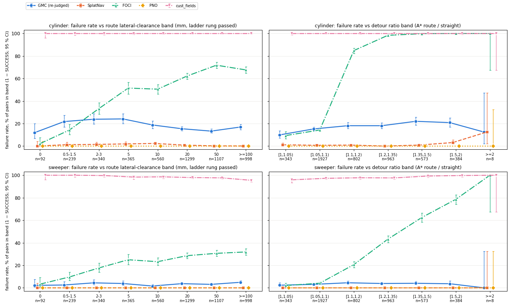
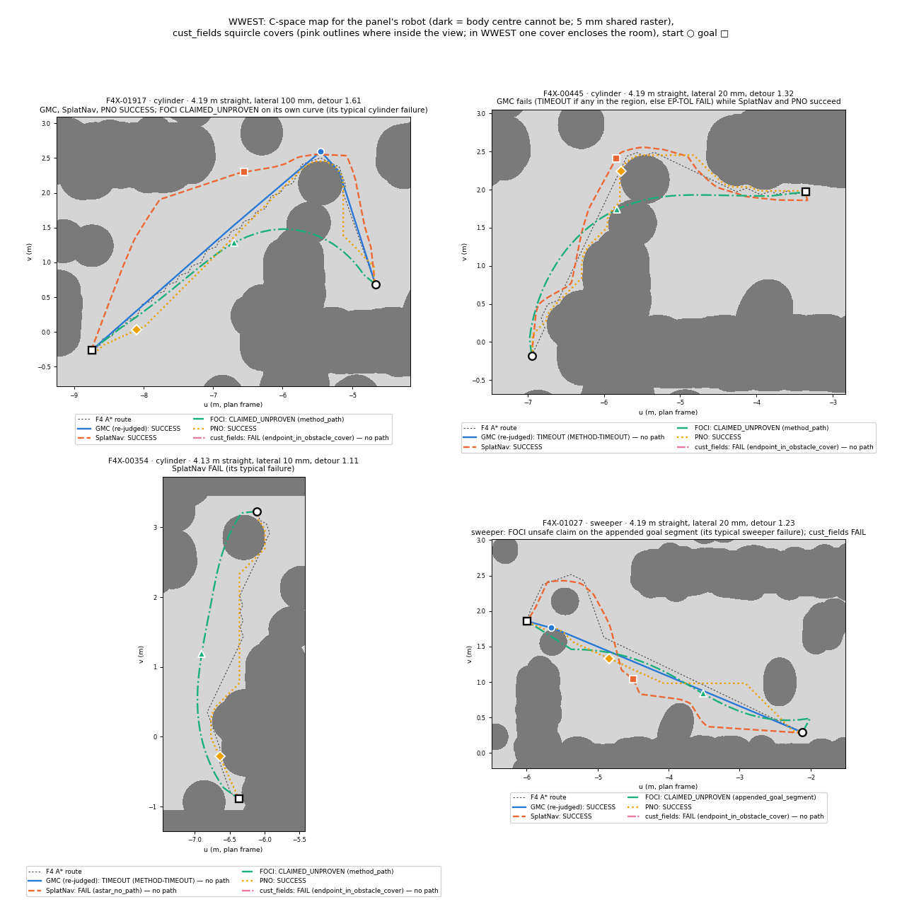
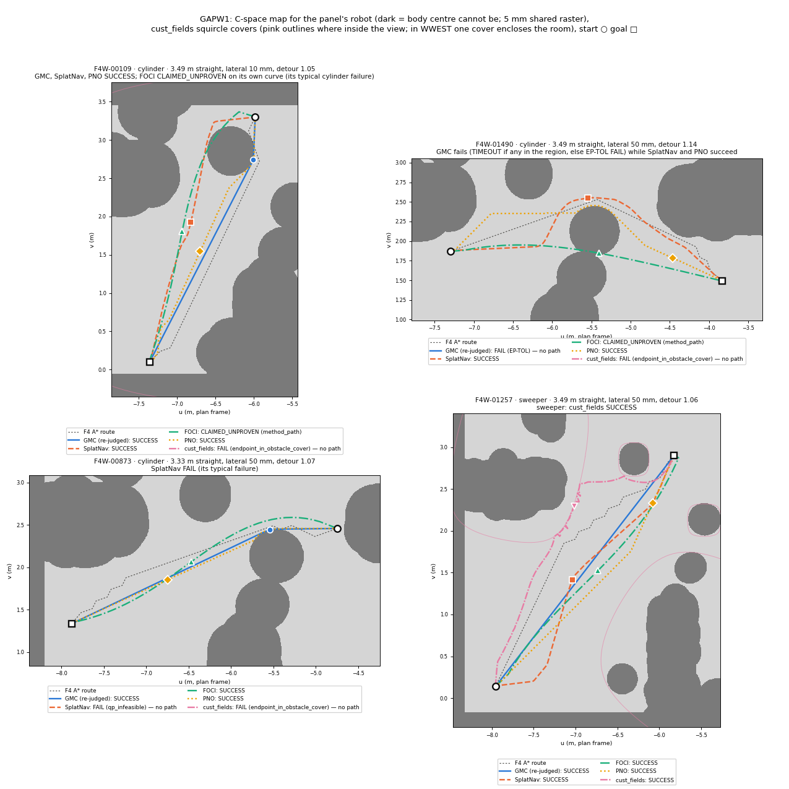
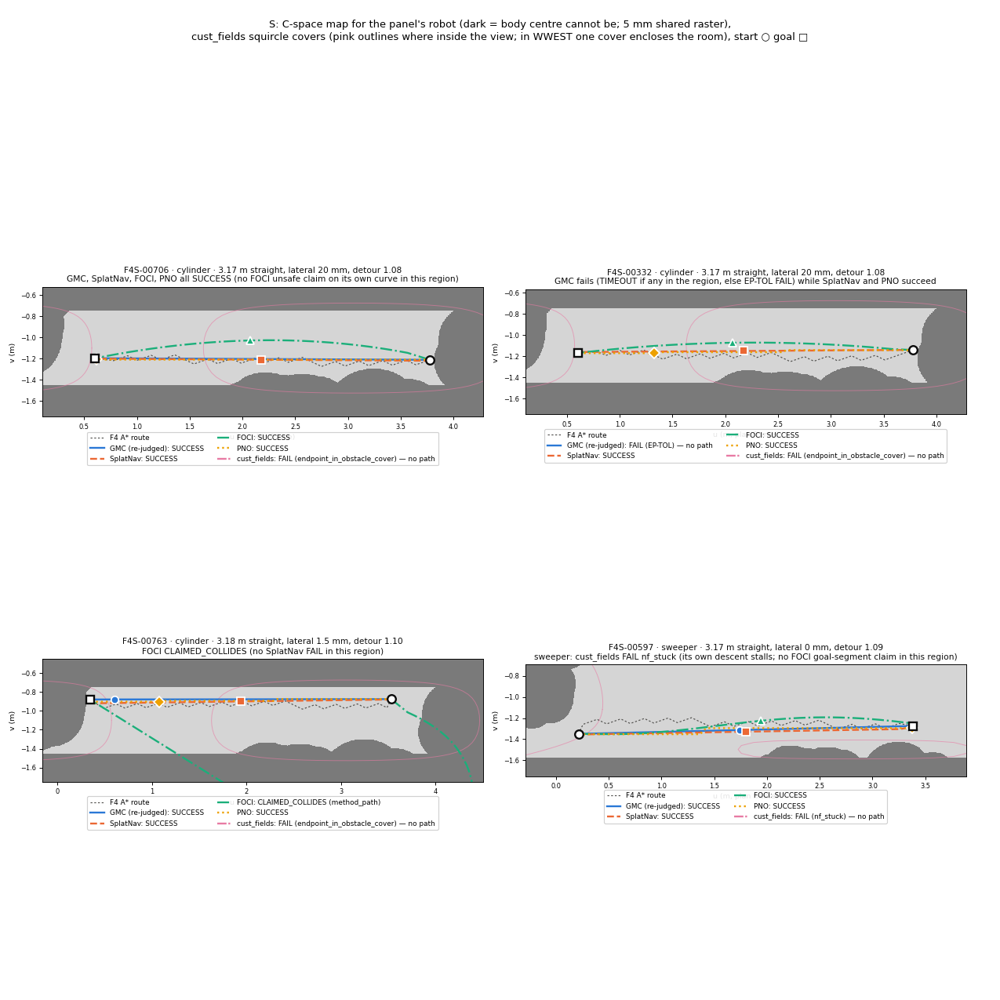
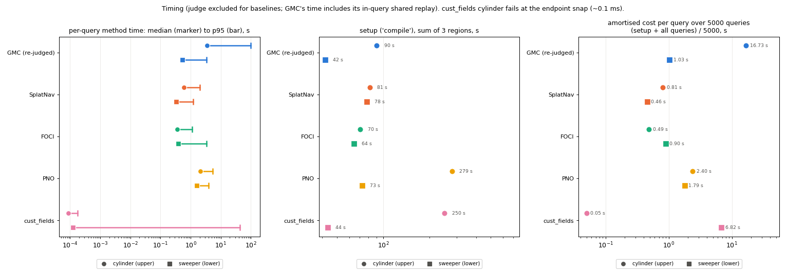

# 四个 baseline 在 F4 5000 对上的对比报告（bl 链 J–B4）：SplatNav、FOCI、PNO、cust_fields vs GMC（重判后）

计划（唯一依据）：[`baselines_f4_plan.md`](baselines_f4_plan.md)。分阶段文档：裁判修复验证
[`baselines_judge_check.md`](baselines_judge_check.md)（J）、环境 [`baselines_envs.md`](baselines_envs.md)（B0）、适配器 / 调参 /
试跑 [`baselines_adapters.md`](baselines_adapters.md)（B1、B2）、全量运行 [`baselines_b3.md`](baselines_b3.md)（B3）。过程记录：
[`worklog/baselines.md`](worklog/baselines.md)。

本报告（B4）的所有数字都由 `gmc/experiments/bl_analyze.py` 从**已提交的行**算出，不重新规划：
- 机器可读汇总：[`gmc/results/baselines/b4/analysis.json`](../gmc/results/baselines/b4/analysis.json)；
- 生成的英文表格：[`b4/tables.md`](../gmc/results/baselines/b4/tables.md)；
- 图：[`gmc/results/baselines/fig/`](../gmc/results/baselines/fig/)（`figures.json` 记录了每张图选了哪些对、按什么规则选）；
- 测量表（每个方法一份）：[`baselines_measurement_splatnav.csv`](baselines_measurement_splatnav.csv)、
  [`_foci.csv`](baselines_measurement_foci.csv)、[`_pno.csv`](baselines_measurement_pno.csv)、
  [`_cust_fields.csv`](baselines_measurement_cust_fields.csv)。

标注：**[E]** = 有证据，证据文件就写在旁边；**[G]** = 推断或未验证。

## 一句话结论

**四个 baseline 全部在 F4 的全部 5000 对、两种机器人上跑完了**：
- 共 40,000 行，没有用子集；
- 起终点与 GMC 完全相同，裁判同一份（d757729）；
- 计时规则相同：每个机器人×区域 setup 一次，每次查询 120 s 外部限时。

**结果对 GMC 不利，要直说**。cylinder 上，按同一个裁判：
- **PNO 5000/5000、SplatNav 4958/5000**，都高于 **GMC 的 4147/5000（82.9 %）**；
- FOCI 2102/5000，并且有 2884 次**不安全的声称**（声称有路，裁判判撞或间隙未证实）；
- cust_fields 0/5000。

sweeper 上：PNO 和 SplatNav 都是 5000，GMC 4823，FOCI 3665（449 次不安全声称），cust_fields 113。
- **GMC 失败的 853 个 cylinder 对，每一个都至少有一个 baseline 解出**。其中 656 个是 GMC 自己的端点容差（不认证离障碍 1–5 mm 的端点）。
- **没有一个对是所有方法都解不出的。**

**这两个 100 % 不全是 baseline 本身的功劳**，要分开说：
- **PNO 的成功来自栅格 A\***。它在我们这张对裁判"可靠"的保守栅格图上运行，A\* 在这张图上是完备的；神经算子只提供启发式，只影响速度（B2 调参：所有候选都 50/50）。
- **SplatNav 的成功依赖我们的 ε 压缩机体覆盖**。用论文式的外接球，cylinder 调参集上只有 2/50。

GMC 在两点上仍然更好，但都不能弥补成功率的差距：
- **路径质量**：与 baseline 共同解出的对上，GMC 的路径更短（长度 / A\* 路线中位数 0.94，SplatNav 1.03，PNO 0.98），顶点更少（5 个，SplatNav 约 700，PNO 约 100）。
- **安全性**：GMC 和 SplatNav、PNO、cust_fields 一样，0 次不安全声称。

## 0. 做了什么，没做什么（如实命名）

- **做了**：
  - J：在规模上验证裁判修复，写出 GMC 的重判行。
  - B0：建 4 个环境，每个仓库跑通自带示例。
  - B1、B2：共享 harness、4 个适配器、一个共享栅格化器；每个方法在调参集上调参（≤ 10 个配置），提交冻结配置后再试跑。
  - B3：4 方法 × 2 机器人 × 5000 对全量运行。
  - B4（本报告）：审计、分析、测量表、图、最终逐项检查。
- **B4 自己新做的两项检查**：
  - 把 GMC 的 8970 条 REACHABLE 路线全部过了一遍 baseline 的裁判路径。
  - 对所有 baseline 行做"同端点、同记录规范"的逐行检查（§8）。
- **没做的**：
  - PNO 没有训练或微调（用户决定：零样本）。
  - cust_fields 的同伦定制（`TOPO/`）没有用：本基准不定义目标同伦类。
  - FOCI 没有用 HSL MA27：没有许可证，用的是 MUMPS。
  - 没有重复运行同一输入：确定性没有验证 [G]。
  - 没有真值最短路：长度比以 F4 的 0.1 m 栅格 A\* 路线为参照。

## 1. 设置与公平性约定（plan §3）

| 项 | 值 |
|---|---|
| 场景 | `scene_v2`（展厅 3DGS + uavlamp 灯/隔断，SHA-256 `2a3a72d6…96cc`），三个区域 WWEST / GAPW1 / S；裁判场景（opacity > 0.3）分别 390,716 / 209,126 / 333,487 个 Gaussian |
| 对 | F4 的 5000 个 confirmed-reachable 对（`gmc/results/aerial3dg/f4/pairs_confirmed_5000.json`）：WWEST 2500、GAPW1 1500、S 1000；每对都已用 cylinder 真实机体（margin 0.001 m）的格点 A\* + `verify_path` 证实可达 |
| 机器人 | cylinder：r 0.30 m，半高 0.865 m；sweeper：r 0.175 m，半高 0.04 m。都是竖直圆柱，离地 0.02 m，`ground_unicycle`（0.3 m/s，1 rad/s） |
| 裁判（唯一成功判据） | `replay_plan(result, GaussianBodyOracle(区域编译的 prepared 场景))`，代码 = d757729（`gmc/src` 自那以后 0 行改动 [E]，`analysis.json` → `audit`）。几何：`verify_path`，即 F4 证实 A\* 路线用的同一个检查；另有运动学检查和到达目标匹配 |
| 同输入 | Gaussian 原生方法（SplatNav、FOCI）读裁判场景的 Gaussian。地图方法（PNO、cust_fields）读**同一个**栅格化器 `bl_raster.py` 生成的 C-space 图（5 mm），逐字节相同 |
| 同机体 | 各用原生机体模型；表示不了竖直圆柱的，用最小保守覆盖（§7 表） |
| 同端点、同导出 | 起终点 = 对的 `start_uv/goal_uv`（z = z_c），逐行核对 [E]（§8）。方法输出经 **GMC 自己的导出器**（`api._gs3d_result` + 0.20 m 加密）转成 gs3d 结果后判。方法停在终点前的，补一段直线到终点；起点不在对的起点的，同样补一段。补段**同样受裁判检查**，并逐行记录 |
| 同计时 | 每个机器人×区域 setup（"编译"）一次，持久化并记 SHA-256，每行带 `setup_id`，每任务有 setup-once 证明。每次查询 120 s 外部限时（父进程 `select` + `killpg`）。裁判时间单独记为 `judge_wall_s`，**不计入方法** |
| 不在 5000 对上调参 | 只在调参集（F3 pilot 对，50 对，与 5000 对不相交）上调，规则事先登记（`configs/baselines/tuning/RULE.md`）。冻结配置在 B3 第一个作业之前就已提交：SplatNav/FOCI 0f0e049，PNO 3a841e9，cust_fields 981f5b6；B3 第一个作业 05:41 EDT 才开始；此后配置文件 0 改动 [E]（`audit.config_freeze`） |

**GMC 列的取法**：用 J 的重判行（`gmc/results/baselines/gmc_rejudged/`），状态映射如下：
- REACHABLE → SUCCESS；
- UNKNOWN（`start/goal_not_certified_free`）→ FAIL；
- TIMEOUT → TIMEOUT；
- ERROR → ERROR。

GMC 的查询里本来就含共享重放（同一个裁判）。所以 GMC 的声称一旦没过裁判，就不会成为 REACHABLE，它的 CLAIMED_* 结构上为 0。代价是 GMC 的时间里含这次重放：中位数 0.034 s（cylinder）、0.023 s（sweeper）[E]。

**硬件不对等（如实说明）**：
- GMC：CPU 单核（F4 的 cpu_short 节点）。
- SplatNav、FOCI、PNO：L40S GPU，一卡 4 个 harness 流（B3 的布局），时间是在这种争用下测的。
- cust_fields：CPU 单核。

所以时间比较只能看量级。

## 2. 裁判修复，以及 GMC 修复前后（J；plan §2）

用户要求先修裁判："它和 A\* 用的标准不同，或者有问题，导致 GMC 或 A\* 本来通过了它还报问题"。修复在 d757729，有两处：
- **REPLAY-AABB**：覆盖检查原来问的是"扫掠体的世界 AABB 是否落在旋转后的路线棱柱里"。在 53–64° 的坐标系下，这个 AABB 比机体大约 0.34 r。A\* 恰好是用这同一个测试搜索出来的，所以从不触发；但按真实机体规划的 GMC（以及任何 baseline）会被它否决。修复后改为两端圆柱在路线坐标系里的精确检查。
- **REPLAY-RATE**：转弯被导出器精确卡在限速上，浮点舍入让它读成超速约 1e-9。修复后对时间放宽 1 ulp、对位姿放宽 2 ulp。

两处修复都**只放松**判定，碰撞检查本身没动。J 在规模上验证了这一点 [E]（`baselines_judge_check.md`，`j/judge_check.json`）：
- 5000/5000 条 A\* 路线仍然通过。
- 538 行被否决的 GMC 结果重新查询后，537 行 REACHABLE；剩下 1 行是 120 s 超时，属于节点速度问题。
- 369 行分层抽样的 REACHABLE 结果，polyline SHA 不变。
- 199,970 条直线边用新旧代码各判一遍：**0 条从 occupied 变成 free**，变化的只有 `map_unknown`。

| GMC | 修复前（F4） | 重判后（J） | 变化 |
|---|---|---|---|
| cylinder REACHABLE | 3614（失败率 27.7 %） | **4147（17.1 %）** | EXPORT-DOMAIN 524 → 523 REACHABLE + 1 TIMEOUT；EXPORT-KIN 10 → REACHABLE |
| sweeper REACHABLE | 4819（3.6 %） | **4823（3.5 %）** | EXPORT-KIN 4 → REACHABLE |

**B4 补充审计**：J 只重查了被否决的行。其余 REACHABLE 行沿用 F4 的判定，理由是"修复只放松"。为了不只靠这个论证，B4 把 GMC 全部 8970 条 REACHABLE 路线（cylinder 4147 + sweeper 4823，存储的 0.1 mm 舍入路线）逐条送进和 baseline 完全相同的裁判路径（`bl_harness.judge_row`：补段 → GMC 导出器 → `replay_plan`，F3 编译 SHA 已校验）。
- 结果：**8970/8970 SUCCESS，0 次舍入失败** [E]（作业 19529261，`gmc/results/baselines/b4/gmc_judge/*.summary.json`）。
- 因此"所有方法（含 GMC 列）由同一份 d757729 裁判判定"这一点，现在有逐行证据。

**GMC 侧的一个已知保守性（J gate (a)，用户选了方案 1）**：
- 修复让裁判变精确了，但 GMC 的规划域 `domain_from_scene` 仍按旧的世界 AABB 规则内缩。
- 于是沿旋转盒面有一条宽 r(|cos θ|+|sin θ|−1) 的带（cylinder 在 64° 时约 0.10 m）：裁判允许走，GMC 不会走。
- 这是 GMC 的保守，不是裁判的问题。它不会让 GMC 丢掉 F4 的任何一对：每对的 A\* 路线都是在旧规则下找到的，即都在 GMC 的域里 [E]（J §8、§10）。
- 它可能让 GMC 的路线贴不到那条带上 [G]。

## 3. 主结果（plan §7.2）

### 3.1 每种机器人的总表（计数；SUCCESS 率带 95 % Wilson 区间）[E]（`analysis.json` → `headline`）

**cylinder**（5000 对）

| 方法 | SUCCESS | CLAIMED_COLLIDES | CLAIMED_UNPROVEN | CLAIMED_KINEMATICS | FAIL | TIMEOUT | ERROR | SETUP_FAIL | SUCCESS 率 | 不安全声称率 |
|---|---|---|---|---|---|---|---|---|---|---|
| GMC（重判） | 4147 | 0 | 0 | 0 | 657 | 195 | 1 | 0 | **82.9 %**（81.9–84.0） | 0.0 % |
| SplatNav | 4958 | 0 | 0 | 0 | 42 | 0 | 0 | 0 | **99.2 %**（98.9–99.4） | 0.0 % |
| FOCI | 2102 | 224 | 2660 | 0 | 14 | 0 | 0 | 0 | **42.0 %**（40.7–43.4） | **57.7 %**（56.3–59.0） |
| PNO | 5000 | 0 | 0 | 0 | 0 | 0 | 0 | 0 | **100.0 %**（99.9–100） | 0.0 % |
| cust_fields | 0 | 0 | 0 | 0 | 5000 | 0 | 0 | 0 | **0.0 %**（0.0–0.1） | 0.0 % |

**sweeper**（同 5000 对）

| 方法 | SUCCESS | CLAIMED_COLLIDES | CLAIMED_UNPROVEN | CLAIMED_KINEMATICS | FAIL | TIMEOUT | ERROR | SETUP_FAIL | SUCCESS 率 | 不安全声称率 |
|---|---|---|---|---|---|---|---|---|---|---|
| GMC（重判） | 4823 | 0 | 0 | 0 | 177 | 0 | 0 | 0 | **96.5 %**（95.9–96.9） | 0.0 % |
| SplatNav | 5000 | 0 | 0 | 0 | 0 | 0 | 0 | 0 | **100.0 %**（99.9–100） | 0.0 % |
| FOCI | 3665 | 239 | 210 | 0 | 886 | 0 | 0 | 0 | **73.3 %**（72.1–74.5） | **9.0 %**（8.2–9.8） |
| PNO | 5000 | 0 | 0 | 0 | 0 | 0 | 0 | 0 | **100.0 %**（99.9–100） | 0.0 % |
| cust_fields | 113 | 0 | 0 | 0 | 4887 | 0 | 0 | 0 | **2.3 %**（1.9–2.7） | 0.0 % |

- CLAIMED_* 单独列出，是方法的**不安全 / 不可靠**率，没有并入 FAIL（plan §5）。
- FOCI 在 cylinder 上的声称里，57.8 % 没过裁判（4986 次声称中 2884 次）；在 sweeper 上是 10.9 %（4114 次中 449 次）。
- 没有任何方法出现 ERROR 或 SETUP_FAIL。GMC 有 1 个 ERROR：F4 已知的 simplify 除零。
- 除 GMC 的 195 个以外，没有 TIMEOUT。

### 3.2 分区域（SUCCESS / n，括号内为 95 % CI；"不安全"为 CLAIMED_* 计数）[E]（`per_region`）

| 方法 · 机器人 | WWEST（2500） | GAPW1（1500） | S（1000） |
|---|---|---|---|
| GMC · cylinder | 2098（83.9 %，82.4–85.3） | 1237（82.5 %，80.5–84.3） | 812（81.2 %，78.7–83.5） |
| SplatNav · cylinder | 2459（98.4 %） | 1499（99.9 %） | 1000（100 %） |
| FOCI · cylinder | 681（27.2 %），不安全 1812 | 423（28.2 %），不安全 1071 | 998（99.8 %），不安全 1 |
| PNO · cylinder | 2500 | 1500 | 1000 |
| cust_fields · cylinder | 0 | 0 | 0 |
| GMC · sweeper | 2442（97.7 %） | 1413（94.2 %） | 968（96.8 %） |
| SplatNav · sweeper | 2500 | 1500 | 1000 |
| FOCI · sweeper | 1670（66.8 %），不安全 276 | 1030（68.7 %），不安全 162 | 965（96.5 %），不安全 11 |
| PNO · sweeper | 2500 | 1500 | 1000 |
| cust_fields · sweeper | 0 | 113（7.5 %） | 0 |

S 是窄长走廊，路线几乎都是直的（见 §4.1 的绕行比分档），FOCI 在那里几乎全对。GMC 在三个区域的失败率接近，cylinder 都在 16–19 % 之间。

### 3.3 失败率 vs F4 的横向间隙档与绕行比档（与 `aerial3dg_failures_f4.md` 同一套分档）[E]（`bands`；图 `fig/bands.png`，已看）

cylinder，失败率 = 1 − SUCCESS：

| 横向间隙档（mm，路线通过的梯级） | 0（92） | 0.5–1.5（239） | 2–3（340） | 5（365） | 10（560） | 20（1299） | 50（1107） | ≥100（998） |
|---|---|---|---|---|---|---|---|---|
| GMC | 12.0 % | 21.8 % | 23.8 % | 24.1 % | 18.8 % | 15.4 % | 13.3 % | 16.9 % |
| SplatNav | 0.0 % | 1.3 % | 1.5 % | 1.9 % | 2.3 % | 0.8 % | 0.2 % | 0.1 % |
| FOCI | 2.2 % | 14.2 % | 33.2 % | 51.5 % | 50.5 % | 62.2 % | 71.8 % | 67.6 % |
| PNO / cust_fields | 0 % / 100 % | 0 / 100 | 0 / 100 | 0 / 100 | 0 / 100 | 0 / 100 | 0 / 100 | 0 / 100 |

| 绕行比档（A\* 路线 / 直线） | [1, 1.05)（343） | [1.05, 1.1)（1927） | [1.1, 1.2)（802） | [1.2, 1.35)（963） | [1.35, 1.5)（573） | [1.5, 2)（384） | ≥2（8） |
|---|---|---|---|---|---|---|---|
| GMC | 9.9 % | 15.2 % | 18.1 % | 18.1 % | 22.0 % | 20.8 % | 12.5 % |
| SplatNav | 1.2 % | 0.7 % | 0.9 % | 0.0 % | 0.9 % | 3.1 % | 12.5 % |
| FOCI | 9.3 % | 14.3 % | **84.8 %** | **98.3 %** | 99.8 % | 100 % | 100 % |

sweeper 上：GMC 各横向档 1.6–4.9 %；FOCI 在绕行比档上从 2 % 升到 79–100 %；PNO、SplatNav 各档都是 0 %。

怎么读：
- **FOCI 的失败由绕行比决定** [E]：直线附近（< 1.1）9–14 %，需要绕行（≥ 1.1）时 85–100 %。
  - 它在横向间隙上的"反向"趋势（间隙越大失败越多）是区域混杂造成的 [E]：低间隙档几乎全是 S 的对（"0" 档 92 对中 87 对来自 S），而 S 恰好是 FOCI 能解的直走廊。
  - 原因推断 [G]：软碰撞代价加上基于均值体素的 A\* 初值，在需要明显绕行的地方会把曲线拉成贴着 Gaussian 擦过去。
- **GMC 的失败与横向间隙关系不大**：12–24 %，在 0.5–5 mm 档最高。它主要是端点容差（§4.1），不是走廊太窄。
- **SplatNav 只在 cylinder 上有一点失败**：各横向档 ≤ 2.3 %，不随间隙单调变化；绕行比档 ≤ 3.1 %，只有 ≥ 2 档是 1/8。

## 4. 每个方法在哪里失败（plan §7.2、§7.6）

### 4.1 失败原因与位置 [E]（`where_breaks`、`completion`、`overlap`）

- **GMC**
  - cylinder：
    - 端点容差 EP-TOL 656 个（`start/goal_not_certified_free` 331 + 325）：GMC 不认证离障碍 1–5 mm 的端点，这是设计如此。
    - 后处理超时 195 个（`shortcut`/`tighten` 用完 120 s，即 F5 的 POST-TIMEOUT）。
    - simplify 除零 1 个，EP-GENUINE 1 个。
  - sweeper：EP-TOL 176 个，EP-GENUINE 1 个。
  - **谁解出了 GMC 的失败对**（cylinder）：
    - EP-TOL 656：SplatNav 656/656，PNO 656/656，FOCI 302。所以这些端点裁判可以接受，问题在 GMC 的端点认证太保守，不在几何。
    - TIMEOUT 195：PNO 195，SplatNav 173，FOCI 15。
  - sweeper 的 EP-TOL 176：SplatNav、PNO 都是 176/176。
  - **"GMC 失败但有 baseline 解出"**：cylinder 853，sweeper 177。**"只有 GMC 解出"**：两种机器人都是 0。
- **SplatNav**
  - cylinder FAIL 42 = `astar_no_path` 39（全在 WWEST）+ `qp_infeasible` 3。0 次不安全声称。
  - 每个声称都补了起终段：它的 A\* 起终于体素中心，起终段长度中位数 8.9 mm，p95 8.9 cm。这些补段**全部**通过裁判。
- **FOCI**
  - cylinder 不安全声称 2884 次：在它**自己的曲线上** 2754 次（其中 `geometry_or_margin_unproven` 2608，即间隙 < 1 mm 的擦碰），在补的起点段上 103 次，终点段上 27 次。FAIL 只有 14 个（IPOPT 迭代上限）。
  - sweeper：FAIL 886（IPOPT 迭代上限 885，另 1 个求解步骤错误）。不安全声称 449 次，其中 **349 次落在 §3.3 规定补的终点段上**：FOCI 的软终点会停在终点前（终点缺口中位数 0.12 m，p95 1.85 m），补的直线段被判撞。另有 98 次在它自己的曲线上。
- **PNO**：没有失败。
- **cust_fields**
  - cylinder：5000/5000 `endpoint_in_obstacle_cover`，端点被覆盖吞没。
  - sweeper：被吞没 3005；`nf_stuck` 1011（导航函数下降停滞）；`nf_max_steps` 871；成功 113，全在 GAPW1。

**哪些失败归因于我们的适配，哪些是方法本身**（plan §7.6）：
- **我们的适配造成的**：
  - cust_fields 的端点吞没（cylinder 5000 + sweeper 3005）。由不相交 squircle 组成的星形世界表示不了这些地图（B2 世界检查：凸覆盖把 WWEST 和 GAPW1 cylinder 合成一个障碍）。
  - SplatNav 如果用论文式外接球会大量失败（调参集 cylinder 2/50）。我们用的是 ε 压缩覆盖，这本身就是一项适配。
  - PNO 的栅格 / 重采样保守性：它仍然全解了。
- **方法本身造成的**：
  - FOCI 的擦碰和 IPOPT 迭代上限；
  - cust_fields 的导航函数下降停滞或走满步数（B2 对照：同一循环在满足全部假设的合成世界上也只解出 15/30）；
  - SplatNav 在 WWEST 的 39 个 A\* 无路。B1 推断这与 2 cm 体素图和覆盖保守性有关 [G]。
- **介于两者之间的**：FOCI 的 349 次 sweeper 终点段不安全声称。软终点是方法的特性，但补直线段是我们公平性约定 §3.3 的规定。如果换一种补法（例如让 FOCI 带硬终点约束重解），结果可能不同 [G]。

### 4.2 每区域的代表对（规则选取，不手挑；`fig/figures.json`）[E]（三张图都已看）

每张图 4 个面板。背景是该面板机器人的 5 mm 共享 C-space 图（深色 = 机体中心不能到的地方），灰色虚线是 F4 的 A\* 路线，每种方法一种颜色加一种线型；没有路径的方法在图例里写明状态。选对规则（`bl_analyze.pick_pairs`；同一条件下取直线距离最接近区域中位数的对）：
1. GMC、SplatNav、PNO 成功，FOCI 在自己的曲线上 CLAIMED_UNPROVEN；
2. GMC 失败（区域内有 TIMEOUT 就选 TIMEOUT，否则选 EP-TOL），而 SplatNav、PNO 成功；
3. SplatNav FAIL（区域内没有就选 FOCI COLLIDES）；
4. sweeper：cust_fields 成功（没有就选 FOCI 在终点段上的不安全声称，再没有就选 cust_fields `nf_stuck`）。

- **WWEST**：
  - F4X-01917：FOCI 的曲线直接切过两个障碍团之间，被判间隙未证实；PNO 和 SplatNav 绕开，GMC 走一条直线段。
  - F4X-00445：GMC 超时，PNO 和 SplatNav 沿 A\* 的走廊过去了。
  - F4X-00354：GMC 超时，SplatNav `astar_no_path`，PNO 解出。
  - F4X-01027：sweeper 上 FOCI 停在终点前，补的终点段被判未证实。
  - cust_fields 在 WWEST 的唯一一个凸覆盖包住了整个房间，所以图里看不到它的轮廓。

- **GAPW1**：
  - F4W-01490：GMC 的 EP-TOL 对上 SplatNav 和 PNO 都成功；FOCI 切过一个障碍团的边缘。
  - F4W-00873：SplatNav `qp_infeasible`，其余三个方法成功。
  - F4W-01257（sweeper）：五个方法全部成功，粉色轮廓是 cust_fields 的 squircle 覆盖，它的路径沿导航函数梯度弯行。

- **S**（窄长走廊）：
  - 在 S 里 FOCI 没有在自己曲线上的 UNPROVEN，所以面板 1 按后备规则选了"四个方法都成功"的对。
  - F4S-00332：GMC 的 EP-TOL，其他方法都成功。
  - F4S-00763：FOCI 唯一的 COLLIDES，曲线冲出了区域盒。
  - F4S-00597（sweeper）：cust_fields `nf_stuck`。

## 5. 计时（plan §7.3）[E]（`timing`；图 `fig/timing.png`，已看，数值与 JSON 一致）

**setup（"编译"）的定义**：
- GMC：F3 编译墙钟（`f4_handoff.json`，F4/J 都复用这次编译）。
- baseline 是以下四项之和：
  - 场景导出（从裁判编译里取出 Gaussian，共享）；
  - 方法自己的持久化 setup；
  - 共享栅格构建（仅 PNO、cust_fields）；
  - 一次实例化：从 setup 产物建出可用的规划器，例如 SplatNav 的体素网格、FOCI 的 CasADi NLP、PNO 的权重加 χ。取各任务 worker 启动的中位数，是在 4 流争用下测的。

**单次查询**：方法自己的 `algorithm_wall_s`。GMC 的时间里含它查询内的共享重放；baseline 不含裁判。**摊销** = (三个区域 setup 之和 + 全部 5000 次查询之和) / 5000。

| 方法 · 机器人 | setup WWEST / GAPW1 / S（s） | 单次查询中位数 / p95 / 最大（s） | 裁判中位数（s，不计入） | 摊销每查询（s；setup 占比） |
|---|---|---|---|---|
| GMC · cylinder | 61.2 / 23.9 / 5.0 | 3.51 / 97.7 / 120（195 个 TIMEOUT 计 120 s） | （查询内重放 0.034） | 16.73（0.1 %） |
| SplatNav · cylinder | 42.1 / 21.1 / 18.2 | 0.60 / 2.00 / 3.7 | 0.99 | 0.81（2.0 %） |
| FOCI · cylinder | 29.9 / 24.8 / 15.8 | 0.36 / 1.14 / 4.8 | 0.04 | 0.49（2.9 %） |
| PNO · cylinder | 157.2 / 99.9 / 21.8（其中栅格 138 / 84 / 15） | 2.13 / 5.50 / 7.9 | 0.26 | 2.40（2.3 %） |
| cust_fields · cylinder | 145.6 / 86.7 / 17.5（其中栅格同上） | 0.0001（在端点吸附就失败） | — | 0.05（99.8 %，无意义：全部快速失败） |
| GMC · sweeper | 24.1 / 11.0 / 6.7 | 0.53 / 3.44 / 22.9 | （0.023） | 1.03（0.8 %） |
| SplatNav · sweeper | 38.7 / 19.9 / 19.2 | 0.33 / 1.20 / 3.0 | 0.68 | 0.46（3.4 %） |
| FOCI · sweeper | 25.2 / 24.4 / 14.7 | 0.39 / 3.41 / 4.6 | 0.04 | 0.90（1.4 %） |
| PNO · sweeper | 34.3 / 26.4 / 12.2 | 1.57 / 3.95 / 8.1 | 0.11 | 1.79（0.8 %） |
| cust_fields · sweeper | 21.5 / 14.6 / 7.5 | 0.0002 / 43.9 / 72.1 | 0.15 | 6.82（0.1 %） |

**阶段分解**（占该方法全部查询时间的份额）[E]：
- **GMC cylinder**：`tighten` 39 %，`shortcut` 28 %，`merge_corners` 2.5 %，`graph_search` 0.5 %，共享重放 1.0 %。其余约 28 % 是 195 个超时行，它们没有阶段记录。
- **GMC sweeper**：`tighten` 59 %，`shortcut` 23 %，`graph_search` 9 %。
- **SplatNav**（cylinder）：多面体走廊 42 %，碰撞集 36 %，Bézier QP 15 %，A\* 0.6 %。
- **FOCI**：一个阶段，`plan_s` = IPOPT（含它自己的 A\* 初值），100 %；IPOPT 迭代中位数 53（cylinder）/ 78（sweeper），sweeper p95 500（迭代上限）。
- **PNO**：网格 A\* 94 %，值函数推理（GPU）2.5 %（中位数 0.054 s），启发式 1.6 %；A\* 扩展节点中位数 58,708（cylinder）。**PNO 的时间几乎全花在 Python 网格 A\* 上**，神经算子只占约 3 %。
- **cust_fields**（sweeper）：导航函数下降 100 %，步数中位数 1312。

时间的注意事项：
- **硬件不对等**（§1）：GPU 方法是一卡 4 流，GMC 是 CPU 单核。所以 cylinder 中位数上 SplatNav/FOCI 比 GMC 快 6–10 倍（0.60 / 0.36 s 对 3.51 s）、PNO 快约 1.6 倍（2.13 s）[E]，这些倍数只能看量级。如果 GMC 也给同样的硬件，差距会是多少，没有测 [G]。
- **GMC cylinder 的 p95 和均值主要被后处理拖长**（F5 的 POST-TIMEOUT 机制）。不含共享重放时，中位数是 3.40 s。
- **J 重查的 534 行 cylinder 来自 J 的节点**，比 F4 的节点慢约 11 %。只看 F4 来源的 4466 行：中位数 4.84 s，p95 105.7 s；全 5000 行：3.51 / 97.7。F4 来源的统计更高，是因为 194 个 120 s 超时都在 F4 来源里，而重查的 534 行里有 533 行 REACHABLE。
- **GMC 的摊销 setup 占比最低**（0.1–0.8 %），PNO 和 cust_fields 的 setup 被共享栅格的构建主导（cylinder 在 WWEST 要 138 s）。

## 6. 路径质量（只比较 GMC 和该 baseline 都成功的对；plan §7.4）[E]（`quality`）

| baseline · 机器人 | 共同成功对 | 长度 / A\* 路线：baseline vs GMC（中位数） | 顶点：baseline vs GMC | 累计转角（rad）：baseline vs GMC | baseline 比 GMC 短的比例 |
|---|---|---|---|---|---|
| SplatNav · cylinder | 4127 | 1.031 vs **0.942** | 705 vs 5 | 6.40 vs 0.93 | 0.1 % |
| FOCI · cylinder | 1785 | 0.945 vs **0.931** | 42 vs 3 | 1.78 vs 0.00 | 0.3 % |
| PNO · cylinder | 4147 | 0.982 vs **0.942** | 102 vs 5 | 79.8 vs 0.93 | 2.1 % |
| SplatNav · sweeper | 4823 | 1.019 vs **0.897** | 714 vs 4 | 6.30 vs 0.25 | 0.1 % |
| FOCI · sweeper | 3542 | 0.942 vs **0.925** | 42 vs 3 | 2.02 vs 0.04 | 0.5 % |
| PNO · sweeper | 4823 | 0.931 vs **0.897** | 73 vs 4 | 57.9 vs 0.25 | 14.6 % |
| cust_fields · sweeper | 113 | 1.221 vs **0.927** | 121 vs 3 | 81.0 vs 0.05 | 0 % |

- **GMC 的路线最短**：中位数比 F4 的 0.1 m 栅格 A\* 路线短 6–10 %。除 PNO · sweeper 外，GMC 在 ≥ 97.9 % 的共同对上不比 baseline 长；PNO 在 sweeper 上有 14.6 % 的共同对比 GMC 短。**顶点最少**：3–5 个直线段，原地转。
- **SplatNav** 是稠密 Bézier（约 700 个导出顶点），比 A\* 路线长约 2–3 %。
- **PNO** 是 8 邻接网格路径（合并共线点后约 100 个顶点），累计转角大，是阶梯形。
- **FOCI** 的曲线（成功时）很短，但它只在近乎直线的对上成功（§3.3）。
- **裁判间隙下界**都贴着 1 mm margin：cylinder 中位数 SplatNav 1.16 mm、PNO 1.02 mm、GMC 1.10 mm。
- **不同表示之间的转角 / 顶点数不可直接比较**（稠密曲线 vs 阶梯 vs 折线），这里只作描述。
- **没有真值最短路** [G]。

## 7. 适配与偏差（一张表；plan §7.5）

| # | 方法 | 适配 / 偏差 | 障碍契约 | 对结果的影响 | 证据 |
|---|---|---|---|---|---|
| 1 | SplatNav | **机体覆盖**：Splat-Plan 只有球形机体。我们在 z 方向线性压缩（ε = 0.05）后用球覆盖；映回实空间是侧向 1.07 × r（cylinder）/ 1.09 × r（sweeper）、竖直很高的椭球。论文式外接球半径是 0.917 m（3.05 × r） | — | 关键：外接球在 cylinder 调参集只有 2/50，ε 覆盖有 49/50。**SplatNav 的 99.2 % 依赖这项适配** | adapters §2.2、§4（S0 vs S1/S6）[E] |
| 2 | SplatNav | 障碍取 2σ 椭球：`scales = 2√eig(Σ)`，与裁判一致 | **匹配** | 原生 1σ（S7）在调参集上 cylinder 有 12/50 不安全声称 | adapters §2.3、§4 [E] |
| 3 | SplatNav | 在压缩后的薄层里做 3D 规划，再投影到 z_c（实际 \|dz\| ≤ 0.77 m，在覆盖考虑的 Δ 之内）；绕开 nerfstudio 直接喂 Gaussian；QP 不可行时的调试转储改成空操作；每个查询固定随机种子；起终于 A\* 体素中心，由 harness 补段 | — | 补段 4958/4958（cylinder），全部通过裁判 | adapters §2.4，`completion` [E] |
| 4 | FOCI | **IPOPT 线性求解器 MA27 → MUMPS**（没有许可证；补丁 `gmc/baselines/patches/foci_mumps.patch` 打在副本 `foci_bl` 上，原始 clone 不动） | — | 与论文的迭代可能不同；MA27 在这里测不了 [G] | envs §4 [E] |
| 5 | FOCI | 机体 = 3 个机体点 × Gaussian `robot_cov`（包围圆柱的最小体积椭球；冻结配置 cov_scale 0.5）；子类化把 z 带限制在 z_c ± 1 cm（仓库原来的 (0, 1) 带让机体离平面 ±0.5 m）；用它自己的 A\* 初值，从不用我们的路线 | **不匹配**（软重叠代价，没有阈值 / 水平集 / margin） | 2754 次不安全声称在它自己的曲线上，主要是 < 1 mm 的擦碰 | adapters §3 [E] |
| 6 | FOCI | **软终点 + 补终点段**（§3.3）：FOCI 停在终点前，harness 补直线并判 | — | sweeper 449 次不安全声称里 349 次在补段上（§4.1） | `where_breaks` [E] |
| 7 | PNO | **零样本**：发布的 City 训练 `DEEPNORM2dMultiGoal`（PNOwPINN 权重）+ FNOSDF。规划 notebook 用的 `PNO2D` 权重没有公开。路径提取用论文自己的"PNO 启发式 + 网格 A\*"。不训练、不微调 | 通过共享栅格化器**匹配** | 100 % 来自 A\* 在可靠地图上的完备性，PNO 只影响速度（调参所有候选 50/50） | adapters §10 [E] |
| 8 | PNO | 栅格最大池化到 S = 1024（分辨率损失 ×1.7 / ×1.1 / ×1.9）；S = 4096 在 44 GB L40S 上放不下（OOM）；端点吸附到最近的空闲格，再补 mm 级段 | — | 没有一条通道被关闭；补段全部通过 | adapters §10.4–10.5 [E] |
| 9 | cust_fields | **只用 plain NF**（`NF/`，同 `test_nf.py`）。同伦定制 `TOPO/` 需要逐对指定目标同伦类，本基准没有定义 | 通过共享栅格**匹配**（撤销仓库隐藏的 +0.1 m 外扩） | — | adapters §11.1 [E] |
| 10 | cust_fields | **星形世界构造**：冻结配置 C0 = 每片一个凸 squircle，重叠就合并（规则的平局决胜：cylinder 所有候选都是 0/50，选最快失败的那个）；墙的覆盖穿过工作空间边界（仓库对贴边障碍的处理会崩溃：`compute_virtual_ws` TypeError），违反 forest-world 假设 | — | **cylinder 5000/5000、sweeper 3005 个端点被吞没，这是我们的适配造成的**；更紧的链式构造保住了端点，但导航函数下降仍然失败（方法本身） | adapters §11.2–11.4 [E] |
| 11 | 共享栅格 | C-space 图对裁判可靠（0/117,960 个采样不安全），保守 0.16–2.5 %；5 mm 时会关掉 cylinder A\* 路线本身的走廊（WWEST/GAPW1 34–39 % 的路线穿过占用格），但所有对的端点仍连通 | — | PNO 仍然全解，说明没有关闭可行性 | adapters §9.2 [E] |
| 12 | 全部 | **补起终段**：方法输出不在对的起终点时补直线段，并受裁判检查（起点补段是我们在 §3.3 之外加的） | — | SplatNav、FOCI、PNO 几乎每行都补；补段失败只出现在 FOCI | `completion` [E] |
| 13 | 全部 | **子集：无**，全部 5000 对 × 2 机器人 | — | — | `collect.json`、B3 plan [E] |
| 14 | 全部 | 计时布局：GPU 方法一卡 4 流，实例化在争用下计时 | — | 时间只能看量级 | B3 §4 [E] |
| 15 | GMC | 域内缩带（J gate (a)，GMC 侧的保守）；端点容差 EP-TOL 是设计如此；查询时间含共享重放 | — | 656 + 176 个 EP-TOL 失败，都被 SplatNav/PNO 解出 | J §8/§10，`overlap` [E] |

## 8. 审计（B4 任务 1）[E]

| 检查 | 结果 | 证据 |
|---|---|---|
| 行完整、与 `collect.json` 一致 | 5 方法 × 2 机器人 × 3 区域 = 30 格：行数等于该区域对数，0 缺、0 重、0 外来。每格 baseline 的状态计数与 `collect.json` 逐项相等。每格 1 个 setup id，且与 collect 相同。GMC 每格 1 个 compile id | `analysis.json` → `audit.cells`，`rows_ok: true` |
| 冻结配置在 B3 首跑之前提交 | SplatNav/FOCI 0f0e049（10-09 21:30 EDT）、PNO 3a841e9（10-10 02:05）、cust_fields 981f5b6（03:45），B3 首个作业 05:41 EDT 才开始；之后 0 改动 | `audit.config_freeze`、`sacct` |
| setup 只做一次 | 每任务 `setup_builds_in_this_task = 0`，0 次重启，每次 worker 启动用同一个产物 SHA，所有行同一 `setup_id` | `collect.json`（B3）+ B4 复核 `setup_once_collect` |
| 所有方法（含 GMC 列）由 d757729 裁判判定 | `gmc/src` 从 d757729 到 HEAD 0 行改动。harness、适配器、栅格化器、配置自 8c5f2ef（B3 计划提交）以来 0 改动。**GMC 全部 8970 条 REACHABLE 路线过 baseline 的裁判路径 8970/8970 通过** | `audit`；`b4/gmc_judge/` |
| 同端点、同记录规范 | 每一行 baseline 的 `start_uv/goal_uv` 与 F4 对逐字相等。§5 字段齐全。每个声称都带被判的精确折线，首尾就是对的起终点（SplatNav 在其 SHA 校验过的完整行文件里）。没有超过 120 s 却不是 TIMEOUT 的行。每个任务汇总带 host/commit/setup-once/config SHA/裁判场景 | `b4/doctrine_check.json`（作业 19529631） |

**审计中发现的问题：无**。B4 没有重跑任何 baseline 行，也没有补任何行。

## 9. 未决事项与局限

1. **时间不在同一硬件上**（GPU 4 流 vs CPU 单核）。GMC 在同等硬件上会怎样，没有测 [G]。
2. **GMC 的单次查询时间混了两种节点**：534 行来自 J 的较慢节点。表里同时给了只看 F4 来源的统计。
3. **SplatNav 的完整行没有提交**（133 MB gzip，在 `gmc/outputs/baselines/b3_rows/splatnav/`，带 SHA 旁文件）。已提交的是精简行，带完整文件路径和它的 SHA。
4. **FOCI 用 MA27 会怎样无法测**（没有许可证）[G]。
5. **PNO**：`PNO2D` 规划权重没有公开，S = 4096 放不下，只能是零样本。它的 100 % 不能说明神经算子本身的规划能力（§7 #7）。
6. **cust_fields**：没有评估同伦定制（`TOPO/`）；端点吞没归因于我们的适配。更好的星形分解能否让 plain NF 成功，B2 的 8 个候选在调参集上的答案是"否"（1/800），但这不是证明 [G]。
7. **每对只跑一次**，没有验证可重复性 [G]。B3 抽查了 25 行：在新进程里重新判存储的路径，结果一致；但这不是重跑规划器。
8. **测量表里很多行是 N/A**：模板是为 GMC 的 pair 认证流程设计的，例如候选 Gaussian pair、BVH、算子非零元，baseline 没有这些阶段。
9. **没有真值最短路**，长度比以 0.1 m 栅格 A\* 为参照。转角和顶点数在不同路径表示之间不可比。
10. **GMC 侧的域内缩带**（§2）可能让 GMC 的路线略长 [G]，但不会让它丢掉任何一对。

## 10. 复现

在 `gmc/` 下用 gmc-venv（`PYTHONPATH=src:experiments`）运行：
- `python experiments/bl_b4_gmcjudge.py --region R --robot X`：GMC 路线审计，每个区域 × 机器人一个任务。
- `python experiments/bl_analyze.py analyze|sheets|figs|doctrine|all`：sheets 读模板 `/scratch/wg2381/splathjb/measurement_template.csv`，不改原件。

sbatch 辅助脚本：`gmc/hpc/baselines/b4_gmcjudge.sbatch`、`b4_cpu.sbatch`。作业号：`/scratch/wg2381/claude_jobs/baselines/jobids/B4.txt`。

## 11. 最终检查：逐项对照 plan §7 与用户原始要求

只按分支 `baselines-f4` 上已提交的文件判断，不看各阶段自己的 done.md 怎么说。

| # | 要求 | 结论 | 证据 |
|---|---|---|---|
| §0 | "这四个都跑一下"：splatnav、foci、PNO、cust_fields | **达成**：四个都在本集群上建好环境、跑通自带示例，并在全部 5000 对 × 2 机器人上运行 | `baselines_envs.md`（B0 冒烟）；`collect.json`（40,000 行，0 ERROR/SETUP_FAIL） |
| §0 | 复用 5000 对的起终点 | **达成**：每一行的起终点与 `pairs_confirmed_5000.json` 逐字相等 | `b4/doctrine_check.json` |
| §0 | 记录和计时遵循同一规范 | **达成**：§5 字段，setup 一次加 SHA，每任务 setup-once 证明，120 s 外部限时，裁判时间单独记，任务汇总带 host/commit，每个方法一份测量表 | `doctrine_check.json`、`collect.json`、`baselines_measurement_*.csv` |
| §0 | 先修裁判 | **达成**：d757729；J 在规模上验证（(b) 5000/5000，(c) 537/538，(d) 368+1/369，(e) 0 条 occupied→free）；gate (a) 由用户选方案 1 解决；B4 再验证 GMC 8970/8970 | `baselines_judge_check.md`、`b4/gmc_judge/` |
| §0 | PNO 只用发布的预训练权重、零样本 | **达成**：HF 权重，SHA 已校验，没有任何训练 | envs §2、adapters §10 |
| §0 | 安排 claude_jobs 跑完 | **达成**：J→B0→B1→B2→B3→B4 都是无人值守的 Slurm agent 阶段，每个阶段都有 done.md | `/scratch/wg2381/claude_jobs/logs/baselines_*_done.md` |
| §7.1 | 四个方法在 F4 5000 对上运行（或声明子集），两种机器人，同端点、同裁判、同计时 | **达成，没有用子集** | §1、§8；B3 plan.json `subset: none` |
| §7.2 | 每种机器人的总表（SUCCESS/CLAIMED_*/FAIL/TIMEOUT/ERROR，计数 + 比率 + CI），分区域，失败率 vs 横向间隙档和绕行比档 | **达成** | §3.1–3.3；`analysis.json` → `headline / per_region / bands`；`fig/bands.png` |
| §7.3 | 计时：setup（每机器人 × 区域）、单次中位数/p95、5000 次摊销、阶段分解；每个方法一份测量表 | **达成**（硬件不对等已注明） | §5；`timing`；`fig/timing.png`；4 份 `baselines_measurement_*.csv`（107 行全部有值或 N/A） |
| §7.4 | GMC 与 baseline 共同解出的对上的路径质量（长度比 vs A\*、顶点 / 转弯） | **达成** | §6；`quality` |
| §7.5 | 每区域一张俯视总览图，几对代表对，画出所有方法的路径；间隙档图；所有适配 / 偏差列在一张表里 | **达成**：3 张总览图（每张 4 对，规则选取），档位图，计时图，全部看过并与 JSON 核对；适配表见 §7 | `fig/overview_{WWEST,GAPW1,S}.png`、`fig/figures.json`；§7 |
| §7.6 | [E]/[G] 标注；适配造成的失败要说是适配的，不算方法的 | **达成** | 全文标注；§4.1 的归因；§7 的 #1、#10、#11 |
| B4-1 | 按产物审计，补上前面阶段漏掉的 | **达成**：没有发现缺口。补做了两项原本只靠论证的检查：GMC 列逐行过裁判、逐行核对端点和规范 | §8 |
