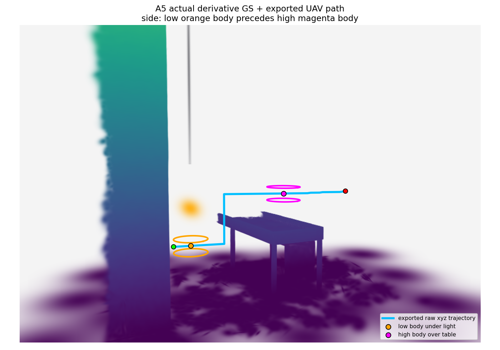
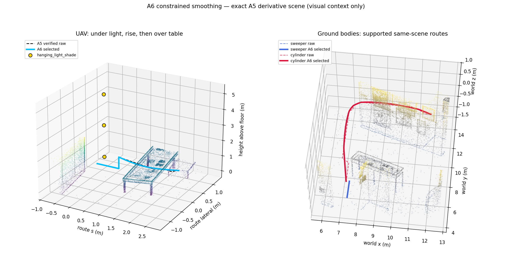

# GS3D 最终审查报告

状态：**A7 的 R1–R8 发布就绪检查通过；679 项不同测试均有通过证据。**
**已推送 GitHub（2026-09-23）**：plan、ops 与 A0–A7 共十个 `codex/gs3d-20260921/*`
分支，远端 SHA 已逐一核对，见文末「发布记录」。`main` 与原有 height-* 分支未移动。

三种机器人均在同一个已有 GS 展示厅的衍生场景中规划并通过独立回放检查。
无人机真实改变 xyz 中的 z，先从新增吊灯下方经过，再上升并越过原有桌面。
cylinder 保留原始 8.583851 m 远目标并精确到达。平滑后的整段轨迹重新通过
三维实体碰撞、支撑和声明的速度／加速度界验证。这是静态地图中的规划与数学回放，
没有实机飞行或闭环跟踪实验。

## 方法与独立审查

生产入口为 `gmc/experiments/gs3d_integration.py`，核心在 `gmc/src/gmc/gs3d/`。
所有障碍保留三维均值和完整 3×3 covariance；BVH 索引完整椭球支撑 AABB。
UAV 搜索 xyz 的 26 邻域；地面机器人在支撑曲面的 xy 8 邻域搜索，但每条边仍用
同一三维实体 oracle 检查。地面 xy 搜索是运动约束，不是把障碍投影到二维。
旧 `height` 流程保留为二维比较方法；本次没有修改它的实现和测试。

碰撞体为直立有限圆柱：UAV 半径 .25 m／半高 .10 m；sweeper .175/.04 m；
cylinder .30/.865 m。后两者底盘离支撑面 .02 m。原始线段检查整个扫掠体；
曲线通过 Bezier 凸包相对弦的偏差扩大碰撞 margin，逐段递归验证。
只有严格分离下界超过 margin 才允许通过；相切、不收敛、unknown 和预算耗尽
不会转成 free。完整 footprint 的覆盖与支撑检查同样适用于曲线。

A7 在前序通过测试的基础上仍发现并修复了五个遗漏，提交
`0f738d1f45d1d17d58c28abf8796a51e189641a8`：

1. UAV 的 crop/index 漏计入准备耗时；现已纳入算法入口之前的准备区间。
2. 平滑验证漏查分段 yaw 连续性；现从控制点推导端点 yaw 并拒绝跳变与非有限限制。
3. 非线性地面不能仅凭控制点高度宣称整段贴地；现要求有证据的平面或整片恒高界。
4. 平滑轨迹的穿灯／越桌判据曾把回放采样点当直线；现检查权威 Bezier 控制点的
   恒高、横向包含和前进单调性，用保守分段时间界判断先后顺序。
5. 渲染中的 UAV 实体位置曾取理想示例中心；现取真实回放位置，并记录时间、行号、xyz。

新增对抗测试连同相关 smoothing/integration 测试 **15/15 通过**。
全套测试中的 GS3D **78/78 通过**，包括投影调用陷阱、同 xy 不同 z 的不同路线、
竖直／航点间碰撞、旋转各向异性、unknown、目标容差、预算与安全回退。
真实复现也启用了 `project_scene` 调用即失败的陷阱。

## 场景与任务

场景先由 A2/A5 构建，再运行 A7。已有人工地板版含 7,101,868 个 Gaussian，
仅追加灯罩、悬杆和顶板三个确定性三维 Gaussian，得到 **7,101,871** 行；
原桌子、墙和其他原始障碍保留。阈值为 `opacity > .3`、支撑 level=2，
不是概率置信度。衍生归档 SHA-256：
`1103b6a5124d4e858bbd03ff751b52bc10a0fd095d7b0212d3c7ac28a893044d`。

原始 PLY、decoded NPZ、人工地板源文件均以只读方式重新散列，与前序记录一致。
完整路径、大小、SHA 见 [sources.json](../gmc/results/gs3d/final_review/sources.json)。
三种机器人使用同一归档，分别按完整三维支撑包围盒裁剪；没有删障碍换成功。

UAV 冻结的相对地板高度为 .65→1.40 m，范围 **.75 m**，要求至少 .50 m；
灯下低段中心跨越 s=[−.20,.20]，机体顶面 .75 m，灯底 1.05 m；
越桌高段中心高度 1.40 m，机体底面 1.30 m，桌子最高支撑 .905098 m。
实体 clearance 门槛 .05 m。平滑后用连续控制凸包证明低段发生在 t∈[0,3.090] s、
高段至少跨越 s=[.92,1.62] 且发生于 t∈[8.012,12.548] s；这些是保守时间包含界，
不是精确出入时刻。实际全路线与高度均记录在 JSON。

地面机器人使用原人工地板的恒高接触参考和声明的 .05 m 接触行程／5° 坡度上限，
同时保留地板 Gaussian 作为底盘障碍。实际参考面、拟合偏差与 tile 顶部 clamp
见结果 provenance。该接触模型不等于逐点实测地形或轮胎接触仿真。

## 同场景质量与安全结果

| 机器人 | 路长：原始→平滑 m | 总转向量：原始→平滑 rad | 改善 | 平滑连续 clearance 下界／要求 m | 轨迹时长：原始→平滑 s |
|---|---:|---:|---:|---:|---:|
| UAV | 3.5971→3.5311 | 7.0686→3.6191 | 48.8% | .05277597／.05 | 8.194→16.353 |
| sweeper | 1.6000→1.6000 | 0→0 | 输入本来为直线 | .00144336／.001 | 8.475→16.824 |
| cylinder | 12.8127→12.5223 | 7.8540→2.2003 | 72.0% | .00100147／.001 | 52.134→95.895 |

地面 z 范围仅有 ≤6.7×10⁻¹⁶ m 浮点误差；没有抬升地面机器人绕障。
三者保留独立验证过的原始安全路径作为失败回退。曲线候选不通过几何、目标、
动力学或质量门槛时，不替换输入。原始回退是分段线性、未经加速度连续性保证的路径，
不能把平滑候选的动力学保证转移给它。

| 机器人 | 速度界 m/s | 垂直速度界 m/s | 加速度界 m/s² | yaw 速度／加速度界 rad/s、rad/s² |
|---|---:|---:|---:|---:|
| UAV | .4762 ≤ .5 | .2857 ≤ .3 | .4535 ≤ .5 | 0／0 ≤ 1／1 |
| sweeper | .2858 ≤ .3 | 0 | .0838 ≤ .3 | .9315／.9071 ≤ 1／1 |
| cylinder | .2858 ≤ .3 | 0 | .2712 ≤ .3 | .9524／.9071 ≤ 1／1 |

这些界由权威控制点与 quintic ease 时间律重新计算，而不是信任 JSON 中的声明。
每个分段连接处速度和加速度归零，代价是时长增加。**总转向量下降不代表所有几何
拐角消失或最大曲率下降**：UAV 保留受保护爬升处的两个停止拐角；ground 在需要时
停住旋转。有限采样的曲率诊断在这些连接处可很大（UAV 209.44、cylinder 42.08 rad/m），
不与原始折线的离散代理量作同尺度优劣结论，也不用于安全授权。

## cylinder 远距离失败诊断

保留原始起点 xy=(7.35,5.30)、目标 xy=(11.70,12.70)，原目标距离 **8.583851 m**。
此次 0/.10/.25/.50 m 四种容差全部安全到达同一精确原目标，位置误差 0；没有利用
放宽容差隐蔽换终点。对 unknown／occupied 原目标选择可达安全候选的语义另有对抗测试。

旧 rung3/rung4 的记录显示 `query_support_budget_exhausted`；投影预检端点为 clear、
栅格连通。这只能反驳“已证明是 unknown 终点”的说法，不能证明原三维可达性。
新三维结果单独记录端点、搜索预算、连通性与计算量：686 expansions、1,532 oracle
调用、84,466 narrowphase pairs；精确目标和独立回放均通过。旧失败记录及 hash 保留，
没有重新标成 map unknown。完整四组诊断见 [metrics.json](../gmc/results/gs3d/final_review/metrics.json)。

## 算法耗时与 dt

作业 **18297240**，cs603，2 CPU／12 GiB 请求，31m08s 总时长，峰值 RSS 5,145,952 KiB。
Python 3.13.5、NumPy 2.1.3，种子 0，BLAS 单线程。总作业时长含测试与渲染，
不作为算法性能。每次算法从 `LatticePlanner.plan` 入口计时，到结果组装结束；
场景 load/edit-validation/crop/index、渲染和调度排队分开。

| 机器人 | 准备 s | 首次算法 s | 五次 warm p50／p95 s | 平滑算法 s |
|---|---:|---:|---:|---:|
| UAV（三段任务） | 2.3542 | .4793（三次调用之和） | .4659／.4688（整个三段 wrapper） | .0273 |
| sweeper | 1.1855（共享 ground index） | .00678 | .00651／.00701 | .0114 |
| cylinder | 复用同一 1.1855 s index | 23.2352 | 23.5693／23.7701 | 53.6919 |

UAV warm wrapper 包含极小的每次 finalize 开销，不能冒充单次算法测量；每一段的
algorithm wall 都单独保存。stage 包括 endpoint/goal-candidates/search/edge-validation/
trajectory-build/verify；嵌套 span 不能相加当总耗时。五次分布是本节点小样本测量，
不能推导实时性或跨硬件保证。平滑另有共享准备 3.8749 s。

`control_dt_s=.05` 是输出的名义／最大回放采样间隔。原始回放末帧可更短；平滑回放
为了精确包含每个段端点用等分采样，实际间隔 ≤.05 s，逐行 `time_s` 是权威时间。
各机器人实际间隔范围已存 metrics；轨迹时长、物理采样间隔和渲染帧率均不是算法耗时。

## 图像核对

已用 image viewer 打开 A7 新生成的 side/oblique/high UAV、ground overview、
raw-vs-smoothed 3D 和 profiles 六张图，并重新计算散列。



侧面图清楚显示灯下低位实体、间隙爬升、原桌面上方高位实体。所有实体位置由实际
回放时间重新插值核对，不再使用理想路线中心。斜视／高视保留附近墙体遮挡。
ground EWA 图受到顶面严重遮挡，只能辨认路径轮廓，不能据此判定障碍距离；
三维上下文和数值三维 oracle 必须结合阅读。



这张图为确定性稀疏 Gaussian 均值上下文；金色点只表示空中编辑的中心，不表示
椭球体积。完整协方差碰撞由 oracle 负责。最终路线仍保留停止爬升的几何折角，
cylinder 绕行转弯变缓，sweeper 的两条直线重合。
逐图 hash、视觉局限和 keyframe xyz/time 见
[visual_review.json](../gmc/results/gs3d/final_review/visual_review.json)。

## 回归、证据和发布检查

完整 `pytest tests`：**679 项，654 passed／25 failed／0 skipped**，1539.945 s。
25 项名称与 A0 baseline 完全相同，24 项 `AtlasAssetError`、1 项 `FileNotFoundError`，
均因工作树没有 sealed package 路径；没有新的 GS3D 失败。
**A7 进一步发现原 checkout 的 sealed package 实际可读**，且 dev_001 的 pinned
source／manifest／oracle record 验证通过。因此不能继续笼统说资产不可用：
已在本工作树创建 ignored 的只读使用 symlink，禁用 Python bytecode 写入。
补充作业 **18301714** 对两个受影响 Atlas 测试文件运行 **31/31 passed**，
18.889 s 测试时间（作业 25 s，峰值 RSS 83,152 KiB），其中包含全部 25 个原失败。
实现和测试代码未改；六个原通过项重复通过，25 个路径失败全部消除。
逐测试身份合并得到 **679 个不同测试全部通过，零剩余失败／跳过**。
这是完整首跑加受影响文件重跑的证据，不声称一次 monolithic 全绿运行。

JUnit SHA-256：`d3efb058bcddc154efceaa074dc527ff358ba25f71287ae013ece8fb4a4d85bb`。
[完整失败分类](../gmc/results/gs3d/final_review/full_suite_classification.json)、
[外部资产探测](../gmc/results/gs3d/final_review/external_atlas_probe.json) 均保留。
补充 JUnit SHA-256：`501d1240f9777b5e78620265b5af2b4e0d155b5fce9279b7324c14d929f7f774`。
[合并回归证据与全部测试名](../gmc/results/gs3d/final_review/resolved_regressions.json)
保留两个原始 JUnit 路径和散列，未覆盖首跑失败记录。

| 要求 | 已核对的证据 |
|---|---|
| R1 | 真实复现的 projection trap；同 xy／不同 z 回归；3D covariance/body/swept-edge 源码审查 |
| R2 | xyz 导出、回放 .75 m 高差、权威曲线验证与实际实体 keyframe |
| R3 | 三机器人成功；支撑／非侧滑／停止转向／切线 yaw；真实地面 z 不变化 |
| R4 | 冻结三维编辑、原输入 hash 不变、连续有序灯下／桌上门槛；同归档渲染 |
| R5 | 原 8.583851 m 目标、四种容差、精确终点及独立诊断 |
| R6 | 修复准备边界；各次／各阶段 wall、5 warm 分布、独立 trajectory dt |
| R7 | 成功原始输入后平滑；总转向改善、连续安全／动力学界和原始回退 |
| R8 | 主套件＋受影响文件重跑共 679 个不同测试通过；图像、报告、证据与历史审查完成；已推送并核对远端 SHA（见「发布记录」） |

已核对 A0–A6 accepted commit 都是当前 HEAD 的祖先，没有 reset/rebase。
对基线之后的全部新增历史 blob 检查：没有 >1 MiB blob，
没有 private-key／常见 GitHub、OpenAI、AWS token pattern 匹配；这不是对任意秘密格式的
绝对保证。原数据和大媒体未进入 Git。本报告包含三个 PNG，每个小于 1 MiB；
体积最大的约 761 KiB，其余证据为小型 JSON。最终提交后的干净状态、commit 和
compute 终态记录在运行时 `logs/A7/final_audit.json` 与 `state/A7.done.json`。
[Git 内容与历史检查](../gmc/results/gs3d/final_review/git_audit.json)。

## 复现命令与证据位置

运行时根目录 `R=/scratch/wg2381/codex_jobs/gs3d_20260921`，本工作树为 `$R/worktrees/A7`。
完整复现使用受控 helper，不直接 sbatch/srun：

```bash
python3 "$R/submit_compute.py" --stage A7 \
  --script "$R/compute/A7_final_checks.sh" --cpus 2 --mem-gb 12 --hours 1
```

脚本在本工作树 `gmc/` 运行，解释器
`/scratch/wg2381/.conda/envs/gmc-venv/bin/python`，环境
`PYTHONPATH=src:experiments MPLBACKEND=Agg`。算法命令为：

```bash
python experiments/gs3d_final_audit.py reproduce \
  --a5-gmc "$R/worktrees/A5/gmc" --output results/gs3d/final
python -m pytest tests -q --tb=short --junitxml="$R/logs/A7/full_suite.xml"
```

`python` 在此必须替换成上面的绝对解释器；重运行仅经 helper。A7 复现精确比对
A5 的原始 trajectory（含位置、yaw 和物理时间），仅 wall 时间不同；随后将新 JSON
重新固定散列供平滑，不覆盖前序 acceptance。完整运行 JSON/HTML/PNG 留在
`gmc/results/gs3d/final/`，紧凑证据在 Git 的 `gmc/results/gs3d/final_review/`。
所有原始证据及源码 hash 见 [reproduction.json](../gmc/results/gs3d/final_review/reproduction.json)。
对应文件中的 `human_visual_review_pending` 是计算作业当时状态，后续人工核对记录
单独保存在 visual_review，未篡改原始 receipt。

Atlas 补充运行脚本 `$R/compute/A7_atlas_recheck.sh` 使用相同解释器，并设
`PYTHONDONTWRITEBYTECODE=1`。工作树内 ignored symlink 为
`splatc_atlas/outputs/round4_final_package` → 原 checkout 对应 package，
`splatc_atlas/data/splatc_gates` → 原 checkout 对应 gates；测试只读原文件，
篡改检验通过内存 monkeypatch 完成。复现命令：

```bash
python3 "$R/submit_compute.py" --stage A7 \
  --script "$R/compute/A7_atlas_recheck.sh" --cpus 2 --mem-gb 8 --hours 1
```

上述链接属于本机资产配置，未提交到 Git；其他机器需要提供相同 pinned 资产。
核心实现提交 `0f738d1`，证据提交 `d4fc858`，最后报告/验收提交的完整 SHA 由
`git log codex/gs3d-20260921/A7` 给出，避免报告自引用 hash。

## 相关工作与适用边界

[A0 架构与研究记录](gs3d_architecture.md) 已保留 NeuPAN 和 Splat-Nav 的论文、
官方代码 commit 与许可证。NeuPAN 的形状距离约束与运动控制分层启发接口设计，
但其点云/地面模型不替代三维 Gaussian 安全证明；Splat-Nav 的 Gaussian 几何及
Bezier 凸包思想用于本项目的独立实现。没有复制第三方代码或新增训练依赖。

结论仅适用于声明的人工编辑地图、opacity/level 和 assumed-map-domain 覆盖。
unknown holes 在有明确 coverage 证据时失败关闭，但场景的 box 覆盖不是传感器
观测自由空间证明。浮点支撑分离／tube 下界不是精确算术认证，且 cylinder 的
clearance 下界接近 1 mm 门槛；不得据此声称对地图噪声有宽裕。
未建模 UAV roll/pitch、风、跟踪误差、执行器、jerk，或地面轮胎力矩／牵引力。
未实现动态障碍在线闭环执行，五次 warm 是静态重复规划；无实机实时性承诺。

## 发布记录

A7 在最终提交 `6efd973` 后因 Codex 额度上限中止，runner 的自动发布没有执行；
调度链随后按用户要求以 `state/PAUSE` 暂停。A0–A4、ops 已于 2026-09-22 18:53 由
ops 修复会话推送；A5–A7 于 2026-09-23 手工推送（fast-forward 新建分支，无 force）。
推送后 `git ls-remote` 核对的远端 SHA：

| 分支 | commit | 内容 |
|---|---|---|
| `codex/gs3d-20260921/plan` | `1d5891a` | 计划与调度器 |
| `codex/gs3d-20260921/ops` | `244a74b` | 验收判定与 SQLite 状态修复 |
| `codex/gs3d-20260921/A0` | `1bac9e2` | 架构与接口 |
| `codex/gs3d-20260921/A1` | `3cfa80d` | 三维 Gaussian 几何与规划核心 |
| `codex/gs3d-20260921/A2` | `70ab219` | 吊灯／顶板场景编辑 |
| `codex/gs3d-20260921/A3` | `c0f3db4` | 机器人、目标容差、长距离 cylinder |
| `codex/gs3d-20260921/A4` | `70f5dc4` | 计时与 benchmark |
| `codex/gs3d-20260921/A5` | `b2c74a6` | 三机器人真实场景集成 |
| `codex/gs3d-20260921/A6` | `726dc09` | 平滑与连续安全复检 |
| `codex/gs3d-20260921/A7` | 本报告所在 HEAD | 最终审查；包含 A0–A6 与 ops 的全部历史 |

计划中的 `codex/gs3d-20260921/integration` 分支未单独创建；A7 分支即完整集成结果。
