# uav.md 连通性 / 图搜索后端：在带人工障碍的 3DGS 展厅场景上跑通，并与 uav-lamp 基线对比（C2 报告）

## 一句话结论

**跑通了**。在 uav-lamp 的展厅场景上（真实展示厅 3DGS，加上人为添加的灯箱、隔断、吊顶、背板；归档
`2a3a72d6…96cc`），新的连通性 + 图搜索后端只接受起点和终点：
- 对 5 个基准查询给出的结论全部正确：M1、M5 先钻灯下再到桌面上方；C4h 从灯上方飞过；N2、N2h 堵住灯下开口后，给出带 pair 割集的**认证无路**。
- 每条返回的路线都通过了基线同一套独立 Gaussian 回放。
- 在预注册的 24 对扩展集上，成功率与基线**持平**，都是 21/24。
- 需要搜索的查询上，每次查询比基线快 72–1 638 倍（中位数 393 倍）；只需一条直线的简单查询上，基线更快。

失败方式不同：
- **新方法**：3 对 UNKNOWN。原因是共享回放对单条长斜线段的包围盒检查过不了，不是碰撞；把同一路线细分后事后复查能通过，但这 3 对不计入成功。
- **基线**：3 对在 5 h 预算内没有给出答案。

## 0. uav.md 规定的是什么，实际实现的是什么（如实命名）

**uav.md 规定的完整链路**（§5–§8、§10–§11，Phase U0）：
1. 完整 3DGS。
2. 每个 Gaussian 与机体组成 pair C-obstacle。
3. 认证的外 / 内包络 P⁺ / P⁻。
4. 由 Gaussian 诱导的自由体积复形 / 门户图。§7.3–7.4 要求用精确的 3D 布尔排列，交给 C++ 后端。
5. 图搜索。
6. 路径提升。
7. 连续 Gaussian 验证。

**实际实现**（C1，`gmc/src/gmc/aerial3d/`，设计见 [`docs/uavconn_design.md`](uavconn_design.md)）是
**pair-certified support-plane cell complex**（逐 pair 认证的支撑平面凸胞复形）：
- **pair 与包络。** 碰撞语义与基线 oracle 完全相同：O_i = E_i ⊕ Cyl(r,h) ⊕ B(m)，τ = 0.3，level = 2。外 / 内包络 P⁺ / P⁻ 带三明治审计。
- **octree。** pair 驱动的 octree（uav.md §13.3）只根据 pair 证书，把配置空间盒子标成 SAFE / BLOCKED / UNKNOWN。
- **凸自由胞与门户图。** 由 SAFE 叶子长出凸自由胞，每个面都是某个外包络的支撑平面（带 pair id），或是工作空间边界。胞之间用认证门户相连。
- **搜索与后处理。** 在门户图上做 A*，然后提升路径，再做经认证的 shortcut / 拉紧 / 合并拐角。
- **验证。** 先过自己的连续验证器，再过基线的 `gs3d` `replay_plan` 回放；两者都通过才算 REACHABLE。
- **无路证书。** 只从可能空间一侧给出 UNREACHABLE：割集上每个 BLOCKED 盒子都在某一个 pair 的内多面体里。

**没有实现的部分**：精确 3D 布尔排列与 C++ 后端（§7.4）、精确 / 二进有理谓词、偏航（§9）和动力学（Phase 6）。

**§13.2 的警告在这里适用。** 本方法的连通性依赖 octree，完备性受分辨率限制（最小盒 0.05 m）。uav.md §13.2
说「3DGS → octree 标签 → A*」**不是**完整的 GMC 主张，本实现离那个主张更近，而不是离精确排列更近。它与「octree 标签 + A*」的区别有三点：
- 搜索图的节点是 pair 支撑平面围成的凸胞，不是格子；
- 无路结论带显式的 pair 割集；
- 每个标签都对整个盒子做了 pair 认证。

但窄于约两个最小盒的通道可能漏掉。这时答 UNKNOWN，绝不会错答 UNREACHABLE。C2 的单元测试里正好有一个例子：
L2 的窄切片测试场景（C 空间爬升井约 0.25 m）上，新方法答 UNKNOWN，基线能找到路。

**可追溯性**（展台编译，[`runs/aerial3d/compile_booth.json`](../gmc/results/uavconn/runs/aerial3d/compile_booth.json)）：
- 1 025 个凸胞的 91 314 个面里，86.5% 是 pair 支撑平面，其余是工作空间 / 已知空间边界，没有来源不明的面。
- 27 560 个自由边界面 100% 能追溯到 pair id。
- 三明治审计通过（80 个 pair，含 16 个最各向异性的）。
- N2 的割集有 4 056 个 BLOCKED 叶子、1 298 个不同的 pair，100% 可追溯。按来源分：测试用堵板 206、隔断 224、灯箱 151、原始扫描（墙 / 地面）717。

## 1. 实验设置（两种方法完全相同的输入）

- **相同的输入。** 同一个归档（manifest 校验加载器，SHA-256 与冻结值一致），同一个 `uavlamp_query.build_scene`：同样的裁剪（359 201 个 Gaussian）、盒子、τ / level、直立圆柱机体（r 0.25，半高 0.10）、余量 0.05。
- **同一个最终安全判据。** 两种方法都用基线的 `replay_plan`，每次**新建** oracle 和索引。新方法自己的验证器是额外的一道，不替代它。
- **新方法。** 默认 `CompileConfig` / `QueryConfig`。每个场景变体编译一次：展台（M1、M5）、展台 + 堵板（N2、N2h）、只有灯（C4h）；扩展集另编译一次。每个查询只调用 `query(compiled, start, goal)`：一次冷调用（在编译完成后 fork 出的干净进程里），加 3 次热调用。入口 [`gmc/experiments/uavconn_run.py`](../gmc/experiments/uavconn_run.py)，结构和 JSON 格式与 `uavlamp_run.py` 一一对应。
- **基线。** 未改动的 `uavlamp_run.py`：`LatticePlanner`，26 邻域，0.10 m。本分支的 gs3d / uavlamp 代码与 `uav-lamp` 4357962 逐字节相同。每个查询单独一个 sbatch 作业、一次 `plan()` 调用。
- **扩展集。** 在跑之前预注册并提交（[`docs/uavconn_c2_prereg.md`](uavconn_c2_prereg.md)，`fca0ea8`；生成的 24 对在 `ecc8f05`）。种子 20260925：
  - A 类 12 对：起点在进场走廊，终点在桌面上方；
  - B 类 12 对：盒子内随机的无碰撞点对。

  每个位姿都由共享 gs3d oracle 认证无碰撞。基线每对给 5 h 预算，各自一个作业（2 CPU / 8 GB），同时排队不超过 12 个。
- **成功的定义（预注册 §3）。**
  - 有路 = 任一方法返回了通过共享回放的路径。有路时，返回这样一条路径才算成功。
  - 无路时，新方法要给认证的 UNREACHABLE，基线要队列耗尽，才算成功。
  - UNKNOWN、预算停止、作业超时都不算成功，单独列出。

## 2. 预注册预测 vs 结果

C1 设计文档 §5（`59625e9`，基准 5 查询）：

| 查询 | 预测 | 结果 | 成立？ |
|---|---|---|---|
| M1 | REACHABLE，从灯下过，2.9–3.35 m，≤ 10 个顶点；编译 2–30 min，查询 ≤ 10 s（含回放），比基线快得多 | REACHABLE，3.056 m，4 个顶点，灯下区间 s 0.79–1.61 m（中心 z 0.73–0.92）先于桌上区间 s 1.93–3.06 m；编译 6.2 min，查询 7.97 s；比基线单独重测的 4 985 s 快 626 倍 | 是 |
| M5 | REACHABLE，先降到 ≈ 0.93 以下钻过灯底，3.0–3.5 m | REACHABLE，3.254 m，最低 z 0.919，先灯下后桌上 | 是 |
| N2 | 认证 UNREACHABLE（P≈0.8），否则 UNKNOWN，绝不 REACHABLE | 认证 UNREACHABLE，冷调用 0.16 s | 是 |
| N2h | 同上 | 认证 UNREACHABLE，冷调用 0.14 s | 是 |
| C4h | REACHABLE，从灯上方过，接近直线，≈ 2.875 m | REACHABLE，2.8749 m，一条直线段，z 1.50–1.55 | 是 |

C2 预注册（扩展集，[`docs/uavconn_c2_prereg.md`](uavconn_c2_prereg.md) §4）：

| # | 预测 | 结果 | 成立？ |
|---|---|---|---|
| X1 | A 类 12 对都有路；两种方法的 A 类路径都先灯下后桌上 | 12/12 有路（EA03 只有基线找到；EA05/10/11 只有新方法找到）；20 条 A 类路径全部先灯下后桌上 | 是 |
| X2 | 新方法 A ≥ 10/12、B ≥ 10/12；失败为 UNKNOWN（预计出现在贴墙 / 贴吊顶的薄自由空间），绝不错答 UNREACHABLE | A 11/12、B 10/12；3 个 UNKNOWN，没有 UNREACHABLE。**失败原因猜错了**：不是图不连通，而是共享回放拒绝了一条长斜线段（见 §3） | 数量成立，机理不成立 |
| X3 | 基线 A ≥ 9/12、B ≥ 10/12（5 h 内） | A 9/12（3 对预算停止）、B 12/12 | 是 |
| X4 | 没有矛盾：没有回放失败的路径，没有新方法错判 UNREACHABLE | 29 个查询 0 矛盾 | 是 |
| X5 | B 类约 4 ± 2 对跨灯平面，≥ 4 对直线段无碰撞，≤ 2 对无路 | 6 对跨灯平面（区间上沿），5 对直线无碰撞，0 对无路 | 是 |
| X6 | 新方法每对冷查询 ≤ 20 s，中位数 ≤ 10 s；编译 4–15 min | 中位数 9.8 s，但 **7/24 对超过 20 s**（最长 40.6 s）；编译 6.2 / 11.0 min | **不成立**（「每对 ≤ 20 s」） |
| X7 | 基线在需要搜索的对上中位数 ≥ 3 000 s；直线对上两者都在秒级，相差不超过 10 倍 | 需搜索的 19 对中位数 5 447 s。**直线对上基线快 22–190 倍**（0.005–0.06 s vs 0.9–1.4 s），只有 EB05 接近（2.6 s vs 2.9 s） | 前半成立，**后半不成立** |
| X8 | 两者都有路时，新方法原始路径都不更长；总转角在 ≥ 90% 的对上更低 | 长度 15 对更短、6 对相同（同一条直线），0 对更长。总转角在路径不同的 15 对上全部更低，6 条直线两者都是 0；按字面算 15/21 = 71% | 长度成立；转角在路径不同的对上成立，按字面不到 90% |
| X9 | 同一 A6 平滑后每条曲线都通过重新验证；平滑后 jerk 不预测方向 | 48 条平滑曲线全部通过新建 oracle 的连续复验；jerk：新方法 8 对更低、7 对更高、6 对相同 | 是 |

## 3. 成功率

基准 5 个查询：

| 查询 | 真值 | aerial3d 结果 | aerial3d 长度 / 顶点 | aerial3d 单次查询 冷 / 热 | lattice 结果 | lattice 长度 / 节点 | lattice 单次查询 | 两者先灯下后桌上 |
|---|---|---|---:|---:|---|---:|---:|---|
| M1 | 有路 | 有路（回放通过） | 3.056 m / 4 | 7.97 s / 7.36 s | 有路（回放通过） | 3.383 m / 29 | 6,117 s (L2, 并发节点)；C2 单独重测 4,985 s | 是 / 是 |
| M5 | 有路 | 有路（回放通过） | 3.254 m / 5 | 12.28 s / 11.61 s | 有路（回放通过） | 3.549 m / 29 | 8,142 s (L2, 并发节点) | 是 / 是 |
| N2 | 无路 | 认证无路 UNREACHABLE | — / — | 0.16 s / 0.11 s | 队列耗尽（未认证） | — / — | 8,335 s (L2, 并发节点) | — / — |
| N2h | 无路 | 认证无路 UNREACHABLE | — / — | 0.14 s / 0.11 s | 队列耗尽（未认证） | — / — | 8,410 s (L2, 并发节点) | — / — |
| C4h | 有路 | 有路（回放通过） | 2.875 m / 2 | 1.67 s / 1.58 s | 有路（回放通过） | 2.875 m / 2 | 1.78 s (L2, 并发节点) | 从灯上方过 / 从灯上方过 |

- N2/N2h 两种方法都判为「无路」，但证据的种类不同：
  - **新方法**给出可能空间割集：起点所在连通分量被 4 056 个 BLOCKED 叶子包住，每个叶子都在某一个 pair 的内多面体中。其中 206 个 pair 属于测试用堵板。
  - **基线**把可达格点扩展完了，队列被清空，标签是 `map_unknown`。这不是证书。
  - 两种证据都依赖盒子的 u_min 面（悬空面），见 §8。
- M1 的基线耗时有两个值：L2 记录的 6 117 s 是在 4–7 个搜索并发的节点上测的；C2 单独重测是 4 985 s，扩展数同为 1 293，路线相同。

成功率（UNKNOWN、预算停止分开列出，不计入成功）：

| 集合 | 方法 | 成功 / 总数 | 成功率 [Wilson 95%] | 有路 | 认证无路 | 队列耗尽 | UNKNOWN | 预算停止 / 超时 | 矛盾 |
|---|---|---:|---:|---:|---:|---:|---:|---:|---:|
| 基准 5 查询 | aerial3d | 5 / 5 | 100% [57–100%] | 3 | 2 | 0 | 0 | 0 | 0 |
| 基准 5 查询 | lattice | 5 / 5 | 100% [57–100%] | 3 | 0 | 2 | 0 | 0 | 0 |
| 扩展集 A 类（走廊→桌上） | aerial3d | 11 / 12 | 92% [65–99%] | 11 | 0 | 0 | 1 | 0 | 0 |
| 扩展集 A 类（走廊→桌上） | lattice | 9 / 12 | 75% [47–91%] | 9 | 0 | 0 | 0 | 3 | 0 |
| 扩展集 B 类（随机无碰撞对） | aerial3d | 10 / 12 | 83% [55–95%] | 10 | 0 | 0 | 2 | 0 | 0 |
| 扩展集 B 类（随机无碰撞对） | lattice | 12 / 12 | 100% [76–100%] | 12 | 0 | 0 | 0 | 0 | 0 |
| 扩展集合计（24） | aerial3d | 21 / 24 | 88% [69–96%] | 21 | 0 | 0 | 3 | 0 | 0 |
| 扩展集合计（24） | lattice | 21 / 24 | 88% [69–96%] | 21 | 0 | 0 | 0 | 3 | 0 |
| 全部（29） | aerial3d | 26 / 29 | 90% [74–96%] | 24 | 2 | 0 | 3 | 0 | 0 |
| 全部（29） | lattice | 26 / 29 | 90% [74–96%] | 24 | 0 | 2 | 0 | 3 | 0 |

扩展集逐对（「直线段」是共享 oracle 对起点到终点直线段的判定；「过灯平面」表示起终点在 u = −0.85 两侧）：

| 对 | 类 | 直线段 (oracle) | 过灯平面 | aerial3d | 长度 / 顶点 | 冷 | lattice | 长度 / 节点 | 耗时 | 真值 | 成功 a / l |
|---|---|---|---|---|---:|---:|---|---:|---:|---|---|
| EA00 | A | unknown | 是 | 有路（回放通过） | 3.860 / 7 | 24.56 s | 有路（回放通过） | 4.281 / 35 | 11,215 s | 有路 | ✓ / ✓ |
| EA01 | A | occupied | 是 | 有路（回放通过） | 3.084 / 4 | 9.52 s | 有路（回放通过） | 3.255 / 29 | 682 s | 有路 | ✓ / ✓ |
| EA02 | A | unknown | 是 | 有路（回放通过） | 2.966 / 4 | 9.20 s | 有路（回放通过） | 3.242 / 25 | 1,256 s | 有路 | ✓ / ✓ |
| EA03 | A | unknown | 是 | UNKNOWN (`shared_replay_failed`) | — / — | 10.13 s | 有路（回放通过） | 6.322 / 53 | 16,587 s | 有路 | ✗ / ✓ |
| EA04 | A | occupied | 是 | 有路（回放通过） | 3.608 / 5 | 17.28 s | 有路（回放通过） | 3.854 / 31 | 6,789 s | 有路 | ✓ / ✓ |
| EA05 | A | unknown | 是 | 有路（回放通过） | 4.668 / 6 | 30.19 s | 预算停止（5 h） | — / — | 18,000 s | 有路 | ✓ / ✗ |
| EA06 | A | occupied | 是 | 有路（回放通过） | 3.069 / 5 | 8.23 s | 有路（回放通过） | 3.255 / 26 | 1,451 s | 有路 | ✓ / ✓ |
| EA07 | A | unknown | 是 | 有路（回放通过） | 3.678 / 6 | 19.58 s | 有路（回放通过） | 4.073 / 34 | 8,518 s | 有路 | ✓ / ✓ |
| EA08 | A | unknown | 是 | 有路（回放通过） | 2.901 / 7 | 25.06 s | 有路（回放通过） | 3.096 / 23 | 2,624 s | 有路 | ✓ / ✓ |
| EA09 | A | unknown | 是 | 有路（回放通过） | 3.247 / 6 | 26.94 s | 有路（回放通过） | 3.375 / 25 | 2,522 s | 有路 | ✓ / ✓ |
| EA10 | A | unknown | 是 | 有路（回放通过） | 4.631 / 9 | 29.47 s | 预算停止（5 h） | — / — | 18,000 s | 有路 | ✓ / ✗ |
| EA11 | A | unknown | 是 | 有路（回放通过） | 4.972 / 7 | 40.58 s | 预算停止（5 h） | — / — | 18,000 s | 有路 | ✓ / ✗ |
| EB00 | B | unknown | 是 | 有路（回放通过） | 3.763 / 5 | 27.55 s | 有路（回放通过） | 4.160 / 35 | 7,332 s | 有路 | ✓ / ✓ |
| EB01 | B | free | 否 | 有路（回放通过） | 1.144 / 2 | 1.17 s | 有路（回放通过） | 1.144 / 2 | 0.02 s | 有路 | ✓ / ✓ |
| EB02 | B | unknown | 是 | UNKNOWN (`shared_replay_failed`) | — / — | 4.70 s | 有路（回放通过） | 4.897 / 38 | 1,820 s | 有路 | ✗ / ✓ |
| EB03 | B | free | 否 | 有路（回放通过） | 1.891 / 2 | 1.35 s | 有路（回放通过） | 1.891 / 2 | 0.01 s | 有路 | ✓ / ✓ |
| EB04 | B | unknown | 是 | UNKNOWN (`shared_replay_failed`) | — / — | 1.52 s | 有路（回放通过） | 4.533 / 34 | 2,451 s | 有路 | ✗ / ✓ |
| EB05 | B | free | 否 | 有路（回放通过） | 3.356 / 2 | 2.90 s | 有路（回放通过） | 3.356 / 2 | 2.56 s | 有路 | ✓ / ✓ |
| EB06 | B | unknown | 是 | 有路（回放通过） | 3.540 / 5 | 8.77 s | 有路（回放通过） | 3.782 / 32 | 5,447 s | 有路 | ✓ / ✓ |
| EB07 | B | occupied | 否 | 有路（回放通过） | 1.746 / 3 | 8.48 s | 有路（回放通过） | 1.933 / 16 | 745 s | 有路 | ✓ / ✓ |
| EB08 | B | unknown | 是 | 有路（回放通过） | 4.093 / 6 | 17.25 s | 有路（回放通过） | 4.248 / 34 | 2,622 s | 有路 | ✓ / ✓ |
| EB09 | B | free | 否 | 有路（回放通过） | 1.066 / 2 | 0.89 s | 有路（回放通过） | 1.066 / 2 | 0.00 s | 有路 | ✓ / ✓ |
| EB10 | B | unknown | 是 | 有路（回放通过） | 3.709 / 5 | 18.03 s | 有路（回放通过） | 4.107 / 31 | 9,082 s | 有路 | ✓ / ✓ |
| EB11 | B | free | 否 | 有路（回放通过） | 1.171 / 2 | 1.29 s | 有路（回放通过） | 1.171 / 2 | 0.06 s | 有路 | ✓ / ✓ |

**新方法的 3 个 UNKNOWN（EA03、EB02、EB04）为什么不是碰撞。** 三个都是 `shared_replay_failed`：新方法自己的连续验证器已经认证（clearance ≥ 0.051 m），查询内的共享 gs3d 回放却不通过。事后诊断（`uc_posthoc`，[`results/uavconn/posthoc.json`](../gmc/results/uavconn/posthoc.json)，**不计入成功率**）：
- 每个查询都**只有最长那一段**（3.48 / 3.23 / 4.19 m）被 oracle 判为 `unknown / map_unknown`，从来不是 `occupied`，其余段都是 `free`。
- 原因在 gs3d `oracle.edge` 的已知空间检查。它拿整段扫掠体的**世界坐标轴对齐**包围盒去和旋转了约 64° 的走廊棱柱比：一条靠近墙 A 的长斜线段，包围盒会伸出 v_min = −0.35，其实线段上每个位姿都在域内（新方法的域约束是逐位姿的，而且域是凸的）。
- 把同一条折线切成 ≤ 0.20 m 的共线小段（点集不变）重放，三个都通过（clearance 0.0502 / 0.0502 / 0.0643 m）。
- 基线自己的 0.1 m 格边从来碰不到这个问题；但它对 EB02 / EB04 等的直连边同样是 `map_unknown`，之后退回到搜索（EB04 用了 2 451 s）。

按预注册规则，这 3 个仍是 UNKNOWN。「回放前把长段切细」这类修正是**事后**的，没有作为预注册方法评估。

**基线的 3 个失败（EA05、EA10、EA11）**：规划器 5 h 墙钟预算用完（`budget_exhausted`，扩展了 2 242–3 555 个节点），没有给出任何答案。
新方法在这 3 对上 29–41 s 就返回了回放通过、先灯下后桌上的路径。基线 EA03 用了 16 587 s（4.6 h）才找到 6.32 m 的路径。

## 4. 路线平滑程度

对两种方法的原始路径，用同一个 C1 指标模块（`gmc.aerial3d.metrics`）计算指标。
然后对两者做同一个 `gs3d/smoothing.py` 后处理（A6 的 UAV 配置，与 `uavlamp_run.smooth` 相同），每条平滑曲线再用新建 oracle 连续复验：48/48 通过。

原始路径：两种方法都有回放通过路径的 21 个查询；平滑后：两者平滑曲线都通过重新验证的 21 个查询。

| 指标 | aerial3d 中位数 [IQR] | lattice 中位数 [IQR] | aerial3d 更小 / 相等 / 更大 |
|---|---:|---:|---:|
| 原始：路径长度 (m) | 3.08 [2.87, 3.61] | 3.36 [2.87, 3.85] | 15 / 6 / 0 |
| 原始：折线顶点数 | 5 [2, 5] | 26 [2, 31] | 15 / 6 / 0 |
| 原始：转折顶点数 | 3 [0, 3] | 9 [0, 12] | 15 / 6 / 0 |
| 原始：总转角 (rad) | 0.859 [0, 1.63] | 7.91 [0, 9.09] | 15 / 6 / 0 |
| 原始：最大单次转角 (rad) | 0.654 [0, 0.781] | 0.955 [0, 0.955] | 15 / 6 / 0 |
| 原始：离散弯曲能 Σθ²/ℓ (1/m) | 0.562 [0, 2.09] | 47 [0, 55.5] | 15 / 6 / 0 |
| 原始：垂直行程 (m) | 1.05 [0.675, 1.27] | 1.17 [0.728, 1.35] | 11 / 10 / 0 |
| 同一 A6 平滑后：∫|jerk|² dt | 2.02 [0.479, 2.83] | 1.67 [0.479, 2.51] | 8 / 6 / 7 |
| 同一 A6 平滑后：无量纲 jerk J·T⁵/L² | 3e+05 [720, 3.71e+05] | 2.12e+05 [720, 5.78e+05] | 7 / 6 / 8 |
| 同一 A6 平滑后：平滑后时长 (s) | 16.6 [11.3, 18.1] | 15.5 [11.3, 20.1] | 10 / 6 / 5 |
| 同一 A6 平滑后：平滑后长度 (m) | 3.12 [2.87, 3.7] | 3.13 [2.87, 3.71] | 11 / 6 / 4 |
| 同一 A6 平滑后：平滑后转角指标 (rad) | 1.2 [1.16e-06, 2.03] | 1.47 [1.16e-06, 3.06] | 13 / 6 / 2 |
| 同一 A6 平滑后：平滑后最大曲率 (1/m) | 1.74 [2.79e-06, 2.59] | 2.22 [2.79e-06, 8.34] | 14 / 6 / 1 |

- **原始路径：新方法明显更「平滑」。** 路径不同的 15 对上，新方法全部更短、转折顶点更少、总转角更小（总转角比值中位数 0.15）；另外 6 对两种方法返回同一条直线。
  - 原因是新方法返回连续空间里拉紧的折线（2–9 个顶点）；基线返回 0.1 m 格子上的 26 邻域折线（23–53 个节点）。
- **同一平滑之后，差距基本消失，jerk 没有赢。**
  - 平滑后长度中位数：3.12 vs 3.13 m；
  - 最大曲率：新方法 14 对更低、1 对更高；
  - ∫|jerk|² dt：新方法 **8 对更低、7 对更高**，中位数 2.02 vs 1.67，按时长归一化后也一样。
  - 原因：A6 平滑器在**每个锚点都缓停**（零速度、零加速度）。新方法的折线在绕角处常有两个相距只有约 0.2 m 的顶点，于是中间那段 Bezier 很短、jerk 很高。基线的格子路径先被平滑器 shortcut 成 4–8 个锚点，锚点间距反而更均匀。
  - 另外，gs3d 平滑器在新方法的 24 条路径中有 18 条**保留了原始折线**（`turn_improvement_below_threshold`：平滑只让转角指标改善不到 10%），基线 24/24 选了平滑曲线。
  - 所以「新方法的路线更平滑」只在**原始路线的几何指标**上成立；经过同一个平滑器之后，两者相当，jerk 互有胜负。

## 5. 耗时

**所有计时都在共享的 cpu_short 节点上测得，不是受控基准。** 各作业记录了节点的 CPUAlloc / CPUTot（96–127 / 128）和 load average。
同一个展台编译，两次测得 371 s 和 658 s（CPU 时间 689 s vs 1 248 s），叶子和胞完全相同。第一轮的基线作业里，最多有 6 个同时在同一节点（cs614）上。

| 场景编译 | 编译墙钟 | 其中 octree / cells+portals | CPU 时间 | 峰值 RSS | 节点 CPUAlloc/CPUTot | 服务查询数 |
|---|---:|---:|---:|---:|---:|---:|
| 展台（M1、M5） | 371 s | 43.82 s / 324 s | 689 s | 1.35 GB | 127/128 | 2 |
| 展台 + 堵板（N2、N2h） | 339 s | 39.41 s / 297 s | 627 s | 2.09 GB | 96/128 | 2 |
| 只有灯（C4h） | 249 s | 39.50 s / 207 s | 449 s | 2.11 GB | 96/128 | 1 |
| 展台（扩展集 24 对，另一作业） | 658 s | 54.34 s / 600 s | 1,248 s | 1.35 GB | 114/128 | 24 |

| 查询 | lattice 单次 | aerial3d 冷 | aerial3d 热（中位数） | 加速比 冷 | 加速比 热 | 首条路径耗时 lattice / aerial3d（含编译） | 比值 |
|---|---:|---:|---:|---:|---:|---:|---:|
| M1 | 4,985 s | 7.97 s | 7.36 s | 626× | 677× | 4,986 s / 379 s | 13× |
| M5 | 8,142 s | 12.28 s | 11.61 s | 663× | 701× | 8,142 s / 383 s | 21× |
| N2 | 8,335 s | 0.16 s | 0.11 s | 53,691× | 78,914× | 8,336 s / 339 s | 25× |
| N2h | 8,410 s | 0.14 s | 0.11 s | 59,442× | 79,988× | 8,411 s / 339 s | 25× |
| C4h | 1.78 s | 1.67 s | 1.58 s | 1.1× | 1.1× | 2.70 s / 251 s | 0.011× |
| EA00 | 11,215 s | 24.56 s | 23.29 s | 457× | 481× | 11,216 s / 683 s | 16× |
| EA01 | 682 s | 9.52 s | 9.09 s | 72× | 75× | 683 s / 668 s | 1.0× |
| EA02 | 1,256 s | 9.20 s | 8.88 s | 137× | 141× | 1,257 s / 667 s | 1.9× |
| EA03 | 16,587 s | 10.13 s | 9.76 s | 1,638× | 1,699× | 16,588 s / 668 s | 25× |
| EA04 | 6,789 s | 17.28 s | 16.84 s | 393× | 403× | 6,790 s / 675 s | 10× |
| EA05 | 18,000 s † | 30.19 s | 28.61 s | 596× | 629× | 18,001 s / 688 s | 26× |
| EA06 | 1,451 s | 8.23 s | 7.50 s | 176× | 193× | 1,452 s / 666 s | 2.2× |
| EA07 | 8,518 s | 19.58 s | 17.78 s | 435× | 479× | 8,519 s / 678 s | 13× |
| EA08 | 2,624 s | 25.06 s | 23.60 s | 105× | 111× | 2,625 s / 683 s | 3.8× |
| EA09 | 2,522 s | 26.94 s | 25.22 s | 94× | 100× | 2,523 s / 685 s | 3.7× |
| EA10 | 18,000 s † | 29.47 s | 27.74 s | 611× | 649× | 18,001 s / 688 s | 26× |
| EA11 | 18,000 s † | 40.58 s | 39.56 s | 444× | 455× | 18,001 s / 699 s | 26× |
| EB00 | 7,332 s | 27.55 s | 24.86 s | 266× | 295× | 7,333 s / 686 s | 11× |
| EB01 | 0.02 s | 1.17 s | 0.77 s | 0.018× | 0.027× | 0.77 s / 659 s | 0.0012× |
| EB02 | 1,820 s | 4.70 s | 3.94 s | 387× | 461× | 1,821 s / 663 s | 2.7× |
| EB03 | 0.01 s | 1.35 s | 0.92 s | 0.011× | 0.016× | 0.92 s / 659 s | 0.0014× |
| EB04 | 2,451 s | 1.52 s | 1.09 s | 1,609× | 2,248× | 2,452 s / 660 s | 3.7× |
| EB05 | 2.56 s | 2.90 s | 2.43 s | 0.88× | 1.1× | 3.61 s / 661 s | 0.0055× |
| EB06 | 5,447 s | 8.77 s | 7.72 s | 621× | 705× | 5,447 s / 667 s | 8.2× |
| EB07 | 745 s | 8.48 s | 7.43 s | 88× | 100× | 746 s / 667 s | 1.1× |
| EB08 | 2,622 s | 17.25 s | 15.91 s | 152× | 165× | 2,623 s / 675 s | 3.9× |
| EB09 | 0.00 s | 0.89 s | 0.70 s | 0.0052× | 0.0066× | 0.88 s / 659 s | 0.0013× |
| EB10 | 9,082 s | 18.03 s | 16.83 s | 504× | 539× | 9,082 s / 676 s | 13× |
| EB11 | 0.06 s | 1.29 s | 0.89 s | 0.045× | 0.065× | 0.95 s / 659 s | 0.0014× |

† lattice 在 5 h 预算内没有给出答案（预算停止）；比值是下界。M1 的 lattice 用 C2 单独重测值（L2 在并发节点上记录的是 6 117 s）；其余基准行是 L2 记录值（并发节点）。扩展集的 aerial3d 编译是另一作业的 658 s（与 371 s 的同一编译相比节点更忙）。

- **每次查询（冷）。** 扩展集上新方法中位数 9.8 s，最长 40.6 s；热调用约为冷调用的 92%，因为时间主要花在路径后处理上（拉紧 + shortcut，EA00 里占 20.5 s / 24.6 s；门户图 A* 2.3 s，共享回放 1.0 s）。
  - 基线在需要搜索的 19 对上中位数 5 447 s（含 3 次 18 000 s 预算停止）。
  - 这 19 对上的加速比：冷调用 72–1 638 倍（中位数 393 倍）。
  - 认证无路（N2/N2h）：0.14–0.16 s vs 8 335–8 410 s（L2，并发节点），约 5 万倍以上。
- **一次性编译。** 展台 371 s / 658 s，展台 + 堵板 339 s，只有灯 249 s；峰值 RSS 1.35–2.1 GB。
  - 摊到 N 个查询上，每个查询的成本 ≈ 编译 / N + 查询：
    - M1 场景 N = 2 时 ≈ 185 + 8 s；
    - 扩展集 N = 24 时 ≈ 27 + 10 s。
- **首条路径耗时（含编译）。** M1：新方法 379 s（371 s 编译 + 7.97 s 查询），基线 4 986 s（单独重测），快 13 倍。
  - 在需要搜索的扩展集对上中位数快 8.2 倍（新方法这边用的是更慢的 658 s 那次编译）。
  - **只需一条直线的简单查询，基线远快于新方法**：基线 0.005–2.6 s 就连上直线；新方法单次查询 0.9–2.9 s，算上编译是 660 s。
## 6. 图

所有图都直接来自规划用的同一个归档和结果 JSON，没有重新规划。每张图和视频帧都已逐一看过。

**M1 / M5 两种方法的路线叠加**：上排俯视，下排侧视。画了灯箱、隔断（header）、吊顶（soffit）、背板和桌面。蓝色是新方法，橙色是基线格子路径。
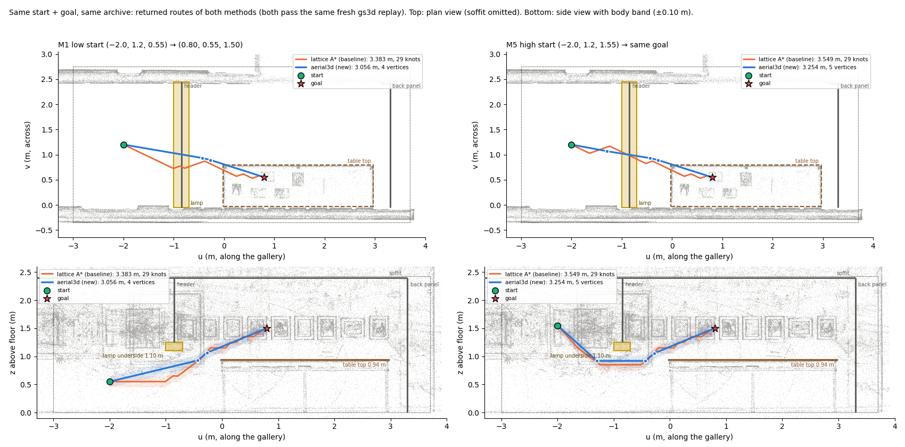

**新方法的「必须钻灯下」三联**：同一个高起点和终点，分别是 (a) 只有灯、(b) 设计好的展台、(c) 展台 + 堵板。(c) 里紫色点是割集上的 BLOCKED 叶子。
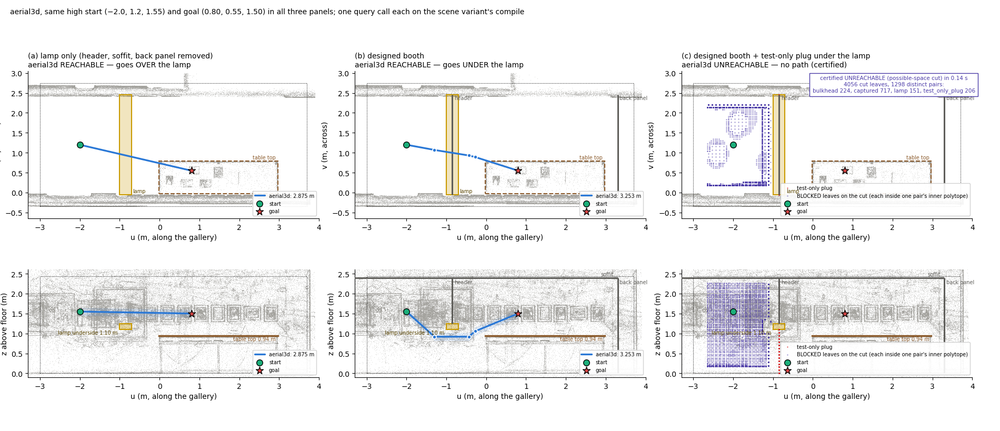

**EWA 照片级关键帧**：新方法的 M1 路线，橙色圆柱是 UAV 机体，取路线上 6 个位姿。墙 B 和吊顶已裁掉，镜头不在墙后。
- 侧视，另用细橙线叠加基线路线：
  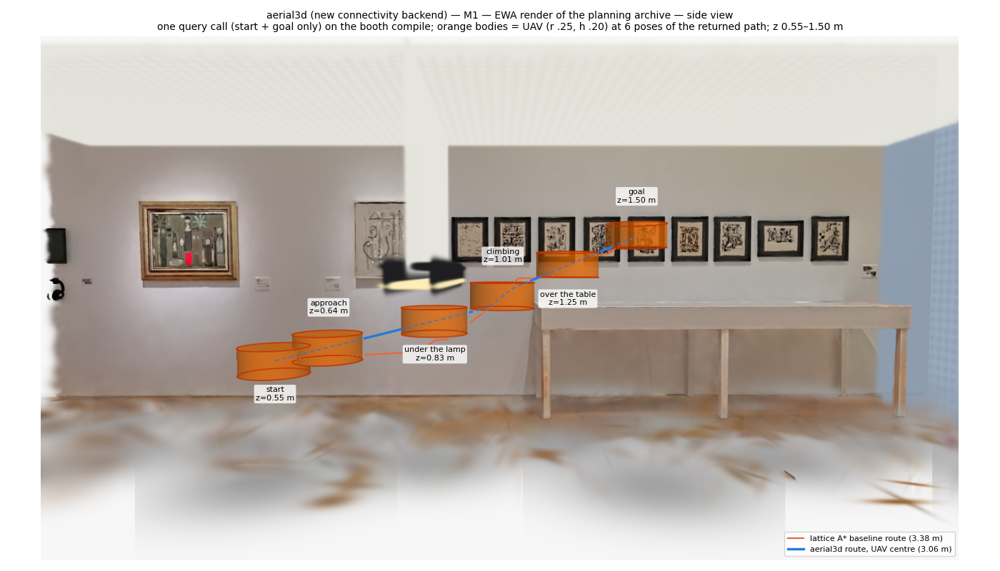
- 斜视：
  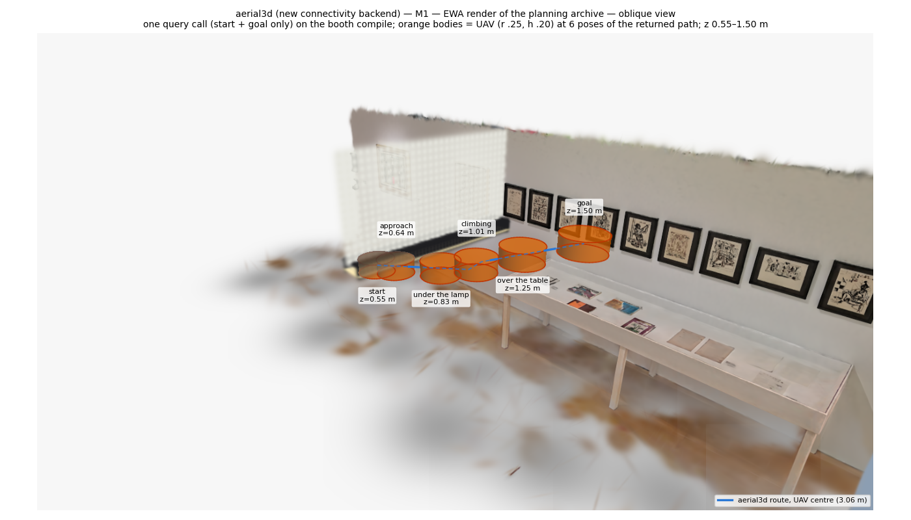
- 俯视（灯箱 x-ray 显示）：
  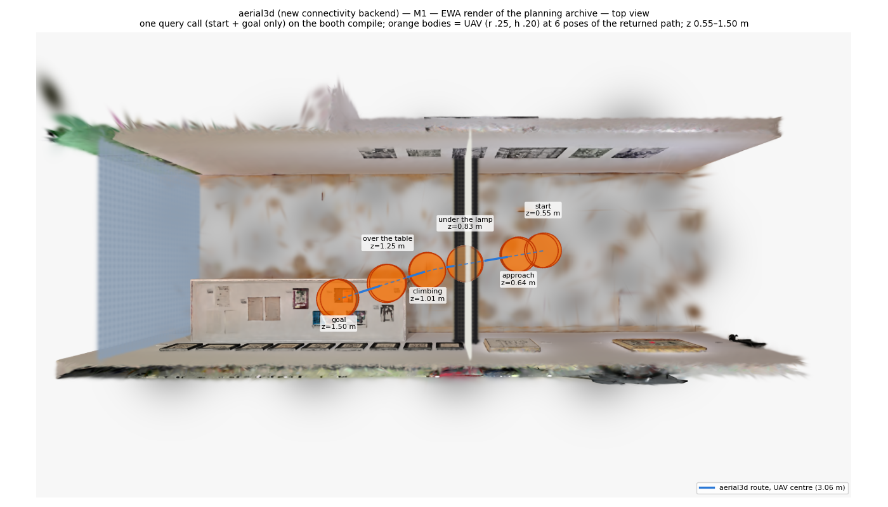

**飞行视频**：[`video/flythrough.mp4`](../gmc/results/uavconn/final/video/flythrough.mp4)（960×540，20 fps，0.68 MB，沿用 L2 的 `uavlamp_viz.flythrough`）。下面 4 帧是从编码好的 MP4 读回的：

| 起点（z 0.55） | 灯下（t 2.4 s，z 0.83） |
| --- | --- |
| 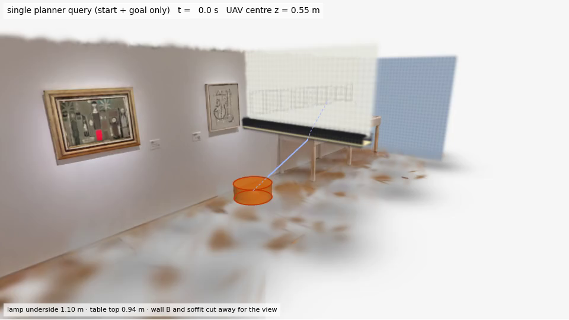 | 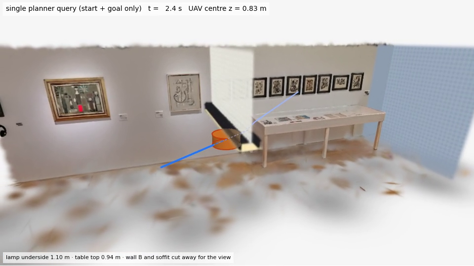 |
| **爬升（t 3.6 s，z 1.01）** | **终点（t 6.1 s，z 1.50）** |
| 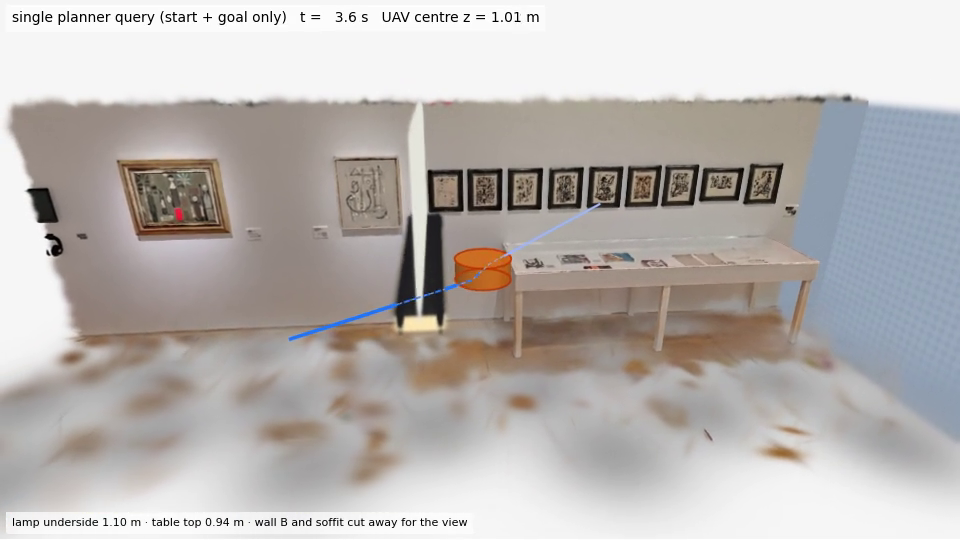 | 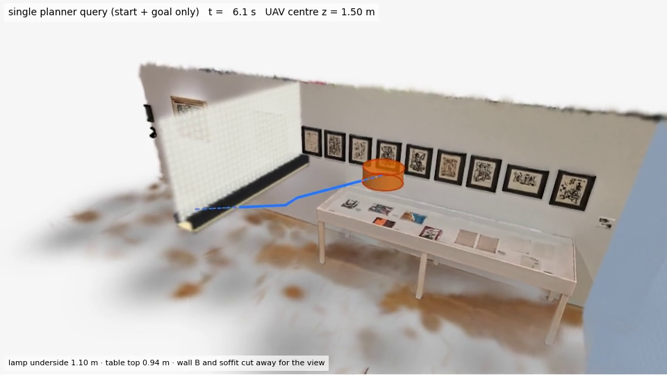 |

**耗时**：每个查询一行，对数横轴。空心蓝点表示新方法答 UNKNOWN，空心橙点表示基线预算停止，虚线是各场景的一次性编译时间。
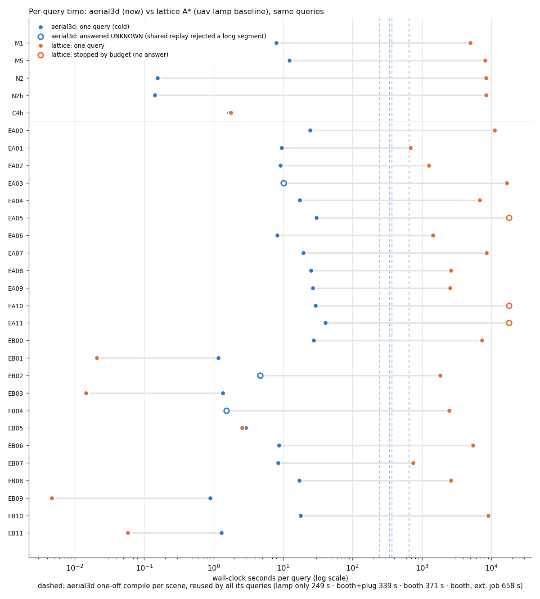

**平滑度**：两者都有路的 21 个查询，灰线连接同一个查询。
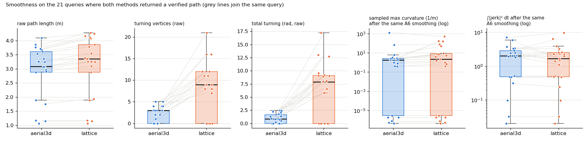

数据文件：
- [`comparison.json`](../gmc/results/uavconn/comparison.json)：逐查询的全部指标、真值、成功判定和计时；
- [`tables.md`](../gmc/results/uavconn/tables.md)：本报告里的表格，由 `experiments/uavconn_tables.py` 从 JSON 生成，没有手抄数字；
- [`runs/`](../gmc/results/uavconn/runs/)：每次运行的紧凑 JSON 副本，完整文件的 SHA-256 在 `MANIFEST.json`；
- [`extended/pairs.json`](../gmc/results/uavconn/extended/pairs.json)：扩展集的 24 对。

## 7. 复现

在 `gmc/` 下执行（Torch，cpu_short，资源为本次实际用量）。基线规格使用 L2 的 `configs/uavlamp_l2/*.json`，归档在 baseline 工作树里，只读。

```bash
S=hpc/uavconn; C=configs/uavlamp_l2; E=configs/uavconn_c2/ext; O=$PWD/outputs/uavconn/c2
# 新方法：每个场景编译一次，每个查询冷 1 次 + 热 3 次（2 CPU / 6 GB，约 5–35 min）
sbatch --job-name=uc_run_booth $S/c2_run.sbatch $O/aerial3d/booth $C/M1_main_low_start.json $C/M5_high_start.json
sbatch --job-name=uc_run_plug  $S/c2_run.sbatch $O/aerial3d/plug  $C/N2_plug_low_start.json $C/N2h_plug_high_start.json
sbatch --job-name=uc_run_lamp  $S/c2_run.sbatch $O/aerial3d/lamp  $C/C4h_lamp_only_high_start.json
# 基线 M1 单独重测（未改动的 uavlamp_run.py，一次 plan() 调用，2 CPU / 8 GB）
sbatch --job-name=uc_base_M1 --time=06:00:00 $S/c2_baseline.sbatch $PWD/$C/M1_main_low_start.json $O/baseline/M1_retime
# 扩展集：生成（种子 20260925）-> 新方法一次编译跑 24 对 -> 基线每对一个作业（5 h 预算，同时排队 <= 12）
sbatch $S/c2_pairs.sbatch
sbatch --job-name=uc_run_ext --time=02:00:00 $S/c2_run.sbatch $O/aerial3d/ext $(ls $E/*.json)
for n in $(ls $E | sed 's/.json//'); do
  sbatch --job-name=uc_base_$n $S/c2_baseline.sbatch $PWD/$E/$n.json $O/baseline/ext/$n; done
# 同一 A6 平滑（两种方法），每条曲线重新验证；--run method:name=result.json 可重复
sbatch $S/c2_smooth.sbatch --template $C/M1_main_low_start.json --out $O/smooth/booth \
  --run aerial3d:M1=$O/aerial3d/booth/l2_M1_main_low_start/result.json \
  --run lattice:M1=/scratch/wg2381/splathjb-uavlamp/gmc/outputs/uavlamp/l2/M1_main_low_start/result.json
# 事后诊断（不计入成功率）、图、对比表、单元测试
sbatch $S/c2_posthoc.sbatch outputs/uavconn/c2/posthoc $O/aerial3d/ext/c2_ext_{EA03,EB02,EB04}/result.json
sbatch $S/c2_viz.sbatch --out results/uavconn/final          # 4 CPU / 16 GB，约 6 min
PYTHONPATH=src:experiments python experiments/uavconn_compare.py --out results/uavconn
PYTHONPATH=src:experiments python experiments/uavconn_tables.py results/uavconn/comparison.json > results/uavconn/tables.md
sbatch $S/c2_pytest.sbatch                                      # gs3d + uavlamp + aerial3d + uavconn
```

实测资源：
- 新方法作业 MaxRSS 1.4–2.3 GB，墙钟 4.5 min（只有灯）到 34 min（扩展集 24 对）；
- 基线作业 0.3 min 到 5 h（预算）。

## 8. 局限（如实）

- **不是精确 3D 布尔排列。** 实现的是逐 pair 认证的支撑平面凸胞复形，连通性依赖 octree，完备性受最小盒 0.05 m 限制（uav.md §13.2 的情形）。窄通道会得到 UNKNOWN（窄切片测试里就是这样），不会得到错误的 UNREACHABLE。所有证书都是浮点保守的（声明了余量），不是精确算术。
- **UNREACHABLE 只在声明的盒子内成立。** N2/N2h 起点分量的剩余边界是盒子的 u_min 面，这是悬空面，与基线的假设相同。L1 把这个面外推 1 m 后路线不变，但 C2 没有重跑外推后的无路查询。
- **3 个 UNKNOWN 来自两个验证器的不一致。** 新方法的后处理（shortcut / 合并拐角）会产生很长的直线段。基线的共享 oracle 对整段扫掠体的世界 AABB 做已知空间检查，而这个检查对靠墙的长斜线段过于保守。把长段切细就能通过，但这是事后分析，没有作为预注册方法评估。若要修正，应作为全局规则写进方法后重新预注册。
- **耗时是在共享节点上测的，不是受控基准。** 同一个编译两次测得 371 s 和 658 s。基线 L2 的记录值（M5、N2、N2h、C4h）来自并发节点；只有 M1 由 C2 单独重测（4 985 s vs 6 117 s）。
  - 新方法的单次查询主要花在路径后处理上（最长 41 s），而不是图搜索。
  - 对只需一条直线的简单查询，基线快得多；新方法还必须先付约 4–11 min 的编译。
- **平滑度的结论分两半。** 原始路线的几何指标上新方法明显占优；经过同一个 A6 平滑器之后两者相当，jerk 互有胜负（8 : 7）。A6 平滑器在每个锚点缓停，所以 jerk 对锚点间距很敏感。
- **成功率样本小。** 24 对的 Wilson 95% 区间约为 69–96%，两种方法 21/24 的持平说明不了谁的成功率更高，只说明失败方式不同：新方法是 3 个 UNKNOWN，基线是 3 个预算停止。
- **只做了 Phase U0。** 没有偏航（§9）、动力学（Phase 6）、姿态、跟踪误差或气流。两种方法的 clearance 都贴着 0.050 m 余量（0.0500–0.0599），对证明有效，但不是飞行级安全裕度。
- **场景是编辑过的地图。** 灯箱 / 隔断 / 吊顶 / 背板是人为添加的，堵板仅用于测试（见 [`docs/uavlamp_report.md`](uavlamp_report.md) §8）。

## 附：单元测试

`sbatch gmc/hpc/uavconn/c2_pytest.sbatch`（job 18563059，commit `d8cd57b`）：gs3d + uavlamp + aerial3d + uavconn 共 **181 项，
0 失败，0 错误**（C1 的 169 项 + C2 新增 `tests/unit/test_uavconn_run.py` 12 项）。C2 新增的测试覆盖：
- 查询 API 只接受起点和终点；
- 一次编译服务多个查询，冷 / 热调用都记录；
- 基线的新建 oracle 回放与有序证据；
- 堵板场景得到认证 UNREACHABLE，割集按来源归属；
- 不同场景的规格拒绝共用编译；
- 航点类键被拒；
- 冻结哈希被强制检查；
- 窄切片上绝不错判 UNREACHABLE；
- 扩展集生成器（种子可复现、每个位姿由 oracle 认证无碰撞）；
- 两种方法用同一平滑，并重新验证。
