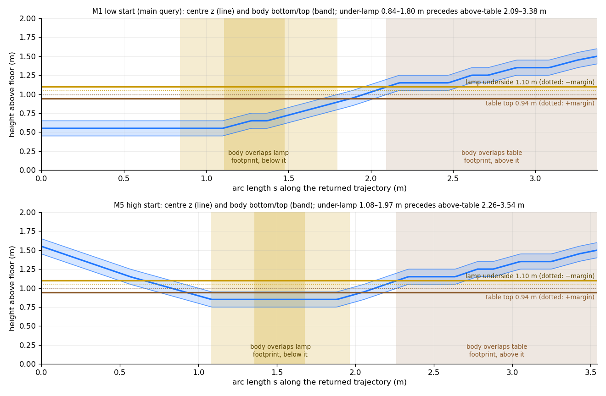
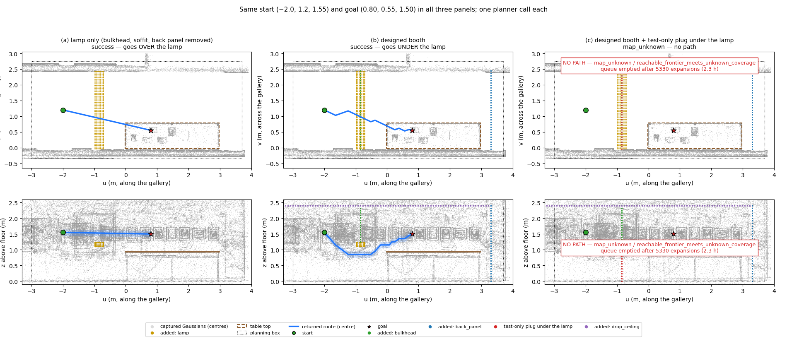
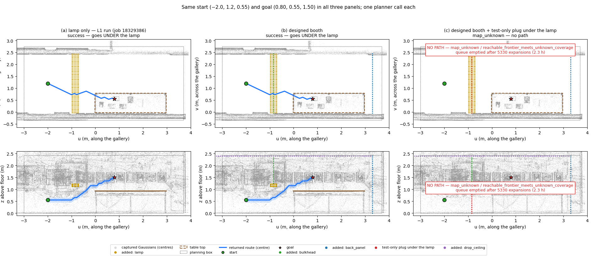
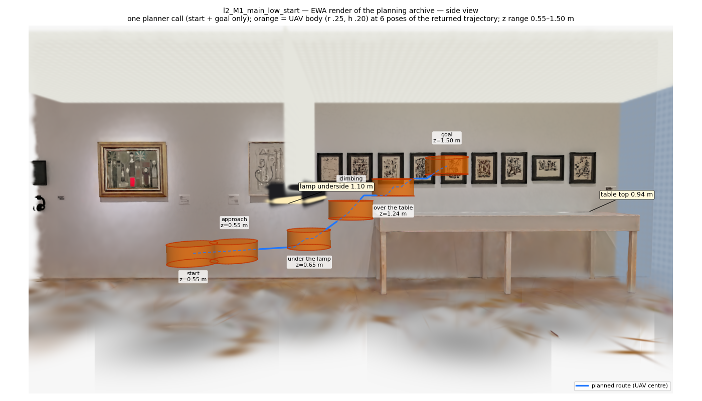
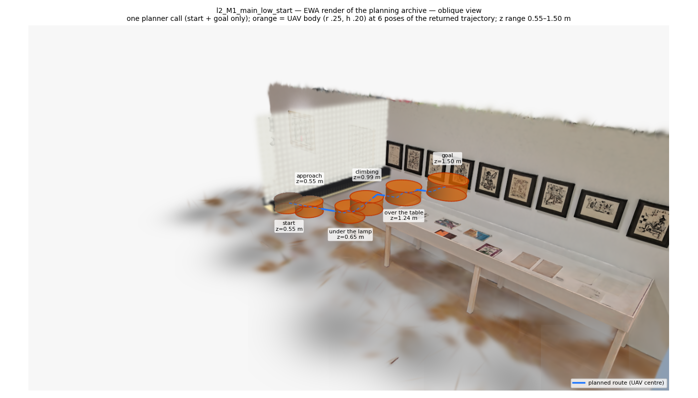
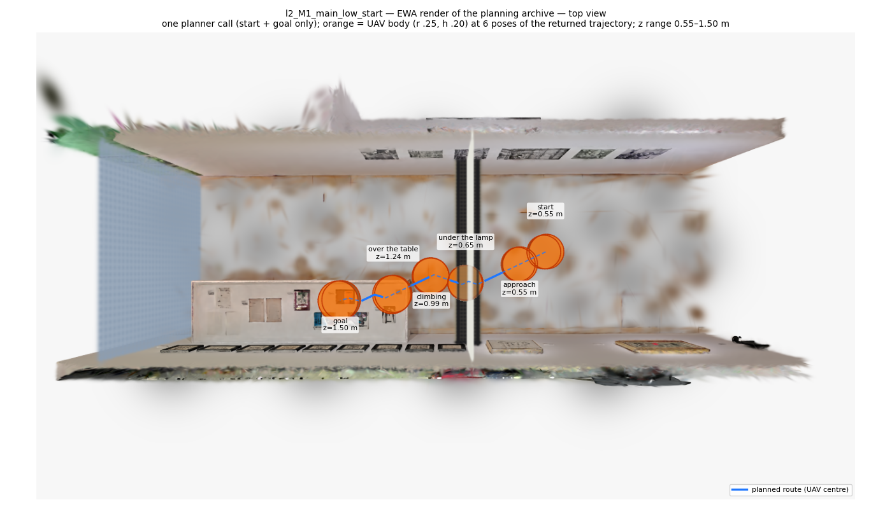
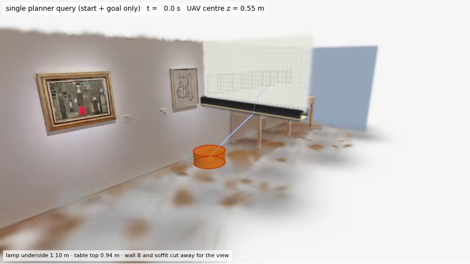
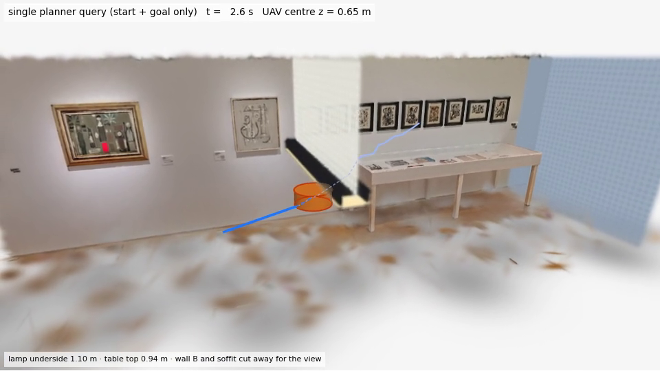
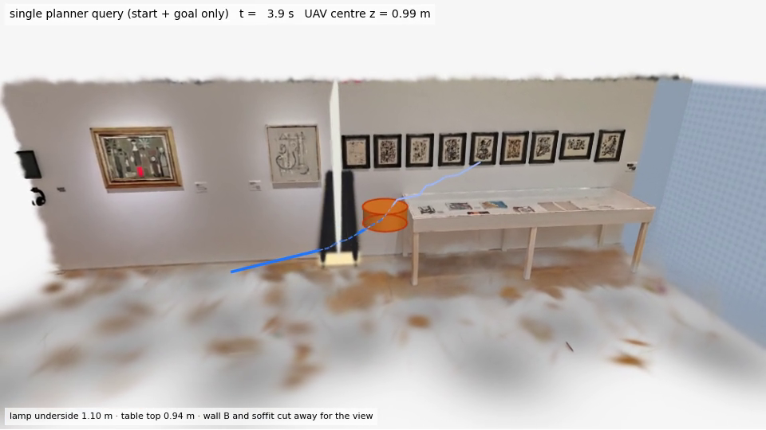
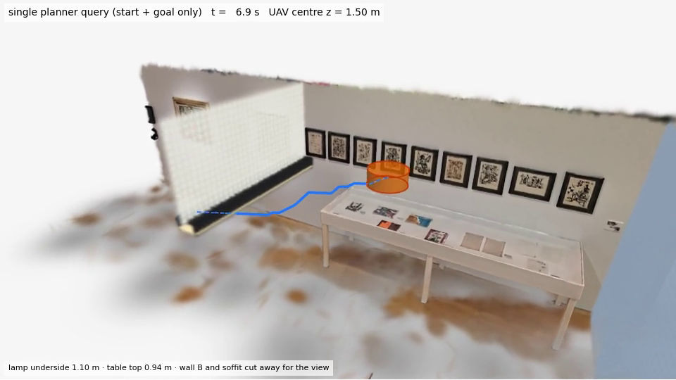

# 真实展厅 3DGS 场景：无人机一次查询先钻灯下再升到桌面上方（L2 报告）

## 一句话结论

在真实展示厅 3DGS 场景（加上有文字记录、物理上说得通的追加物）上，生产版 UAV 规划器**只调用一次**，
**只给起点和终点**（无航点、无分段 z 限制、无高度日程、无为演示加的代价项），返回的路线**先在灯箱下方低飞**
（中心 z 0.55–0.71 m，灯底 1.10 m），**再爬升到桌子上方**的终点（z 1.50 m，桌面 0.94 m）。这条路线用同一批
Gaussian 独立回放验证通过（clearance 下界 0.0500 m ≥ 余量 0.05 m）。把灯下开口堵住之后，同一查询穷尽
可达集合也找不到路；只留灯、去掉封堵时，高起点直接从灯上方飞过。这说明「必须钻灯下」是场景造成的，
不是某个隐藏约束造成的。

## 1. Codex 之前做了什么，为什么不算

Codex 的 gs3d 链（最终 `cba1433`，本分支的基点）实现了直接在 3D Gaussian 上做的 26 邻域 xyz A*
（`gmc/src/gmc/gs3d/planner.py` 的 `LatticePlanner`），这部分是真的，我们直接复用、没有改动。
但它在真实场景里的「先灯下、后越桌」演示**不是一次规划查询**：

- `gmc/experiments/gs3d_integration.py:124` 读取人工给定的航点
  `document["configuration"]["candidate_path_world_m"]`，`_plan_uav_mission`（同文件 `:97`）对相邻航点
  逐段规划再拼接。「先低后高」的顺序是人通过航点写进去的，规划器从未自己选择过。
- 它的「灯」（`gmc/src/gmc/gs3d/scene.py:80–82`，灯罩 + 吊杆 + 顶板）只是追加在开阔大厅里的 3 个
  Gaussian：旁边和上方都有空间，是纯局部障碍。只给低起点和高终点时，最短路没有任何理由从灯下走。
- `gs3d_scene.py` 给出的是「可行性见证走廊」，明确不是规划器结果。

## 2. 预判（L1 预注册）与是否成立

用户的预判：只给低起点和桌子上方的高终点，最短路不一定从灯下穿过；灯只是局部障碍，规划器很可能
直接爬高从灯旁或灯上方绕过去；要让「必须先钻灯下」自然出现，得像合成场景 F1 那样把其他路堵住。

L1 在跑之前把预测提交进了 git（`497ce43`，`docs/uavlamp_scene_design.md` §1），然后在 Codex 的原始
「只有灯」场景上各跑了一次单查询：

- Q1a（Codex 的起点，起点本来就在灯罩边缘下方）：走灯下，与 L1 的预测一致。但这不说明灯起了作用：
  起点–终点连线本来就在灯底下面。
- Q1b（起点后退 1.5 m）：L1 预测「从上方越过」（≈55%），**结果仍走灯下**，预测被推翻。原因是灯底
  1.05 m 高于起终点之间的自然爬升线。在 26 邻域格子上，「先平飞再 45° 爬升」和其他单调爬升等价，
  从灯下过不需要额外代价。
- **关键反事实**（L1 C4h，L2 复跑 job 18332119）：同一个设计场景，只保留灯（去掉隔断/吊顶/背板），
  从**高起点**出发，规划器直接走一条直线**从灯上方越过**（z 1.50–1.55 m，0 次扩展，直连边）。

结论：用户的判断在本质上是对的。Codex 那种局部灯**不强制**钻灯下：从高处出发就从上面过，从低处
出发只是碰巧顺路。要让「必须先钻灯下」成为唯一选择，必须靠场景把其他路堵死。

## 3. 场景设计（L1，本阶段未改动）

选址是展厅里两道**真实**的通高展墙之间的走廊（墙 A、墙 B，净宽约 2.3–2.4 m）。墙 A 旁有一张**真实**
的桌子，桌面高 0.92–0.94 m。坐标用走廊坐标系：u 沿墙 A，v 从墙 A 指向走廊内，z 为离地高度。

只做**追加**，原始 7 101 868 个 Gaussian 一个没删、逐字节不变（manifest 记录源文件 SHA-256
`a7931eab…3c60`）：

| 追加物 | 尺寸（m） | 现实依据 | 作用 |
| --- | --- | --- | --- |
| 灯箱（光带） | u −1.00…−0.70，横跨 v −0.05…2.45（两端各嵌入墙体 5 cm），底面 **1.10**，顶面 1.25 | 展台入口的门头灯箱 | 堵住「灯旁」 |
| 隔断（header） | u = −0.85，z 1.25…2.40 | 灯箱上方的封板 | 堵住「灯上方」 |
| 吊顶（soffit） | z = 2.40，u −4.20…3.30，墙到墙 | 展台局部吊顶 | 封顶 |
| 背板 | u = 3.30，z 0…2.40 | 展台背墙 | 封住走廊另一端 |

这样，放桌子和终点的展台由墙 A、墙 B（真实）、地面（真实）、吊顶、背板、隔断 + 灯箱（追加）围成，
**唯一开口是灯箱下方**（高约 1.07 m、宽约 2.3 m）。这就是 F1 的结构，只是 F1 用盒子边界当墙，
这里用真实的墙。

- 起点（低）：(−2.0, 1.2, **0.55**)；起点（高）：(−2.0, 1.2, **1.55**)。
- 终点：(0.80, 0.55, **1.50**)，在桌子近半部上方，机体底面比桌面高 0.46 m。
- 机体：直立圆柱，半径 0.25 m，半高 0.10 m，安全余量 0.05 m；格子分辨率 0.10 m。
- 规划盒：u [−3.0, 3.7]，v [−0.35, 2.75]，z [0, 2.43]。v 面和 u_max 面都放在真实墙/背板**后面**，
  z_min 是地面，z_max 是吊顶。**u_min = −3.0 是唯一一个悬在空气里的面**（走廊往南还有路），L1 把它
  外推 1 m（B6/B6h），路线完全不变。
- 渲染和规划读取的是**同一个**归档 `gmc/outputs/uavlamp/scene_v2/uavlamp_scene.npz`，SHA-256
  `2a3a72d610519095381a83fd741a61f32b420b20f39e0c5f60951e463fd596cc`（L2 重新计算，与 manifest 一致）。

## 4. 单次查询结果（L2 生产运行）

入口：`gmc/experiments/uavlamp_run.py`。它复用 L1 的 `build_scene` 和 gs3d 包，没有另起一套实现。
每个查询**只调用一次** `LatticePlanner.plan(scene, UAV, start, GoalRegion(goal), config)`。结果 JSON 的
`call_arguments_verbatim` 按实际传入的对象逐字记录全部参数：scene（盒子与 known space）、body、
start、goal（容差 0）、config（分辨率 0.10、余量 0.05、seed 0、预算）。没有航点，没有分段 z 限制，
没有高度代价项，规划器代码与 `cba1433` 相同。

所有行用的都是同一个归档 `2a3a72d6…96cc`，各行都只调用一次 `plan`。成功的路线由新建的 oracle 在重新构建的
索引上回放（`replay_plan`）。原始 JSON 在 HPC 的 `gmc/outputs/uavlamp/l2/`，压缩副本在
[`gmc/results/uavlamp/final/runs/`](../gmc/results/uavlamp/final/runs/)，完整文件的 SHA-256 见其中的 `MANIFEST.json`。

| 查询 | 场景 | 起点 → 终点（走廊坐标，m） | job | 状态 | 扩展数 | oracle 调用 | 算法耗时 | 路径长度 | z 范围 | clearance 下界 | 回放 |
| --- | --- | --- | --- | --- | ---: | ---: | ---: | ---: | --- | ---: | --- |
| **M1 主查询** | 设计好的展台 | (−2.0, 1.2, **0.55**) → (0.80, 0.55, 1.50) | 18332115 | **success** | 1293 | 5858 | 6 100–6 122 s | 3.383 m | **0.55–1.50** | 0.05004 | 通过 |
| **M5 高起点** | 设计好的展台 | (−2.0, 1.2, **1.55**) → 同上 | 18332116 | **success** | 1941 | 9327 | 8 142 s | 3.549 m | **0.85–1.55** | 0.05003 | 通过 |
| **N2 必要性** | 展台 + 灯下堵板（仅测试用） | 低起点 → 同上 | 18332117 | **无路**（队列耗尽） | 5330 | 23692 | 8 335 s | — | — | — | — |
| **N2h 必要性** | 展台 + 灯下堵板（仅测试用） | 高起点 → 同上 | 18332118 | **无路**（队列耗尽） | 5330 | 23311 | 8 410 s | — | — | — | — |
| **C4h 反事实** | 只有灯（去掉隔断/吊顶/背板） | 高起点 → 同上 | 18332119 | success，**从灯上方过** | 0（直连边） | 5 | 1.8 s | 2.875 m | 1.50–1.55 | 0.05001 | 通过 |

- M1、M5、C4h 返回的节点序列与 L1 交接文件 `l1_handoff.json` 里的 `knots_route` **完全一致**，扩展数也一样
  （1293 / 1941 / 0）。M1 的 4 次调用（1 次冷启动 + 3 次热启动）返回的轨迹哈希相同，调用参数也相同。
- N2 / N2h 的状态标签是 `map_unknown / reachable_frontier_meets_unknown_coverage`。这是**队列被耗尽**
  （A* 把从起点可达的每个格点都扩展完了），不是预算停止：墙钟预算是 20 700 s，实际用了约 8 300 s。之所以
  标成 map_unknown，是因为搜索边界碰到了盒子。按面统计，**全部 3 648（N2）/ 3 642（N2h）次 unknown 拒绝
  都落在 u_min 面上**，也就是起点身后、离灯 2 m、悬在空气里的那个面，墙、地面、吊顶、背板上一次也没有。
  其余拒绝是 3 578 次 occupied 和 7 853 / 7 851 次 unproven（安全下界 ≤ 余量，按不通过处理）。高、低起点
  耗尽的是同一个可达集合（扩展数都是 5330）。
- 实际传给 `plan` 的参数（摘自 `runs/M1_main_low_start.json` 的 `call_arguments_verbatim`）：scene（359 201
  个裁剪后的 Gaussian，τ 0.3，level 2，`RouteBoxKnownSpace` u [−3.0, 3.7] / v [−0.35, 2.75] / z [0, 2.43]），
  body（圆柱 r 0.25，半高 0.10，`uav_translation`），start（一个 xyz），goal（一个 xyz，位置容差 0），
  config（分辨率 0.10，余量 0.05，seed 0，预算）。关键字参数只有 `timer`（只计时，不影响搜索）。

### 只从轨迹本身提取的有序证据（`ordered_evidence`，按 0.02 s 采样轨迹，s 为弧长）

判据：「在灯下」指机体圆盘在平面上与灯箱投影重叠，且机体顶 + 余量 ≤ 灯底 1.10；「在桌上方」指机体圆盘与桌面
投影重叠，且机体底 − 余量 ≥ 桌面 0.94。

| 查询 | 在灯下区间 s（m） | 该区间中心 z | 其中中心在灯投影内 | 在桌上方区间 s（m） | 该区间中心 z | 先灯下后桌上 | 终点 z − 灯下最低 z | 与灯投影重叠但不在灯下的采样数 |
| --- | --- | --- | --- | --- | --- | --- | ---: | ---: |
| M1 | **0.84–1.80** | 0.55–0.90 | s 1.11–1.48，z 0.56–0.71 | **2.09–3.38** | 1.09–1.50 | **是** | 0.95 | 0 |
| M5 | **1.08–1.97** | 0.85–0.90 | s 1.36–1.68，z 0.85 | **2.26–3.54** | 1.09–1.50 | **是** | 0.65 | 0 |
| C4h（只有灯） | 无 | — | — | 1.78–2.88 | 1.50–1.52 | 否 | — | 82（全部在灯**上方**，s 0.78–1.59，z 1.52–1.54） |



高度剖面：粗线是中心 z(s)，色带是机体底到顶；金线是灯底，棕线是桌面，虚线是加减余量后的界限；
浅金色区间是「在灯下」（深金色表示中心在灯投影内），浅棕色区间是「在桌上方」。两条路线都是先进入金色区间，
后进入棕色区间。M5 从 1.55 m 先**下降**到 0.85 m 钻过灯底，再升回 1.50 m，这是 z 作为搜索变量最直接的证据。

### 计时

计时用的是 A4 的 `gmc.gs3d.timing`：`algorithm_wall_s` 由规划器自己在 `plan()` 入口到结果组装完成之间测量，
不包括归档读取/哈希（1.37 s）、裁剪（0.60 s）、渲染、回放（0.88 s），也和轨迹的物理时间（M1 6.92 s，
控制 dt 0.05 s）无关。

| M1 调用 | 模式 | 索引准备 | 算法耗时 |
| --- | --- | ---: | ---: |
| cold0 | 冷启动（索引构建计入算法耗时） | 计入内部 | 6 122.3 s |
| warm0 / warm1 / warm2 | 热启动（复用预先建好的索引） | 0.93 s（单独计时） | 6 117.3 / 6 102.5 / 6 100.3 s（p50 6 102.5 s） |

- 冷、热只差约 20 s：真实杂物中的耗时几乎全在搜索里（约 4.7 s/次扩展，70 万对体–Gaussian 精确检测），
  索引构建不到 1 s。
- **说明**：4 次 M1 调用是在同一节点（cs614）上用 fork 出的 4 个进程**并行**跑的，每个进程 1 个 CPU。
  顺序跑要约 6.8 h，超过 cpu_short 的上限。同一节点上当时还有 M5/N2/N2h 共 7 个单线程搜索在跑，所以本次
  耗时比 L1 单独跑时长（M1 5 902 s → 约 6 100 s，M5 6 595 s → 8 142 s），存在内存带宽竞争。这些数字是
  这个负载下测到的墙钟时间，不是基准测试。

### 平滑（可选，在原始路线验证之后）

job 18332346：A6 的 `optimize_trajectory` 作用在**已验证的**原始 M1 路线上（23.5 s）。平滑结果被选中
（`smoothed_verified`），随后又用新建的 oracle 和新索引对连续 Bezier 曲线做了一次独立复验：通过，
`continuous_bound`，clearance 下界 0.05009 m。平滑后路线长 3.13 m，物理时长 14.3 s（原始 6.9 s；曲率和
动力学界更紧），z 范围 0.545–1.50。在灯下区间为 s 0.80–1.69（z 0.57–0.91），在桌上方为 s 1.95–3.13，
仍是先灯下后桌上。**主结论以原始路线为准**，平滑路线只是附加结果，原始路线作为后备保留
（`runs/M1_smooth.json`）。

## 5. 为什么必须从灯下走：三联图



三列用同一个高起点 (−2.0, 1.2, 1.55) 和同一个终点 (0.80, 0.55, 1.50)，每列一次规划调用，全部由 L2 重新运行：

- **(a) 只有灯**（C4h，job 18332119）：起点到终点的直连边本身就是空的，规划器 0 次扩展，直接在 z 1.50–1.55
  从灯**上方**飞过。这就是用户预判的情况：局部的灯不会逼规划器从下面走。
- **(b) 设计好的展台**（M5，job 18332116）：上方被隔断和吊顶封住，两侧是真实的墙，规划器自己选择**先下降**到
  0.85 m 钻过灯底，再升到桌子上方。
- **(c) 展台 + 仅测试用的灯下堵板**（N2h，job 18332118）：**无路**，5 330 次扩展后队列耗尽，unknown 全部在
  u_min（空气面）。换成低起点（N2，job 18332117）结果相同。

所以在这个场景里，灯下开口是起点区域通往终点区域的唯一连接。补充证据来自 L1：边界扫描时，墙 A/B、吊顶、
背板、灯 + 隔断共 2 923 次连续扫掠穿越全部被挡，只有灯下开口有 85 次能通过；把 u_min 面外推 1 m 后
（B6/B6h），路线完全不变。

低起点版本（同样三联，(a) 为 L1 的运行）：


## 6. 可视化

所有渲染都来自规划用的同一个归档（EWA 光栅化真实 Gaussian）。UAV 机体用解析圆柱按深度与 splat 合成，
所以被前景遮挡时会真的被挡住。路径折线可见处画实线，被遮挡处画虚线。为了不让墙挡住镜头，裁掉了
墙 B（v > 2.22）以及俯视/斜视图中的吊顶（z > 2.34）。

**照片级关键帧**（EWA，M1 路线，橙色圆柱为 UAV 机体，取轨迹上 6 个真实位姿：起点 / 接近 / 灯下 / 爬升 /
桌上方 / 终点）：

侧视（相机在被裁掉的墙 B 外侧，灯底、桌面和路径高度在同一画面里）：


斜视（从桌子那一端回看灯箱）：


俯视（去掉吊顶；灯箱画在 UAV 上方，按 x-ray 半透明显示）：


**飞行视频**：[`flythrough.mp4`](../gmc/results/uavlamp/final/flythrough.mp4)（960×540，20 fps，17 s，0.77 MB，
SHA-256 见 `viz_manifest.json`）。镜头从起点身后绕到展台侧面并跟随 UAV，墙 B 和吊顶已裁掉，镜头不在墙后。
下面 4 帧是**从编码好的 MP4 中读回**的：

| 起点（z 0.55） | 灯下（t 2.6 s，z 0.65） |
| --- | --- |
|  |  |
| **爬升（t 3.9 s，z 0.99）** | **终点（t 6.9 s，z 1.50）** |
|  |  |

**交互式 3D**：[`route_3d.html`](../gmc/results/uavlamp/final/route_3d.html)（plotly，下载后用浏览器打开；包含
路线附近 4 万个 Gaussian 中心的子样本，以及 M1、M5 两条路线）。

## 7. 复现

在 `gmc/` 下执行（Torch，cpu_short；资源为本次实际用量）：

```bash
S=hpc/uavlamp/l2_run.sbatch; C=configs/uavlamp_l2; O=outputs/uavlamp/l2
sbatch --job-name=ul_m1  --cpus-per-task=4 --mem=16G --time=05:00:00 $S $C/M1_main_low_start.json --cold 1 --warm 3 --output $O/M1_main_low_start
sbatch --job-name=ul_m5  --cpus-per-task=2 --mem=8G  --time=04:00:00 $S $C/M5_high_start.json --warm 1 --output $O/M5_high_start
sbatch --job-name=ul_n2  --cpus-per-task=2 --mem=8G  --time=04:00:00 $S $C/N2_plug_low_start.json --warm 1 --output $O/N2_plug_low_start
sbatch --job-name=ul_n2h --cpus-per-task=2 --mem=8G  --time=06:00:00 $S $C/N2h_plug_high_start.json --warm 1 --output $O/N2h_plug_high_start
sbatch --job-name=ul_c4h --cpus-per-task=2 --mem=8G  --time=00:30:00 $S $C/C4h_lamp_only_high_start.json --warm 1 --output $O/C4h_lamp_only_high_start
sbatch --job-name=ul_smooth --cpus-per-task=2 --mem=8G --time=02:00:00 $S $C/M1_main_low_start.json --smooth-from $O/M1_main_low_start/result.json --output $O/M1_smooth
sbatch hpc/uavlamp/l2_viz.sbatch --out results/uavlamp/final      # 4 CPU / 16 GB，约 6 min
sbatch hpc/uavlamp/l2_pytest.sbatch                               # gs3d + uavlamp 单元测试
```

实测 MaxRSS 为 1.4–2.9 GB；M1 墙钟 1 h 42 min，M5/N2/N2h 约 2 h 16–20 min。场景归档需先按 L1 的方式构建
（`experiments/uavlamp_build.py`，见 `docs/uavlamp_scene_design.md`），加载时会按 manifest 校验 SHA-256。
单元测试：`test_uavlamp_run.py`（9 项：单次调用契约、冷/热调用、拒绝航点类参数、堵板耗尽、有序证据提取）；
gs3d + uavlamp 全部 **98/98 通过**（job 18332120）。

## 8. 局限（如实）

- **编辑后的地图 ≠ 真实房间。** 墙、地面、桌子是真实采集的；灯箱、隔断、吊顶、背板是追加的展台构造，
  展厅里并不存在。灯底 1.10 m 对人来说是齐头高，选这个高度是为了让灯下中心比终点低 ≥ 0.5 m，同时仍高于桌面。
  追加的面板渲染时能看到 8 cm 的格点纹理。原始 7 101 868 个 Gaussian 逐字节不变。
- **格子分辨率。** 搜索在以起点为锚点的 0.10 m xyz 格子上进行（26 邻域）。「无路」是格子意义上的：
  unproven 的边按不通过处理（N2：7 853 次）。更细的格子或更不保守的下界理论上可能找到一条缝。L1 的边界
  连续扫掠（0.10 m 网格，2 923 次穿越，0 次通过）是更强的证据，但也不是网格线之间的连续空间证明。
- **哪些是认证过的，哪些是采样的。** 碰撞安全是**认证**的：扫掠圆柱对完整协方差椭球的连续下界，规划器验证
  一次，独立回放再验证一次；平滑曲线用 Bezier 凸包连续验证。「灯下 / 桌上方」区间和先后顺序是在 0.02 s
  **采样**的轨迹上算的，边界位置的精度约为一个采样间距（≤ 1 cm）。
- **悬空的盒子面。** u_min = −3.0 是唯一一个不贴着场景表面的盒子面。N2/N2h 的 unknown 拒绝全部在这个面上。
  L1 把它外推 1 m（B6/B6h），路线不变；L2 没有重跑 B6。「从 u_min 绕出去再回到展台」需要穿过一道已被扫描证明
  封闭的边界。
- **余量很紧。** 两条成功路线的 clearance 下界都约等于 0.0500，即贴着 0.05 m 余量飞。这对证明是有效的，但不是
  飞行级的安全裕度。没有模拟姿态、跟踪误差、气流和闭环控制。
- **耗时。** 真实杂物中一次查询要 1.7–2.3 h（单线程，4.2–4.7 s/次扩展）。计时是在节点上有并发负载时测的
  （见计时一节）。
- **N2 标签。** 必要性查询的状态是 `map_unknown`，不是 `no_path_on_lattice`。按面统计已说明 unknown 只来自
  空气面 u_min，但标签本身没有改写。
