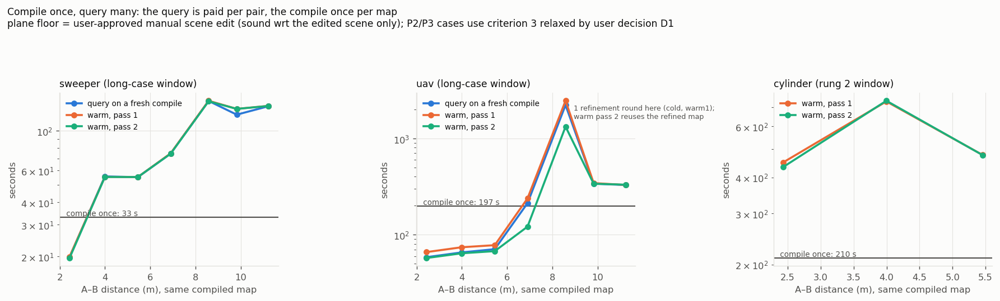
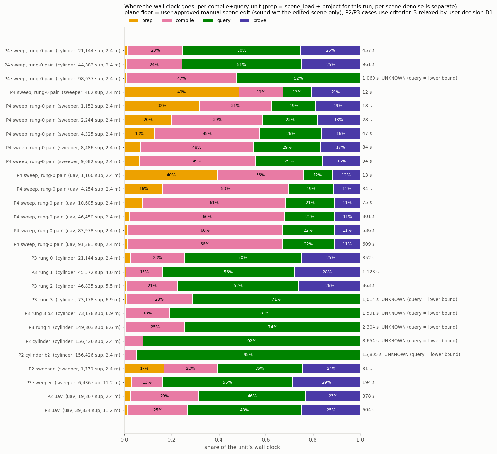
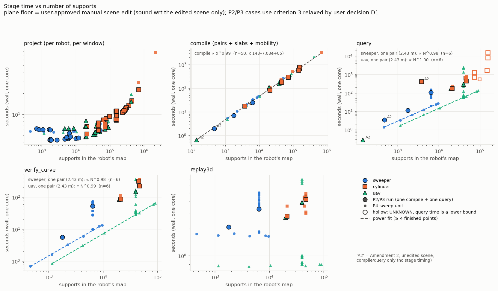

# Where the wall clock goes: stage timings and GMC's efficiency (Amendment 3 §P4)

**Claims boundary (applies to every number here):**
- The plane floor is a **user-approved manual scene-definition change** (Amendment 3 P1). It is not a
  reconstruction method and not a guaranteed outer approximation. Results are sound with respect to the
  edited scene only.
- The P2/P3 cases, and the P4 sweep pairs taken from them, rest on criterion 3 **relaxed by user
  decision D1** (`r + 0.05` m on each robot's own certified map). Criteria 1 and 3 intersect in
  **0.9 m²** of the hall as built and **1.2 m²** with every phantom cell deleted.
- Amendment 2's three runs (marked **A2**) are on the unedited scene with the Amendment 1 floor rule.
  They predate `timing.py`, so they enter the compile and query series only.
- τ = 0.3, ρ = 2.0, the robots, `configs/height_showcase.yaml` (including its 50 M support-call and
  7,200 s query budgets), GMC, `verify_curve` and `replay3d` are untouched. P4 only timed them.

Every number below comes from `gmc/results/height/timing/tables.md` or `timing_report.json`, both
machine-written by `experiments/plane_timing_report.py` from the run JSONs and the sweep's JSONL.

## The answer, before the detail

The user asked for the time of each stage, *"从降噪处理到真实的算法进行路径选择，再到证明路径的可行性、连通性，
再到证明算法本身的效率"*.

1. **降噪 / scene prep costs ≈ 25 s, once per scene.** Projecting one robot's map adds 4–5 s plus
   ~30 µs per support, once per robot and window. Together they are **0.1–3 %** of any planning run.
2. **Path selection: compile once per map, query once per pair. The query is not the cheap part.**
   - **Compile** is linear: **4.6 ms per support** (n = 50 compiles, 143–703,015 supports).
   - **Query:** in every finished single-job hall run the first query took **1.6–4.3×** the compile.
   - **A second query on the same compiled map costs what the first did.** 61 of the sweep's 63
     queries refined nothing, and on the same pair warm ÷ cold time is 0.99–1.08 (sweeper) and
     0.95–1.13 (uav).
   - **The query is linear in the whole map's size, not in the route's neighbourhood.** At one fixed
     2.43 m pair, query ∝ N^0.98–1.00 (n = 6 per robot, R² 1.000).
3. **Proving the path costs half a query.** `verify_curve` = **0.47–0.52 × query** in 66 of the 69
   finished, timed units (62 sweep queries + 7 single-job runs). The exception is the one pair whose query refined the map. `replay3d` takes a few
   seconds.
4. **Efficiency: compile ∝ N^0.99, query ∝ N at a fixed pair.** The query also grows with distance
   (sweeper ∝ d^1.25 on one map) and depends strongly on the route.
   - **What binds first is the query's frozen 50 M support-call budget,** not the compile, the memory
     or the wall clock.
   - On the cylinder's hardest measured pair, 993 calls per support caps its map at **≈ 50 k
     supports**, however short the route. That is exactly where P3's ladder stopped.



## 0. What was measured

| source | what it is | units | stage timing |
|---|---|---|---|
| P2 shared case | one job per robot: project → compile → query → verify → replay3d | 4 (incl. the cylinder `BUDGET=2` retry) | all nine P1e stages |
| P3 long case + cylinder ladder | same | 8 (incl. rung 3 `BUDGET=2`) | all nine |
| A2 (Amendment 2) | same pipeline, unedited scene | 3 | `compile_seconds` / `query_seconds` only |
| P2/P3 searches | `scene_load` + many `project` calls | 94 projection records | `scene_load`, `project` |
| **P4 timing sweep 17965980** | the one dedicated sweep (below) | 63 queries (42 on the sweeper/uav fixed map, 6 cylinder warm, 15 window series; 62 finished), 3 one-off compiles for the warm passes, 3 compile-only, 3 hall projections, the prep chain | all nine, plus GMC's own query report |

- All times are **wall clock on one core**. GMC is single-threaded: the P2 cylinder used 0.99 of 8 cores.
- This cluster's `sacct` reports `TotalCPU = 0` for every job, so wall time is the only time there is.
- The 15 single-job runs landed on four node families (cs6xx, cl01x, gr104, gl060).
- The sweep ran on one node, cs616 (Intel Xeon Platinum 8592+), with four lanes side by side: 4 h 08 m,
  MaxRSS 18.5 GB.
- **Calibration:** the sweep repeated P3's two long-case runs exactly. Against P3's cs601 it ran
  **1.30× slower** (sweeper: compile 32.5 vs 25.0 s, query 136.7 vs 107.5 s) and **1.11–1.12× slower**
  (uav).
- Cold compiles of one map vary by CV **0.5 %** (sweeper, 7 compiles) and **1.4 %** (uav, 7).
- So comparisons inside the sweep are tight. Fits that pool the sweep with single-job runs carry a
  factor of up to ~1.3 of node noise.

### Why a sweep, and what it did

The runs alone could not separate the three axes the prompt asks for:
- **Window, supports and distance moved together**: P3's ladder grew window and distance at once, and
  the other runs differ in robot, site and scene.
- **Every run was one compile followed by one query.**
- **`run.compile_and_query` drops GMC's query report**, so no run said whether its query refined the
  map. `mobility.query.query` can: on an UNKNOWN attempt it calls `refine_compiler`, which bisects an
  orientation slab and rebuilds the derived graph in place. So "compile once, query cheaply" had to be
  measured.

`experiments/plane_timing.py` (self-test on `synth3d` first) ran four single-core lanes:
- **prep:** the per-scene chain step by step; hall-wide projections for all three robots; compile-only
  on 51 k, 422 k and 703 k-support maps.
- **cyl:** the cylinder on one pair (ladder rung 0, 2.43 m) while the window grows 7.2 → 116 m².
  It stops at the first UNKNOWN, as P3's ladder did.
- **sweeper** and **uav:**
  - on the long case's map (83.9 m²), 7 goals at 2.43–11.24 m. **Warm**: one compile, then all 7
    queries, then all 7 again. **Cold**: a fresh compile per goal.
  - then the rung-0 pair on a window grown 7.2 → 144 m² (D2's 12 × 12).
- The sweeper lane also ran the **cylinder warm** experiment: rung 2's map (46,835 supports) with the
  goals of rungs 0–2, twice.

## 1. 降噪 / scene prep: once per scene

| step (P4 sweep, one core) | seconds | what it does |
|---|---|---|
| PLY decode | 5.2 | 7,340,008 rows → 7,319,425 finite splats |
| floor fit, gravity rotation, crop | 2.1 | — |
| Amendment 1 floor rule | 10.6 | −71,594 splats |
| five band rasters + phantom test | 3.5 | 397,047 cells at 0.05 m, 94,780 phantom |
| plane-floor replacement | 2.1 | −146,977, +1,014 plane tiles → 7,101,868 |
| npz write | 0.7 | 0.80 GB |
| npz load (what every run pays) | 0.7 | — |
| **total, once per scene** | **≈ 25 s** | — |

- **The timed rebuild reproduced P1 exactly:** every count matches (`checks.all_match: true`).
- **Projection is per robot and per window.** It scans all 7.1 M splats whatever the window, so it is a
  fixed cost plus a per-support term. Linear fits over every recorded projection:

  | robot | fixed cost | per support | n | R² |
  |---|---|---|---|---|
  | cylinder | 4.0 s | 32 µs | 39 | 0.98 |
  | uav | 4.9 s | 29 µs | 27 | 0.88 |
  | sweeper | 4.8 s | 38 µs | 28 | 0.37 |

  The sweeper's maps are too small to move its time off the fixed scan.
- **Whole hall:** 7.4 s (sweeper, 51,499 supports), 19.4 s (uav, 421,853), 75.8 s (cylinder,
  2,148,885).
- **Denoising and projection are not where the time goes.** In the single-job runs, scene load +
  projection is **0.1–3.2 %** of the unit's wall clock. Only on maps of ~0.5–2 k supports does it
  reach 16–49 % (P2 sweeper, the sweep's smallest windows), and those units take 12–34 s in total.

## 2. Path selection: compile vs query

### 2a. The single-job runs

| run | robot | supports | A–B m | compile s | query s | query ÷ compile | status |
|---|---|---|---|---|---|---|---|
| A2 | uav | 143 | 4.15 | 0.6 | 0.3 | 0.43 | certified |
| A2 | sweeper | 477 | 2.02 | 2.0 | 3.4 | 1.76 | certified |
| A2 | cylinder | 3,791 | 2.69 | 17.3 | 409.4 | **23.65** | certified |
| P2 | sweeper | 1,779 | 2.36 | 7.0 | 11.3 | 1.62 | certified |
| P2 | uav | 19,867 | 2.36 | 108.5 | 171.9 | 1.58 | certified |
| P3 | sweeper | 6,436 | 11.24 | 25.0 | 107.5 | 4.29 | certified |
| P3 | uav | 39,834 | 11.24 | 153.4 | 292.9 | 1.91 | certified |
| P3 rung 0 | cylinder | 21,144 | 2.43 | 81.0 | 174.8 | 2.16 | certified |
| P3 rung 1 | cylinder | 45,572 | 4.00 | 174.7 | 628.8 | 3.60 | certified |
| P3 rung 2 | cylinder | 46,835 | 5.45 | 185.0 | 445.0 | 2.41 | certified |
| P3 rung 3 (+`BUDGET=2`) | cylinder | 73,178 | 6.90 | 283.9 / 293.8 | ≥ 722.5 / ≥ 1,289 | ≥ 2.5 / ≥ 4.4 | UNKNOWN |
| P3 rung 4 | cylinder | 149,303 | 8.58 | 581.0 | ≥ 1,714 | ≥ 2.95 | UNKNOWN |
| P2 (+`BUDGET=2`) | cylinder | 156,426 | 2.36 | 675.7 / 766.4 | ≥ 7,968 / ≥ 15,027 | ≥ 11.8 / ≥ 19.6 | UNKNOWN |

**The prompt expected the compile to be expensive and the query cheap. The data say otherwise:**
- In every finished hall run the query took **1.6–4.3×** as long as the compile, and 24× for the A2
  cylinder.
- Only the 143-support A2 uav map queried faster than it compiled.

### 2b. Compile once, query many (the sweep)

Same compiled map, same goals, in three modes: a fresh compile per goal (cold), then warm passes 1 and
2 on one map.

| map | compile once | query, 2.43 → 11.24 m (cold) | warm ÷ cold | refinement rounds |
|---|---|---|---|---|
| sweeper, long-case window, 6,436 supports | 33.0 s | 19.8 → 136.7 s | **0.99–1.08** | 0 in all 21 queries |
| uav, same window, 39,834 supports | 197 s | 58.4 → 327.7 s | 0.95–1.13, except below | 0 in 19 of 21 |
| cylinder, rung 2 window, 46,835 supports | 210.5 s | 451 / 732 / 479 s at 2.43 / 4.00 / 5.45 m (warm 1) | pass 2 ÷ pass 1 = **0.96–1.01** | 0 in all 6 |

- **A compiled map is reusable; the query work is not.** 61 of the sweep's 63 queries refined nothing.
  Their support-call counts are identical in cold, warm 1 and warm 2 (e.g. 1,613,550 calls for the sweeper at
  11.24 m, all three times), and so are their times.
  - A query on a compiled map does its own certified lifting of the route from scratch. There is no
    deferred compile work for a first query to pay and a second to reuse.
- **The one exception shows what refinement costs.** The uav's 8.58 m pair needed **1 refinement
  round** (1 → 2 orientation slabs): 2,214 s cold and 2,454 s warm (pass 1), against 212–338 s for its
  neighbours. The refined map was kept, and on warm pass 2 the same pair took **1,323 s (−46 %)**.
  The 6.90 m pair, re-queried on the refined map, dropped from 238 to 121 s. So refinement is
  compile-like work that *is* reused, but only this one pair needed it: 2 of 63 queries.
- **Query ÷ compile on a warm map** (median over the 7 goals):
  - sweeper 1.68;
  - uav 0.48–0.80;
  - cylinder 2.27 (the only 3 goals, so no fit).

  Even warm, one query on these maps costs about half of one compile up to more than two compiles.



## 3. Proving the path: verify_curve and replay3d

- **`verify_curve` costs half a query.** It is the independent 2D re-check of the lifted route against
  every support pair.
  - It is **0.47–0.52 × query** in 66 of the 69 finished timed units: 3 robots, 462–46,835 supports,
    2.4–11.2 m, single runs and sweep alike.
  - The 3 exceptions are the uav's refining 8.58 m pair: 0.14 and 0.16 with the refinement, 0.26 on
    the refined map. There the query did work that verification does not repeat.
  - The query itself runs a SAFE → verify → refine loop and certifies its lifted path before returning
    it (`mobility/query.py`). The constant ratio is consistent with about half of every non-refining
    query being one certification pass of the same size as `verify_curve`'s. That is an inference from
    the ratio. `mobility/` is read-only, and the query's internals were not timed.
  - `verify_curve` scales like the query: ∝ N^0.98 (sweeper) and N^0.99 (uav) at the fixed pair
    (n = 6 each, R² ≥ 0.999); ∝ d^1.26 on the sweeper's fixed map (n = 7, R² 0.93).
- **`replay3d` is a few seconds:** 0.8–7.1 s against 7.1 M splats in 3D, growing loosely with route
  length. That is **0.4–1.7 %** of a single-job unit; 6.7 % of the 31 s P2 sweeper run. It is the check
  that the route clears the room's own 3D geometry, not just its projection, and it is the cheapest
  stage in the pipeline.
- **Proving (verify + replay3d) is 23–29 % of every finished single-job unit.** On the sweep's
  fixed-pair series it is 11–25 %. It is never the dominant stage.
- **Connectivity** in the D1 sense (start and goal in one component of `dist > r`) is a raster
  pre-check on the certified map, not a GMC stage. The sweep timed it with the raster in
  `d1_raster_seconds` of each `dist/project` row. The formal proof of connectivity *is* the certified
  route: REACHABLE + `verify.certified` + `replay3d.passed`, the three stages above.

## 4. Efficiency of the algorithm: growth rates

Every fit is on finished, measured units only, with at least 4 points. UNKNOWN runs are lower bounds
and are never fitted.

| stage | what varies | fit | n | range | R² |
|---|---|---|---|---|---|
| compile (all three sub-stages) | supports | **t = 0.00481 · N^0.99** (linear: 4.61 ms per support) | 50 | 143–703,015 | 0.997 |
| — single-job runs only | supports | t = 0.00436 · N^1.00 | 15 | 143–156,426 | 0.998 |
| `compile_slabs` | supports | t = 0.0050 · N^0.99, **95.7–96.8 %** of compile (all 47 timed compiles) | 47 | 462–703,015 | 0.996 |
| `compile_pairs`, `compile_mobility` | supports | N^1.03 each, ~2 % of compile each | 47 | 462–703,015 | ≥ 0.996 |
| project | supports | 4.0–4.9 s + 29–38 µs · N | 27–39 per robot | 700–2.15 M | 0.37–0.98 |
| query, one pair (2.43 m) | supports | sweeper **N^0.98**, uav **N^1.00** | 6 + 6 | 462–9,682; 1,160–91,381 | 1.000 |
| query, one pair, cylinder | supports | **no fit (n = 2)**: 229 s at 21,144, 487 s at 44,883, UNKNOWN at 98,037 | 2 | — | — |
| query, one map | A–B distance | sweeper **d^1.25** (cold; warm d^1.27–1.28) | 7 | 2.43–11.24 m | 0.93 |
| query, one map | A–B distance | uav d^1.65–1.75, **R² 0.51–0.58**: route-dependent, see §2b | 7 | 2.43–11.24 m | ≤ 0.58 |
| query, across single-job runs | supports | cylinder N^0.09, **R² 0.04**; sweeper and uav **no fit (n = 3)** | 4 | 3,791–46,835 | 0.04 |
| verify_curve | supports / distance | as the query (§3) | 6 / 7 | — | ≥ 0.93 |
| window area | area, one pair | sweeper: supports ∝ A^1.00, so compile and query ∝ A^1.0; uav: supports ∝ A^1.49 (the window grows into denser ground), compile and query ∝ A^1.5 | 6 + 6 | 7.25–144 m² | ≥ 0.98 |

What this says about the algorithm:
- **Compile is linear in supports across 3.7 decades** (143 → 703 k), for all three robots
  (per-robot exponents 1.00–1.04). The sweep's three compile-only units stay on the line: 51 k in
  268 s, 422 k in 2,118 s, 703 k in 3,162 s. `build_slabs` is the compile.
- **The query is linear in the whole map, even for a short route.** At a fixed 2.43 m pair, the
  support calls per support in the map are constant: 248–252 (sweeper), 124–133 (uav), 993 (cylinder).
  A query touches every support, not just those near the route. So every support compiled into a map
  is paid again by every query on it.
- **The query also grows with distance and depends on the route.** Calls per support across all
  measured routes:

  | robot | calls per support | varies with the route by |
  |---|---|---|
  | sweeper | 126–252 | 2× |
  | uav | 124–854 | 7× |
  | cylinder | 126–993 | 8× |

  A hard pair can also force refinement, which cost ~10× its neighbours for the one pair (of 63
  queries) that needed it.
- **Area matters only through supports.** Supports per m² differ by robot and by site: the uav's
  window series grew into denser ground and gave supports ∝ A^1.49. Area is not a portable cost
  measure; supports are.



## 5. Which stage dominates at which scale, and the day

**Which stage dominates** (`where_time_goes.png`; the sweep's fixed-pair series and the single runs):

| scale | dominant stage | evidence |
|---|---|---|
| maps of ~0.5–1 k supports | **projection** (a fixed ~5 s scan) | sweep windows at 7 m² (462 / 1,160 supports): prep 49 % / 40 % of 12–13 s |
| sweeper and uav, short route, 10³–10⁵ supports | **compile** | compile rises to 49 % (sweeper, 9.7 k) and 66 % (uav, 46–91 k); query ~21–29 %, proof 11–17 % |
| any robot, long route (≥ 7 m) | **query** | P3 sweeper at 11.24 m: query 55 %, compile 13 %; the uav's refining pair: query ≈ 12× its compile |
| cylinder, any route | **query** | ~50 % in every finished cylinder unit; 71–95 % in the UNKNOWN ones |
| the cylinder above ~50–75 k supports | **the query's support-call budget ends the run** | 98,037 (sweep, 2.43 m) and 73,178 (P3 ladder, 6.9 m) exhausted 50 M calls; 156,426 (P2) exhausted the 7,200 s wall |

**The day. Everything below is EXTRAPOLATION**, labelled with the range it rests on.

- **Compile time:**
  - The 50-point fit (143–703,015 supports) reaches 24 h of one core at **≈ 20 M supports**. That is
    **28× beyond** the largest map compiled.
  - For scale, the fit puts 5 M supports at 6.1 h and 10 M at 12.1 h.
  - The whole hall compiles in **0.06 h** (sweeper, 51 k), **0.52 h** (uav, 422 k) and **2.6 h**
    (cylinder, 2.15 M, 3.1× beyond the largest compile).
- **Compile memory probably binds before the day does.** This rests on only 3 compile-only points,
  one per robot, so there is **no fit**:
  - Peak RSS growth was 0.47 (sweeper, 51 k), 1.32 (uav, 422 k) and 0.77 (cylinder, 703 k) GiB per
    100 k supports.
  - At those rates 20 M supports need **93–262 GiB**.
  - A 64 GiB node holds **≈ 4.7–13 M supports**, i.e. **≈ 6–16 h** of compile.
- **But the query binds long before either.** The frozen budget is 50 M support calls, and a query
  needs 124–993 calls per support in the map. So the largest map a single query can certify in this
  scene is **≈ 50 k–400 k supports**, depending on robot and route:

  | robot | calls per support at the rung-0 pair | map the 50 M budget allows | whole-hall map |
  |---|---|---|---|
  | sweeper | 248–252 | ≈ 200 k | 51 k supports, 12.8 M calls, ≈ 2.5 min per query: **fits** |
  | uav | 124–133 | ≈ 400 k | 422 k supports, 53 M calls: **just over**; harder routes (up to 854/support) cap it at ≈ 58 k |
  | cylinder | 993 | **≈ 50 k** | 2.15 M supports, 2.1 G calls (43× over) and ≈ 6.5 h per query (over the 2 h wall) |

  - The ratio rests on 6 finished points each for the sweeper and uav (up to 9.7 k and 91 k). For the
    cylinder it rests on 2 finished points (21 k and 45 k) plus the UNKNOWN at 98 k. That UNKNOWN
    spent 49,999,993 calls, consistent with needing ~97 M.
  - The cylinder number matches P3's ladder: 46,835 certified, 73,178 did not. The cylinder's limit
    is **map size, not distance**: the sweep's 2.43 m pair fails at 98 k just as the ladder's 6.9 m
    pair failed at 73 k.

**Practical statement.** On one core, GMC can **compile** a map of the whole hall for any of the three
robots in under 3 hours. It could compile roughly 5–13 M supports before memory on a 64 GiB node or
the day runs out. Either way, the **scene** is never the limit.

The limit is the **query on the compiled map**. Each query costs time proportional to the map's total
supports × a route-dependent factor, pays it again for every start/goal pair, and under the frozen
budget certifies on maps of about 50 k (cylinder) to 400 k (uav) supports. At this hall's densities
that is:

| robot | typical density | area a query can certify on |
|---|---|---|
| cylinder | ~2–6 k supports/m² | **~10–25 m²** |
| uav | ~640/m² | several hundred m² |
| sweeper | ~66/m² | the whole hall |

This makes two things GMC's scaling question: **how many supports each query must touch** (the
query's certification is not local to the route) and **the per-robot support density** (the cylinder's
tall band). It is not the compile, and not the scene prep. Shrinking the map the query sees is what
Amendment 3's option (b) (the Amendment 1 grid coreset) would do. It was not run.

## Reproduce

```
cd gmc && export PYTHONPATH=src:experiments MPLBACKEND=Agg
sbatch --job-name=pf_p4_sweep hpc/planefloor_timing.sbatch      # the sweep (runs --step selftest first)
python experiments/plane_timing_report.py --step collect         # -> results/height/timing/records.json
python experiments/plane_timing_report.py --step report          # -> timing_report.json, tables.md, figs/
```

- **Raw sweep rows:** `results/height/timing/sweep/{prep,cyl,sweeper,uav}.jsonl`.
- **`sacct` snapshot of every run read:** `results/height/timing/sacct_runs.json`.
- **Figures** (`gmc/results/height/timing/figs/`, each opened and checked against `tables.md`):
  - `compile_once_query_many.png`
  - `where_time_goes.png`
  - `stages_vs_supports.png`
  - `stages_vs_area.png`
  - `stages_vs_distance.png`
  - `prep_per_scene.png`
